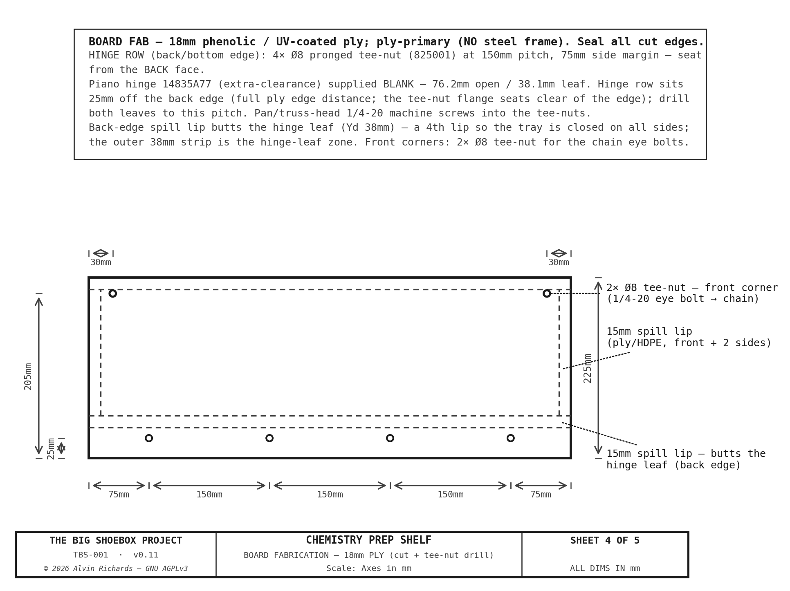
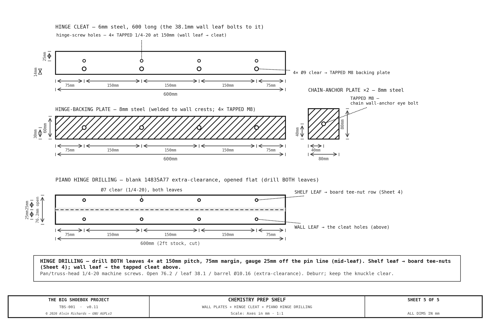

<!-- SPDX-License-Identifier: AGPL-3.0-only -->
<!-- © 2026 Alvin Richards -->
# Chemistry Prep Shelf

## 1. Purpose

Cyanotype processing requires a clean, stable work surface for:

- Mixing sensitizer chemistry (ammonium iron(III) oxalate + potassium ferricyanide)
- Measuring and dispensing solutions (graduated cylinders, digital scale)
- Coating muslin substrate with sensitizer (roller tray, foam roller)
- Staging materials (bottles, pH meter, gloves, timer)
- Post-exposure citric acid wash preparation

Chemistry is mixed **before exposure**, so the shelf does not need to be permanently
deployed. It is a **wall-hinged fold-down** in the widened near walkway: folded DOWN to
a counter-height work surface while mixing, and folded UP flat against the pinhole wall
for transport and during exposure. Because it is only deployed while the film plane is
parked, it is **fully decoupled from the film-plane swing**.

A dedicated water tap (TAP-01) on the pinhole wall provides filtered water from the blue
supply line for chemistry mixing and wash-down. It is relocated to the **left of the
shelf** (the battery bank is to the right); the branch riser tops at the stowed-shelf
height and the spout reaches over the shelf to fill containers. Ball valve BV-06
on the ¾" branch gives shut-off control from the prep position.

---

## 2. Location and Spatial Constraints

The shelf is in the **widened near walkway** (<!-- BEGIN fact:walkway_near_wide_w_mm -->500<!-- END fact:walkway_near_wide_w_mm --> mm deep), hinged on the
pinhole wall **left of the battery bank**. Deployed, it
projects 225 mm into the walkway. The operator stands on the widened walkway and works
facing the wall. When folded up, the full walkway is clear.

### 2.1 Why fold-down (film-plane swing) + optical cone

**Film-plane swing.** The fold-down removes the
conflict with the film plane mechanism: the shelf is only deployed while mixing (film plane parked), and is
folded flat against the wall whenever the plane tilts/swings during exposure. No swing
restriction is imposed.

**Optical cone.** Even deployed, the shelf is clear of the optical cone. Its right edge
sits left of the cone's left boundary at the shelf's deepest point (Yd=225):

    cone_left(225) = PH_X + (FP_X_L − PH_X) × 225 / FP_Y
                   = 2,454 + (260 − 2,454) × 225 / 2,262
                   = 2,454 − 218 = 2,236 mm

→ the shelf right edge (X=1,780) is ~**456 mm** outside (left of) the cone. No vignetting at any
film-plane position.

### 2.2 Spatial Constraints

| Constraint | Value |
|-----------|-------|
| Deployed footprint | Hinged on the pinhole wall, projects 225 mm |
| Stowed (transport) | Vertical against the wall, ~25 mm proud |
| Work surface height | 945 mm above the 130 mm walkway deck |
| Walkway (widened) | <!-- BEGIN fact:walkway_near_wide_w_mm -->500<!-- END fact:walkway_near_wide_w_mm --> mm deep — ~275 mm pass when deployed, full clear when stowed |
| Evap cooler (stow) | Slides under the deployed shelf |
| Optical cone | ~456 mm clear |

---

## 3. Design Specification

### 3.1 Shelf board

| Parameter | Value |
|-----------|-------|
| Width (X) | 600 mm |
| Depth (Yd, deployed) | 225 mm |
| Work surface height | 945 mm above the walkway deck |
| Thickness | 18 mm phenolic ply — **ply-primary (no steel frame)** |
| Work surface area | 600 × 225 = 0.135 m² |

**Work surface:** 18 mm phenolic-faced / UV-coated plywood — chemical-resistant to cyanotype
solutions and pH 3–4 citric acid; smooth, non-absorbent, wipe-clean. The plywood is the **primary
structure** — the earlier welded 25×25×3 steel perimeter frame is removed (see
[`chem-shelf-blueprint-spec.md`](chem-shelf-blueprint-spec.md)); all attachments land in **pronged
tee-nuts in the ply underside** (the 1/4-20 ply-mount standard), which is why the M5 CSK ply screws
are gone.

**Spill lip:** a 15 mm chemical-resistant lip (ply or HDPE offcut) on the three free edges retains
bottles/items; cut edges sealed.

### 3.2 Fold-down mechanism

**Piano hinge:** a **bolt-on** 304 SS continuous piano hinge runs the full 600 mm back edge —
its shelf leaf machine-screwed (1/4-20 SS) into a row of ply tee-nuts, its wall leaf to a 6 mm
mounting cleat. Because the pinhole wall is corrugated, the cleat and each chain wall anchor bolt to
**flat 8 mm steel backing plates welded to the wall crests** (M8×25 into M8 weld-nuts, ~14 mm grip) —
flat, solid load anchors rather than bridging the corrugation. The shelf swings between horizontal
(deployed) and vertical-up (stowed) about this hinge; the chains slacken as it folds up.

**Stays:** two **304 SS chains** run from wall anchors (M8 eye bolts) ~230 mm above the hinge down to
a **1/4-20 SS eye bolt** in each shelf front corner. Deployed, they carry the front-edge load in
tension and hold the board level; the length is set by the chosen link (quick-links at the ends) —
simple and adjustable.

**Transport latch:** the folded-up board is secured for transport by a **cam latch** (the same
1619A74 as the hinged panel — a standard-part reuse) at the top against the wall.

### 3.3 Load Rating

Design load **25 kg** (bottles, cylinders, roller tray, scale, staging), deployed horizontal —
carried by the **2 chain stays** (front-edge tension) + the **piano hinge** (back-edge reaction).
Validated in [`chem_shelf_load.py`](https://github.com/alvinr/tbs/blob/main/src/generators/chem_shelf_load.py):

<!-- BEGIN chem-shelf-load -->
| Element | Demand | Capacity | SF |
|---|---|---|---|
| Board bending (18mm ply, 600 wide, 225mm span, 25kg UDL) | 7.3 N·m | 324 N·m | **44** |
| Board midspan deflection | 0.02 mm (L/11930) | — | — |
| Chain stay tension (per chain, 46° from horizontal) | 91 N | 490 N (WLL) | **5** |
| Front-corner tee-nut pull-out (1/4-20 4-prong, 18mm ply) | 65 N | 1300 N | **20** |
<!-- END chem-shelf-load -->

Every element clears with a large margin — the 18 mm ply board and the 2 SS chain stays carry the
mixing load comfortably, confirming the steel perimeter frame is not structurally required.

### 3.4 Leveling

The chain length sets the deployed level — pick the link (via the end quick-links) that lands the
board level on a spirit level at first install; the two chains give independent ±adjust at each front
corner.

### 3.5 Fabrication detail

Dimensioned fabrication sheets: the board cut + tee-nut drill positions, and the wall plates + hinge
cleat + fastener schedule. The piano hinge is supplied **blank** — its leaves are drilled to the same
150 mm tee-nut pitch (4 bolts) so the hinge, the ply tee-nuts, and the cleat all align.

---

## 4. Transport Mode

The shelf folds UP flat against the pinhole wall and latches.

| Check | Status |
|-------|--------|
| Walkway clearance | Folded up, ~25 mm proud of the wall — full walkway clear ✓ |
| Film-plane clearance | Folded flat — never in the swing envelope ✓ |
| Overhead clearance | 425mm below the cable trunking ✓ |
| Evap stow | Evap tucks below the folded board ✓ |
| Vibration | Board latched flat against the wall; no loose span ✓ |

---

## 5. Operator Access

The operator stands on the widened near walkway at about the shelf
midpoint, facing the wall. The deployed surface (945 mm above the deck) is
ergonomic counter height; the full depth is reachable. The tap (left of the shelf)
fills containers staged on the board.

When deployed, the 225 mm board leaves ~275 mm of the 500 mm walkway behind it — enough
for the operator to work but not for through-traffic; this is acceptable because the
shelf is only down while mixing. Folded up, the walkway is fully clear in both directions.

---

## 6. Assembly Sequence

1. Cut the 18 mm ply board to 600 × 225; seal the cut edges; fit the 15 mm spill lip (ply/HDPE) to the three free edges.
2. Set the pronged tee-nuts into the ply underside — the hinge screw row along the back edge + one at each front corner.
3. Weld the 8 mm backing plates to the pinhole-wall crests (behind the hinge cleat + one per chain anchor); bolt the 6 mm hinge cleat on (M8×25 into the weld-nuts).
4. Bolt on the piano hinge: wall leaf to the cleat, shelf leaf into the back-edge tee-nut row (1/4-20 SS screws).
5. Thread a 1/4-20 SS eye bolt into each front-corner tee-nut; cap/grind the ~7 mm protruding tip.
6. Fit an M8 eye bolt into each chain wall anchor ~230 mm above the hinge; hang a chain (quick-links) from each wall eye to the shelf eye.
7. Deploy; set each chain link so the board sits level on a spirit level, then lock.
8. Fit the cam latch (1619A74) + keeper; verify the board folds up flat and latches clear of the wall equipment.
9. Verify: deployed level + rigid under load; folded-up clear of the evap stow and walkway.

---

## 7. Parts List

<!-- BEGIN parts:shelf -->
| Item | Spec | Qty | Supplier | Est. cost |
|------|------|-----|----------|-----------|
| [UV-coated white plywood (work surface)](https://www.homedepot.com/p/302874373) (BPI6WUV2I) | Swaner 18mm × 4'×8' UV-coated white hardwood ply (1220×2440mm), cut to 300×600. UV-coated face gives a sealed, wipeable work surface — substitute for the phenolic concrete-form sheet (same purpose, readily stocked). | 1 4'×8' 18mm sheet | Home Depot | $73 |
| [Bolt-on continuous (piano) hinge, 600 mm, SS](https://www.mcmaster.com/1582A457-1582A452/) (1582A457) | 304 SS BOLT-ON continuous hinge, 25.4mm open / 12.7mm leaf (1582A452 datasheet), 2ft (610mm) stock cut to 600, supplied BLANK (undrilled) — drill both leaves to the 150mm tee-nut pitch (4 bolts), the row 7mm off the edge (mid-leaf) so the hinge, the ply tee-nuts and the cleat all align. Shelf leaf 1/4-20 SS machine-screwed (pan/truss head — a CSK head overhangs the 12.7mm leaf) into the ply tee-nut row; wall leaf to the 6mm cleat/backing plate. $6.23/2ft (1582A457) — replaces the retired weld-on LSN8-32-600 ($23.56), cheaper. | 1 ea | McMaster-Carr | $6 |
| [304 SS chain — 2 tension stays](https://www.mcmaster.com/3392T51-3392T512/) (3392T51) | 304 SS ~4mm chain, 2 tension stays (front corner → wall anchor ~230mm above the hinge), ~1m used of the 3ft; trimmed to set the deployed level. WLL >> the ~91N tension demand (chem_shelf_load.py SF 5.4). $23.79/3ft. | 1 3ft | McMaster-Carr | $24 |
| [1/4"-20 SS eye bolt — shelf front-corner chain anchor](https://www.mcmaster.com/3014T45/) (3014T45) | 304 SS 1/4-20 eye bolt into a ply tee-nut at each front corner (~1in shank; tip protrudes ~7mm through the 18mm top — cap/grind at the corner). Chain hooks to the eye. $4.16 ea. | 2 ea | McMaster-Carr | $8 |
| [M8 SS eye bolt — chain wall anchor](https://www.mcmaster.com/4843T13/) (4843T13) | 304 SS M8 eye bolt into the backing-plate M8 weld-nut ~230mm above the hinge (reuses the M8 wall standard) — the chain's top anchor. $7.80 ea. | 2 ea | McMaster-Carr | $16 |
| [304 SS quick-links](https://www.mcmaster.com/8947T25/) (8947T25) | 304 SS ~4mm quick-links — chain ends + length adjustment (2 per stay). $2.90 ea. | 4 ea | McMaster-Carr | $12 |
| [1/4"-20 pronged tee-nut (ply attach)](https://www.homedepot.com/p/Everbilt-1-4-in-20-Zinc-Plated-Tee-Nut-4-Pack-825001/317478995) (825001) | 1/4-20 4-prong tee-nut (the ply-mount standard SKU 825001) seated in the ply underside — the 4-bolt hinge row + 2 front-corner eye bolts = 6 → 2× 4-pack (8, with spares). Reuses the project ply-mount tee-nut; replaces the retired M5 CSK ply attach. | 2 4-pack | Home Depot | $3 |
| 1/4"-20 SS machine screws — hinge → tee-nuts | 1/4-20 × ~3/4in SS machine screw — hinge leaf into the ply tee-nut row (4 bolts). SS is the splash-zone exception to the zinc ply-mount screw (panel-machine-screws). ~4 off. SKU pending — source a 1/4-20 × 3/4 SS machine screw. | 4 ea | McMaster-Carr | $2 |
| Hinge wall cleat, 6mm steel | 6mm steel cleat behind the piano-hinge wall leaf (bolts to the backing plate via M8). The 2 chain wall anchors are M8 eye bolts into the backing plates, not slotted stay anchors. | 1 lot | Local fab | $10 |
| Shelf mount backing plates, 8mm steel (welded, ×3) | Flat 8mm steel backing plates welded to the pinhole-wall interior crests — one behind the hinge cleat + one per chain wall-anchor (M8 eye bolt) — flat, solid load anchors with M8 weld-nuts. | 3 ea | Local fab | $18–$30 |
| [M8×1.25 × 25 hex bolt, Grade 8.8 zinc — shelf hinge cleat](https://www.mcmaster.com/91280A534/) (91280A534) | Clamps the shelf hinge cleat (6mm) to its welded 8mm backing plate (M8 weld-nut) — 1 per hinge bolt (4 at the 150mm hinge pitch). Grip ≈ 14mm → M8×25. Pitch M8×1.25 coarse. $18.51/pack of 50 (same 91280A534 as the film ICP-14 fixing). | 4 ea | McMaster-Carr | $1 |
| [M8×1.25 hex nut, plain SS](https://www.mcmaster.com/90591A161/) (90591A161) | Plain hex nut — shelf hinge-cleat bolts. Pitch M8×1.25 coarse — confirmed vs 90591A161 PDF 2026-07-29 (matches the bolt). $7.53/pack of 100. | 4 ea | McMaster-Carr | $0 |
| [M8 flat washer, SS](https://www.mcmaster.com/91166A270/) (91166A270) | Flat washer (1/bolt) — shelf hinge-cleat bolts (dry). Distinct SKU from the film-plane wet-zone washer-m8-flat (98689A673): separate keys so the by-type BOM doesn't blend the two M8 flat washers. $3.32/pack of 100. | 4 ea | McMaster-Carr | $0 |
| [Transport latch — cam latch (reuse 1619A74)](https://www.mcmaster.com/1619A74/) (1619A74) | Secures the folded board for transport — reuses the hinged-panel cam latch (1619A74), a standard-part reuse that retires the est zinc toggle. $30.57 ea. | 1 ea | McMaster-Carr | $31 |
| Ply edge sealer + lip fixings | Seal the ply cut edges (chemical-resistant) + fix the spill lip (ply/HDPE offcut, 3 free edges). No steel frame to powder-coat (frame removed). | 1 lot | Hardware store | $10 |
| [½" PVC Sch-40 pipe (tap relocation)](https://www.homedepot.com/p/319692959) (30-05010HD) | Extend the blue supply trunk ~1.3 m left to TAP-01 (PVC Sch-40, per the joint convention). IPEX ½" × 10 ft — same stick as pvc-half; one covers the run. | 1 stick | Home Depot | $5 |
| **Shelf total** | | | | **$219–$232** |
<!-- END parts:shelf -->

*The relocated TAP-01 + BV-06 hardware itself is unchanged (carried in the water-system
BOM); only the ~1.3 m trunk extension is added here.*

---

## 8. Maintenance

| Interval | Task |
|----------|------|
| Before each session | Deploy + check level; wipe the surface; inspect the spill lip for residue |
| Before each session | Confirm the stays lock positively and the hinge swings freely |
| Monthly | Inspect the hinge, stays, and wall bolts for corrosion/tightness |
| Before transport | Fold up + latch; confirm clear of the evap stow and walkway |
| After transport | Re-deploy and re-check level |

---

## 9. Source References

1. [ISO 668:2020](https://www.iso.org/standard/76912.html) — Series 1 freight containers: dimensions and ratings.
2. [Walkway System Report](walkway-report.md) — Walkway deck height and the widened near-walkway section.
3. [Equipment Layout Report](equipment-layout-report.md) — Optical cone clearance and pinhole-wall zone definitions.
