# Moveable Film Plane — Mechanism Design & Optical Distortion Analysis

## Overview

The Giant Pinhole Camera uses a 20ft ISO shipping container as its light-tight body. In the default configuration the photosensitive film plane is flush against one of the 20ft long-side walls. This report describes a **view-camera-style moveable film plane** — a mechanism that lets the top and bottom edges of the film plane travel independently along the optical axis, enabling controlled perspective distortions comparable to those produced by a large-format view camera's rear standard.

---

## Container Reference Geometry

| Dimension | Value | Notes |
|-----------|-------|-------|
| Interior length | 5,893 mm (19 ft 4 in) | Film plane spans this direction |
| Interior width | 2,362 mm (7 ft 9 in) | **Optical axis = focal length** |
| Interior height | 2,388 mm (7 ft 10 in) | Film plane height |
| Pinhole position | Centre of one 20ft long-side wall | |
| Nominal film plane | Opposite 20ft long-side wall | flush to wall |
| Structural ribs | Every 457 mm (18 in) along length | Rail mounting points |

---

## Movement Axes

The mechanism supports five movement modes, using view-camera terminology:

| Axis | Description | Max Travel | Effect |
|------|-------------|-----------|--------|
| **Tilt (top)** | Top edge moves along optical axis | 100–2,262 mm | Perspective convergence, keystone |
| **Tilt (bottom)** | Bottom edge moves along optical axis | 100–2,262 mm | Perspective convergence, keystone |
| **Back focus** | Both edges move together | 100–2,262 mm | Uniform magnification change |
| **Rise / Fall** | Plane translates vertically | ±200 mm | Horizon shift, rise/fall perspective |
| **Shift** | Plane translates horizontally | ±300 mm | Left/right perspective offset |

**Maximum tilt angle:** arctan((2,262 − 100) / 2,388) ≈ **42°**

When tilted at maximum, the film plane's physical length increases from 2,268 mm to approximately **3,180 mm** — 40% longer than when flat. The backing panel must accommodate this elongation (see Variable Geometry section below).

---

## Mechanism Design

### Four-Post Frame

The film plane frame is supported by four carriages riding on four linear rails:

```
CEILING ─────────────────────────────────────────────
        [CEIL RAIL ×2 — 200mm from each end wall]
        carriage TL ─── TOP BEAM (5,893mm) ─── carriage TR
             │                                      │
             │          FILM PLANE FRAME            │
             │    5,893mm wide × 2,388mm tall        │
             │         PIN JOINT each corner         │
        carriage BL ─── BOT BEAM (5,893mm) ─── carriage BR
        [FLOOR RAIL ×2 — 200mm from each end wall]
FLOOR ──────────────────────────────────────────────
```

- **4 linear rails** — HiWin HGR20 profile, 2,200 mm length, mounted to ceiling and floor at the left and right ends of the container interior. Rails run along the 2,362 mm optical axis direction.
- **8 carriages** — HGH20CA flanged blocks, 2 per rail. Each carriage pair is joined by a horizontal cross-beam.
- **2 horizontal beams** — 80×80 mm aluminium T-slot extrusion (80/20 10-4080 or equivalent), 5,893 mm span. The top beam carries the top edge of the film frame; the bottom beam carries the bottom edge. Each beam is driven by an independent leadscrew.
- **Film plane frame** — welded 2"×2"×3/16" aluminium angle, 5,893 mm × 2,388 mm. Pin-jointed to the top and bottom beams so it can rotate freely as the tilt angle changes.

### Actuation

Each beam is driven by a **¾"-6 Acme leadscrew** (8 ft / 2,438 mm length), turning in a bronze Acme nut fixed to the beam. One turn of the ¾"-6 screw = 6/1" pitch = **4.2 mm travel per turn**. An 8" handwheel gives comfortable torque for the beam load. A locking collar on each screw holds position during exposure.

**Optional electric actuation:** replace the handwheels with **Progressive Automations PA-14** 12V linear actuators (20" / 508 mm stroke, 150 lb force rating). Two actuators, one per beam, controlled by panel-mount DPDT momentary switches. This allows the film plane to be repositioned without entering the camera.

### Variable Geometry Accommodation

As the film plane tilts, its along-plane height grows from 2,268 mm (flat) to up to ~3,180 mm at maximum 42° tilt. The backing panel must cover this elongated surface.

**Recommended solution — hinged two-panel system:**

The ACM (aluminium composite material) backing is cut in two equal panels, each ~1,600 mm × 2,388 mm. They are joined along the horizontal centreline with a full-width 2" aluminium piano hinge. When the film plane is flat, the two panels lie flush. As the plane tilts, the hinge allows the upper panel to fold back, maintaining full coverage of the film frame at any tilt angle up to the maximum.

Film/paper is attached to the ACM surface with black photo tape or push-pins. For a tilted exposure, the film sheet must be pre-cut to the elongated length or joined from multiple sheets.

### Light Sealing

The tilted film plane creates triangular voids at the top and bottom of the container where it no longer contacts the walls. These are sealed with:

- **Primary seal:** 1"×½" black EPDM foam strip bonded to all four edges of the film frame — compresses against walls at low tilt angles
- **Secondary seal:** Rosco Duvetyne (professional blackout fabric) curtains attached to the film frame perimeter, hanging freely and weighted at the bottom — drapes against the walls and floor for large tilt angles
- **Rail light traps:** Three overlapping strips of black felt across each rail opening in the ceiling and floor panels — prevent light leakage along the rail slots

---

## Tilt Configurations

| Config | Name | Top Edge | Bottom Edge | Tilt Angle | Film Length | Area Change |
|--------|------|----------|-------------|-----------|-------------|-------------|
| C0 | Flat | 2,262 mm | 2,262 mm | 0° | 2,268 mm | 0% |
| C1 | Mild tilt up | 1,800 mm | 2,262 mm | 5.6° | 2,315 mm | +2% |
| C2 | Strong tilt up | 800 mm | 2,262 mm | 17.5° | 2,598 mm | +15% |
| C3 | Max tilt up | 100 mm | 2,262 mm | 41.6° | 3,121 mm | +38% |
| C4 | Max tilt down | 2,262 mm | 100 mm | 41.6° | 3,121 mm | +38% |
| C5 | Both near | 100 mm | 100 mm | 0° | 2,268 mm | 0% |
| C6 | Compound | 100 mm | 2,262 mm | 41.6° + 15° swing | — | — |

*Top/bottom edge depths measured from the pinhole wall.*

---

## Optical Distortion Analysis

### Physics of Tilted-Plane Projection

In a pinhole camera, every scene point projects through the pinhole aperture onto the film plane regardless of its distance. When the film plane is flat and perpendicular to the optical axis, the projection is a standard central perspective: a scene point at world coordinates (X, Y) and distance D from the pinhole maps to film coordinates:

```
film_x = −X · f / D
film_y = −Y · f / D
```

where f is the perpendicular distance from pinhole to film plane. The negative signs give the inverted image.

When the film plane is **tilted** (top edge at depth d_top, bottom edge at d_bot), the perpendicular distance from the pinhole to the film varies continuously from d_bot (at the bottom edge) to d_top (at the top). A point at height parameter v on the film (v=0 bottom, v=1 top) is at depth:

```
f(v) = d_bot + (d_top − d_bot) · v
```

This varying effective focal length is the source of all the distortions below.

### Distortion Effects by Configuration

**C0 — Flat (reference):**
Standard central projection. Vertical lines in the scene remain vertical. Horizontal scale is uniform across the full film height. The checker pattern is a regular perspective view; the horizon is a straight line through the image centre.

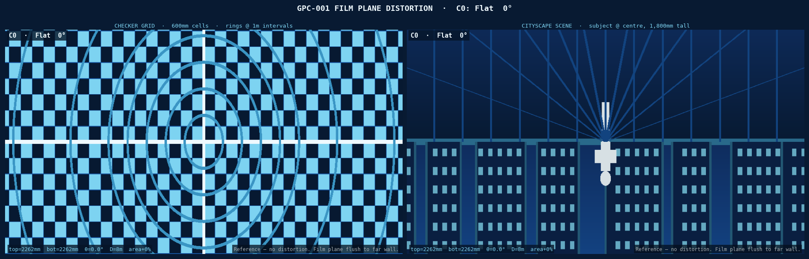

**C1 — Mild tilt 5.6°:**
Subtle keystone. The top quarter of the image is slightly compressed horizontally (effective focal length 462 mm shorter at top). The horizon appears marginally raised. Useful for compensating naturally converging verticals when photographing tall subjects close to the camera.

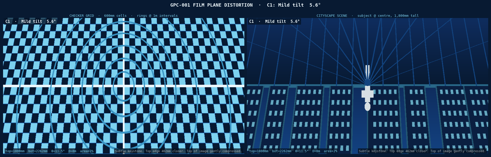

**C2 — Strong tilt 17.5°:**
Dramatic keystone. The top of the image has f ≈ 800 mm (one-third nominal) — three times more magnification per unit scene height than the bottom. Buildings appear to flare outward toward the base. Wide horizontal bands at the bottom compress many floors of a building into a small vertical distance at the top. The horizon line curves subtly.

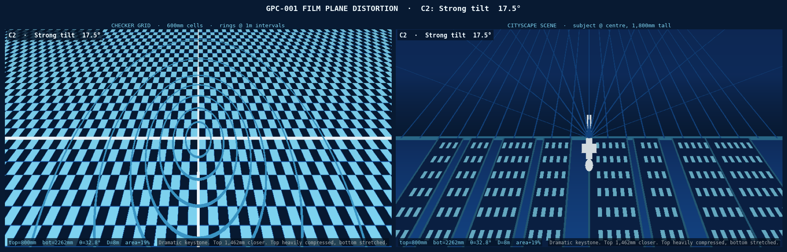

**C3 — Maximum tilt up 41.6°:**
Extreme effect. Top edge is only 100 mm from the pinhole wall — a 22× difference in effective focal length between top (f=100) and bottom (f=2,262). The top of the image captures a vast compressed panorama; the bottom captures a narrow, highly magnified strip. The checkerboard transforms from squares at the bottom to near-horizontal slivers at the top. In a landscape scene, the ground rushes toward the viewer and the sky is squeezed into a narrow band.

**Recommended for:** wide open landscapes, aerial-perspective scenes, dramatic urban canyons. Produces a result unlike any conventional photographic technique.

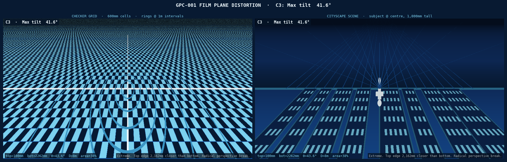

**C4 — Maximum tilt down (reverse) 41.6°:**
The inverse of C3 — bottom edge 100 mm from pinhole. The ground plane is compressed and the sky dominates. Standing subjects at the centre appear to elongate dramatically toward the bottom of the frame. Objects on the ground are rendered as thin horizontal lines. Surreal inversion of spatial intuition.

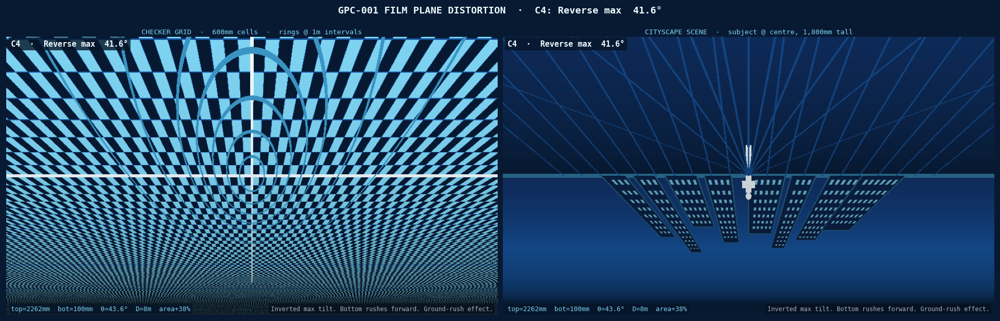

**C5 — Both edges near (uniform close):**
The entire film plane is pushed 2,162 mm closer to the pinhole, leaving only 100 mm clearance. The effective focal length drops from 2,362 mm to ~100 mm — a magnification of 2,362/100 = **23.6× reduction in image scale**. The camera now captures a scene 23× wider and taller than normal. The distortion is zero (no tilt) but the field of view is enormous. Useful for cramped spaces where the subject cannot be far from the camera.

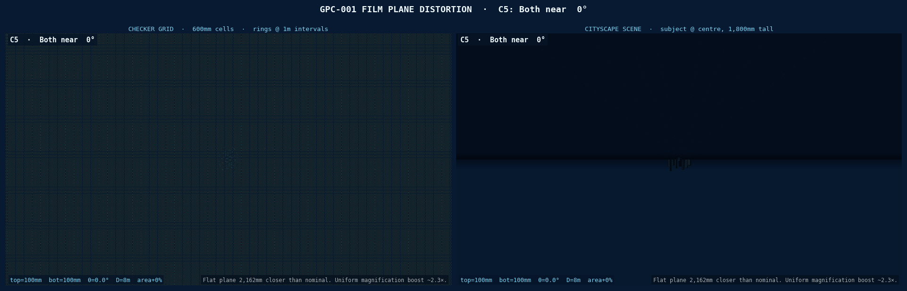

**C6 — Compound tilt + swing:**
Maximum vertical tilt (41.6°) combined with 15° horizontal swing. The left edge of the film plane is pushed forward while the right edge recedes, simultaneous with the top-bottom tilt. No line in the scene remains parallel to any edge of the film — there are no rectilinear references anywhere in the image. The checker pattern becomes a complex curved mesh. This is the most disorienting configuration and the most likely to produce images that appear to be drawings or paintings rather than photographs.

**Recommended for artistic use.** The compound distortion cannot be easily reversed or predicted without simulation — each exposure will be a unique geometric artefact.

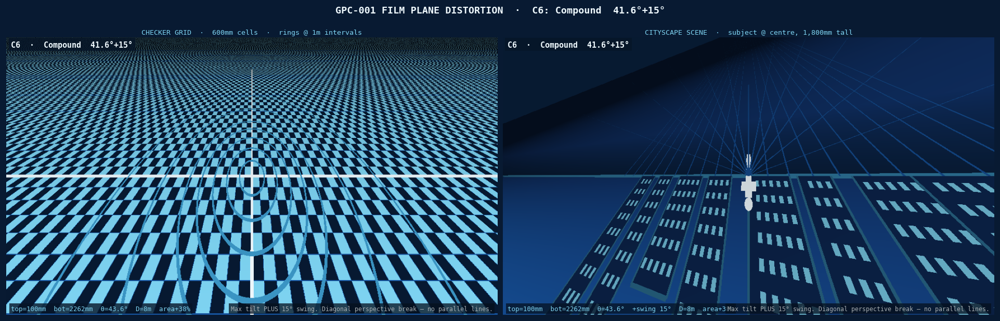

### Summary Comparison

All seven configurations on a checker grid (D = 8,000 mm):

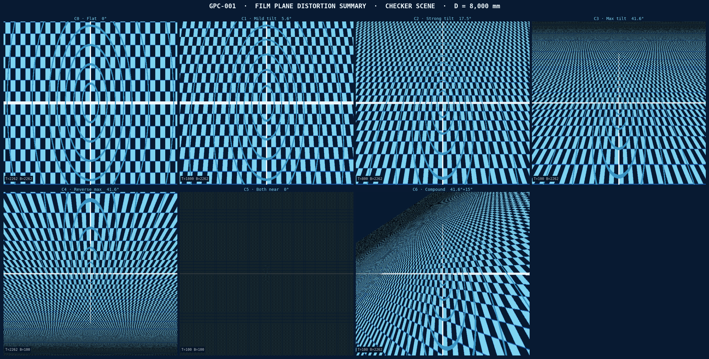

---

## Engineering Drawings

Four drawing sheets accompany this report:

| Sheet | Content |
|-------|---------|
| Sheet 1 — Plan view | Top-down view: container footprint, rail layout, top/bottom beam positions for each tilt config |
| Sheet 2 — Side elevation | Cross-section through container centreline: all four tilt configs, tilt angles, carriage and rail positions |
| Sheet 3 — Hardware detail | Beam cross-section (80×80 T-slot), HGR20 rail + HGH20CA carriage profile, pivot joint detail, ACM panel hinge arrangement |
| Sheet 4 — Specification table | Movement axis summary, all tilt config dimensions, full bill of materials |

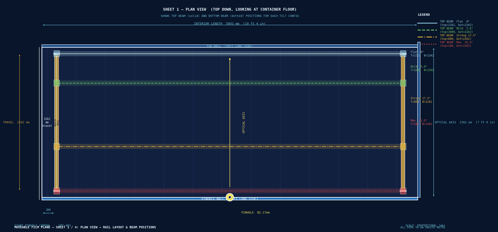

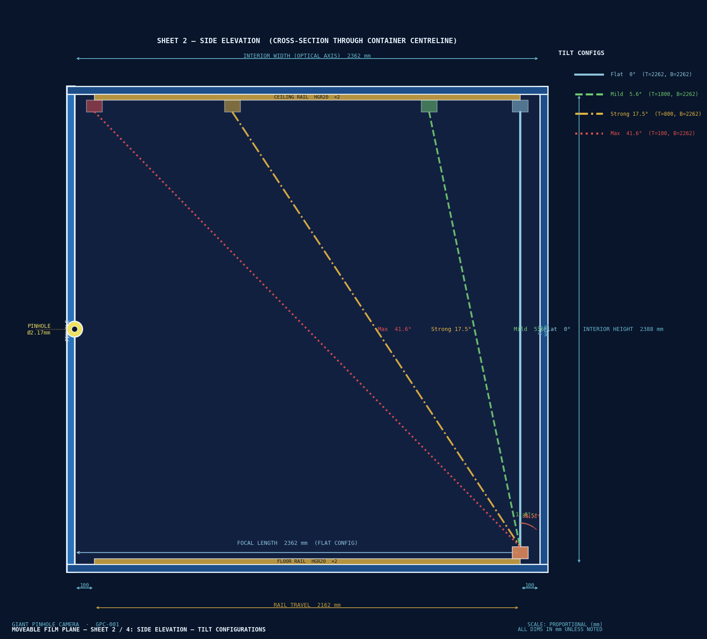

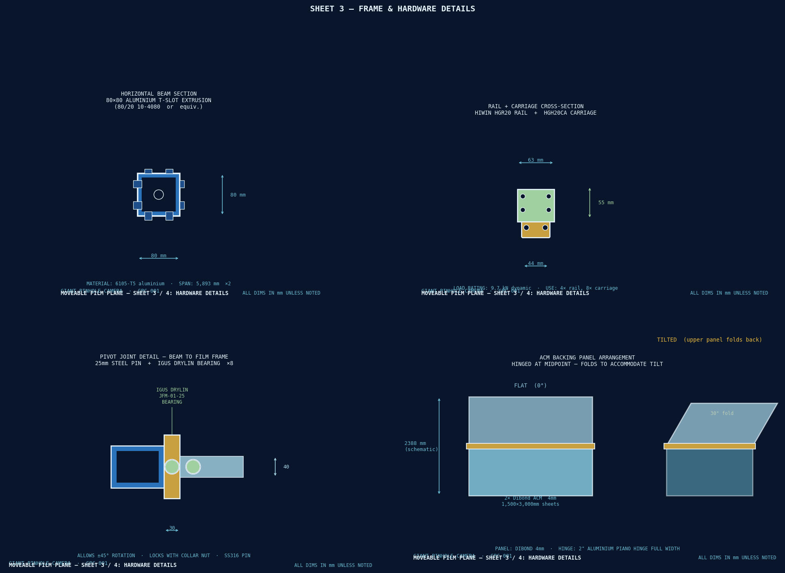

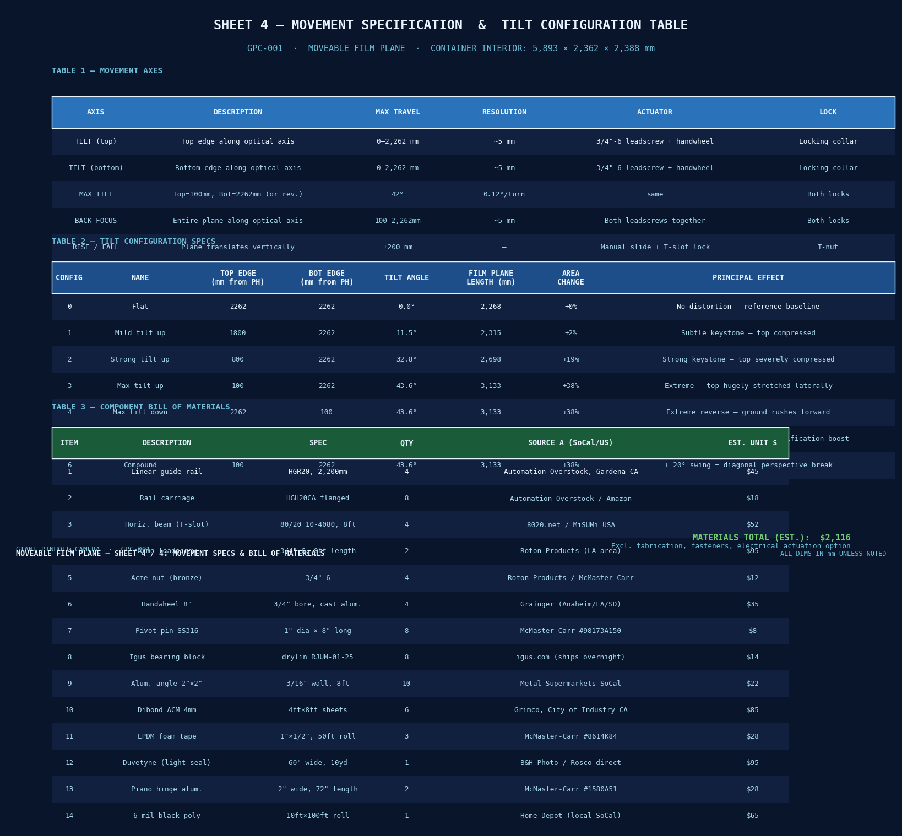

---

## Shopping List

All items ship within the United States. Local Southern California pickup noted where available.

### Structural & Rails

| Item | Spec | Qty | Source A | Source B | Est. Unit |
|------|------|-----|---------|---------|-----------|
| Linear guide rail HGR20 | 2,200 mm | 4 | Automation Overstock, Gardena CA | McMaster-Carr #5901T777 | $45 |
| Rail carriage HGH20CA | Flanged block | 8 | Automation Overstock / Amazon | McMaster-Carr | $18 |
| Aluminium T-slot beam | 80/20 10-4080, 8 ft | 4 | 8020.net | MiSUMi USA | $52 |
| Acme leadscrew ¾"-6 | 8 ft length | 2 | Roton Products (LA area) | McMaster-Carr #6289K36 | $95 |
| Acme nut bronze ¾"-6 | — | 4 | Roton Products | McMaster-Carr #6289K512 | $12 |
| Handwheel 8" dia | ¾" bore, cast aluminium | 4 | Grainger (Anaheim / LA / SD) | McMaster-Carr #6440K64 | $35 |
| Pivot pin SS316 | 1" dia × 8" long | 8 | McMaster-Carr #98173A150 | Fastenal (SoCal branches) | $8 |
| Igus drylin bearing | RJUM-01-25 | 8 | igus.com (ships overnight) | Amazon | $14 |

### Film Plane Frame

| Item | Spec | Qty | Source A | Source B | Est. Unit |
|------|------|-----|---------|---------|-----------|
| Aluminium angle 2"×2"×3/16" | 8 ft lengths | 10 | Metal Supermarkets SoCal | Online Metals | $22 |
| Dibond ACM panel 4 mm | 4 ft × 8 ft sheets | 6 | Grimco, City of Industry CA | Signwarehouse | $85 |
| Black EPDM foam tape 1"×½" | 50 ft rolls | 3 | McMaster-Carr #8614K84 | Grainger | $28 |
| Rosco Duvetyne | 60" wide, 10 yd | 1 | B&H Photo | Rosco direct | $95 |
| Aluminium piano hinge 72" | 2" wide, 1/16" leaf | 2 | McMaster-Carr #1580A51 | Grainger | $28 |
| 6-mil black poly sheeting | 10 ft × 100 ft | 1 | Home Depot (local, all SoCal) | Uline | $65 |
| 2" black Gorilla Tape | 35 yd rolls | 6 | Home Depot / Target (local) | Amazon | $12 |

### Optional Electric Actuation

| Item | Spec | Qty | Source A | Source B | Est. Unit |
|------|------|-----|---------|---------|-----------|
| PA-14 linear actuator | 12V, 20" stroke, 150 lb | 2 | Progressive Automations | Amazon | $185 |
| 12V 30A power supply | Enclosed | 1 | Mouser | Digi-Key | $55 |
| DPDT momentary rocker | Panel-mount, 20A | 2 | Mouser | Grainger | $8 |

**Estimated materials total (manual actuation): ~$2,100**
*Excludes fasteners, fabrication labour, and electric actuation option.*

### Local SoCal Metal Sourcing

- **Metal Supermarkets** — Anaheim (714-630-8463), Van Nuys (818-988-1301), San Diego (619-280-7600). Will cut to length on-site, no minimum order.
- **Grimco** — City of Industry, CA. Sign-industry ACM panel supplier, large sheet stock.
- **Automation Overstock** — Gardena, CA. Industrial surplus linear motion components; walk-in available.
- **Grainger** — branches throughout LA, Orange County, San Diego. Same-day local pickup.
- **Roton Products** — ships from the LA area; Acme screw stock cut to length.
