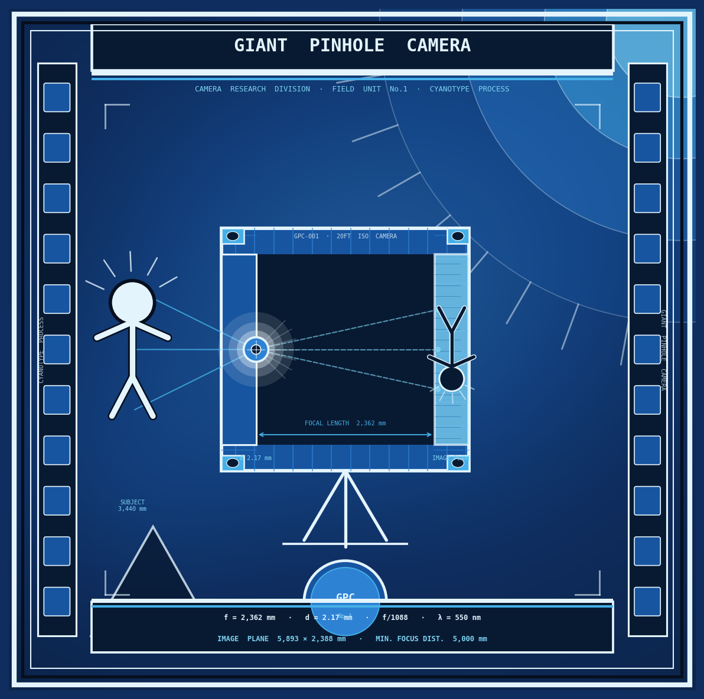

# The Big Shoebox — Project Summary

  

---

## What Is It

A fully operational pinhole camera built inside a standard 20-foot ISO shipping container. It makes photographs — real, large-format photographs — on contact-scale cyanotype prints measuring nearly 20 feet wide by 8 feet tall. It is transportable, deployable in remote locations, and self-sufficient for water and processing. It is not an installation that resembles a camera. It is a camera.

---

## The Scale

| Parameter | Value |
|-----------|-------|
| Image plane | 5,893 × 2,388 mm (~19'4" × 7'10") |
| Image area | ~140 sq ft |
| Focal length | 2,362 mm (container interior depth) |
| Optimal pinhole | Ø2.17 mm (Lord Rayleigh formula, λ = 550 nm) |
| f-number | f/1088 |
| Baseline exposure | ~2–3 hr (cyanotype on muslin, f/1088, full sun — no reciprocity correction) |
| Process | Cyanotype — water-based, non-toxic, no silver |
| Per-print cost | ~$57 |
| 50-print run | ~$2,842 |
| License | [GNU AGPLv3](license.md) — © 2026 Alvin Richards |

---

## The Technology

Two independent movement systems work in series, stacking their effects non-linearly:

**Front board — tilt and swing (±5°)**
The pinhole itself pivots on a spherical plain bearing, steering the image cone across the film plane. Every 5° of tilt shifts the projected image 207 mm. Used for compositional placement — not correction, not distortion, but deliberate image steering.

**Film plane — 4-corner independent actuation (±42° tilt, ±20° swing)**
Four corners of the image plane move independently via handwheels, enabling view-camera-style geometric control at pinhole focal lengths. Scheimpflug-equivalent movements, compound twisted-plane projections, convergence manipulation — the full vocabulary of large-format photography, applied to a pinhole.

**Combined:** the two systems interact non-linearly. Their compound optical projections — modelled and documented in the [distortion renders](tilt-swing-board-report.md) — produce images that no other camera type can make.

Every specification traces to a peer-reviewed source or manufacturer datasheet. The optics are not approximated.

**Off-grid capable:** a self-contained three-circuit water system supports 8–10 full-size prints between resupply runs, with 40% water recycling. 12V DC operation. Deployable without mains connection.

---

## The Process

Cyanotype on cotton muslin. The sensitiser (ferric ammonium citrate + potassium ferricyanide) is coated onto fabric, exposed by contact with the image-plane, and developed in plain cold water. No silver, no hazardous chemistry, no darkroom registration required.

The container travels by commercial hire truck. No CDL required for the operator. No oversize permits required for an empty 20ft standard container on Interstate highways.

---

## Documents

| Document | Description |
|----------|-------------|
| [Pinhole Optics Report](pinhole-optics-report.md) | Lord Rayleigh formula, f-numbers, exposure calculations |
| [Container Optics](pinhole-option-b-optics.md) | Detailed optics for the shipping container configuration |
| [Construction Guide](pinhole-camera-construction.md) | Light-sealing, pinhole plate fabrication, image plane loading |
| [Lens Options](lens-options.md) | Coverage problem, thin lens equations, DoF, distortion, recommendations |
| [Lens vs Pinhole](lens-vs-pinhole-exposure.md) | Why the exposure difference is ~5,500× — full derivation |
| [Photosensitive Materials](photosensitive-plane-options.md) | All process options, ISO equivalents, spectral response, per-image costs |
| [Processing System](water-system-report.md) | Off-grid three-circuit water system design and Bill of Materials |
| [Film Plane Mechanism](film-plane-mechanism-report.md) | 4-corner independent actuation — design, drawings, shopping list |
| [Fabrication Drawings](fabrication-drawings.md) | Interchangeable plate system — wall frame, pinhole plate, lens plate |
| [Tilt-Swing Front Board](tilt-swing-board-report.md) | Spherical-pivot mechanism — design, drawings, combined distortion renders |
| [Cost Breakdown](project-cost-breakdown.md) | Full itemised build cost — three scenarios, all sources cited |
| [Chem Shopping List](chemistry-shopping-list.md) | 50-print quantities with supplier URLs and confirmed prices |
| [Transportation](container-transport-options.md) | Commercial hire vs. self-haul analysis |
| [Operating Manual](operating-manual.md) | Single-operator step-by-step workflow — coating, exposure, development, cleanup |
| [Electrical & Systems](electrical-report.md) | Power architecture, light trap vestibule, cooling, ventilation, wiring diagrams |
| [Master Shopping List](master-shopping-list.md) | All components consolidated by build area — electrical, water, chemistry, vestibule, cooling |
| [License](license.md) | GNU AGPLv3 — © 2026 Alvin Richards |
