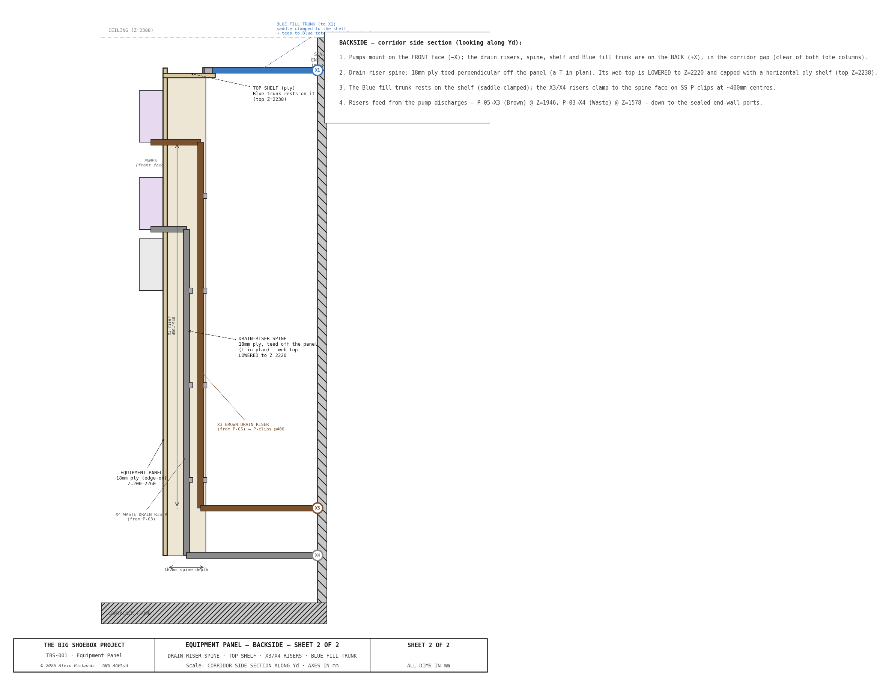

<!-- SPDX-License-Identifier: AGPL-3.0-only -->
<!-- © 2026 Alvin Richards -->
# Equipment Panel Report

## 1. Purpose

The equipment panel is an 18mm marine plywood board mounted vertically at the
front (cargo-door-facing) mouth of the IBC plumbing corridor at X=4874mm —
moved forward from the sealed end (`ibc-reconfig-v2`) for walkway reach-in
access, mounting on the front-portal frame (~X4734). It spans the full 270mm
corridor width (Yd=1046–1316mm) and 2060mm in height (Z=250–2310mm). All pumps,
filters, the pressure accumulator, diverter valves,
and isolation valves mount on this single panel, concentrating the entire
water-handling system in one accessible location within the IBC zone.

The panel serves three functions:

1. **Structural mounting surface** — provides a rigid, flat substrate for
   equipment that would otherwise require individual mounting brackets on the
   corrugated container walls.
2. **Plumbing coordination** — all pump suction and discharge lines, filter
   connections, and valve positions are organized on one face, minimizing pipe
   runs and simplifying maintenance.
3. **Accessibility** — the panel faces the open end of the container (-X
   direction). The operator approaches from the right walkway (X=4329–4629mm)
   and reaches into the 270mm corridor to access valves and pump switches.

---

## 2. Panel Specifications

| Parameter | Value |
|-----------|-------|
| Material | 18mm marine plywood (BS 1088 or equivalent) |
| Face dimensions | 270mm wide (Yd) × 2060mm tall (Z) |
| Orientation | Vertical, perpendicular to sealed end wall |
| Panel face X position | 4874mm — corridor front mouth (equipment protrudes toward cargo door, -X; tip ~4744mm, clear of film rail X=4649) |
| Bottom edge Z | 250mm (120mm above walkway deck) |
| Top edge Z | 2310mm (78mm below ceiling at Z=2388mm) |
| Corridor width | 270mm (Yd=1046–1316mm, between near and far IBC columns) |
| Mounting | L-brackets to the front-portal frame uprights (~X4734), 4 points |
| Finish | Sealed with marine varnish or epoxy; white face for visibility |

---

## 3. Equipment Layout

The panel face is divided into two zones: a filter skid at the bottom and a pump
zone above, with equipment arranged in columns for pipe routing efficiency.

**Equipment Panel Layout — Front elevation with pump zone, filter skid, valves, and full plumbing routing**


**Backside (corridor side section) — what is mounted on the *back* of the panel:**
the drain-riser backing spine (18mm ply teed off the panel, with a lowered top
and a capped shelf), the X3/X4 drain risers running from the P-05/P-03 discharges
down to the sealed end-wall ports, and the Blue fill trunk resting on the shelf.
Pumps mount on the front face; the drain/fill runs are on the back, in the
corridor gap clear of both tote columns.



### 3.1 Filter Skid — Z=200–1280mm

Three 4.5"×10" Big Blue filter housings mounted vertically (sump down) in a
slotted angle frame. The housings stack vertically with 30mm gaps between them.
Flow path: P-02 output → F-01 (top, coarsest) → F-02 (middle) → F-03 (bottom,
finest) → pH test point → 3W-DV-01.

| Component | Position (Z, mm) | Specification |
|-----------|-----------------|---------------|
| F-01 (sediment) | 940–1,280 | 4.5"×10" Big Blue, 50μm MPP melt-blown polypropylene |
| F-02 (heavy metal) | 570–910 | 4.5"×10" Big Blue, KDF-55 heavy metal removal |
| F-03 (carbon) | 200–540 | 4.5"×10" Big Blue, CTO coconut shell activated carbon |
| Slotted angle frame | 200–1,280 | 25×25×3mm slotted steel angle, 130mm wide |

Each housing has 1" NPT inlet and outlet ports on the head (top). Inter-housing
piping connects F-01 OUT → F-02 IN and F-02 OUT → F-03 IN using 1" HDPE pipe
with 90° elbows routed outside the housing bodies. Housings mount to an 18mm
plywood backing board within the slotted angle frame via U-bracket clamps with
25mm HDPE spacer blocks for sump-bowl clearance.

**Replacement interval:**

| Stage | Cartridge | Removes | Replace every |
|-------|-----------|---------|--------------|
| F-01 | 5μm MPP sediment | Gross sediment, fiber lint, Prussian blue particles | 25 prints |
| F-02 | KDF-55 | Dissolved iron from ferricyanide wash water | 30 prints |
| F-03 | CTO carbon block | Residual organics, color | 20 prints |

**Alternative:** A single 3-stage combo unit (e.g. Purcooflow WHF2045B302 or
iSpring WGB32B) with 4.5"×20" cartridges eliminates inter-housing plumbing and
the separate frame. The combo unit mounts directly to the panel with its
integrated bracket. 1" NPT inlet/outlet; a single 1/2"→1" bushing reducer
connects P-02 output to the unit inlet. See
[Water System Report](water-system-report.md) §3.2 for sizing rationale.

### 3.2 Pump Zone — Z=1120–1960mm

Five Shurflo 2088 pumps in a 2-column layout above the filter stack:

| Pump | Column | Position (Z, mm) | Circuit | Function |
|------|--------|------------------|---------|----------|
| P-01 | Left | 1,120–1,338 | Blue | Clean water supply to spray bar |
| P-04 | Left | 1,378–1,596 | Black/Brown | Tray drain transfer (sump → IBC-3 or IBC-4) |
| P-02 | Right | 1,120–1,338 | Brown | Brown recycle (IBC-3 → filter train) |
| P-03 | Right | 1,378–1,596 | Black | Waste evacuation (IBC-4 residual → external drain) |
| P-05 | Right | 1,746–1,964 | Brown | Brown drain-out (IBC-3 → external drain) |

All pumps are identical Shurflo 2088-554-144 units: 12VDC, 3.5 GPM, 45 PSI,
self-priming diaphragm. Vertical mount orientation with ports at the head (top),
127mm body width × 218mm body height × 100mm protrusion from panel. Each pump
mounts on a stainless steel mounting bracket with 4 bolts through the plywood.

**Left column** (Yd=0–127mm, near IBC side): P-01 and P-04 share suction from
the near IBC column (Blue IBC-1/IBC-2 and tray sump respectively).

**Right column** (Yd=143–270mm, far IBC side): P-02, P-03, and P-05 serve the
Brown and Waste circuits from the far IBC column.

### 3.3 Accumulator — Z=1746–1896mm

| Parameter | Value |
|-----------|-------|
| Model | SeaFlo or equivalent, 0.75L (23.5 oz) |
| Dimensions | 127mm OD × 150mm length |
| Position | Left column, above P-04 (Z=1746mm) |
| Port | 1/2" NPT, bottom |
| Function | Smooths P-01 pump cycling, maintains pressure when pump is off |

ACC-01 sits inline on the Blue discharge path between P-01 outlet and BV-02.
The accumulator's air bladder absorbs pressure pulsations from the diaphragm
pump, providing steady flow to the spray bar.

---

## 4. Valves

### 4.1 Ball Valves (Isolation)

| Valve | Size | Position | Function |
|-------|------|----------|----------|
| BV-01 | 1/2" | P-01 suction header | Blue supply isolation — closes Blue circuit |
| BV-02 | 1/2" | Blue discharge to spray bar | Operator control — open during wash passes |
| BV-06 | 3/4" | Chemistry tap on pinhole wall | Shut-off for chemistry mixing water |
| BV-07 | 1/2" | Above P-05 | Brown IBC-3 drain-out isolation |
| BV-08 | 1/2" | P-03 suction | Waste IBC-4 drain-out isolation |

BV-02 is the primary operator-controlled valve. It is mounted on the pinhole
wall (Yd=0) at X=2399mm, Z=900mm — waist height from the walkway deck,
directly in front of the operator during spray bar wash passes.

### 4.2 Diverter Valves (3-Way)

| Valve | Size | Position | Function |
|-------|------|----------|----------|
| 3W-DV-01 | 1" FNPT | After filter skid + pH test point | Routes filtered Brown water to Blue (IBC-2) or Black (IBC-4) based on pH reading |
| 3W-DV-02 | 1/2" FNPT | P-04 discharge | Routes tray drain water to Brown (IBC-3) or Black (IBC-4) based on operator judgment |

**3W-DV-02** is the operator judgment valve: set to Brown (default) for normal
rinse water, switch to Black for heavy contamination events.

**3W-DV-01** is the pH-gated valve: if filtered water reads pH 6–7, route to
Blue (IBC-2) for recycling; if pH >7.5 or discolored, route to Black (IBC-4).

### 4.3 Check Valves

| Valve | Size | Position | Function |
|-------|------|----------|----------|
| CV-1 | 1" NPT | X1 bulkhead fill line | Prevents backflow from IBC-1 to external port |
| CV-3 | 1" NPT | X3 bulkhead drain line | Prevents backflow from external to IBC-3 |
| CV-4 | 1" NPT | X4 bulkhead drain line | Prevents backflow from external to IBC-4 |

Spring-loaded inline check valves (PVC body, EPDM seal) on each external
bulkhead line. Installed in the IBC zone, not on the equipment panel.

---

## 5. Pipe Specifications

| Run | Schedule | Nominal Size | OD (mm) | Material | Notes |
|-----|----------|-------------|---------|----------|-------|
| Pump suction/discharge | Sch 40 | 1/2" | 21 | HDPE | Matches Shurflo 2088 port thread |
| DV-02 outputs | Sch 40 | 1/2" | 21 | HDPE | To IBC-3 or IBC-4 |
| DV-01 outputs | Sch 40 | 1/2" | 21 | HDPE | To Blue IBC-2 or Black IBC-4 |
| Filter inter-stage | Sch 40 | 1" | 33 | HDPE | Matches Big Blue 1" NPT ports |
| Filter outlet → DV-01 | Sch 40 | 1" | 33 | HDPE | Gravity flow, lower restriction |
| IBC fill/drain (internal) | Sch 40 | 1" | 33 | HDPE | IBC valve to corridor |
| IBC fill/drain (external bulkhead) | Sch 40 | 2" | — | Steel/brass | Bulkhead unions with camlock |
| Spray bar flex hose | — | 1/2" | — | Reinforced braided PVC | ~4m coiled, BV-02 to beam center feed |

All pump-driven internal runs use 1/2" pipe, matching the Shurflo 2088 pump
ports (1/2"-14 male parallel thread). This eliminates reducer fittings at pump
connections. The only reducer is a single 1/2"→1" bushing at the filter skid
inlet (P-02 output to F-01 input).

---

## 6. Flow Paths

### 6.1 Blue System — Clean Water Supply

```
IBC-1/IBC-2 → BV-01 → P-01 → ACC-01 → BV-02 → spray bar
```

P-01 draws from the Blue IBC manifold (two IBCs plumbed in parallel via 1"
HDPE with isolation valves), pressurizes through ACC-01 (0.75L accumulator),
and delivers to BV-02 on the pinhole wall. A 4m flexible hose connects BV-02
to the spray bar center feed bulkhead.

### 6.2 Brown System — Used Water Recycling

```
Tray sump → P-04 → 3W-DV-02 → IBC-3
IBC-3 → P-02 → 1/2"→1" reducer → F-01 → F-02 → F-03 → pH test → 3W-DV-01
  → IBC-2 (if pH 6–7) or IBC-4 (if pH drift)
```

P-04 lifts drain water from the processing tray sump (~900mm head) to IBC-3.
P-02 recirculates IBC-3 water through the 3-stage filter train. After filtering,
the operator checks pH and sets 3W-DV-01 to route either back to Blue (IBC-2)
or to Waste (IBC-4).

### 6.3 Black System — Waste Containment

```
3W-DV-01 reject → IBC-4
3W-DV-02 contaminated → IBC-4
IBC-4 → P-03 → external drain port X4 (gravity + pump assist)
```

P-03 is dedicated to waste evacuation. IBC-4 gravity-drains through external
port X4 (Z=200mm) down to approximately 120L residual; P-03 pumps the residual
below the gravity drain height to a disposal tanker.

---

## 7. Mounting and Structure

### 7.1 Equipment Panel Mounting

The plywood panel is secured to the IBC restraint front-portal frame uprights
(~X4734, at the corridor mouth) at four points using L-brackets with M10 bolts.
The frame provides rigid lateral restraint — the panel does not contact the
container walls directly.

### 7.2 Filter Skid Frame

The filter skid uses a separate 25×25×3mm slotted steel angle frame bolted to the
plywood panel. The frame provides:

- Adjustable housing height via slotted holes in the uprights
- Rigid support for the ~5kg weight of each filled filter housing
- Backing board (18mm plywood) within the frame for U-bracket attachment

Each filter housing mounts via a steel U-bracket that wraps around the head
section. HDPE spacer blocks (25mm) between the bracket and backing board provide
clearance for the sump bowl to hang freely below. Two bolts per bracket
through the backing board.

### 7.3 Pump Mounting

Each Shurflo 2088 mounts on a stainless steel 4-bolt bracket (Shurflo OEM
accessory). The bracket screws through the plywood panel. Pump body orientation
is vertical (long axis along Z) with ports at the head (top), facing left and
right (along Yd). This orientation minimizes the footprint on the 270mm-wide
panel and allows gravity to assist with priming.

### 7.4 Panel Protrusion Envelope

| Component | Protrusion from panel face (-X) |
|-----------|-------------------------------|
| Pump body (Shurflo 2088) | 100mm |
| Filter housing (Big Blue 4.5"×10") | 130mm |
| Accumulator (ACC-01) | 127mm |
| Pipe fittings + valves | ~50mm |

The maximum protrusion is 130mm (filter housings). Combined with the 18mm panel
thickness, the total X footprint is 148mm. The walkway inner edge is at
X=4329mm — leaving 653mm clear between the walkway and the nearest protruding
component.

---

## 8. Pipe Routing Conventions

All piping on the equipment panel follows the parallel-wall drawing convention
used throughout TBS-001 engineering diagrams:

- **Blue pipes** — front layer (closest to viewer/operator)
- **Brown pipes** — middle layer
- **Black/waste pipes** — rear layer (closest to panel)

Pipe crossings use the gap-break method (rear pipe broken at crossing) for pipes
of different system colors, and the bridge-arc method for same-color crossings.

Pipes enter and exit the panel zone at the left and right panel edges:
- **Left edge** (Yd=1046mm, near wall side) — Blue IBC suction, Blue discharge
  riser to pinhole wall
- **Right edge** (Yd=1316mm, far wall side) — Brown/Waste IBC connections,
  external drain routing

---

## 9. Parts List

| # | Item | Specification | Qty | Est. Cost |
|---|------|--------------|-----|-----------|
| 1 | Marine plywood panel | 18mm BS 1088, 270×2060mm | 1 | $40–$65 |
| 2 | Shurflo 2088-554-144 pump | 12VDC, 3.5 GPM, 45 PSI, self-priming diaphragm | 5 | $275–$350 |
| 3 | Shurflo pump mounting bracket | Stainless steel, for 2088 series | 5 | $40–$60 |
| 4 | Pressure accumulator (ACC-01) | 0.75L (23.5 oz), 1/2" NPT port | 1 | $25–$40 |
| 5 | Big Blue filter housing 4.5"×10" | Standard 1" NPT head, with clamp and wrench | 3 | $60–$90 |
| 6 | F-01 cartridge — 5μm MPP sediment | 4.5"×10" Big Blue format | 1 | $8–$15 |
| 7 | F-02 cartridge — KDF-55 heavy metal | 4.5"×10" Big Blue format | 1 | $20–$35 |
| 8 | F-03 cartridge — CTO carbon block | 4.5"×10" Big Blue format | 1 | $10–$18 |
| 9 | Slotted angle frame | 25×25×3mm slotted steel angle, cut and bolted | 1 set | $20–$35 |
| 10 | Filter backing board | 18mm plywood, within frame | 1 | $10–$15 |
| 11 | U-bracket clamps (filter) | Steel, with HDPE spacer blocks | 3 sets | $15–$25 |
| 12 | Ball valve BV-01 | 1/2" FNPT, full-port, quarter-turn | 1 | $8–$12 |
| 13 | Ball valve BV-02 | 1/2" FNPT, full-port, quarter-turn | 1 | $8–$12 |
| 14 | Ball valve BV-06 | 3/4" FNPT, polypropylene, quarter-turn | 1 | $8–$12 |
| 15 | Ball valve BV-07 | 1/2" FNPT, full-port | 1 | $8–$12 |
| 16 | Ball valve BV-08 | 1/2" FNPT, full-port | 1 | $8–$12 |
| 17 | 3-way diverter valve 3W-DV-01 | 1" FNPT, L-port or T-port, HDPE compatible | 1 | $18–$30 |
| 18 | 3-way diverter valve 3W-DV-02 | 1/2" FNPT, L-port or T-port, HDPE compatible | 1 | $12–$22 |
| 19 | Check valve CV-1/CV-3/CV-4 | 1" NPT, PVC body, EPDM seal, spring-loaded | 3 | $24–$42 |
| 20 | 1/2" HDPE pipe (Sch 40) | Pump suction/discharge runs, ~20m total | 1 lot | $30–$50 |
| 21 | 1" HDPE pipe (Sch 40) | Filter inter-stage + IBC connections, ~8m | 1 lot | $25–$40 |
| 22 | 1/2" HDPE fittings | Elbows, tees, couplings, adapters | 1 lot | $30–$50 |
| 23 | 1" HDPE fittings | Elbows, tees, reducers (1"→1/2") | 1 lot | $20–$35 |
| 24 | Banjo polypropylene fittings | Ball valves, elbows, tees (Banjo LE/V series) | 1 lot | $25–$40 |
| 25 | 1/2" reinforced braided PVC hose | 4m, BV-02 to spray bar center feed | 1 | $12–$20 |
| 26 | 1" reinforced suction hose | 6 ft, P-04 sump pickup over tray rim | 1 | $12–$20 |
| 27 | Panel mounting L-brackets + M10 bolts | Connects panel to IBC frame uprights | 4 sets | $15–$25 |
| 28 | pH test port | Inline tee with cap on filter outlet | 1 | $5–$10 |
| | **Total** | | | **$830–$1,320** |

---

## 10. Maintenance

| Interval | Task |
|----------|------|
| Before each session | Verify all valve positions per valve matrix (see [Water System Report](water-system-report.md) §4) |
| Before each session | Run P-02 for 2 minutes to verify filter flow; check pH of filtered output |
| Before each session | Confirm P-04 suction pickup tube seated in sump well (visual check) |
| After each session | Run P-04 to evacuate residual tray water to Brown or Black as appropriate |
| Monthly | Inspect all pipe joints for leaks; tighten compression fittings if needed |
| Monthly | Check pump mounting bracket bolts for tightness |
| Monthly | Inspect filter housing clamp bands and U-bracket bolts |
| Every 20 prints | Replace F-03 (CTO carbon block) cartridge |
| Every 25 prints | Replace F-01 (5μm sediment) cartridge |
| Every 30 prints | Replace F-02 (KDF-55) cartridge |
| Quarterly | Check accumulator pre-charge pressure (should hold 30 PSI) |
| Quarterly | Inspect check valves CV-1/CV-3/CV-4 for proper seating |
| Annually | Inspect plywood panel for delamination or moisture damage; reseal if needed |

**Filter replacement procedure:** Close P-02 supply valve. Place bucket under
housing. Turn sump bowl counter-clockwise with Big Blue wrench (included with
housing). Remove spent cartridge, inspect housing interior, insert new
cartridge, re-seat sump bowl, hand-tighten plus 1/4 turn. Run P-02 for 1
minute to flush; check for leaks.

---

## 11. Source References

1. [Shurflo 2088-554-144 datasheet](https://www.shurflo.com/products/2088-series) — 12VDC diaphragm pump, 3.5 GPM, 45 PSI,
   self-priming. 127mm × 218mm × 100mm body dimensions, 1/2"-14 NPSM ports.
2. [Pentek Big Blue 4.5"×10" housing specifications](https://www.pentair.com/en-us/water-treatment-components/filter-housings/big_blue_heavy_duty_series.html) — 1" NPT inlet/outlet,
   130mm OD, 340mm total height, polypropylene head.
3. [SeaFlo accumulator specifications](https://www.seaflo.com/products/accumulator-tank) — 0.75L capacity, 125 PSI max, 1/2" NPT
   port, 127mm OD × 200mm length.
4. [Purcooflow WHF2045B302](https://www.purcooflow.com/products/whf2045b302-3-stage-kdf-heavy-metal-water-filter) — 3-stage whole-house filter, 4.5"×20" Big Blue
   cartridges, 1" NPT inlet/outlet, integrated mounting bracket.
5. [Water System Report](water-system-report.md) — Flow circuits, valve matrix,
   processing procedure, pipe specifications.
6. [Equipment Layout Report](equipment-layout-report.md) — Component positions,
   IBC corridor dimensions, line-of-sight clearance.
7. [IBC Stacking Report](ibc-stacking-report.md) — IBC arrangement, stacking
   frame, external bulkhead ports, internal pipe routing.
8. [Processing Tray & Spray Bar Report](processing-tray-and-spray-bar.md) —
   Tray sump, P-04 suction pickup, spray bar connection to BV-02.

*© 2026 Alvin Richards — Released under [GNU AGPLv3](licensing.md)*
