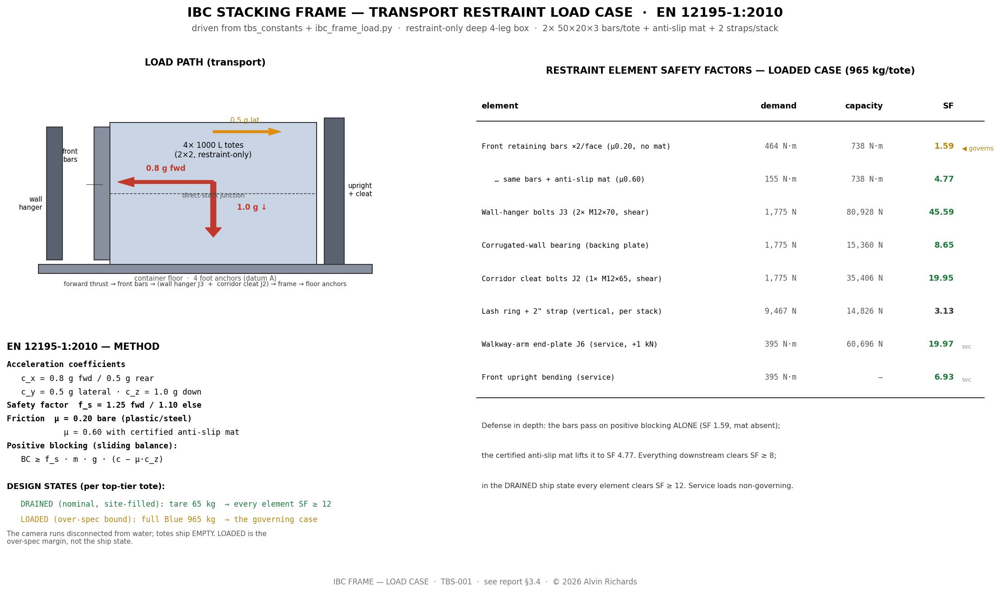
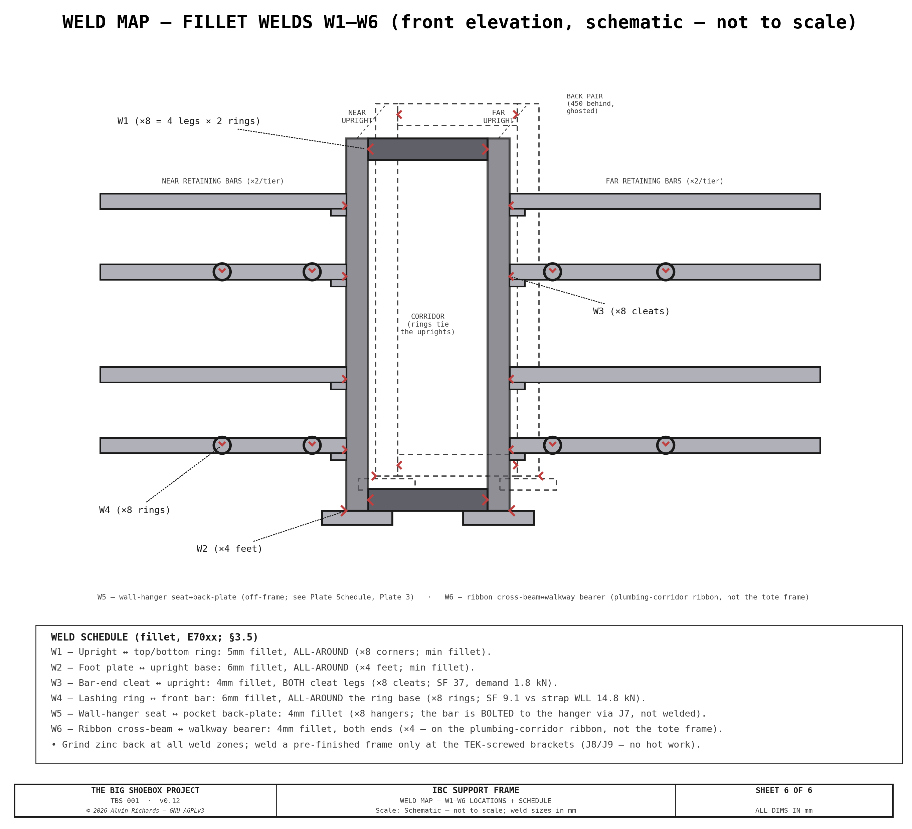
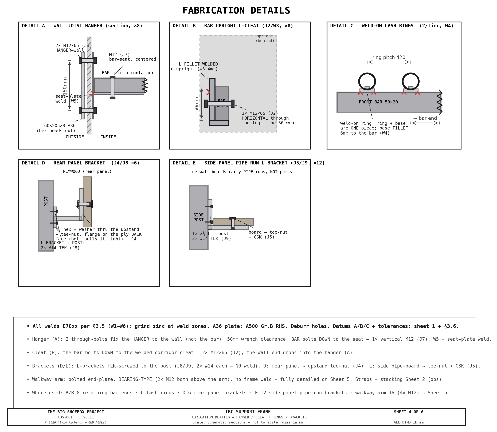
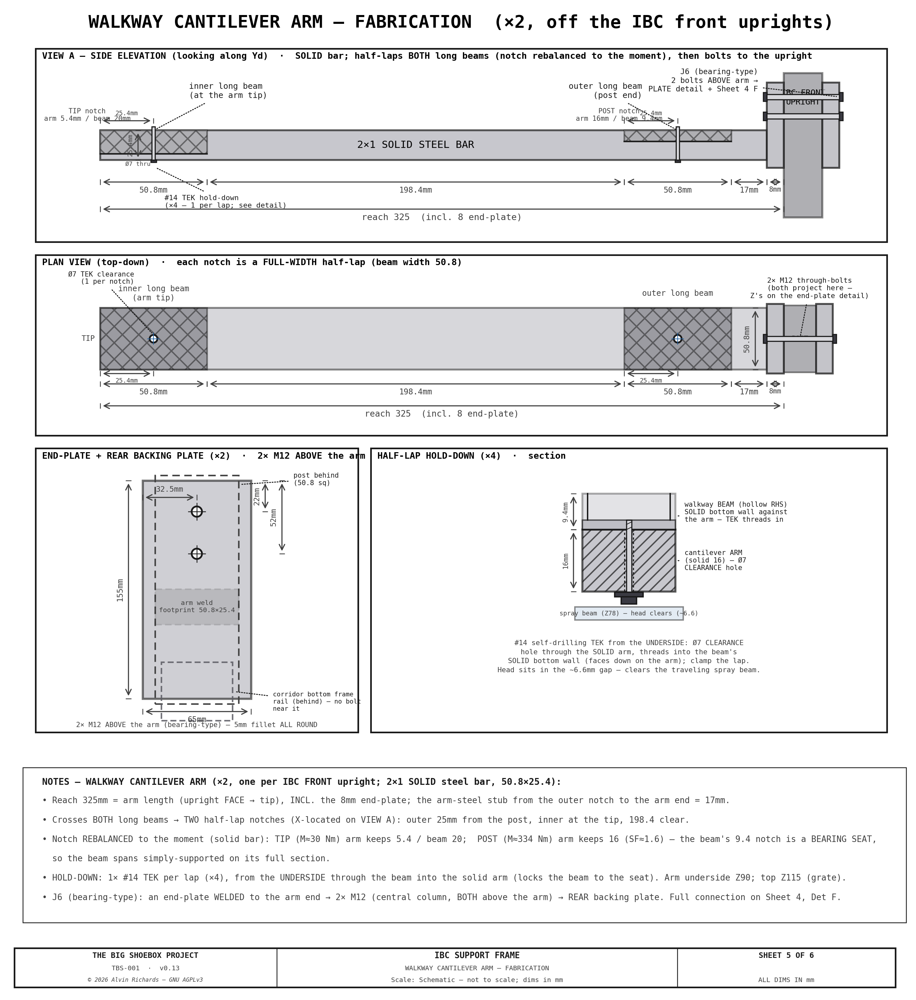
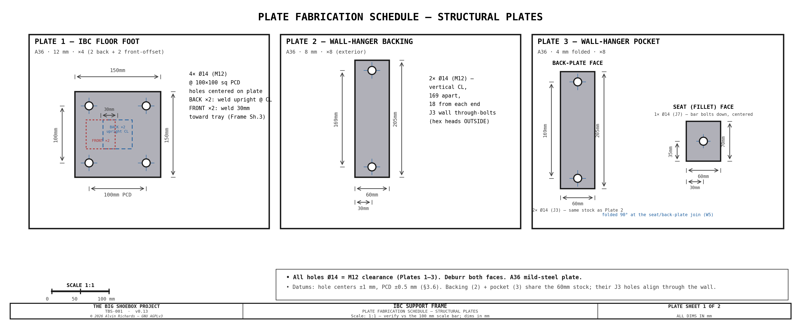
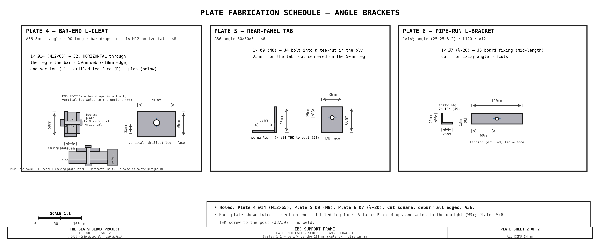

<!-- SPDX-License-Identifier: AGPL-3.0-only -->
<!-- © 2026 Alvin Richards -->
# IBC Stacking System

## 1. Purpose

TBS-001's three-circuit water system requires four 1,000 L caged composite totes arranged in a
2×2 stack in the right end zone of the container. Two Blue supply
totes (IBC-1 and IBC-2) sit on top; one Brown recycle tote (IBC-3) and one Waste tote
(IBC-4) sit on the bottom. A welded mild steel **restraint-only** frame restrains all four direct-stacked totes for transport, and maintains a <!-- BEGIN fact:corridor_width_mm -->270<!-- END fact:corridor_width_mm -->mm plumbing corridor
between the near and far columns for internal pipe routing, valves, and the equipment
panel.

**Design goals:**

- Restrain 4× 1,000 L caged totes in a 2×2 direct-stack (2 columns × 2 tiers)
- Restrain all totes for road transport with weld-on lashing rings
- Maintain a central plumbing corridor for pipe routing and valve access
- Enable external fill and drain without opening cargo doors
- Fit within the <!-- BEGIN fact:container_height_mm -->2,388<!-- END fact:container_height_mm -->mm container ceiling height with adequate clearance

<!-- brochure:skip -->
**Interactive 3D model** — the four IBC totes, the welded stacking frame, and the plumbing corridor. Drag to orbit, scroll to zoom.

  

    <iframe title="TBS-001 IBC Model" frameborder="0" allowfullscreen mozallowfullscreen="true" webkitallowfullscreen="true" allow="autoplay; fullscreen; xr-spatial-tracking" execution-while-out-of-viewport execution-while-not-rendered web-share src="https://sketchfab.com/models/8d091c60e93848f38e26c9c89a08cbc8/embed" style="position:absolute;top:0;left:0;width:100%;height:100%;border:0;"></iframe>
  

  
<a href="https://sketchfab.com/3d-models/tbs001-ibc-model-8d091c60e93848f38e26c9c89a08cbc8?utm_medium=embed&utm_campaign=share-popup&utm_content=8d091c60e93848f38e26c9c89a08cbc8" target="_blank" rel="nofollow" style="font-weight: bold; color: #1CAAD9;">TBS001 - IBC Model</a> by <a href="https://sketchfab.com/alvin91403?utm_medium=embed&utm_campaign=share-popup&utm_content=8d091c60e93848f38e26c9c89a08cbc8" target="_blank" rel="nofollow" style="font-weight: bold; color: #1CAAD9;">alvin91403</a> on <a href="https://sketchfab.com?utm_medium=embed&utm_campaign=share-popup&utm_content=8d091c60e93848f38e26c9c89a08cbc8" target="_blank" rel="nofollow" style="font-weight: bold; color: #1CAAD9;">Sketchfab</a>

<!-- brochure:endskip -->

---

## 2. IBC Totes

### 2.1 Specification

| Parameter | Value |
|-----------|-------|
| Model | Schütz Ecobulk MX 1000L (or equivalent US 48×40 caged composite tote) |
| Capacity | 1,000 L (~264 US gal) per tote. **"600 L" / "1,000 L" are fill levels, not tote sizes** — all four totes are identical |
| Overall dimensions | 1,219 × 1016 × 1,168mm (W × D × H) |
| Pallet format | US 48" × 40" composite |
| Pallet base height | 168mm (includes feet/runners) |
| Cage upright tube | Ø25mm |
| Cage top rail | 25mm OD |
| Drain valve | DN50 butterfly valve, S60×6 thread |
| Fill | **side entry near the top** (no top-cap access — only <!-- BEGIN fact:ibc_ceiling_clearance_mm -->52<!-- END fact:ibc_ceiling_clearance_mm -->mm headroom stacked) |
| Tare weight | ~65 kg per tote |
| Full weight (1,000 L) | ~1,065 kg per tote |
| Total tare (4 totes) | ~260 kg; water load see [weight-distribution report](weight-distribution-report.md) |

### 2.2 Tote Assignments

| Tote | Position | Circuit | Function |
|------|----------|---------|----------|
| IBC-1 | Top tier, near column | Blue (clean supply) | Primary clean water supply for spray bar |
| IBC-2 | Top tier, far column | Blue (clean supply) | Secondary supply, filled in parallel with IBC-1 from the X1 fill tee |
| IBC-3 | Bottom tier, near column | Brown (recycled) | Wash water buffer — filtered and recycled back to Blue |
| IBC-4 | Bottom tier, far column | Black (waste) | Contaminated water sealed for off-site disposal |

### 2.3 Layout

| Parameter | Value |
|-----------|-------|
| Near column Yd | 30–1,046mm (pushed to near/pinhole wall, 30mm clearance) |
| Far column Yd | 1,316–2,332mm (pushed to far wall, 30mm clearance) |
| Column X range | 4,674–5,893mm (right-justified to sealed end wall) |
| Plumbing corridor | Yd=1,046–1,316mm (270mm gap between columns) |
| Single IBC height | 1,168mm |
| Stacked height (2 totes, direct-stack cage-on-cage) | <!-- BEGIN fact:ibc_stack_height_mm -->2,336<!-- END fact:ibc_stack_height_mm -->mm (2 × 1,168mm — no deck/mat between tiers) |
| Ceiling clearance | <!-- BEGIN fact:ibc_ceiling_clearance_mm -->52<!-- END fact:ibc_ceiling_clearance_mm -->mm (2388 − 2,336mm) — tight but transport-validated (see [weight report](weight-distribution-report.md)) |

---

## 3. Stacking Frame — Restraint-Only Deep 4-Leg Box

### 3.1 General Arrangement

The 1,000L caged totes **direct-stack cage-on-cage** — the upper tote's pallet base
bears directly on the lower tote's cage top, leaving only <!-- BEGIN fact:ibc_ceiling_clearance_mm -->52<!-- END fact:ibc_ceiling_clearance_mm -->mm of ceiling headroom.
There is no room for (and no need for) a load-bearing platform deck between tiers, so
the frame is **restraint-only**: it carries no vertical service load, it only keeps the
totes from moving during transport.

The frame is a **deep 4-leg box** at the IBC front, spanning the plumbing corridor: a
**front pair** of full-height 2×2×0.120in uprights at the corridor mouth and a **back pair**
~450mm behind, tied by butt-jointed top and bottom rings, on four floor-flange feet (the
front feet reach ~25mm under the tray edge). Transport restraint is provided by:

- **front retaining bars** across each column at the IBC front that stop
  the totes sliding out the open front, their wall ends dropped into Simpson-style joist
  hangers;
- **Weld-on lashing rings** on the front bars, with ratchet straps over each stack;
- the totes are otherwise trapped by the container side walls (30mm gap) and sealed end wall.

The box carries the **Corridor Plumbing Panel** (pumps) and its **drain-riser backing spine**
on the back uprights, and gives the right-walkway cantilever arms their bolt-on point on the
front uprights — so it is the **shared metal structure of the IBC plumbing corridor**, not just a
tote-restraint frame. The panel brackets, the 12 side-panel pipe-run L-brackets, the ribbon cross-beams,
and the walkway-arm connection are validated and scheduled in §3.4–3.6 alongside the tote restraint.

### 3.2 Frame Specification

| Parameter | Value |
|-----------|-------|
| Material | 2×2×0.120in RHS mild steel (A500 Grade B) |
| Uprights | 4 full-height (deep 4-leg box: front pair at the corridor mouth + back pair ~450mm behind), tied by butt-jointed top + bottom rings |
| Floor anchorage | 4 × 150 × 150 × 12mm flange-plate feet, 4 × M12 anchors each (front feet reach ~25mm under the tray) |
| Front retaining bars | **8 × 50×20×3 RHS** — **two per tote face** (upper + lower), both seated in the 25mm gap to the film rail, wall → upright per column. Doubled from one to carry the loaded-transport case (§3.4) |
| Anti-slip matting | **4 × certified anti-slip mat (μ ≥ 0.6)** under the tote interfaces (2 on the floor + 2 on the lower-tote cage tops) — raises the sliding friction that credits against the forward thrust (§3.4) |
| Wall joist hangers | **8 × identical 2-bolt Simpson-style U-pocket** — one per bar (the pair uses identical hangers for fab simplicity), each **through-bolted (2 × M12×65) to an exterior backing plate** (M12×65 spans the 8mm plate + corrugation + 4mm hanger grip). Wall penetrations unchanged at 16 |
| Exterior backing plates | 8 × 60 × 205 × 8mm steel (one per hanger), on the **outside** of the container side walls (hex heads outside) — spread the totes' transport thrust into the thin corrugated wall so the bolts can't pull through |
| Weld-on lashing rings | 8 on the front bars (4 per tier); 3,333 lb (~1,512 kg) assembly WLL (2" strap-limited), 2 straps per stack |
| Panel mount | the box carries the Corridor (pump) Plumbing Panel + drain-riser spine on the back uprights, and the right-walkway cantilever arms on the front uprights |
| Frame weight | ~123 kg (4 uprights + rings + 4 feet + 8 front bars + 8 hangers + 8 exterior plates + rear-panel brackets + 4 mats — see [weight report](weight-distribution-report.md)) |
| Joints | Welded (fillet weld throughout — sizes scheduled in §3.5); the walkway-arm connection is a bolted end-plate (J6), not a frame weld |

### 3.3 Direct-Stack Junction

The upper tote bears directly on the lower tote's galvanized cage top rail
(no platform, mat or lip) — the totes' normal warehouse cage-on-cage stacking interface,
rated for a full upper tote.

### 3.4 Structural Validation (transport restraint) — EN 12195-1:2010

The frame carries **no vertical service load** (the totes stack on themselves), so there is no
platform-beam bending case. The governing case is **transport restraint**: the totes must not shift
when the container is moved by road — and, because the camera is designed to run **self-contained**
(disconnected from mains water and power), it is transported with **water aboard**. The restraint is
therefore designed for the loaded case, not just the drained one.

**Load basis — [EN 12195-1:2010](https://cdn.standards.iteh.ai/samples/32961/4592590bcf194f1a8ffa917a5db7d258/SIST-EN-12195-1-2011.pdf)** (the European cargo-securing standard for road transport). Design accelerations: **0.8 g forward** (braking), 0.5 g rearward, 0.5 g lateral, with **1.0 g vertical** in the friction term; safety factor **f_s = 1.25 forward / 1.1 otherwise** ([Table 2 + §5](https://hvttforum.org/wp-content/uploads/2019/11/Johansson-International-guidelines-on-safe-load-securing-for-road-transport.pdf)). A blocking (positive-restraint) device must carry **BC ≥ f_s · m · g · (c − μ·c_z)** — the inertia demand less the friction credit. Sliding friction **μ = 0.20** bare (the conservative fallback for an unlisted plastic-pallet-on-steel pairing), rising to **μ = 0.60** with certified anti-slip matting ([EN 12195-1 Annex B](https://res.jedermann.de/data/downloads/KB029-2_Gesamtdokument.pdf)). Forward (0.8 g) governs: it is the only direction with no wall to trap the totes (the side walls trap laterally, the sealed end wall rearward). The design mass is a full top-tier Blue tote, **965 kg** (65 kg tare + 900 L). Computed in [`ibc_frame_load.py`](https://github.com/alvinr/tbs/blob/main/src/generators/ibc_frame_load.py).

The forward thrust is blocked by the **front retaining bars**, seated in the 25mm film-rail slot — which limits each bar to a **20mm depth in the load direction** (weak-axis bending). A single bar per tote face fails this case (bending SF **0.79**). The design therefore uses **two bars per tote face** sharing the thrust, plus certified anti-slip matting to cut the demand:

| Element | Demand (loaded) | Capacity | SF (bar-alone) | SF (+ anti-slip mat) |
|---|---|---|---|---|
| Front retaining bar — bending (2 × 50×20×3, weak-axis) | 464 N·m | 738 N·m | **1.59** | **4.77** |
| Wall-hanger bolts (2 × M12×65 Gr.8.8 per bar) | 1,775 N | 80,900 N | 46 | — |
| Wall bearing (60×205×8 plate, 1.6mm wall, 2 holes) | 1,775 N | 15,400 N | 8.7 | — |
| Bar → upright cleat (2 × M12×65 A2, shear) | 1,775 N | 70,800 N | 40 | — |
| Lashing strap — vertical tie-down (2 straps/stack) | 9,467 N | 29,650 N | 3.1 | — |

The two bars give **defense in depth**: as positive blocking they pass on their own (**SF 1.59**, mat degraded or absent); with the anti-slip mat the friction credit lifts the margin to **SF 4.77**. Everything downstream of the bars is comfortably strong — the wall-hanger bolts, the corrugated-wall bearing (backing-plate-spread), the cleat bolts, and the tie-down straps all clear SF ≥ 8. In the **drained** transport state (site-filled water, totes empty) every element clears SF ≥ 12.

- **Front retaining bars** (two per tote face, 50×20×3 RHS, ~1,046mm span) share each tote's forward (−X) thrust into the floor feet + wall hangers.
- **Wall joist hangers** — **one identical 2-bolt hanger per bar** (8 total; the two bars of a pair use identical hangers for fabrication simplicity), each **through-bolted (2 × M12×65) to a 60×205×8mm exterior backing plate** on the outside of each side wall — the plate spreads the bolt load so the thin corrugated wall cannot pull through. Total wall penetrations stay at 16 (8 hangers × 2 bolts = the old 4 × 4). M12×65 (partial thread) spans the ~42–54mm sandwich (8mm plate + corrugation + 4mm hanger). **Both ends of the bar now use the SAME L-cleat** — the corridor-end **J2** and the wall-end **J7** each drop the bar into an L-angle and run a single horizontal M12×65 through the L's vertical leg + the bar's 50mm web, with a small nut-side **backing plate** spreading the load into the bar's far web.
- **Anti-slip matting** (certified μ ≥ 0.6) under each tote interface is the primary friction lever — it triples the effective margin and directly answers the "totes must not shift" requirement.
- **Weld-on lashing rings + 2 straps/stack** (3,333 lb / ~1,512 kg per strap) provide vertical tie-down against the forward-tipping mode of the tall loaded stack (CG Z≈1,345mm) and supplement lateral restraint; the totes are otherwise wall-trapped.
- **Floor feet** (150×150×12, 4 × M12 each) anchor the uprights against uplift and transfer loads into the slab.

**Service + walkway load cases** (the same frame also carries the plumbing panel and the walkway — both **non-governing** vs the transport case):

- **Plumbing panel + pumps** (~20 kg on the 6 rear-panel brackets) = ~33 N/bracket, static — trivial (SF ≫ 10).
- **Right-walkway cantilever** — each of the 2 arms carries ~22 kg dead + a 1 kN person point load at the deck (325 mm out from the upright) = a **395 N·m moment into the front upright**: the 50.8 RHS upright bends at **SF 6.9**, and the arm→upright connection — a **bolted end-plate**, **bearing-type** (a plate welded to the arm end, then 2× M12 **both above the arm** through the upright into a **rear backing plate**, J6): the top bolt group takes the tension while the plate bears compression at the bottom against the upright. At the ~65 mm lever the two bolts share **~3.0 kN each** (**SF ≈ 20** on the M12), and the backing plate spreads the reaction so the hollow RHS wall can't dish. **Both bolts sit above the arm** — this clears the 3-way corner congestion at the front upright: the corridor's bottom frame X-rail (Z12–63) runs behind the plate's lower edge (ghost-marked on Sheet 5) with **no bolt near it**, and neither bolt fouls the welded arm (Z90–115). A walkway support carries **down-load only** (deck + people; the grate lifts out without loading the arm up), so the asymmetric bearing-type joint is appropriate. The arm itself is a **solid 2×1 flat bar** (not a tube): each arm half-laps over *both* walkway long beams, and a notched hollow tube opens into a weak channel — a notched partial section has to be solid to keep its strength. The half-lap is **rebalanced to the moment**: a deep arm notch at the tip (M ≈ 30 N·m, arm keeps 5.4 mm), and at the post end (M ≈ 267 N·m) the **outer beam** takes the deep notch so the arm keeps 16 mm (**SF ≈ 2.0** on the solid bar). The outer beam's thin 9.4 mm notch sits at an arm support, but a thin channel can't carry that support's hogging — so the half-lap is a **bearing seat** (the beam's upper 9.4 mm rests on the arm's lower 16 at ~0.2 MPa), i.e. a pinned support. The beam therefore spans **simply-supported on its full 25.4 mm section** — **SF ≈ 7** and **~2 mm** deflection under a person (`ibc_frame_load.outer_beam_frame_check`; the light grate load and person-share are estimates to firm with the full walkway-frame model). Each half-lap is **positively secured** by one **#14 self-drilling TEK screw** (4 total) driven from the underside through a Ø7 **clearance** hole in the solid arm, threading into the hollow beam's **solid bottom wall** (which faces down onto the arm) — an anti-lift/anti-slide locator whose head clears the traveling spray beam. The arm's fabrication (including the hold-down section) is drawn on Sheet 5.

The load path, the EN 12195-1 method, and the full demand/capacity/SF matrix (driven from `ibc_frame_load.py`) are drawn on the load-case sheet:

### 3.5 Fastener + Weld Schedule (fabrication)

Every bolted and welded joint in the restraint frame, for the fabricator. Weld sizes are computed in
[`ibc_frame_load.py`](https://github.com/alvinr/tbs/blob/main/src/generators/ibc_frame_load.py); torques
are the standard values for the grade.

**Fastener schedule**

| ID | Joint | Fastener | Grade | Qty | Torque | Washers | Locking |
|----|-------|----------|-------|-----|--------|---------|---------|
| J1 | Floor foot-plate → floor + crossmember | #14×3¼″ winged self-driller (F14C325FDC) | 410 SS | 16 | driven to seat / flush — no torque spec (self-drilling; not a structural bolt) | — | thread-forming, self-locking |
| J2 | Front-bar corridor end → upright **L-cleat** — the bar drops into the L, **1 HORIZONTAL** bolt through the vertical leg + the bar's tall 50 mm web (the L-corner carries the load; the bolt secures the unsupported direction) | M12×65 hex (92800A481, 18-8 SS) | A2-70 (18-8 SS) | 1 per bar × 8 = 8 | **~50 N·m** with anti-seize (stainless galls → torqued lower than 8.8; no impact driver) | flat | nyloc nut |
| J3 | Wall hanger → side wall → exterior backing plate | M12×65 through-bolt (91280A728) | Gr.8.8 zinc | 16 | **~90 N·m** (85–95 band) | flat (head, outside) + flat + split-lock (nut, inside) | plain nut + split-lock washer |
| J4 | Rear panel → L-bracket upstand (off the back upright) | M8 hex into captive 5/16 tee-nut set from the ply BACK face (tension pulls the flange against the wood) | zinc | 6 brackets | snug + locker (light static load) | flat washer under head | thread-locker |
| J5 | Side-panel pipe-run boards → L-brackets | ¼-20 CSK machine screw into captive pronged tee-nut (rear-panel method, #30) | zinc | 12 brackets | snug | — | pronged tee-nut (self-locking in ply) |
| J6 | Walkway cantilever arm → front upright (arm end-plate → **rear backing plate**, bolted through the upright; **bearing-type — both bolts above the arm**, clear of the corridor bottom rail + the welded arm; internal crush sleeve per bolt) | M12×100 hex through-bolt | Gr.8.8 zinc | 2 arms × 2 bolts = 4 | **~90 N·m** (85–95 band) | flat both ends | nyloc nut |
| J7 | Front-bar wall end → wall-hanger **L-cleat** — the SAME joint as the post end: the bar drops into the L, **1 HORIZONTAL** M12×65 through the vertical leg + the bar's 50mm web (nut on a far-web backing plate). The L is welded to the inside wall plate; the inside + outside plates clamp the container wall via J3 | M12×65 hex (92800A481, 18-8 SS) | A2-70 (18-8 SS) | 1 per bar × 8 = 8 | **~50 N·m** with anti-seize | flat | nyloc nut |
| J8 | Rear-panel L-bracket → back upright (post leg) | #14 self-drilling TEK screw, #4/5 point, HWH | 410 SS | 2 per bracket × 6 = 12 | driven to seat — no torque spec (self-drilling; light static panel load) | bonded washer | thread-forming, self-locking |
| J9 | Side-panel pipe-run L-bracket → side post (weld leg) | #14 self-drilling TEK screw, #4/5 point, HWH | 410 SS | 2 per bracket × 12 = 24 | driven to seat — no torque spec (self-drilling; light pipe load) | bonded washer | thread-forming, self-locking |

Straps: 2 × 2″ ratchet strap per stack, ratcheted to the 3,333 lb (~1,512 kg) assembly WLL — no torque.

Torque sources: M12 8.8 zinc/dry ≈ 88 N·m ([Fastenal torque-tension, K = 0.20](https://crafter.fastenal.com/static-assets/pdfs/technical-resources/Torque-Tension-Relationship-for-Metric-Fasteners-Property-Class-4.6-8.8-10.9-12.9.pdf)) to 93 N·m ([Bossard preload/torque, µ = 0.14](https://assets.eu.ctfassets.net/0vp0u5uh75zd/3S40LEUM235Qk3rJk2phR1/c715f9f45232756c12b59aa681c7fede/060_074_Preload_tightening_torques_Fastening_EN_01_2025.pdf)); M12 A2-70 ≈ 51 N·m (µ = 0.10, [Bossard austenitic-stainless table](https://assets.eu.ctfassets.net/0vp0u5uh75zd/3S40LEUM235Qk3rJk2phR1/c715f9f45232756c12b59aa681c7fede/060_074_Preload_tightening_torques_Fastening_EN_01_2025.pdf)); #14 self-drillers are driven to seat, not torqued ([ITW Buildex TEKS technical guide](https://www.tannerbolt.com/media/akeneo_connector/media_files/T/e/Teks_Select_Technical_Guide_Steel_to_Steel_4_5_56b0.pdf)).

**Weld schedule** (fillet, E70xx electrode; frame welds carry small restraint loads → set by the AWS D1.1 minimum practical fillet for ≤6 mm plate, except the load-checked W3/W4)

| ID | Joint | Fillet leg | Extent | SF |
|----|-------|-----------|--------|-----|
| W1 | Upright ↔ top/bottom ring | 5 mm | all-around | min fillet |
| W2 | Floor foot-plate ↔ upright base | 6 mm | all-around | min fillet |
| W3 | Bar-end cleat ↔ upright | 4 mm | both cleat legs | **37** (demand 1.8 kN) |
| W4 | Weld-on lashing ring ↔ front bar | 6 mm | all-around the ring base | **9.1** (demand = strap WLL 14.8 kN) |
| W5 | Wall-hanger seat ↔ pocket back-plate (the hanger PLATE weldment — the bar is *bolted* to it via J7, not welded) | 4 mm | — | min fillet |
| W6 | Ribbon cross-beam ↔ walkway bearer (×4 ends) | 4 mm | both ends | min fillet |

The rear-panel bracket (**J8**) and the side-panel pipe-run L-bracket (**J9**) are **no longer welded** — they attach to the post with **#14 self-drilling TEK screws** (2 per bracket) so they can be added to a pre-finished, painted frame with no hot work and stay adjustable; both carry only light static loads (panel ~33 N/bracket; pipe runs lighter).

**Sheet 6** maps where each weld lands on the frame (a schematic front elevation with W1–W6 ticked) alongside the schedule:

The wall joist hangers are **folded** 4 mm plate (bent, not welded); the exterior backing plates are loose (bolted, not welded). The corridor-panel + side-panel pipe-run brackets and the ribbon cross-beams are the **plumbing-corridor metal** that shares this frame; the walkway cantilever arms **bolt** to the front uprights (J6, an end-plate welded to the arm + a rear backing plate, 4× M12 through-bolts — not a frame weld) and are fabricated per Sheet 5.

These joints are drawn on **Sheet 4** (each with its weld + fastener callout):

The walkway cantilever arms — how each arm is cut (the **two half-laps** where it crosses the walkway's inner + outer long beams, dimensioned on the side elevation) and the end-plate bolt-hole pattern — are drawn on **Sheet 5** (VIEW A side elevation of the J6 joint, the END-PLATE detail, and the PLAN VIEW showing the plate→post through-bolts):

### 3.6 Datum + Tolerance Scheme

The frame is a welded structure, so tolerances follow **ISO 13920 Class B** (general tolerances for welded
constructions) for linear/angular, and **AWS D1.1** for the welds; the values below are the functional
tolerances that actually matter for fit-up.

**Datums:**

- **A (primary)** — the common plane of the four floor-foot undersides. The frame is set and shimmed to A; everything references off it (it sits on the container floor).
- **B (secondary)** — the front-upright front faces (X = 4,654 mm, the corridor mouth). References the retaining-bar / hanger X positions and the walkway-arm end-plate point.
- **C (tertiary)** — the corridor centerline (Yd = 1,181 mm, midway between the two tote columns). Symmetry reference for the columns and the 270 mm plumbing corridor.

**Functional tolerances:**

| Feature | Tolerance | Why |
|---------|-----------|-----|
| Foot-underside coplanarity (flatness ⟂ A) | ±1.5 mm | frame sits flat on the floor, minimal shim |
| Upright plumb (perpendicularity to A) | ±2 mm over 2,296 mm (≈0.05°) | totes + corridor stay square |
| Frame diagonal square (Δ of the two diagonals) | ±3 mm | a true rectangular box |
| Foot-plate M12 hole pattern (100 mm PCD) | ±0.5 mm | floor-anchor clearance |
| Front-bar seat / hanger-pocket Z position | ±2 mm | bars seat cleanly + the wall holes align |
| Exterior backing-plate M12 holes (to its hanger) | ±1 mm | M12×65 through-bolt clearance |
| Corridor clear width (between the inner uprights) | +2 / −0 mm | the 270 mm plumbing corridor must not pinch |
| Rear-panel bracket Z position (on the back uprights) | ±2 mm | plumbing-panel mount aligns |
| Side-panel pipe-run L-bracket landing (post inner face) | ±2 mm | the support boards seat flush |

General (unspecified) dimensions: ISO 13920 Class B. Break sharp edges; deburr all drilled holes.

---

### 3.7 Assembly + Weld Sequence

The frame is a **shop-welded box that bolts out in the field** — deliberately, so the only hot work is the
deep 4-leg weldment (§3.5, W1–W6). Everything hung on it afterward — the wall hangers, the retaining bars,
the corridor-panel and pipe-run brackets — attaches with fasteners (J1–J9), so the fit-out and the tote
loading happen on a **finished, painted frame with no welding on-site.** Build in four phases:

**Phase 1 — Shop-weld the deep 4-leg box (the only weldment).**

1. **Fit-up in a jig** referencing the datums (§3.6): the four foot undersides on the flat table = datum A, the
   front-upright faces = B, the corridor centerline = C. Clamp the four uprights + the top/bottom rings; set
   the box square.
2. **Tack, then check square before finish-welding** — verify the diagonals and upright plumb are inside the
   §3.6 tolerances while the joints are still only tacked and correctable. A weldment pulls toward each bead,
   so distortion is controlled by *balanced, symmetric* welding, not by fixing it afterward
   ([TWI — distortion control](https://www.twi-global.com/technical-knowledge/job-knowledge/distortion-control-prevention-by-fabrication-035)).
3. **Finish-weld in a balanced order:** ring-to-upright joints in a back-step / alternate-corner pattern so heat
   input stays symmetric about datum C; weld the four feet with the frame held down on the flat table so the
   undersides stay coplanar to A (the frame's seat). Then add the smaller weldments — the bar-end cleats (W3),
   the weld-on lash-ring bases (W4), and the ribbon cross-beams (W6).
4. **Grind the zinc back at every weld zone** (galvanized/primed stock burns dirty), welds per §3.5 (E70xx).
5. **Post-weld: re-check the §3.6 tolerances**, then coat (surface-finish spec is set at the fab/quoting stage).

**Phase 2 — Bolt-on fit-out (no hot work, on the finished frame).** TEK-screw the corridor-panel and pipe-run
L-brackets to the posts (J8/J9), then hang their ply boards (J4/J5). Because these are self-drillers into the
post wall, the brackets can be located, adjusted, or replaced on the painted frame without touching a welder.

**Phase 3 — Install + anchor in the container.** Set the box on the floor, shim to datum A, and anchor the four
feet (J1). Through-bolt each wall hanger to the side wall via its exterior backing plate (J3) — the backing
plate spreads the load into the thin corrugated wall.

**Phase 4 — Load the totes + secure.** Direct-stack the four totes, drop the front retaining bars into the wall
hangers, and bolt each bar down — the corridor end to its cleat (J2) and the wall end with its centered
retention bolt (J7). Fit the anti-slip mats under the tote interfaces, then lash down per §4. Transport
removes nothing from the frame; only the tote straps are released at the destination.

### 3.7 Member Cut List

Every cut member of the restraint frame, with its fabrication cut size and quantity. Computed from the
geometry constants by `src/generators/ibc_frame_cutlist.py` (the same math the 3D model builds from, so
the list can't drift from the model); regenerate with `python3 src/generators/ibc_frame_cutlist.py --inject`.
Cut sizes are member-to-member butt lengths — add saw kerf per shop practice.

<!-- BEGIN cutlist -->
| Member | Section / plate | Material | Cut size | Qty | Note |
|--------|-----------------|----------|----------|-----|------|
| Corner upright | 50.8×50.8×3 SHS (2×2×0.120in) | A500 Gr.B | 2284 mm | 4 | full height; sits on the foot plate (Z12→TOP_Z) |
| Ring rail — Yd (cross) | 50.8×50.8×3 SHS (2×2×0.120in) | A500 Gr.B | 168.4 mm | 4 | 2 rings (top+bottom) × 2 X-faces; butts between uprights |
| Ring rail — X (deep) | 50.8×50.8×3 SHS (2×2×0.120in) | A500 Gr.B | 399.2 mm | 4 | 2 rings × 2 Yd-faces; ties front↔back uprights |
| Front retaining bar | 50×20×3 RHS | A500 Gr.B | 1042 mm | 8 | 2 per tote face (near+far columns identical length) |
| Foot plate | 150×150×12 plate | A36 plate | 150×150×12 mm | 4 | 4× Ø12mm anchor holes on Ø100 PCD |
| Exterior wall backing plate | 8 mm plate | A36 plate | 60×204.8×8 mm | 8 | one per wall hanger; spreads the M12×65 load into the corrugated wall |
| Wall joist hanger | 4 mm folded plate | A36 plate | back 205 + seat 70, ×60 wide | 8 | Simpson-style U-pocket; folded, not welded |
| Front-bar L-cleat (J2/W3) | 8 mm angle | A36 plate | 90 long · vertical leg 59 + horizontal leg 28 | 8 | L-angle: the bar drops into the corner (horizontal leg under it, vertical leg fillet-welded to the upright); 1 horizontal M12 through the vertical leg + the bar web |
| Rear-panel bracket (D) | 5 mm angle | A36 plate | base 40 + upstand, ×60 tall × 30 wide | 6 | L-bracket TEK-screwed to the back uprights (J8) + panel bolts (J4) |
| Weld-on lashing ring | forged ring + base | — | purchased | 8 | not a cut member — 2 per tier on the lower front bars (W4) |

**Stock (buy sticks; add saw kerf + ~10% drop):**

| Section | Total cut length | ≈ sticks (24 ft) |
|---------|------------------|------------------|
| 50.8×50.8×3 SHS (uprights + rings) | 11.41 m (37.4 ft) | 2 |
| 50×20×3 RHS (front bars) | 8.34 m (27.3 ft) | 2 |
<!-- END cutlist -->

The fabricated (non-stick) parts — the foot plate, the exterior wall backing plate, the folded wall joist hanger, and the front-bar cleat — are dimensioned 1:1 with their hole patterns and J/W callouts on the [Plate Fabrication Schedule](#8-engineering-drawings) (Plates 1–4).

---

## 4. Securing for Transport

### 4.1 Weld-On Lashing Rings

| Parameter | Value |
|-----------|-------|
| Quantity | 8 total (4 per tier) |
| Type | 1½" (38mm) ID weld-on tie-down ring, ½" thick, zinc-plated steel |
| Working load limit | 6,600 lb (2,994 kg) ring — assembly strap-limited to 3,333 lb (~1,512 kg) |
| Mounting | Fillet-welded directly to the front retaining bars (integrated weld base — no separate plate) |
| Supplier | McMaster-Carr #3028T31 |

### 4.2 Ratchet Straps

| Parameter | Value |
|-----------|-------|
| Type | 2" (50mm) ratchet strap (Keeper 82827) |
| Working load limit | 3,333 lb (~1,512 kg) |
| Routing | ring to ring, over IBC top, 1 strap per tier per side |
| Total straps | 4 (2 per tier) |
| Pre-transport | Tighten all straps; re-check tension after 50 km |

### 4.3 Wall Trapping

There is no anti-rotation lip. The direct-stacked totes are trapped
laterally by the container side walls (30mm gap each side) and the sealed end wall;
the front retaining bars + lashing-ring ratchet straps restrain the open front and
provide vertical tie-down. Together these restrain both tiers in all six DOF.

### 4.4 Anti-Slip Matting

| Parameter | Value |
|-----------|-------|
| Quantity | 4 (one under each tote: 2 on the container floor, 2 on the lower-tote cage tops) |
| Type | Certified anti-slip cargo matting, **μ ≥ 0.6** ([EN 12195-1 Annex B](https://res.jedermann.de/data/downloads/KB029-2_Gesamtdokument.pdf)) — cut to the tote pallet footprint |
| Purpose | Raises the sliding friction that credits against the forward thrust (μ 0.2→0.6), tripling the front-bar margin (SF 1.59→4.77, §3.4) — the primary "totes don't shift" lever |
| Note | Must be a **tested/certified** μ ≥ 0.6 product; untested rubber caps at μ 0.2 |

---

## 5. Drain Valve Access

The bottom-tier drain valves (DN50 butterfly, corridor-facing) are reached
directly from the **open corridor front** — with the Corridor Plumbing Panel moved forward and
no load-bearing base frame, there are no removable access gates. The operator reaches in
from the right walkway.

---

## 6. External Bulkhead Ports

Three 2" NPT bulkhead ports penetrate the sealed end wall on the container
centerline — **X1** (Blue fill), **X3** (Brown drain), and **X4** (Waste drain) —
so all four totes fill and drain without opening the cargo doors. X1 gravity-feeds
an internal tee that side-enters both Blue totes near the top, so one external hose
fills both. Each penetration is backed by a welded wall reinforcing plate that
spreads its load into the corrugated wall (the same approach as the frame's
exterior backing plates, [§3.2](#32-frame-specification)).

The port elevations are the diagram-of-record (see [§8 Sheet 3](#8-engineering-drawings)).
The bulkhead fittings, camlock, and seals are specified in the
[Water System Report](water-system-report.md) §5 and §7; the bulkhead BOM,
including the reinforcing plates, is in the
[master shopping list](master-shopping-list.md). (These end-wall ports are
distinct from the two equipment **Plumbing Panels** — Corridor and Pinhole Wall —
in [§7](#7-internal-plumbing).)

---

## 7. Internal Plumbing

All internal supply and return lines route through the <!-- BEGIN fact:corridor_width_mm -->270<!-- END fact:corridor_width_mm -->mm plumbing corridor
between the near and far IBC columns, reaching each tote's corridor-facing DN50
butterfly valve (S60×6 thread). The pipe specification, the per-circuit routing
(X1 Blue gravity-fill teed to both top totes, X3 Brown and X4 Waste pumped drains,
and the recycle returns), and the valve schedule are specified in the
[Water System Report](water-system-report.md) §4–§5 and §7. The pumps and
diverter valves that drive those circuits — on the **Corridor Plumbing Panel**
(plywood, at the front (cargo-door) mouth of the corridor, bolted to the
deep-box frame, see [§3.2](#32-frame-specification)) — together with the
3-stage filter bank on the **Pinhole Wall Plumbing Panel** are specified in the
[Plumbing Report](plumbing-report.md). This report treats the corridor plumbing
and both panels only as loads the stacking frame carries.

---

## 8. Engineering Drawings

The construction drawings cover the IBC system across two drawing sets. They are shown inline in the
relevant sections above; the full set is collected here and in [Engineering Diagrams](engineering-diagrams.md).

<!-- brochure:skip -->

### IBC Stacking & Securing (5 sheets)

**Sheet 1 — Cross-section elevation: 2-tier direct-stack, restraint deep 4-leg box, front retaining bars + wall hangers, direct-stack junction, <!-- BEGIN fact:ibc_ceiling_clearance_mm -->52<!-- END fact:ibc_ceiling_clearance_mm -->mm clearance**

**Sheet 2 — Securing arrangement: the 8 lash-point locations + strap routing over each stack (rigger's plan; fastening + weld construction details → IBC Support Frame Sheet 4)**

**Sheet 3 — External bulkhead ports: Sealed end wall elevation with 3× ports**

**Sheet 4 — Internal plumbing plan view: IBC layout, pipe routing, valves, Corridor Plumbing Panel**

**Sheet 5 — Internal plumbing elevation: Pipe routing from IBCs to bulkhead unions**

### IBC Support Frame Fabrication (6 sheets + 2 plate-schedule sheets)

**Sheet 1 — Front elevation: deep-box uprights (front pair, back pair 450mm behind), floor feet, front retaining bars with their J2 corridor-end L-cleats (1 horizontal bolt) and J3/J7 wall-hanger bolts, weld-on lashing rings, direct-stack junction**

**Sheet 2 — Side elevation: deep 4-leg box (front + back uprights + top/bottom rings) + front bars (end-on) + the walkway cantilever arm with its J6 bearing-type connection (2× M12 run through the post ABOVE the arm — end-plate + rear backing plate) + the plywood mounting tabs on the back upright**

**Sheet 3 — Plan view: deep 4-leg box (4 legs + ring perimeter) + retaining bars + 4 floor feet + IBC footprints + corridor + walkway arms**

**Sheet 4 — Fabrication details: DETAIL A wall joist hanger (per-bar, 2-bolt, 50mm clearance), B bar→upright cleat, C weld-on lashing ring, D rear-panel bracket, E side-panel pipe-run L-bracket — each with weld (W) + fastener (J) callouts. (The walkway arm→upright J6 connection is drawn in full on Sheet 5, so its former Detail F here was dropped as a duplicate.)**

**Sheet 5 — Walkway cantilever arm fabrication (×2, off the IBC front uprights): VIEW A dimensioned side elevation (arm reaching 325 mm from the upright to the tip, half-lapping over both long beams — notch widths + gaps 50.8 / 198.4 / 50.8 / 17 arm-steel + 8 end-plate = 325 reach, half-lap depth 20 of the 25.4; J6 bolted end-plate), PLAN VIEW (each notch a full-width half-lap, beam width 50.8; the plate→post through-bolts shown at the upright end), and the END-PLATE / rear-backing-plate detail (65 × 155, 2× Ø13 for M12 **both above the arm** at 30 spacing — bearing-type; the corridor bottom frame rail is ghost-marked behind the plate's lower edge with no bolt near it — 5 mm fillet all round, arm weld footprint shadow-marked)**

**Sheet 6 — Weld map: a schematic front elevation with every fillet weld W1–W6 ticked to where it lands on the frame (W1 upright↔ring, W2 foot↔upright, W3 bar-end cleat↔upright, W4 lashing ring↔bar, W5 wall-hanger seat↔back-plate, W6 ribbon cross-beam↔walkway bearer), alongside the full weld schedule (size, all-around vs both-legs, qty, and the governing SF)**

**Plate Schedule Sheet 1 — Structural plates drawn 1:1 for the shop: PLATE 1 IBC floor foot (150×150×12, 4× Ø14 @ 100 sq PCD), PLATE 2 wall-hanger exterior backing (60×205×8, 2× Ø14 @ 169), PLATE 3 wall-hanger pocket (folded 4 mm back-plate + 70 seat, J3 + J7 holes) — each with outline dims, hole Ø + center positions, thickness, material, and qty**

**Plate Schedule Sheet 2 — Bar-end L-cleat + welded angle brackets drawn 1:1: PLATE 4 bar-end L-cleat (8 mm L-angle, 90 long; the bar drops into the corner, 1 horizontal Ø14 for M12×65 through the vertical leg + the bar's 50 mm web, J2/W3), PLATE 5 rear-panel tab (50×50×5, Ø9/M8, J4), PLATE 6 side-panel pipe-run L-bracket (1×1×⅛, Ø7/¼-20, J5) — L-section end + drilled-leg face for each**

<!-- brochure:endskip -->

Full drawings also appear in [Engineering Diagrams](engineering-diagrams.md) §15
(stacking) and §17 (frame fabrication).

---

## 9. Parts List

### 9.1 Stacking Frame

<!-- BEGIN parts:ibc-frame -->
| Item | Spec | Qty | Supplier | Est. cost |
|------|------|-----|----------|-----------|
| 2×2×0.120in steel SHS (6 m bulk lengths) | Deep 4-leg box uprights (front + back pair) + top/bottom rings + front retaining bars + panel-mount rail (~24 m; front retaining bars DOUBLED to 8 (2/tote face, 50×20×3, ~8.8 m) after the EN 12195-1 loaded-transport case — ibc_frame_load.py; the 50×20×3 bars are a separate section from the 2×2 uprights, lumped here as bulk steel pending the Phase-D split). MATERIAL = 2×2×⅛in A500 square tube (US equiv, confirmed 2026-08-01). SOURCING: full 6m/20-24ft sticks minimize splices but ship only by freight — online cut-to-size shops cap at 96in (UPS max: AllMetals/InchOfMetal 96in, Speedy $7.27/ft cut-retail ≤90in). So the ~$120-180 (4×$30-45) est is realistic BULK full-length pricing (~$1.50-2.50/ft); firm it from a local steel-yard / MetalsDepot 24ft freight quote — NOT an online cut-to-size lookup (which overprices bulk ~3×). | 4 ea | Metal Supermarkets | $120–$180 |
| 12mm steel plate, 150 × 150 cut | Deep-box upright floor flange feet (one per leg; front feet reach under the tray) | 4 ea | Metal Supermarkets | $20–$40 |
| 4mm folded plate | Simpson-style U-pocket wall joist hangers — 8 IDENTICAL 2-bolt hangers, one per front retaining bar (the pair uses identical hangers for fab simplicity — Alvin 2026-08-14). Each through-bolted (2× M12×65) to its own exterior 60×205×8 backing plate on the outside of the container side wall. Wall penetrations unchanged at 16 (8 hangers × 2 = old 4 × 4). | 8 ea | Local fab | $60–$100 |
| [Weld-on lashing ring, 1½" ID](https://www.mcmaster.com/3028t31/) (3028T31) | Zinc-plated steel weld-on tie-down rings — 1½" (38mm) inside × ½" thick, 6,600 lb WLL; fillet-welded to the front retaining bars (4 per tier × 2 tiers). Integrated weld base — no separate mount plate. Ring (6,600 lb) exceeds the 2"-strap-limited 3,333 lb (~1,512 kg) assembly WLL. | 8 ea | McMaster-Carr | $40 |
| [2" (50mm) ratchet strap, 3,333 lb WLL](https://www.homedepot.com/p/331257450) (82827) | Transport securing, over each stack (2 per stack × 2 stacks). Keeper 82827 heavy-duty 2"×27ft, 3,333 lb (~1,512 kg) WLL / 10,000 lb break — width corrected 25mm→50mm (a 1" strap can't hold the 1,100 kg the restraint needs). EN 12195-1 vert tie-down SF 3.1 loaded (ibc_frame_load.py). | 4 ea | Home Depot | $68 |
| Certified anti-slip cargo matting (μ≥0.6) | Certified anti-slip rubber matting under each tote interface (4: 2 on the container floor + 2 on the lower-tote cage tops). Raises the sliding friction μ 0.2→0.6 per EN 12195-1 Annex B, cutting the front-bar forward-blocking demand ~3× (bar SF 1.59 bar-alone → 4.77 with mat; ibc_frame_load.py). Cut to the tote pallet footprint (~1.0×1.2 m). REQUIRES a certified/tested μ≥0.6 product (untested rubber caps at μ 0.2). | 4 ea | Uline / cargo-securing supplier | $40–$80 |
| [Self-drilling structural screw, #14×3¼″ winged, 410 SS](https://www.fastenersplus.com/products/14-x-3-1-4-self-drilling-flat-head-screw-with-wings-410-stainless-steel-pkg-100) (F14C325FDC) | 4 deep-box flange feet × 4 each. Self-drills the 6mm foot plate + 28mm plywood and taps the ~4mm steel crossmember — LAND EACH FOOT OVER A CROSSMEMBER (~450mm centers). Wings ream the plate/ply clearance then snap off at the steel. 410 SS (martensitic — self-drills steel; 316 can't). The IBC dead load bears in compression on the floor; the screws resist sliding/uplift only. Through-bolt 316 + backing nut instead where a crossmember underside is reachable. $1.02/ea (100-pk). | 16 ea | Fasteners Plus / ASMC | $16 |
| [M12×65 hex bolt, 18-8 SS (partial thread)](https://www.mcmaster.com/92800A481/) (92800A481) | Front-bar fasteners: 8 = corridor-end L-cleats (J2, 1 HORIZONTAL bolt per cleat × 8 bars — through the L's vertical leg + the bar's TALL 50mm web, so the Ø14 hole gets ~18mm edge; the L-corner carries the load, the bolt secures the unsupported direction — redesigned from 2 vertical bolts, Alvin 2026-08-18) + 8 = wall-end vertical retention bolts (J7, 1 CENTERED per bar, down through the bar into the pocket seat, ~58mm stack). M12×65 reused for BOTH (>40mm needed; partial-thread smooth shank spans the grip; the 65 length is long for J2's ~36mm grip but avoids a second SKU — pad/trim at fab). McMaster 92800A481: M12×1.75 × 65mm 18-8 SS partial-thread hex — firm $9.95/pack of 5 (2026-08-17, Alvin; 16 used → 4 packs). Full-thread alternative: 92314A595 $11.92/5. | 16 ea | McMaster-Carr | $32 |
| [M12×65 hex through-bolt, Grade 8.8 zinc, partial-thread](https://www.mcmaster.com/91280A728/) (91280A728) | IBC wall-hanger through-bolts (2 each × 8 hangers = 16) — through the corrugated side wall to the exterior 60×205×8 backing plate (hex heads outside). Grip = 8mm plate + ~30mm corrugation + 4mm hanger flange ≈ 42–54mm → M12×65 partial-thread (the fully-threaded M12×40 could not span it). $15.95/pack of 10 → 2 packs for 16. Pad with 1–2 M12 flat washers if the actual corrugation is <30mm. | 16 ea | McMaster-Carr | $26 |
| [M12 hex nut, plain](https://www.mcmaster.com/90591A181/) (90591A181) | Plain hex nut (inside the container) — M12×65 wall-hanger through-bolts (+ split lock washer). $12.78/pack of 50. Pitch M12×1.75 coarse — confirmed vs 90591A181 PDF 2026-07-29. | 16 ea | McMaster-Carr | $4 |
| [M12 flat washer, zinc](https://www.mcmaster.com/91166a290/) (91166A290) | Flat washers, M12×65 wall-hanger bolts — 2 functional + 2 shim/bolt (shims pad the grip if corrugation <30mm). $9.71/pack of 100. | 64 ea | McMaster-Carr | $6 |
| [M12 split lock washer, zinc](https://www.mcmaster.com/91202A246/) (91202A246) | Split lock washer under each nut — M12×65 wall-hanger bolts (plain nut + split = locked). $11.97/pack of 100. | 16 ea | McMaster-Carr | $2 |
| Steel backing plate 60×205×8mm | Exterior wall backing plates — 8 identical, one per 2-bolt hanger — flat 60×205×8mm steel on the OUTSIDE of the container side wall (hex heads outside), 2× M12 holes; spreads the totes' transport thrust into the thin corrugated wall so the through-bolts can't pull through. | 8 ea | Metal Supermarkets | $32–$56 |
| L-cleat nut backing plate 40×50×8mm | Small nut-side spreader plate (~40×50×8mm A36) on the bar's FAR web at each L-cleat through-bolt — 8 corridor-end (J2) + 8 wall-end (J7). The single horizontal M12 nut bears on this plate instead of the thin (3mm) RHS bar wall, so the wall can't dish (Alvin 2026-08-18). Cut from A36 plate offcuts. | 16 ea | Metal Supermarkets | $10–$19 |
| Welding / fabrication (frame assembly) | ~14–20 hrs labor (deep 4-leg box — the ring/back-upright welds sit at the upper end of the range) | 1 lot | Local fab | $688–$1,018 |
| Primer + paint | Anti-corrosion coating | 1 lot | Hardware store | $30–$50 |
| **Ibc-Frame total** | | | | **$1,193–$1,737** |
<!-- END parts:ibc-frame -->

### 9.2 IBC Totes

| Item | Specification | Qty | Est. cost (USD) |
|------|--------------|-----|----------------|
| 1,000 L caged composite IBC tote (Schütz Ecobulk MX 1000 or equiv.) | New or reconditioned US 48×40 caged composite (~65 kg) | 4 | $300–$900 |
| **IBC subtotal** | | | **$300–$900** |

The corridor and bulkhead **plumbing parts** (pipe, valves, fittings, camlock,
bulkhead unions, reinforcing plates) are budgeted in the
[Water System Report](water-system-report.md) §8 and the
[master shopping list](master-shopping-list.md), not here — this BOM covers only
the stacking structure and the totes it restrains.

### 9.3 Cost Summary

| Assembly | Low estimate | High estimate |
|----------|------------|--------------|
| Stacking frame (restraint deep 4-leg box) | <!-- BEGIN costing:ibc-frame-low -->$1,193<!-- END costing:ibc-frame-low --> | <!-- BEGIN costing:ibc-frame-high -->$1,737<!-- END costing:ibc-frame-high --> |
| IBC totes (4×) | $300 | $900 |
| **Total** | **$1,280** | **$2,405** |

---

## 10. Maintenance Schedule

| Interval | Task |
|----------|------|
| Every use | Visually inspect ratchet strap tension before transport |
| Every 10 prints | Inspect IBC valve seals (DN50 butterfly) for drips; tighten or replace O-ring |
| Every 10 prints | Check external camlock fittings for cross-threading; clean dust caps |
| Every 6 months | Inspect lashing-ring welds for cracking; load-test straps |
| Every 6 months | Inspect lashing rings + ratchet straps for wear; re-tension straps |
| Annually | Inspect frame welds (all joints) for fatigue cracking |
| Annually | Touch up paint on frame where chipped or rusted |
| Annually | Inspect front-bar/wall-hanger bolts and upright floor-anchor bolts for loosening; re-torque to spec |
| Annually | Flush all internal pipes with clean water; inspect for biofilm |
| As needed | Replace camlock gaskets if leaking |
| As needed | Clean IBC interiors between circuit changes (bleach rinse + water flush) |

---

## 11. Sources

| Item | Source |
|------|--------|
| Schütz Ecobulk MX 1000 L IBC | [Schütz product catalog](https://www.schuetz-packaging.net/schuetz-usa/en/ibcs/ecobulk/ecobulk-mx/) — US 48×40 composite tote, DN50 valve, UN31HA1/Y (all four totes are this size; "600 L"/"640 L" are fill levels, not tote sizes) |
| Weld-on lashing ring | [McMaster-Carr #3028T31](https://www.mcmaster.com/3028t31/) — 1½" ID, ½" thick, 6,600 lb WLL |
| Plumbing fittings, pipe, valves, camlock, pumps | Specified and sourced in the [Water System Report](water-system-report.md) §11 and [Plumbing Report](plumbing-report.md) §11 |
| Water system architecture | [Water System Report](water-system-report.md) §3 |
| IBC layout and stacking | [Equipment Layout Report](equipment-layout-report.md) §5 |
| Frame fabrication drawings | [§8 — Engineering Drawings](#8-engineering-drawings) (this report) · [All Diagrams](all-diagrams.md) |
| Plumbing panel specification | [Plumbing Report](plumbing-report.md) |
