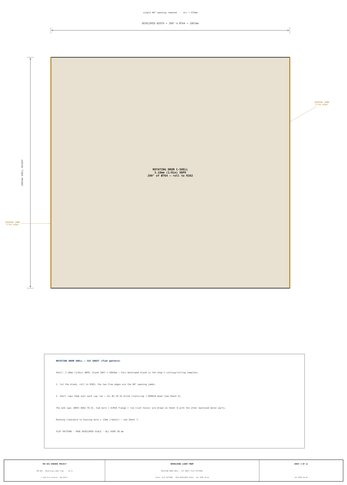
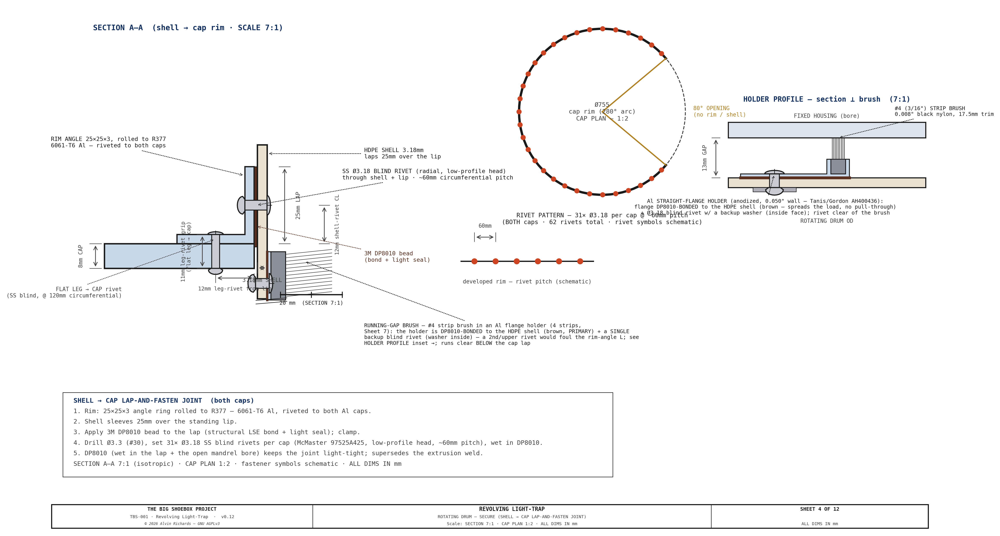
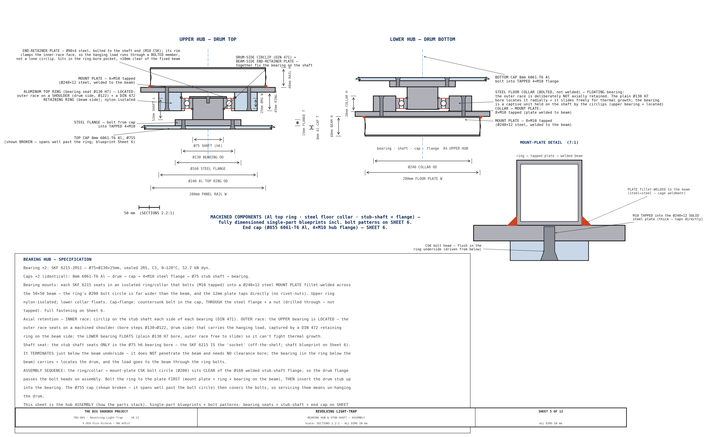
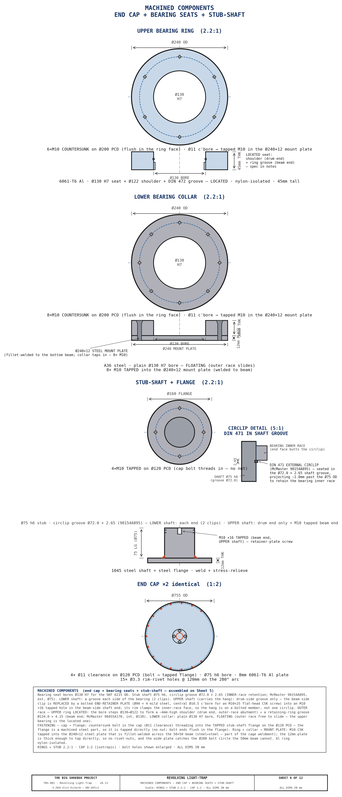
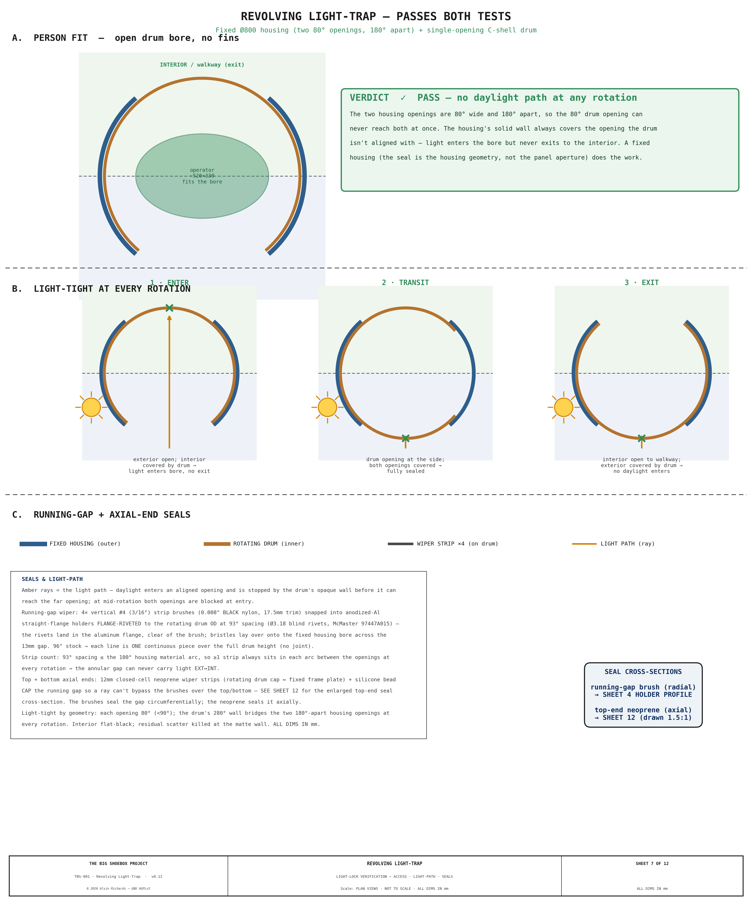
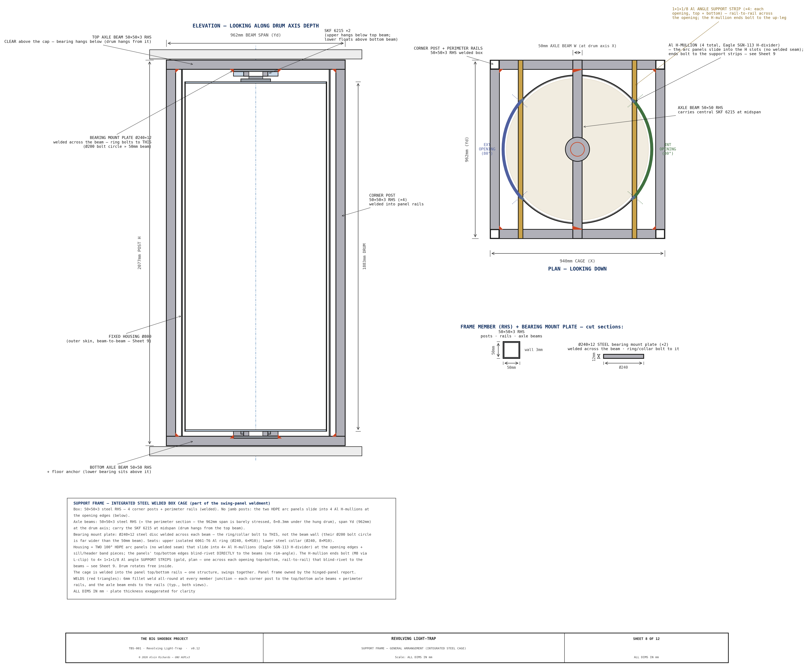
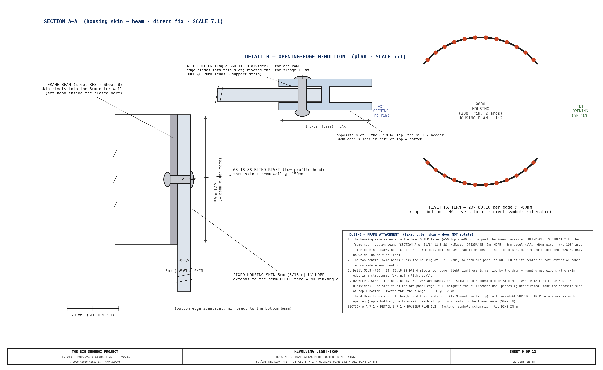
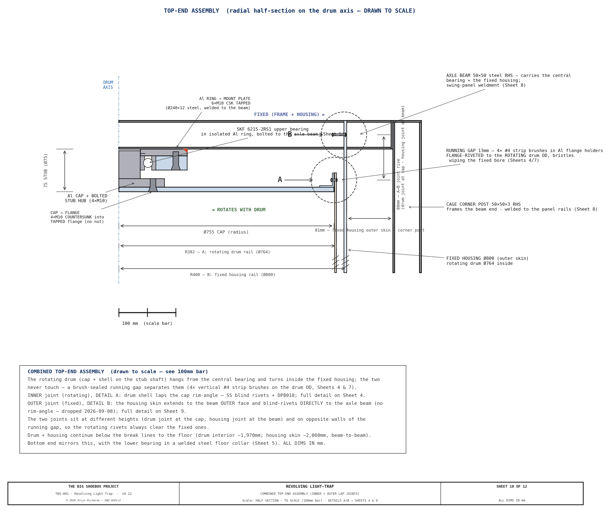
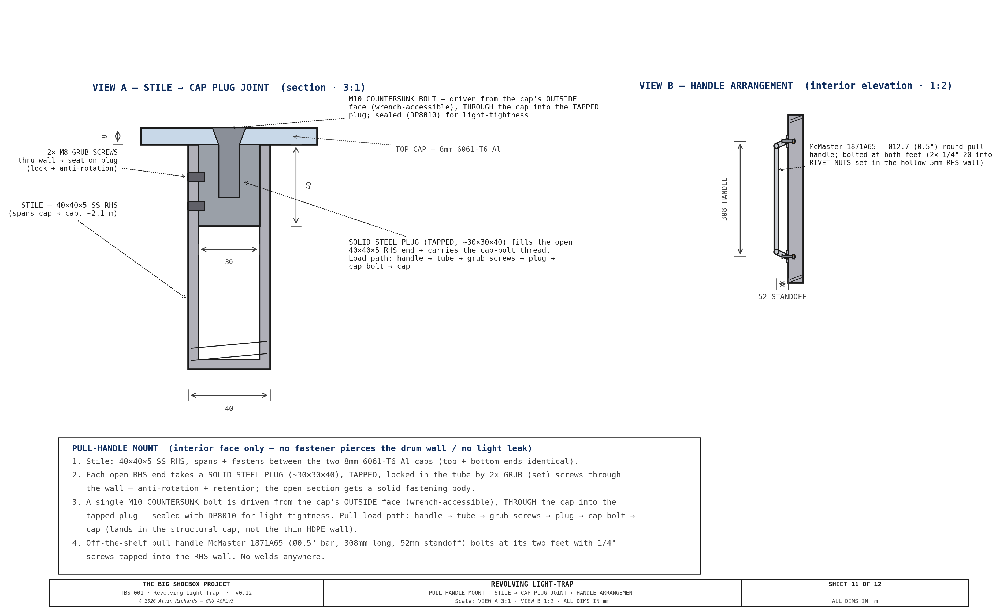
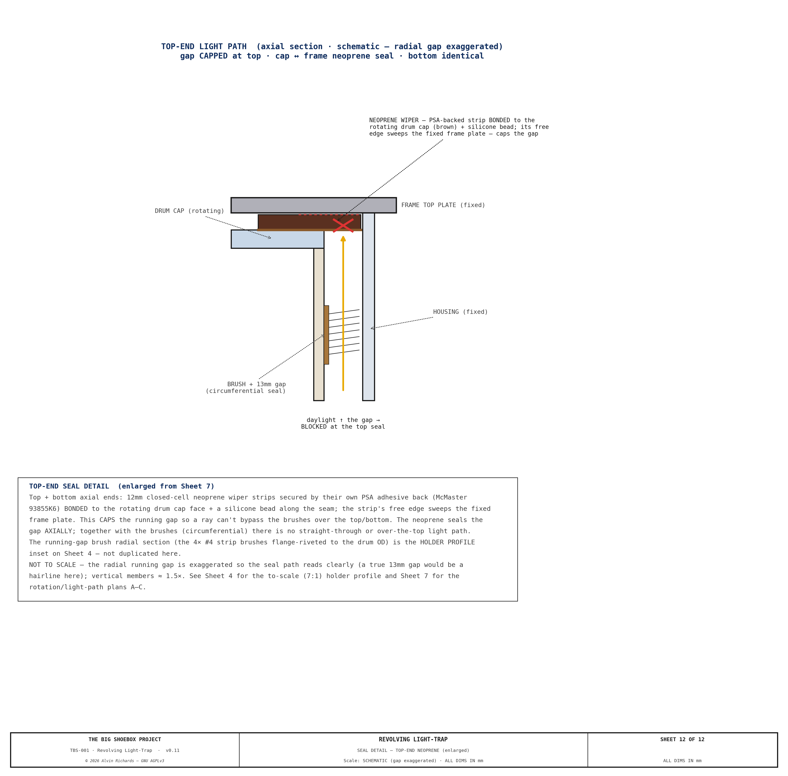

<!-- SPDX-License-Identifier: AGPL-3.0-only -->
<!-- © 2026 Alvin Richards -->
# Revolving Light Trap — Selection & Specification

## 1. Purpose

Personnel access during operation is via a revolving light trap drum built into the panel. Operators can enter or exit at any time without opening the full panel or admitting daylight — for example, between coating of the photosensitive material, or while the exposure is being made.

The cargo door end of TBS-001 is sealed by a stepped hinged panel (<!-- BEGIN fact:container_width_mm -->2,362<!-- END fact:container_width_mm -->mm wide × <!-- BEGIN fact:container_height_mm -->2,388<!-- END fact:container_height_mm -->mm tall). Its thick center zone permanently houses the Ø800mm revolving-door light lock; the thinner corner zones sit flush with the container walls. When closed, the panel is light-sealed at its perimeter by an EPDM compression gasket against a fixed welded door frame. The panel's frame, skins, thickness zones, pivot, and latches are specified in the [Hinged Panel Report](hinged-panel-report.md).

In operation the housing sits in a punch-out bay that offsets the drum clear of the film-plane rail, which stays continuous. For transport the panel and drum swing ~56° about a vertical CHS pivot post, carrying the bay inboard of the door plane so the cargo doors close (clearing the swung frame by +<!-- BEGIN fact:swung_door_clearance_mm -->59<!-- END fact:swung_door_clearance_mm -->mm). The two left film rails lift out first so the drum cage can cross the rail plane, then re-seat to the film datum; the housing and drum ride high enough with the panel to pass over the processing-tray rim and walkway brackets. Mode conversion is single-person and assisted (~5 minutes). See [Equipment Layout Report](equipment-layout-report.md) §6 for the swing-mechanism specification.

**Sheet 1 — Front Elevation (1:20): Panel Dimensions, Drum, Hinges, Latches (interior face)**

**Sheet 2 — Plan Cross-Section: Housed Revolving Door — Housing, Drum & Light-Tight Geometry**

**Sheet 3 — Drum Vertical Section Elevation (Section A-A): Walking-height orientation confirmation**

Full drawings also appear in the [Engineering Diagrams](engineering-diagrams.md) §12.

---

## 2. Requirements

| Requirement | Value |
|-------------|-------|
| Clear passage diameter | ≥ 700mm (minimum comfortable single-person access) |
| Clear passage height | ≥ 1,900mm (full headroom) |
| Light exclusion | 100% — no straight-line optical path from exterior to interior |
| Durability | Repeated field deployment, transport vibration, outdoor exposure |
| Operability | Single operator, no tools required to enter/exit |
| Mounting | Flush-mounted into 120mm center zone of stepped panel — no permanent wall surround |
| Weatherproofing | Drum top and bottom sealed against rain ingress during setup |

---

## 3. Commercial Options Evaluated

Three categories of commercial product were reviewed against these requirements.

### 3.1 Vario / Octanorm Revolving Darkroom Door

| Parameter | Value |
|-----------|-------|
| Typical product | Vario LT-800, Kaiser RD-800, Kindermann equivalents |
| Clear diameter | 800mm |
| Height | 2,000–2,200mm |
| Approximate price | USD $2,500–$3,500 (import from DE/NL; shipping +$400) |
| Lead time | 4–8 weeks |

**Construction:** Aluminum extrusion frame, ABS drum panels, felt drum seals, floor-mounted bearing with ceiling guide. Designed for permanent installation in a finished interior wall with a framed rectangular opening.

**Assessment — Not recommended for TBS-001.**

The Vario/Kaiser/Kindermann range is designed for permanent darkroom installation in climate-controlled interiors. Key issues for field use:
- **No weatherproofing.** The top gap between drum and ceiling guide is sealed by felt strip only. In outdoor use (rain, dust, wind) this seal fails within one season.
- **Floor bearing.** The base bearing is a stub pivot set into a floor-mount plate anchored to a finished floor. It cannot be adapted to a free-swinging 120mm panel with repeated installation/removal.
- **Transport.** The drum (ABS/aluminum construction) is not rated for transport vibration. The bearing races and alignment tolerances assume static installation.
- **Frame dependency.** The drum relies on its surrounding wall frame for structural rigidity. Removed from that frame, the drum has no self-contained structural integrity.

### 3.2 Porta-Fab Modular Darkroom Panel System

| Parameter | Value |
|-----------|-------|
| Product | Porta-Fab DK series modular panels with revolving door unit |
| Clear diameter | 750–900mm (model-dependent) |
| Height | 2,000mm |
| Approximate price | USD $3,000–$4,500 (direct from supplier; custom spec required) |
| Lead time | 6–10 weeks |

**Construction:** Modular steel-framed panels with light-sealed joining extrusions. The revolving door unit is a self-contained drum on a floor bearing, designed to fit a standard panel-bay opening.

**Assessment — Not recommended for TBS-001.**

The Porta-Fab system is modular and more robust than the Vario range, but shares the same fundamental limitations:
- **Cost.** At $3,000–$4,500 for the revolving unit alone, it represents the highest-cost option with no field-durability advantage over custom fabrication.
- **Panel integration.** Porta-Fab drums are designed to fit a standard panel-bay frame (100mm depth). Our panel is 120mm thick — an adapter would be required, adding cost and leak risk.
- **Drum seals.** Top and bottom felt seals, identical in design to the Vario range. Not suitable for outdoor conditions.
- **Bearing.** Stub-shaft floor pivot identical to Vario — not suitable for a removable panel.

### 3.3 Custom Fabrication — Recommended

| Parameter | Value |
|-----------|-------|
| Housing outer diameter | Ø800mm (fixed) + Ø764mm rotating drum, ~Ø758mm bore |
| Height | 1,970mm clear interior (cap top 2,100mm AFF; cage/beam top 2,217mm, 171mm under the ceiling) |
| Wall thickness | 5mm UV-HDPE housing + 1/8" HDPE drum, rolled and extrusion-welded |
| Surface finish | Black-pigmented sheet + flat-black touch-in at welds (interior); UV-stabilized sheet (exterior) — no primer |
| Baffles | None — two 80° housing openings 180° apart + single-opening C-shell drum (see §4, §5) |
| Top bearing | SKF 6215 sealed deep-groove ball bearing on a 75mm steel stub shaft from the drum cap; the nylon-isolated Al ring bolts (M10 tapped) to a Ø230×12 steel mount plate fillet-welded across the top axle beam (drum hangs from it) |
| Bottom bearing | SKF 6215 sealed, short stub into a steel collar that bolts to the bottom mount plate (welded to the bottom axle beam); floating (radial locate) |
| Drum seals (top/bottom) | Two-layer: closed-cell neoprene wiper + silicone bead — IP44 rated |
| Handle | Off-the-shelf 12″ round pull handle ([McMaster 1871A65](https://www.mcmaster.com/1871A65/), Ø0.5″ bar), interior face only, at 900mm height |
| Finish | Interior: flat black RAL 9005; exterior drum face: gray oxide |
| Approximate cost | USD <!-- BEGIN costing:hp-housing-low -->$2,948<!-- END costing:hp-housing-low -->–<!-- BEGIN costing:hp-housing-high -->$3,989<!-- END costing:hp-housing-high --> (local plastic fabrication shop) |
| Lead time | 2–3 weeks |

**Assessment — Recommended.**

Custom fabrication is the correct choice for a field-deployed, transport-rated camera system — every specification can be set to exactly what is required (clear bore, panel-thickness interface, bearing grade, seal type, drum height). The shell is a all-HDPE plastic skin: a 5mm UV-stabilized HDPE fixed housing and a 1/8" HDPE revolving drum. Three properties make plastic the right skin here:

1. **Weight / center of gravity.** The plastic skin holds the drum/housing shell mass to ~60 kg (the steel shaft, bearings, and pull handle set a floor the shell cannot drop below). Because the whole assembly hangs off the swinging leaf and revolves ~56° about the pivot post for transport, low shell mass keeps the swing cantilever moment on the pivot — and the container CG shift — small.
2. **No galvanic couple.** Plastic-to-steel has no galvanic couple, so isolation reduces to plain nylon washers at the shaft only — no full isolation kit, and no outdoor-corrosion risk at the panel-frame and bearing interfaces.
3. **Cost and fabrication.** HDPE sheet is inexpensive, and hot-air / extrusion welding of a Ø800 cylinder is low-skill labor relative to metal seam welding.

A 3–5mm plastic cylinder, edge-stiffened along the opening, is rigid as a freestanding shell without a surrounding wall frame, and bolts into the panel opening on 8 × M10 flush bolts (stainless, nylon-isolated). UV-stabilized HDPE is inherently weatherproof and needs no primer or anodize; the drum is in the dry walk-through entry zone, not the chemistry zone, so only ambient/outdoor exposure applies. The trade-off is plastic's higher thermal expansion, accommodated by the 13mm running gap between drum and housing.

The SKF 6215 sealed bearing is rated for radial loads to 52.7 kN and operates at 0–120°C — far beyond any field requirement. The neoprene/silicone top seal provides IP44 protection against splash and rain ingress. Black-pigmented sheet with flat-black touch-in at the welds is optically dead at visible wavelengths.

---

## 4. Recommended Specification — Custom Housed Revolving Door

The light lock is a **fixed housing + single-opening C-shell drum** (no internal fins) — light-tight by geometry (see §5).

### 4.1 Housing + Drum Body

| Item | Specification |
|------|--------------|
| Fixed housing shell | 5mm UV-HDPE (LT_HOUSING_T), rolled to **Ø800mm OD**, extrusion-welded seam; laps a rolled rim-angle blind-riveted to the integrated support frame — SS blind rivets throughout (rim→beam + housing→rim laps) + DP8010 (see §9 Sheet 9), set in the punch-out bay |
| Housing openings | Two, **80° arc each, 180° apart** (full height) — one facing the exterior, one facing the interior/walkway |
| Rotating drum | 1/8" HDPE C-shell (LT_DRUM_T), **Ø764mm OD** (~Ø758mm bore), single **80° opening**, edge-stiffened, rotates inside the housing on a ≈13mm running gap |
| Internal baffles | **None** — light-tightness is by the fixed-housing geometry (openings <90°, 180° apart; see §5) |
| Drum/housing height | 1,970mm interior clear (2,100mm to cap top AFF; cage/beam top 2,267mm) |
| Top cap | 8mm 6061-T6 aluminum disc (LT_CAP_TOP_T), bolted stub-shaft hub (4×M10 flange); the HDPE shell laps + SS-rivets + DP8010 to a rolled rim-angle on the cap (see §9 Sheet 4) |
| Bottom cap | 8mm 6061-T6 aluminum disc (LT_CAP_BOT_T), matching the top — bolted stub-shaft hub, same lap-and-rivet shell joint |
| Stub shafts (×2) | 75mm Ø × 75mm steel, bolted to the aluminum cap hubs (nylon-isolated); carry the drum in the upper + lower SKF 6215 bearings. The upper stub carries the hang (bearing sits above the cap on it, below the top axle beam); the lower is a short locating stub |
| Surface treatment | Interior: black-pigmented sheet + flat-black at welds; exterior: UV-stabilized sheet (no primer) |

### 4.2 Bearings and Mounting

| Item | Specification |
|------|--------------|
| Bearings (×2) | SKF 6215-2RS1 (75mm ID, 130mm OD, 25mm wide, sealed, C3 clearance) |
| Upper bearing mount | Isolated aluminum top ring, 6×M10 into the integrated frame top beam |
| Lower bearing mount | Bolted steel floor collar, 8×M10 into the integrated frame bottom beam (no weld) |
| Axial retention | INNER race: LOWER (floating) shaft — DIN 471 circlip each side. UPPER (located) shaft, which carries the drum's hanging weight — a drum-side DIN 471 circlip + a bolted END-RETAINER PLATE (Ø90×4 steel, central M10 CSK screw into the shaft end) whose rim clamps the inner-race face, so the hang runs through a positive bolted member rather than a single circlip. OUTER race: upper bearing LOCATED (seats on a Ø122 machined shoulder, drum side, + a DIN 472 retaining ring, beam side); lower bearing FLOATING (plain Ø130 H7 bore, outer race free to slide) |

### 4.3 Seals

| Item | Specification |
|------|--------------|
| Top seal | 12mm closed-cell neoprene wiper strip bonded to top cap underside + silicone bead seal against the frame top plate |
| Bottom seal | 12mm closed-cell neoprene wiper strip bonded to bottom cap underside + silicone bead seal against the frame bottom plate |
| Drum-to-housing running gap | ≈13mm radial clearance, closed by **4 vertical #4 (3/16″) nylon strip brushes** ([Gordon Brush](https://www.gordonbrush.com/brushes/strip-brushes-holders/strip-brushes) / Tanis — metal channel backing, 0.008″ black nylon, 0.687″/17.5mm trim), each snapped into an **anodized-Al straight-flange holder** ([Tanis](https://www.tanisbrush.com/products/strip-brush/strip-brush-holders)) whose offset flange is **DP8010-bonded + flange-riveted** (backup washers on the inside face) to the rotating drum OD at 93° spacing — the bond is the primary attachment (spreads the load over the whole flange so nothing pulls through the soft HDPE), the rivets clamp during cure + back it up, and the fasteners land in the aluminum flange, clear of the brush (a 3/16″ channel is too small to rivet through); bristles lay over onto the fixed housing bore. One continuous 8 ft piece per line over the full drum height. Strip count set by the Sheet 7 light-path study (93° ≤ the 100° housing material arc, so a strip always seals each arc between the openings at every rotation) — see §9 Sheets 4 & 7 |

### 4.4 Hardware

| Item | Specification |
|------|--------------|
| Entry handle | Off-the-shelf 12″ (308mm) round pull handle ([McMaster 1871A65](https://www.mcmaster.com/1871A65/), Ø0.5″ bar, 2.06″ standoff), interior face only, at 900mm height — **bolted at both feet** (1/4″ screws into **1/4″-20 rivet-nuts** set in the hollow RHS wall — a blind insert gives full thread engagement and can't strip the thin wall) to a steel **stile that spans and bolts to the two Al caps**. The stile is a 40×40×5 SS RHS (an open tube), so each end is fitted with a **solid tapped steel plug**, locked in the tube by **2× grub (set) screws** through the wall (anti-rotation + retention); a single **M10 countersunk bolt** is then driven from the cap's outside face (wrench-accessible), through the cap into the tapped plug — sealed with DP8010 for light-tightness. The pull load lands in the structural caps (not the thin HDPE wall) via handle → tube → grub screws → plug → cap bolt → cap. No welds. Mount + plug detail on §9 Sheet 11 |
| Panel bolts | 8 × M10 countersunk flat-head bolts (lower collar) + 6 × M10 (upper ring), stainless — flush in the ring/collar underside, tapped into the Ø230×12 steel mount plates (welded across the axle beams) |
| Lap-joint fasteners | Shell→cap and housing→frame joints: rolled 25×25×3 6061-T6 Al rim-angle + **1/8" (Ø3.18mm) 18-8 SS blind rivets** @ ~60mm (drill Ø3.3 / #30) + 3M DP8010 structural bond (light-tight lap). Shell→cap grip 6.2mm → [McMaster 97525A425](https://www.mcmaster.com/97525A425/); housing→frame grip 8.0mm → [McMaster 97525A435](https://www.mcmaster.com/97525A435/). DP8010 wets the mandrel hole for light-tightness. |

### 4.5 Raw Material Suppliers (US / SoCal)

| Item | Supplier | Part / Notes |
|------|----------|-------------|
| 5mm UV-HDPE sheet (housing, ~7 m²) + 1/8" HDPE sheet (drum, ~7 m²) | [TAP Plastics](https://www.tapplastics.com/) / Curbell Plastics (SoCal); or Online Metals plastics | Rolled + extrusion-welded cylinders |
| 8mm 6061-T6 aluminum plate (2 caps, Ø755) + 25×25×3 6061-T6 Al angle (2 rim rings) | [Online Metals](https://www.onlinemetals.com/) / Industrial Metal Supply (SoCal) | Water-jet the cap discs + hub bolt circle; roll the angle to R427 |
| 1/8" 18-8 SS blind rivets — [97525A425](https://www.mcmaster.com/97525A425/) (shell→cap, $13.83/100) + [97525A435](https://www.mcmaster.com/97525A435/) (housing→frame, $14.59/100) — + 3M Scotch-Weld DP8010 adhesive | [McMaster-Carr](https://www.mcmaster.com/); [3M DP8010](https://www.3m.com/3M/en_US/p/d/b40071180/) | ~35/cap + ~26/edge @ ~60mm pitch, drill Ø3.3 (#30); DP8010 is the structural bond + light seal for HDPE (low surface energy) |
| SKF 6215-2RS1 bearing (×2) | Bearing World — Anaheim CA; or Applied Industrial Technologies | 75mm ID, sealed, C3 clearance |
| 75mm × 75mm steel stub shaft (×2) | Pacific Coast Steel or any steel service center | 75mm Ø solid round bar, cut to length |
| Running-gap wiper — #4 (3/16″) nylon strip brush (4 lines × 8 ft) + anodized-Al straight-flange holders (4 × 8 ft) | [Gordon Brush](https://www.gordonbrush.com/brushes/strip-brushes-holders/strip-brushes) / [Tanis](https://www.tanisbrush.com/products/strip-brush/strip-brush-holders) | Metal channel backing, 0.008″ black nylon, 0.687″/17.5mm trim; brush snaps into the holder, holder DP8010-bonded + riveted (backup washers) to the drum OD (rivets clear of the brush); one 8 ft piece per line |
| Closed-cell neoprene strip 12mm (3m) | McMaster-Carr #93855K6 | Closed-cell, pressure-sensitive adhesive back |
| Silicone bead sealant | McMaster-Carr #7587A3 or equivalent | Black, UV-stable |
| Round pull handle — 12″ (×1) | [McMaster-Carr 1871A65](https://www.mcmaster.com/1871A65/) ($6.43) | Off-the-shelf Ø0.5″ bar, 12.13″, 1/4″ through-hole feet; bolts to the stile (interior face only) |
| Matte-black interior finish | Black-pigmented sheet; rattle-can / local shop | Touch-in at welds |
| Plastic fabrication (rolling, hot-air / extrusion welding, fitting) | Local plastic shop | Estimate 16–22 hrs labor |

**Total custom housing + drum estimate: <!-- BEGIN costing:hp-housing-low -->$2,948<!-- END costing:hp-housing-low -->–<!-- BEGIN costing:hp-housing-high -->$3,989<!-- END costing:hp-housing-high -->** — priced line-item BOM in the [Project Cost Breakdown](project-cost-breakdown.md) §6 and [Hinged Panel Report](hinged-panel-report.md) §8.2.

---

## 5. Light Path Verification

The fixed-housing geometry eliminates any straight-line path from exterior to
interior **at every rotation angle**, and the open bore fits a single operator.

**Light-tightness.** The housing has two openings, each **80° of arc and 180°
apart**; the drum has a single **80° opening**. Because each opening is narrower
than 90° and the two housing openings are 180° apart, the drum opening can never
align with both housing openings simultaneously. So the housing's solid wall always
covers whichever opening the drum opening is not facing — daylight entering the bore
through the exterior opening is blocked by the drum's solid wall before reaching the
interior opening. **Enter:** exterior open, interior covered → light into the bore,
no exit. **Transit:** both housing openings covered → fully sealed. **Exit:**
exterior covered → no daylight enters.

**Access.** The whole **~Ø758mm bore** is clear standing
space and the 80° opening gives a **~487mm passage** (sideways entry). The Ø758 bore
meets the §2 standing-space intent; the opening itself is tighter than the nominal
≥700mm and was accepted for occasional single-operator field use. Emergency egress remains the
whole panel swinging open.

See **Sheet 5** of the hinged-panel drawings (enter / transit / exit verification)
and [Hinged Panel Report](hinged-panel-report.md) §3.3 / §3.6.

---

## 6. Comparison Summary

| | Vario LT-800 | Porta-Fab DK | **Custom (recommended)** |
|---|---|---|---|
| Clear bore / passage | 800mm | 750–900mm | **Ø758mm bore / ~487mm passage** |
| Height | 2,000–2,200mm | 2,000mm | **1,970mm clear** |
| Price (USD) | $2,500–$3,500 | $3,000–$4,500 | **<!-- BEGIN costing:hp-housing-low -->$2,948<!-- END costing:hp-housing-low -->–<!-- BEGIN costing:hp-housing-high -->$3,989<!-- END costing:hp-housing-high -->** |
| Weatherproofing | None | None | **IP44 (neoprene/silicone)** |
| Panel integration | Requires surround wall | Requires panel-bay frame | **Direct bolt-in (120mm panel)** |
| Transport-rated | No | No | **Yes (plastic skin, sealed bearings)** |
| Lead time | 4–8 weeks | 6–10 weeks | **2–3 weeks** |
| Field repairability | Low (ABS/extrusion parts) | Low | **High (weldable plastic + off-shelf bearings)** |
| **Recommendation** | ✗ | ✗ | **✓** |

Custom fabrication is comparable to or below commercial alternatives while providing superior weatherproofing, transport durability, and field repairability.

---

## 7. Integration Notes

- The drum is installed into the hinged panel before the panel is hung. The combined panel + drum weight (~196 kg; itemized breakdown in [Hinged Panel Report §2.4–2.5](hinged-panel-report.md) and [Weight Distribution §3.2](weight-distribution-report.md)) is beyond a two-person lift, so hanging requires an engine crane or gantry hoist. The pivot post, bearings, and cage are separate transport hardware, not carried in the panel + drum lift.
- The lower bearing collar is bolted to the panel bottom rail with 8 × M10 stainless bolts. The upper bearing housing is bolted to the panel top rail with 6 × M10. Both connections can be disassembled with standard hex keys for maintenance.
- The drum rotates freely in both directions; there is no rotation limit. The exterior face carries no handle — the operator pushes the bare drum wall to enter. An interior pull handle (off-the-shelf 12″ round pull handle, McMaster 1871A65, bolted to a steel **stile that is itself bolted between the two Al caps** — the load lands in the caps, no fastener through the wall) at 900mm height allows the operator to pull the drum closed from inside and brace during exit. This eliminates any through-bolt penetration of the drum wall on the exterior face, removing a potential light leak path.
- Interior safelight (Circuit D, per [Electrical Report](electrical-report.md)) illuminates the drum interior during loading operations, allowing operators to orient themselves in darkness.
- **Panel latches (×4 Southco C2-33 cam compression latches) are mounted on the interior face of the panel.** This is a deliberate safety design: if the revolving drum jams and prevents normal egress, an operator inside the container can release all four latches independently from the inside and pull the panel inwards. The panel swings open about its left-edge pivot post, clearing the door opening. Latches appear as hidden (dashed) features in the exterior elevation drawing (Sheet 1).
- **Stepped panel construction:** The thick center zone houses the drum; the thinner corner zones sit flush with the container walls. Zone thicknesses, the step-transition positions, and the frame/skin build-up are specified in the [Hinged Panel Report](hinged-panel-report.md).
- **Swing pivot:** For transport the panel + drum revolve ~56° about a vertical CHS pivot post (the reused film-plane far-left upright) on a thrust collar and top/bottom hub bearings. The vertical axis is balanced at any angle, so there is no gravity torque; the swung position is locked by top and bottom wall stays. A fixed welded door frame provides the EPDM seal landing for the perimeter, cut, and lip seals, compressed by the cam latches when closed. Full specification: [Equipment Layout Report](equipment-layout-report.md) §6.
- **Transport mode conversion** (single person, ~5 minutes, swing assisted): park + pin the drum → lift out the left walkway + door-end near-deck → strike the two left film rails (TL + BL) → release the cam latches → swing the frame ~56° inboard about the pivot → engage the top + bottom wall stays → close the container doors (they clear the swung frame by +<!-- BEGIN fact:swung_door_clearance_mm -->59<!-- END fact:swung_door_clearance_mm -->mm; the door-end walkway brackets are cleared in height, not struck). See [Equipment Layout Report](equipment-layout-report.md) §6 for full specification.

---

## 8. Source References

1. [SKF 6215-2RS1 datasheet](https://www.skf.com/group/products/rolling-bearings/ball-bearings/deep-groove-ball-bearings/productid-6215-2RS1) — Sealed deep-groove ball bearing specifications.
2. [Hinged Panel Report](hinged-panel-report.md) — Panel construction, pivot, latch, and swing-mechanism specification.
3. [Equipment Layout Report](equipment-layout-report.md) — Panel transport mode and swing clearance analysis.
4. [Electrical Report](electrical-report.md) — Circuit D safelight specification for drum interior.
5. [3M Scotch-Weld DP8010 datasheet](https://www.3m.com/3M/en_US/p/d/b40071180/) — Structural acrylic adhesive for low-surface-energy plastics (HDPE), used for the shell-to-cap and housing-to-frame bonds.

---

## 9. Fabrication Blueprints

The following sheets are the **fabrication source-of-record** for the revolving
assembly. A plastics/metal shop builds the housing, drum, end caps, bearing hubs,
seals, and integrated support cage from them. Every dimension is driven from
`tbs_constants.py` — the sheets, not this narrative, carry the exact geometry, cut
positions, and fastener patterns.

The set is drawn to the current design: **aluminum end caps** on bolted stub-shaft
hubs, a **lap-and-fasten** shell-to-cap joint (rolled rim-angle lip, stainless blind
rivets, DP8010 bond), and a **steel welded box cage** integrated with the swing-panel
weldment that carries the bearings and the fixed outer skin.

**Sheet 1 — General Arrangement.** Full vertical section on the drum axis: fixed
housing, rotating C-shell drum, both SKF 6215 bearings, stub shafts, caps, pull handle,
and the support-cage envelope, keyed to the assembly BOM.

**Sheet 2 — Housing cylinder cut sheet.** The fixed UV-HDPE outer skin as a flat
pattern: developed length, height, weld-seam location, and the two 80° opening cutouts.

**Sheet 3 — Drum shell — cut sheet.** The HDPE C-shell as a true developed flat pattern
(2,111 × 2,040 mm, single 80° opening) — the plastics shop's cutting/rolling template.
The end caps are machined metal parts and are drawn on Sheet 6.

**Sheet 4 — Drum — Secure.** The shell-to-cap lap-and-fasten joint: the rolled
rim-angle lip, the 1/8" stainless blind-rivet pattern, and the DP8010 structural
bond that closes the joint against light.

**Sheet 5 — Bearing hub & stub-shaft (assembly).** How the parts stack: the SKF 6215
seat, the stub-shaft capture in the cap, and the bearing axial retention — inner race by a circlip each side (lower) or a drum-side circlip + a bolted end-retainer plate (upper, which carries the hang), outer race located (upper: shoulder + DIN 472 ring) / floating (lower) — top and bottom.
The individual machined parts are drawn on Sheet 6; the end cap on Sheet 3.

**Sheet 6 — Machined components (end cap + bearing seats + stub-shaft).** Single-part
blueprints for the machined metal parts: the Ø755 6061-T6 Al end cap, the upper Al
bearing ring, the lower A36 steel floor collar, and the stub-shaft + flange — each with
OD, bore + fit, thickness, bolt pattern (PCD/count/Ø), material, and the fastening
scheme (cap→flange countersunk in the cap, Ø11 clearance, threading into the TAPPED steel flange on the Ø120 PCD — the flange is a machined part, so it is tapped directly, no nut; ring/collar→MOUNT PLATE via M10 countersunk flat-head bolts — flush in the ring/collar underside — tapped into a Ø230×12 steel mount plate fillet-welded across each 50×50 axle beam: the ring's Ø200 bolt circle (pushed clear of the Ø160 stub-shaft flange so the drum flange passes the bolt heads on assembly) is far wider than the 50mm beam, and the 12mm plate taps directly, so no rivet-nuts; Al nylon-isolated).

**Sheet 7 — Seals & light-path verification.** The running-gap wiper (4 drum-mounted
#4 strip brushes in Al flange holders — see the Sheet 4 holder-profile inset for the
flange-riveted mount) and top/bottom seals, and the three-position proof (open-to-exterior,
open-to-interior, mid-rotation) that no straight-through light path exists at any rotation.
The plans also carry the strip-count study — the 93°-spaced strips keep at least one wiper
in each 100° housing material arc at every rotation, so the annular gap can never carry
light between the openings **circumferentially**. The two enlarged seal cross-sections — the
running-gap brush section and the top-end light-path section — are drawn 1.5:1 on **Sheet 12**;
the top-end detail closes the other axis: the running gap is capped at its axial top/bottom by the
**rotating-cap ↔ fixed-frame neoprene wiper seal + silicone bead**, so a ray travelling up the gap
is stopped at the seal and cannot bypass the brushes over the top/bottom. The brushes seal the gap
circumferentially; the neoprene seals it axially.

**Sheet 8 — Support frame general arrangement.** The integrated steel welded box cage
that carries the bearing loads and the fixed housing, in plan and elevation, with the
axle-support beam at the drum axis and the members dimensioned.

**Sheet 9 — Housing → frame attachment.** The section showing the fixed outer skin
lapped and riveted to the rolled rim-angle blind-riveted on the top and bottom frame beams,
with Detail B showing each free opening edge capped by a bonded aluminum U-channel
(the stiffener that replaces the jamb posts) — the drum rotating free inside.

**Sheet 10 — Combined top-end assembly.** A single half-section at the top end showing
both lap joints nested concentrically: the rotating drum shell→cap joint (Sheet 4) and
the fixed housing→frame joint (Sheet 9), with the upper bearing and the felt-sealed
running gap between them — how the rotating and fixed halves coexist at one level.

**Sheet 11 — Pull-Handle Mount (to scale): stile → cap plug joint (View A, 3:1) + handle arrangement (View B, 1:2).** How the interior pull handle mounts: the stile is a 40×40×5 SS RHS whose open ends are closed by solid **tapped** steel plugs, each locked in the tube by 2× grub (set) screws and secured to its 8mm Al cap by an **M10 countersunk bolt driven from the cap's outside face** (wrench-accessible), through the cap into the plug (sealed with DP8010) — so the pull load lands in the structural caps, not the HDPE wall. The off-the-shelf McMaster 1871A65 pull handle bolts to the stile at its two feet. No welds.

**Sheet 12 — Seal details (enlarged from Sheet 7, 1.5:1).** The two seal cross-sections pulled
off the light-path sheet and drawn large so the geometry is easy to read: **Detail 1** — the
running-gap radial section (the #4 nylon strip brush snapped into its Al straight-flange holder,
flange-riveted to the rotating drum OD, bristles wiping the fixed housing bore across the ≈13mm
gap); **Detail 2** — the top-end axial section (the rotating drum cap ↔ fixed frame plate neoprene
wiper capping the gap, killing a ray that tries to travel up and over the brushes). Together they
show the gap is sealed both circumferentially (brushes) and axially (neoprene).

