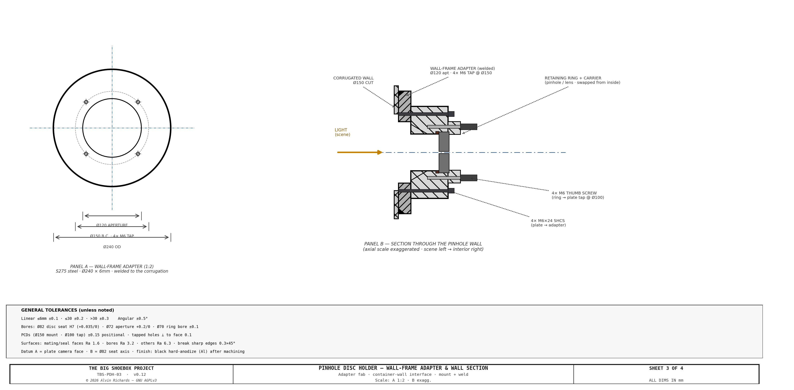
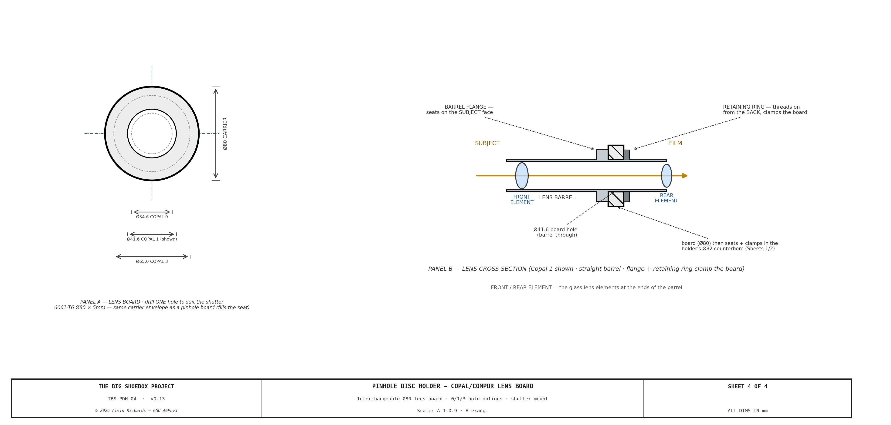

<!-- SPDX-License-Identifier: AGPL-3.0-only -->
<!-- © 2026 Alvin Richards -->
# Pinhole Disc Holder (Front Board)

## 1. Purpose

The front board carries the pinhole at the scene-facing end of the container. This report specifies a simple **quick-change disc/lens-board holder**: an interchangeable **Ø80 carrier** is clamped against a neoprene light-seal washer by a circular retaining ring held with four thumb screws. Carriers swap in seconds — a pinhole board (any diameter), or a **large-format lens board** taking a Copal/Compur 0, 1 or 3 shutter — with no tools beyond fingers. It supersedes the standard Ø600 interchangeable pinhole/lens plate: one compact holder does both jobs.

There is **no tilt or swing**. A pinhole is a point aperture: the image is a central projection *through the pinhole point*, determined only by the pinhole's position and the film plane, and is completely independent of the orientation of the plate that holds it. Tilting a pinhole board therefore does nothing to the image (it only moves the pinhole point by the small pivot offset). All perspective and keystone control lives in the **film-plane mechanism** (the rear standard), where tilting the *film* plane genuinely changes the projection. The earlier tilt-swing front board was retired for this reason — see the changelog.

---

## 2. Mechanism Overview

The holder is a compact front board mounted to the wall-frame adapter with a small bolt pattern (the adapter is part of this design, so it carries the matching pattern). Four elements:

- **ICP-01 Front plate** — **Ø180 round × 18mm** 6061-T6. Mounts to the wall-frame adapter (**4× M6 @ Ø150**); a Ø110 scene-side taper bore converging to a Ø65 light-aperture clearance bore; a Ø82 × 6mm counterbore that seats the carrier and reacts the weight of a lens; four M6 taps on a Ø94 circle (outboard of the counterbore) for the thumb screws.
- **Light-seal washer** — Ø82 OD × Ø65 ID × 1.5mm neoprene. The carrier presses against it, sealing the aperture under the clamp.
- **Interchangeable carrier (ICP-02)** — **Ø80** outer diameter: either a pinhole board (SS-302 shim, pinhole Ø per selection) or a **large-format lens board** carrying a Copal/Compur 0, 1 or 3 shutter (see §3).
- **Circular retaining ring (ICP-03)** — Ø110 OD × Ø70 bore × 6mm 6061-T6. The Ø70 bore is smaller than the carrier so the ring clamps its rim; it clears the light path.
- **Four thumb screws** — M6 knurled, on the Ø94 circle, into the plate.

**Quick-change:** loosen the four thumb screws → lift the retaining ring → swap the carrier → replace the ring → finger-tighten the thumb screws. About 30 seconds, no tools.

**Interactive 3D model** — the Ø180 front plate, neoprene washer, interchangeable carrier, retaining ring and thumb screws. Drag to orbit, scroll to zoom; **click the ring** to pull the retaining ring + thumb screws out along the optical axis and reveal the interchangeable carrier and the plate's four tapped holes (click again to re-seat).

<!-- brochure:skip -->

  

    <iframe title="TBS-001 Pinhole Disc Holder" frameborder="0" allowfullscreen mozallowfullscreen="true" webkitallowfullscreen="true" allow="autoplay; fullscreen; xr-spatial-tracking" execution-while-out-of-viewport execution-while-not-rendered web-share src="https://sketchfab.com/models/4ce663d3fe3e4a2e99c0643dad5bfffe/embed" style="position:absolute;top:0;left:0;width:100%;height:100%;border:0;"></iframe>
  

  
<a href="https://sketchfab.com/3d-models/tbs-001-pinhole-disc-holder-4ce663d3fe3e4a2e99c0643dad5bfffe?utm_medium=embed&utm_campaign=share-popup&utm_content=4ce663d3fe3e4a2e99c0643dad5bfffe" target="_blank" rel="nofollow" style="font-weight: bold; color: #1CAAD9;">TBS-001 Pinhole Disc Holder</a> by <a href="https://sketchfab.com/alvin91403?utm_medium=embed&utm_campaign=share-popup&utm_content=4ce663d3fe3e4a2e99c0643dad5bfffe" target="_blank" rel="nofollow" style="font-weight: bold; color: #1CAAD9;">alvin91403</a> on <a href="https://sketchfab.com?utm_medium=embed&utm_campaign=share-popup&utm_content=4ce663d3fe3e4a2e99c0643dad5bfffe" target="_blank" rel="nofollow" style="font-weight: bold; color: #1CAAD9;">Sketchfab</a>

<!-- brochure:endskip -->

The drawing set (TBS-PDH, 4 sheets): **Sheet 1** — assembly + Section A-A (plate, washer, carrier, ring, thumb screws, and the light path); **Sheet 2** — fabrication blueprints (front plate + retaining ring + carrier); **Sheet 3** — wall-frame adapter + a section through the container wall (the mount interface, weld and bolts); **Sheet 4** — the Copal/Compur lens board (the three shutter‑hole options and how the shutter mounts). Sheets 2–4 carry the CNC‑shop tolerance block (§8).

---

## 3. Interchangeable Carriers — Pinhole & Large-Format Lens

Every carrier is **Ø80 OD**, clamped by the retaining ring, so the camera's front optic changes in seconds.

### Pinhole boards

| Board | Aperture | Effect |
|-------|----------|--------|
| **Standard pinhole** | Ø2.17mm | Rayleigh optimum for the 2,362mm focal length — sharpest pinhole image (f/1088) |
| **Sharper pinhole** | Ø1.5mm | Finer detail, ~2× dimmer (longer exposure) |
| **Brighter pinhole** | Ø3.0mm | ~2× brighter (shorter exposure), softer image |

The Rayleigh-optimum pinhole diameter is d = 1.9·√(f·λ) = **Ø2.17mm** at λ = 550nm, giving f/1088.

### Large-format lens boards

The same Ø80 carrier accepts a lens board drilled for a standard large-format shutter, converting the camera to a lens optic (sharp, fast, controllable aperture). The Ø65 light aperture clears the whole Copal/Compur range:

| Shutter | Lens-board hole | Fits (Ø80 carrier / Ø65 aperture)? |
|---------|-----------------|-------------------------------------|
| Copal / Compur **0** | 34.6mm | ✅ |
| Copal / Compur **1** | 41.6mm | ✅ |
| Copal / Compur **3** | 61.5mm | ✅ (61.5 < Ø65 aperture; ~9mm rim on the Ø80 board) |

Board-hole diameters per the [Intrepid Camera Large-Format Lens Explorer](https://intrepidcamera.co.uk/blogs/guides/the-large-format-lens-explorer) (§11). The lens board (drill one hole to suit) and how a Copal/Compur shutter mounts in it are drawn on **Sheet 4**.

**Carrying a lens's weight.** A large-format lens is cantilevered forward of the board, so the retention is designed to react its weight and tipping moment: the board seats **6mm deep** in the Ø82 counterbore (which takes the shear and the moment against its wall — not the clamp), and the Ø110 × 6mm ring is drawn down by **four M6 knurled thumb screws** (up from M5) for axial clamp force. For a heavy, permanently-mounted Copal 3 lens the thumb screws are simply run down firm; the seat, not the screws, carries the load.

---

## 4. Optical Specification

| Parameter | Value | Note |
|-----------|-------|------|
| Focal length | <!-- BEGIN fact:focal_length_mm -->2,362<!-- END fact:focal_length_mm -->mm | Container interior depth |
| Standard pinhole Ø | 2.17mm | Rayleigh optimum, λ=550nm |
| f-number | f/<!-- BEGIN fact:f_number -->1088<!-- END fact:f_number --> | f / d |

The image is a central projection through the pinhole point. Tilt, swing, rise/fall and other perspective movements are provided by the **film-plane (rear standard) mechanism** — see the [Film Plane Mechanism Report](film-plane-mechanism-report.md), which also holds the (correct) distortion renders.

---

## 5. Light Sealing

The neoprene washer seals the carrier-to-plate joint when the retaining ring is clamped down — a single static compression seal, no moving parts and no bellows. The Ø110 taper bore on the scene side and the Ø65 clearance bore behind the carrier form the light path; the carrier (pinhole or lens) is the only opening. The plate-to-adapter joint is light-sealed by a thin gasket at the mount interface (or an O-ring in the adapter).

---

## 6. Wall Mounting

The pinhole (nose) end wall of the container is corrugated steel, so the front plate cannot seat on it directly. A flat steel **wall-frame adapter** — **Ø240 × 6mm S275**, welded over the corrugation — presents the machined flat datum; every alignment reference starts from its face. It carries **4× M6 tapped holes on the Ø150 circle** (matching the plate), a **Ø120 aperture** (clearing the Ø110 taper bore), and sits over a **Ø150 aperture** cut through the corrugation. The Ø180 front plate bolts to it with **4× M6×24 SHCS** at Ø150. Fabrication and the full through-wall stack (weld, bolts, apertures, light path) are on **Sheet 3**.

---

## 7. Quick-Change Procedure

No special tooling — finger-operated thumb screws.

1. **Loosen** the four M6 knurled thumb screws (fingers).
2. **Lift** the circular retaining ring off.
3. **Remove** the carrier from the Ø82 counterbore seat.
4. **Fit** the new carrier (a pinhole board, or a lens board) into the seat, against the washer.
5. **Replace** the retaining ring and **finger-tighten** the four thumb screws evenly.

Swap time: about 30 seconds. The whole front board can also be unbolted from the wall-frame adapter (4× M6) if the plate itself ever needs service.

---

## 8. Machining Tolerances

| Feature | Nominal | Tolerance | Importance |
|---------|---------|-----------|------------|
| Front-plate carrier counterbore Ø82 | Ø82.000 | H7: +0.035/0.000 | Carrier seats concentric with the optical axis; reacts a lens's weight/moment |
| Carrier seat depth | 6.000mm | +0.1/0.0 | Positive location + moment reaction for a lens board |
| Light-aperture bore Ø65 | Ø65.000 | +0.2/0.0 | Clearance only — clears a Copal 3 hole, must not vignette |
| Thumb-screw PCD Ø94 | Ø94.000 | ±0.2mm positional | Even clamp of the retaining ring; outboard of the Ø82 counterbore |
| Retaining-ring bore Ø70 | Ø70.000 | ±0.1mm | Clamps the carrier rim without fouling the light path |
| Mount bolts M6 PCD | Ø150.000 | ±0.15mm positional | Must match the wall-frame adapter |

These are carried as a **CNC-shop tolerance block on Sheets 2–4**: general linear (±0.1 to ±0.3 by size) and angular (±0.5°) tolerances, the bore fits above, PCD positional tolerances (mount + tap), surface finish (mating/seal Ra 1.6, bores Ra 3.2), datum scheme (A = plate camera face, B = Ø82 seat axis), and black hard-anodize after machining.

---

## 9. Parts List

The BOM is single-sourced from the parts registry (`parts.py`) and generated below. Purchased hardware (thumb screws, mount bolts, washer) is catalog; the raw 6061 stock, the pinhole board set / lens boards, and the fab/finishing **services** (CNC, anodize) carry **SKU pending — source**.

<!-- BEGIN parts:front-board -->
| Item | Spec | Qty | Supplier | Est. cost |
|------|------|-----|----------|-----------|
| ICP-01 front-plate stock — 6061-T6 round bar Ø190×22 | 6061-T6 round bar Ø190×22mm — machined to the Ø180×18 front plate (Ø65 aperture, Ø110 scene taper, Ø82 carrier seat 6 deep, 4× M6 mount @ Ø150 + 4× M6 tap). SKU pending — source. | 1 ea | Metal Supermarkets / Online Metals | $22 |
| ICP-03 retaining-ring stock — 6061-T6 | 6061-T6 stock — machined to the Ø110 OD × Ø70 bore × 6 retaining ring (4× M6 clearance @ Ø94). Can be cut from the plate offcut. SKU pending — source. | 1 ea | Metal Supermarkets / Online Metals | $8 |
| Neoprene light-seal washer (Ø82×Ø65×1.5) | Neoprene washer Ø82 OD × Ø65 ID × 1.5mm — the carrier presses against it under the retaining ring, sealing the aperture. Cut from neoprene sheet or a stock washer. SKU pending — source. | 1 ea | McMaster-Carr / Grainger | $3–$6 |
| [Pinhole board set — SS-302 (Ø2.17 / Ø1.5 / Ø3.0)](https://lenoxlaser.com/) | Ø80 × 0.1mm SS-302 laser-drilled pinhole boards — Ø2.17 (Rayleigh optimum), Ø1.5 (sharper), Ø3.0 (brighter). 3 off (the interchangeable set). SKU pending — quote (Lenox Laser). | 3 ea | Lenox Laser / Edmund Optics | $60–$120 |
| Ø80 lens board — Copal/Compur 0/1/3 (optional) | Ø80 × ~4mm 6061 lens board drilled for a Copal/Compur 0 (34.6), 1 (41.6) or 3 (61.5) shutter — drops into the holder to run the camera as a lens optic. The large-format LENS itself is user-supplied (out of BOM). Optional. SKU pending — source. | 1 ea | SK Grimes / Local fab | $10–$30 |
| [M6 knurled thumb screws, 4× (retaining ring)](https://www.mcmaster.com/products/thumb-screws/) | M6 knurled-head thumb screws — clamp the retaining ring (lens-board clamp force), finger-tightened for quick carrier change. 4 off. SKU pending — source. | 4 ea | McMaster-Carr / Bolt Depot | $8–$16 |
| M6×20 SHCS 18-8 SS, 4× (plate → adapter) | 4 off — mount the Ø180 plate to the wall-frame adapter at Ø150. M6×20 SHCS 18-8 SS. SKU pending — source. | 4 ea | McMaster-Carr / Bolt Depot | $4 |
| CNC machining — front plate + retaining ring (service) | Machine the Ø180 front plate (Ø65 aperture, Ø110 scene taper, Ø82 counterbore 6 deep, 4× M6 mount @ Ø150 + 4× M6 tap @ Ø94) and the Ø110 retaining ring from 6061-T6. SKU pending — fab quote. | 1 job | Fictiv / ProtoLabs | $150–$350 |
| Anodize — front plate + ring (service) | Black anodize the front plate + retaining ring (matte, non-reflective at the aperture). SKU pending — shop quote. | 1 job | Pac-Nor Anodizing | $40–$80 |
| **Front-Board total** | | | | **$305–$636** |
<!-- END parts:front-board -->

---

## 10. Maintenance

| Interval | Action |
|----------|--------|
| Each disc change | Inspect the neoprene washer for a clean, unbroken seat; replace if nicked or set |
| Every 6 months | Check the thumb screws are finger-tight and the retaining ring seats flat |
| As needed | Store spare pinhole boards flat in a protective sleeve — the SS-302 shim is easily creased |

---

## 11. Source References

1. [Lenox Laser Precision Pinholes](https://lenoxlaser.com/blog/pinholes-and-apertures/) — Pinhole board fabrication (Ø2.17mm and alternates, SS-302 shim).
2. [Intrepid Camera — Large-Format Lens Explorer](https://intrepidcamera.co.uk/blogs/guides/the-large-format-lens-explorer) — Large-format lens data and the Copal/Compur 0/1/3 lens-board hole diameters (34.6 / 41.6 / 61.5mm).
3. [S.K. Grimes — Lens Board Mountings](https://skgrimes.com/lens-board-mountings/) — how a Copal/Compur shutter mounts to a lens board (front flange + rear retaining ring); the Sheet 4 mount.
3. [Film Plane Mechanism Report](film-plane-mechanism-report.md) — Rear standard (film-plane) tilt/swing and the correct distortion renders.
4. [Pinhole Report](pinhole-report.md) — Pinhole optics and the wall-frame interface.
5. [McMaster-Carr — Knurled Thumb Screws](https://www.mcmaster.com/products/thumb-screws/) — M6 knurled thumb screws for the retaining ring.
6. [McMaster-Carr — Neoprene Washers / Rubber Sheet](https://www.mcmaster.com/products/rubber/) — Light-seal washer stock.
