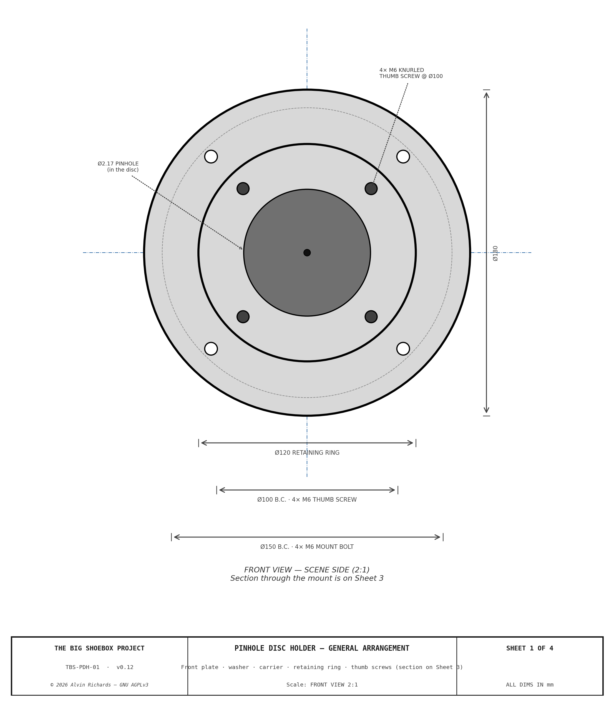
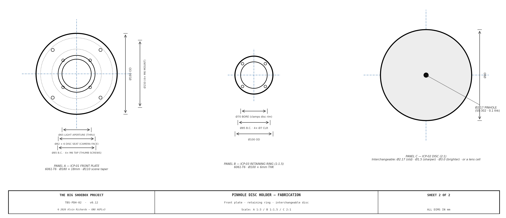

<!-- SPDX-License-Identifier: AGPL-3.0-only -->
<!-- © 2026 Alvin Richards -->
# Pinhole Disc Holder (Front Board)

## 1. Purpose

The front board carries the pinhole disc at the scene-facing end of the container. This report specifies a simple **quick-change pinhole disc holder**: the disc is clamped against a neoprene light-seal washer by a circular retaining ring held with four thumb screws. Discs swap in seconds — different pinhole diameters, or a lens cell of the same outer diameter — with no tools beyond fingers.

There is **no tilt or swing**. A pinhole is a point aperture: the image is a central projection *through the pinhole point*, determined only by the pinhole's position and the film plane, and is completely independent of the orientation of the plate that holds it. Tilting a pinhole board therefore does nothing to the image (it only moves the pinhole point by the small pivot offset). All perspective and keystone control lives in the **film-plane mechanism** (the rear standard), where tilting the *film* plane genuinely changes the projection. The earlier tilt-swing front board was retired for this reason — see the changelog.

---

## 2. Mechanism Overview

The holder is a compact front board that mounts to the wall-frame adapter with its own small bolt pattern (the adapter is part of this design, so it carries the matching pattern — no need for the big standard-plate interface). Four elements:

- **ICP-01 Front plate** — **Ø180 round × 18mm** 6061-T6. A small dedicated mount to the wall-frame adapter (**4× M6 @ Ø150** + 2× Ø6 dowels); a Ø90 scene-side taper bore converging to a Ø40 light-aperture clearance bore; a Ø52 × 3mm counterbore that seats the disc; four M5 taps on a Ø74 circle for the thumb screws.
- **Light-seal washer** — Ø56 OD × Ø40 ID × 1.5mm neoprene. The disc presses against it, sealing the aperture under the clamp.
- **Interchangeable disc (ICP-02)** — Ø50 outer diameter: either a Ø50 × 0.1mm SS-302 pinhole shim (pinhole Ø per selection) or a lens cell in a Ø50 carrier.
- **Circular retaining ring (ICP-03)** — Ø90 OD × Ø44 bore × 5mm 6061-T6. The Ø44 bore is smaller than the disc so the ring clamps the disc rim; it clears the light path.
- **Four thumb screws** — M5 knurled, on the Ø74 circle, into the plate.

**Quick-change:** loosen the four thumb screws → lift the retaining ring → swap the disc → replace the ring → finger-tighten the thumb screws. About 30 seconds, no tools.

The drawing set (TBS-PDH, 2 sheets): **Sheet 1** — assembly + Section A-A (plate, washer, disc, ring, thumb screws, and the light path); **Sheet 2** — fabrication blueprints (front plate + retaining ring + disc).

---

## 3. Interchangeable Discs & Lens Option

The holder takes any disc of Ø50 outer diameter clamped by the retaining ring, so the camera's aperture changes in seconds:

| Disc | Aperture | Effect |
|------|----------|--------|
| **Standard pinhole** | Ø2.17mm | Rayleigh optimum for the 2,362mm focal length — sharpest pinhole image (f/1088) |
| **Sharper pinhole** | Ø1.5mm | Finer detail, ~2× dimmer (longer exposure) |
| **Brighter pinhole** | Ø3.0mm | ~2× brighter (shorter exposure), softer image |
| **Lens cell** | — | A small lens in a Ø50 carrier — converts the camera to a lens optic: sharp, fast, different rendering |

The Rayleigh-optimum pinhole diameter is d = 1.9·√(f·λ) = **Ø2.17mm** at λ = 550nm, giving f/1088. Alternate discs are a procurement option (§9); all share the Ø50 carrier so any one drops into the same holder.

---

## 4. Optical Specification

| Parameter | Value | Note |
|-----------|-------|------|
| Focal length | <!-- BEGIN fact:focal_length_mm -->2,362<!-- END fact:focal_length_mm -->mm | Container interior depth |
| Standard pinhole Ø | 2.17mm | Rayleigh optimum, λ=550nm |
| f-number | f/<!-- BEGIN fact:f_number -->1088<!-- END fact:f_number --> | f / d |

The image is a central projection through the pinhole point. Tilt, swing, rise/fall and other perspective movements are provided by the **film-plane (rear standard) mechanism** — see the [Film Plane Mechanism Report](film-plane-mechanism-report.md), which also holds the (correct) distortion renders.

---

## 5. Light Sealing

The neoprene washer seals the disc-to-plate joint when the retaining ring is clamped down — a single static compression seal, no moving parts and no bellows. The Ø90 taper bore on the scene side and the Ø40 clearance bore behind the disc form the light path; the disc (with its pinhole) is the only opening. The plate-to-adapter joint is light-sealed by a thin gasket at the mount interface (or an O-ring in the adapter).

---

## 6. Wall Mounting

The pinhole (nose) end wall of the container is corrugated steel, so the front plate cannot seat on it directly. A flat steel **wall-frame adapter plate** is welded/bolted over the corrugation to present a flat datum, with an aperture cut through the corrugation larger than the Ø90 taper bore. The Ø180 front plate bolts to that adapter via its **4× M6 / Ø150** pattern and locates on the two Ø6 dowels.

---

## 7. Quick-Change Procedure

No special tooling — finger-operated thumb screws.

1. **Loosen** the four M5 knurled thumb screws (fingers).
2. **Lift** the circular retaining ring off.
3. **Remove** the disc from the Ø52 counterbore seat.
4. **Fit** the new disc (pinhole of the chosen Ø, or a lens cell) into the seat, against the washer.
5. **Replace** the retaining ring and **finger-tighten** the four thumb screws evenly.

Swap time: about 30 seconds. The whole front board can also be unbolted from the wall-frame adapter (4× M6) if the plate itself ever needs service.

---

## 8. Machining Tolerances

| Feature | Nominal | Tolerance | Importance |
|---------|---------|-----------|------------|
| Front-plate disc counterbore Ø52 | Ø52.000 | H7: +0.030/0.000 | Disc seats concentric with the pinhole axis |
| Light-aperture bore Ø40 | Ø40.000 | +0.2/0.0 | Clearance only — must not vignette the cone |
| Thumb-screw PCD Ø74 | Ø74.000 | ±0.2mm positional | Even clamp of the retaining ring |
| Retaining-ring bore Ø44 | Ø44.000 | ±0.1mm | Clamps the disc rim without fouling the light path |
| Mount bolts M6 PCD | Ø150.000 | ±0.15mm positional | Must match the wall-frame adapter |
| Dowel holes Ø6 | Ø6.000 | H7: +0.012/0.000 | Plate registration repeatability |

---

## 9. Parts List

The BOM is single-sourced from the parts registry (`parts.py`) and generated below. Purchased hardware (thumb screws, mount bolts, dowels, washer) is catalog; the raw 6061 stock, the pinhole disc set / lens cell, and the fab/finishing **services** (CNC, anodize) carry **SKU pending — source**.

<!-- BEGIN parts:front-board -->
| Item | Spec | Qty | Supplier | Est. cost |
|------|------|-----|----------|-----------|
| ICP-01 front-plate stock — 6061-T6 round bar Ø190×22 | 6061-T6 round bar Ø190×22mm — machined to the Ø180×18 front plate (Ø40 aperture, Ø90 scene taper, Ø52 disc seat, 4× M6 mount + 2 dowel + 4× M5 tap). SKU pending — source. | 1 ea | Metal Supermarkets / Online Metals | $22 |
| ICP-03 retaining-ring stock — 6061-T6 | 6061-T6 stock — machined to the Ø90 OD × Ø44 bore × 5 retaining ring (4× M5 clearance @ Ø74). Can be cut from the plate offcut. SKU pending — source. | 1 ea | Metal Supermarkets / Online Metals | $8 |
| Neoprene light-seal washer (Ø56×Ø40×1.5) | Neoprene washer Ø56 OD × Ø40 ID × 1.5mm — the disc presses against it under the retaining ring, sealing the aperture. Cut from neoprene sheet or a stock washer. SKU pending — source. | 1 ea | McMaster-Carr / Grainger | $3–$6 |
| [Pinhole disc set — SS-302 (Ø2.17 / Ø1.5 / Ø3.0)](https://lenoxlaser.com/) | Ø50 × 0.1mm SS-302 laser-drilled pinhole discs — Ø2.17 (Rayleigh optimum), Ø1.5 (sharper), Ø3.0 (brighter). 3 off (the interchangeable set). SKU pending — quote (Lenox Laser). | 3 ea | Lenox Laser / Edmund Optics | $60–$120 |
| Lens cell in Ø50 carrier (optional) | A small lens cell in a Ø50 carrier — drops into the holder in place of a pinhole disc to run the camera as a lens optic. Optional. SKU pending — spec + source. | 1 ea | Edmund Optics / Thorlabs | $40–$120 |
| [M5 knurled thumb screws, 4× (retaining ring)](https://www.mcmaster.com/products/thumb-screws/) | M5 knurled-head thumb screws — clamp the retaining ring, finger-tightened for quick disc change. 4 off. SKU pending — source. | 4 ea | McMaster-Carr / Bolt Depot | $8–$16 |
| M6×20 SHCS 18-8 SS, 4× (plate → adapter) | 4 off — mount the Ø180 plate to the wall-frame adapter at Ø150. M6×20 SHCS 18-8 SS. SKU pending — source. | 4 ea | McMaster-Carr / Bolt Depot | $4 |
| Ø6 m6 SS303 dowel pin, 2× | Ø6×24mm dowel — plate registration to the wall-frame adapter. 2 off. SKU pending — source. | 2 ea | McMaster-Carr / Fastenal | $8 |
| CNC machining — front plate + retaining ring (service) | Machine the Ø180 front plate (Ø40 aperture, Ø90 scene taper, Ø52 counterbore, 4× M6 mount + 2 dowel + 4× M5 tap) and the Ø90 retaining ring from 6061-T6. SKU pending — fab quote. | 1 job | Fictiv / ProtoLabs | $150–$350 |
| Anodize — front plate + ring (service) | Black anodize the front plate + retaining ring (matte, non-reflective at the aperture). SKU pending — shop quote. | 1 job | Pac-Nor Anodizing | $40–$80 |
| **Front-Board total** | | | | **$343–$734** |
<!-- END parts:front-board -->

---

## 10. Maintenance

| Interval | Action |
|----------|--------|
| Each disc change | Inspect the neoprene washer for a clean, unbroken seat; replace if nicked or set |
| Every 6 months | Check the thumb screws are finger-tight and the retaining ring seats flat |
| As needed | Store spare pinhole discs flat in a protective sleeve — the SS-302 shim is easily creased |

---

## 11. Source References

1. [Lenox Laser Precision Pinholes](https://lenoxlaser.com/blog/pinholes-and-apertures/) — Pinhole disc fabrication (Ø2.17mm and alternates, SS-302 shim).
2. [Film Plane Mechanism Report](film-plane-mechanism-report.md) — Rear standard (film-plane) tilt/swing and the correct distortion renders.
3. [Pinhole Report](pinhole-report.md) — Wall frame and interchangeable plate interface specification.
4. [McMaster-Carr — Knurled Thumb Screws](https://www.mcmaster.com/products/thumb-screws/) — M5 knurled thumb screws for the retaining ring.
5. [McMaster-Carr — Neoprene Washers / Rubber Sheet](https://www.mcmaster.com/products/rubber/) — Light-seal washer stock.
