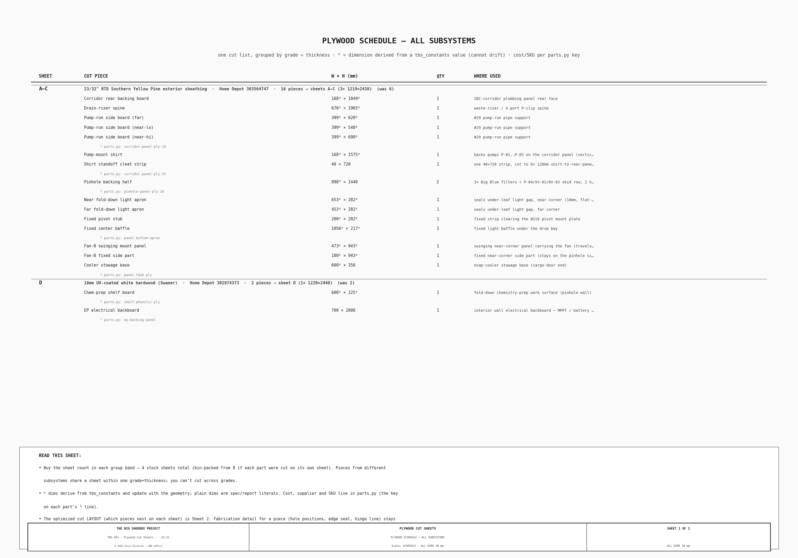
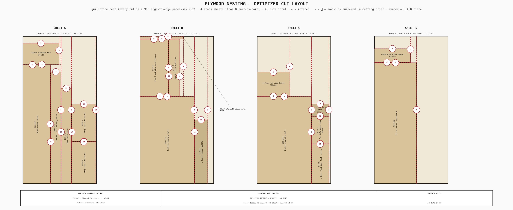

<!-- SPDX-License-Identifier: AGPL-3.0-only -->
<!-- © 2026 Alvin Richards -->
# Plywood Cut Sheets — TBS-001

## 1. Purpose

Plywood recurs across the build — the IBC-corridor plumbing panel and pump-mount shirt, the
pinhole-wall filter-skid backing, the interior EP electrical backboard, the hinged light-trap
panel's Fan-B mount band and fold-down light-seal aprons, and the chemistry-prep shelf. Each was
previously cut ad hoc on its own subsystem drawing. This document is the **single cut sheet** the
buyer and fabricator work from: every plywood part in one schedule, grouped by grade and thickness
so same-stock parts nest on one sheet.

The cut dimensions are **single-sourced**. Geometry-driven pieces — the pinhole-wall panel width,
the fold-down apron widths and heights, the chem-shelf board — derive from `tbs_constants` and
cannot drift from the model (marked with a ᴰ on the schedule); the rest are spec/report literals.
Cost, supplier, and SKU stay in `parts.py`, keyed on each part's registry entry, so the money can't
drift from the procurement record. Fabrication detail for a given piece — hole positions, edge seal,
hinge line — stays on its owning subsystem sheet; this document is the stock and cut index, not the
fab detail.

## 2. Schedule

Every plywood cut piece, grouped by stock. The ᴰ marker flags a dimension derived from a
`tbs_constants` value; the `parts.py` key under each part is where its cost and supplier live.

## 3. Nesting layout

A bin-packer nests all pieces of one grade+thickness onto the fewest 4×8 sheets, **mixing pieces across
subsystems** (e.g. the corridor panel, pump-mount shirt, pinhole-wall backing, the fold-down aprons, and
the Fan-B mount band all share the Southern-Yellow-Pine sheets A–C). Every layout is **guillotine-cuttable
— each cut is a straight 90° edge-to-edge pass, the only cut a panel saw / sawmill makes** — and the
drawing shows the cut lines (dashed red), **numbered in cutting order**, with the cut count per sheet. The packer works to a **5mm cut
tolerance**: a piece may overhang a sheet edge by up to 5mm and still nest, so a near-full-width piece cuts
clean to the edge rather than forcing a new sheet. It minimizes the sheet count first, then the number of
cuts (the current nest is **4 sheets, 47 cuts**). This packs the whole job into **4 stock sheets, lettered A–D** — down from 8 if
each part were cut on its own sheet. Standardizing the timber plywood on 18mm drove the consolidation: the
fold-down aprons re-graded from a dedicated 12mm sheet into the SYP offcut (sheets A–C); the EP electrical
backboard — a finish-agnostic backing surface — now shares the chem-shelf UV-white sheet (sheet D); and
the Fan-B band + cooler base re-graded from a dedicated ¾" pressure-treated sheet into the same SYP offcut,
retiring the PT sheet. So the whole job settles into **two grades** (SYP, UV-white). Pieces are drawn to
scale; ↻ marks a piece rotated 90° to fit, dashed red lines are saw cuts, and shaded pieces are fixed
(non-fold). The layout is a nesting + cut guide — the shop rips each sheet along the shown guillotine cuts.

## 4. Stock sheets

The four sheets are lettered **A–D** in the nesting layout; the schedule's SHEET column maps each cut
piece to the same letters.

| Sheets | Thickness | Grade | Parts |
|---|---|---|---|
| A–C | 18mm (23/32") | RTD Southern Yellow Pine exterior sheathing | corridor plumbing panel, pump-mount shirt, pinhole-wall backing, fold-down light aprons + baffle + pivot stub, Fan-B mount band + cooler stowage base |
| D | 18mm | UV-coated white hardwood (Swaner) | chem-prep shelf board + EP electrical backboard |
| | | **Total** | **4 sheets** |

Sheets A–C are one SKU, so the packer nests their parts together across subsystems (the pinhole-wall
backing exceeds a single sheet's width, so it is cut as two butt-jointed halves; the fold-down aprons,
the Fan-B band, and the cooler base all drop into the offcut). Sheet D's UV-white stock yields
both the chem-prep work surface and the EP electrical backboard — the backboard needs only a sealed,
wipeable face, which the UV coating already gives, so it rides the same sheet rather than buying its own.
Sheet D is single-grade (a different finish from A–C), so it cannot cross-nest — that residual sheet is
set by the grade split, not packing efficiency. Standard exterior grade throughout except the UV-coated
sheet-D surface — no marine ply, and no pressure-treated (the former PT Fan-B sheet was over-spec for a
dry, vented mount), since no plywood part carries a water-immersion load.

## 5. Source references

- Cut geometry — [`tbs_constants.py`](src/generators/tbs_constants.py) (single source), drawn by
  [`generate_plywood_cutsheets.py`](src/generators/generate_plywood_cutsheets.py).
- Cost / supplier / SKU — [`parts.py`](src/generators/parts.py) (`timber-ply` registry entries).
- Fabrication detail per piece — the owning subsystem reports: [Plumbing](plumbing-report.md),
  [Electrical](electrical-report.md), [Hinged Light-Trap Panel](hinged-panel-report.md),
  [Chemistry Prep Shelves](chemistry-prep-shelves.md).
