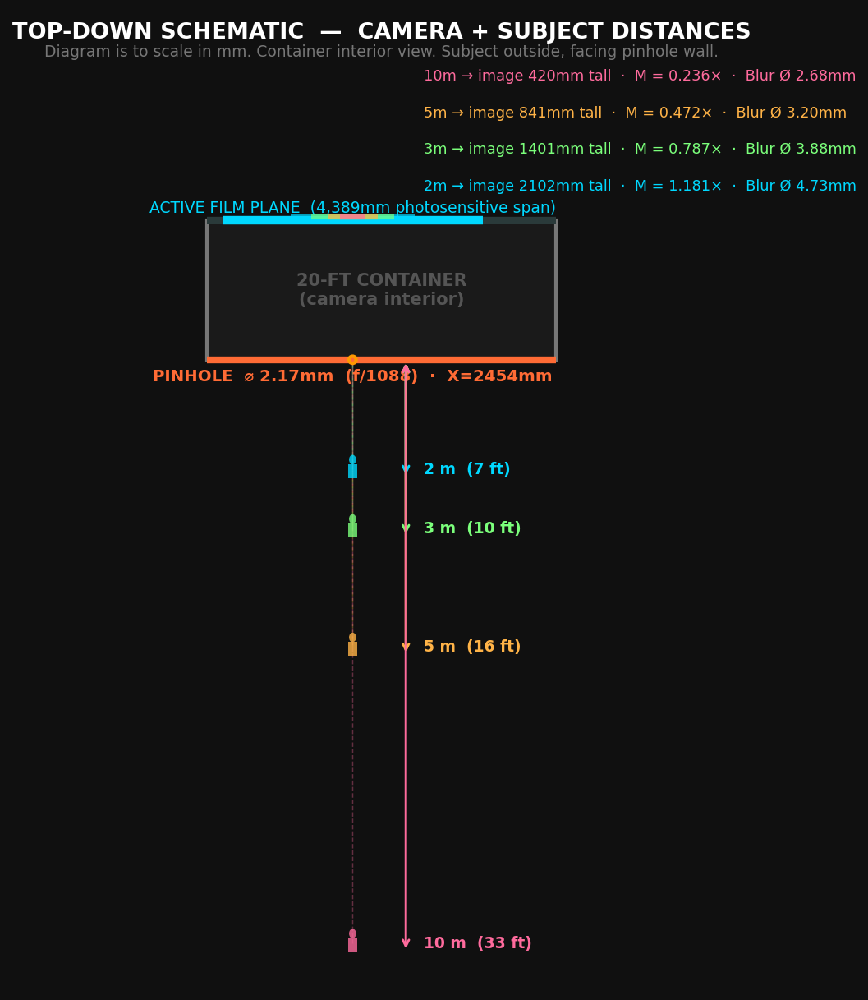
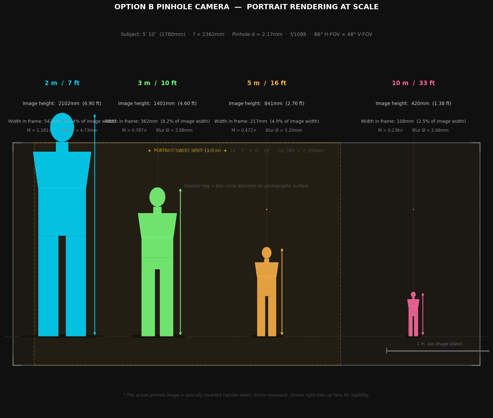
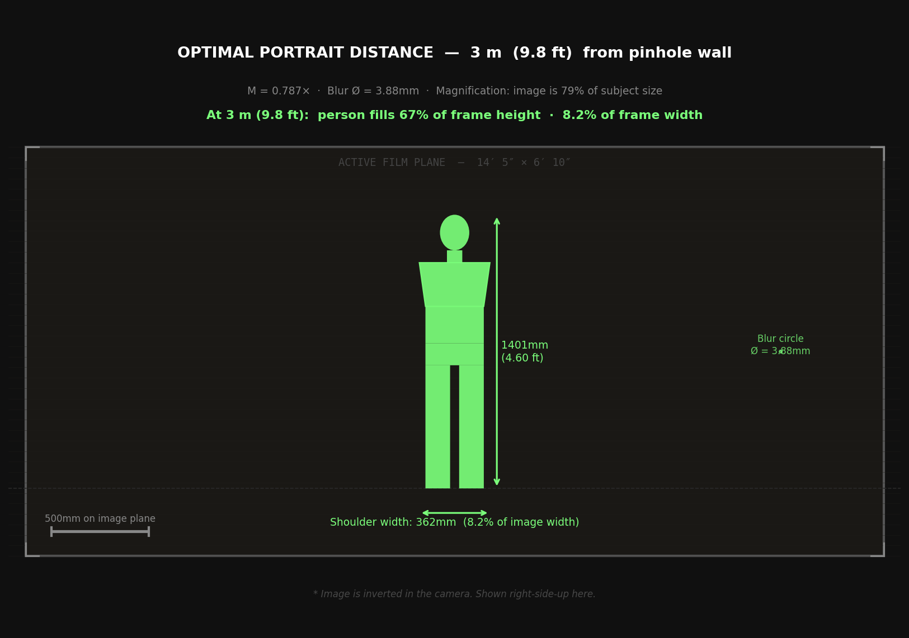

<!-- SPDX-License-Identifier: AGPL-3.0-only -->
<!-- © 2026 Alvin Richards -->
# Portrait Photography — Framing & Field of View

At human scale, TBS-001 is a portrait camera: a person stands in front of the pinhole wall and is
projected — inverted and reversed — onto the photosensitive film plane inside the container. This
page collects the geometry of that capture: how wide a scene the camera takes in, how large a subject
renders at a given distance, and where a portrait sits best.

The optics are the fixed pinhole — focal length **f = 2,362mm** (the container's interior depth),
pinhole **Ø2.17mm**, **f/1088** (the [Rayleigh optimum](pinhole-optics-report.md)). The image forms
on the **active film plane, 4,389 × 2,094mm**, with the pinhole centered on the long wall at
X ≈ 2,454mm — see the [Film Plane Mechanism](film-plane-mechanism-report.md).

---

## 1. Field of view

The field of view is set by how much of the film plane the pinhole "sees" — the active plane's extent
relative to the focal length:

- **Horizontal FOV ≈ 86°** — 2·atan((4,389 ÷ 2) ÷ 2,362)
- **Vertical FOV ≈ 48°** — 2·atan((2,094 ÷ 2) ÷ 2,362)

Subjects stand outside the pinhole wall, facing the camera. A standing adult fills the frame
vertically at modest range; farther back, the figure shrinks and more of the surrounding scene enters.

## 2. Subject size vs distance

For a pinhole the projected image scales linearly: **magnification M = f ÷ u** (image size ÷ subject
size, for a subject at distance *u*). A 1,780mm (5′10″) subject therefore projects to 1,780 · (2,362 ÷ u)
mm on the film:

Closer subjects render larger (and eventually overflow the 2,094mm plane height); farther subjects
render smaller with more context around them.

## 3. The optimal portrait distance

Sharpness is limited by the pinhole's geometric blur circle, **B = 2.17 · (1 + f ÷ u)** mm on the
film — larger for nearer subjects, since the cone of light from each point of the subject spreads more
on the way in. Trading framing against blur puts a comfortable full-figure portrait at roughly **3m**:

At 3m the image is **M = 2,362 ÷ 3,000 ≈ 0.79×** of the subject (a 1,780mm person → ~1,400mm image,
inside the 2,094mm plane height) with a blur circle of **B ≈ 2.17 · (1 + 2,362 ÷ 3,000) ≈ 3.9mm** —
soft by lens standards, and characteristic of the pinhole look.

---

## See Also

- [Optics Report](pinhole-optics-report.md) — pinhole sizing, f-number, and resolution.
- [Lens vs Pinhole Exposure](lens-vs-pinhole-exposure.md) — exposure and sharpness trade-offs.
- [Distortion Renders](distortion-renders.md) — film-plane movement and perspective control.
- [Film Plane Mechanism](film-plane-mechanism-report.md) — the image plane and its dimensions.
