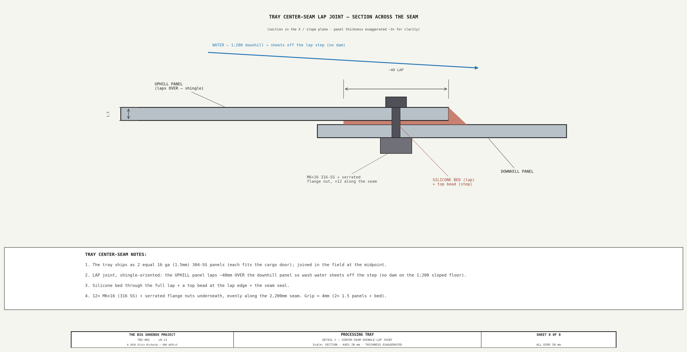

<!-- SPDX-License-Identifier: AGPL-3.0-only -->
<!-- © 2026 Alvin Richards -->
# Processing Tray & Spray Bar Assembly

## 1. Purpose

Cyanotype prints on muslin substrate (<!-- BEGIN fact:film_plane_width_mm -->4,499<!-- END fact:film_plane_width_mm --> × <!-- BEGIN fact:film_plane_height_mm -->2,094<!-- END fact:film_plane_height_mm -->mm) require a controlled flood wash
to remove unexposed sensitizer chemistry after UV exposure. The processing tray provides
the containment surface and the spray bar delivers even water distribution across the
full print width. Together they form the print washing subsystem of the
[water system](water-system-report.md).

**Design goals:**

- Flood the entire print surface uniformly in a single pass (~44 seconds)
- Contain all wash water within a sealed tray — no penetration of the container floor
- Drain water to a sump for pump-out and recycling via the Brown circuit
- Single-operator use from the walkway — no stepping on the print surface
- Permanently installed — no removal required for transport mode conversion

<!-- brochure:skip -->
**Interactive 3D model** — the processing tray, spray-bar gantry, carriages, feed manifold, and push pole. Drag to orbit, scroll to zoom.

  

    <iframe title="TBS-001 Spraybar Model" frameborder="0" allowfullscreen mozallowfullscreen="true" webkitallowfullscreen="true" allow="autoplay; fullscreen; xr-spatial-tracking" execution-while-out-of-viewport execution-while-not-rendered web-share src="https://sketchfab.com/models/18fb381fbf48459cac25dcaa23958387/embed" style="position:absolute;top:0;left:0;width:100%;height:100%;border:0;"></iframe>
  

  
<a href="https://sketchfab.com/3d-models/tbs-001-spraybar-model-18fb381fbf48459cac25dcaa23958387?utm_medium=embed&utm_campaign=share-popup&utm_content=18fb381fbf48459cac25dcaa23958387" target="_blank" rel="nofollow" style="font-weight: bold; color: #1CAAD9;">TBS-001 Spraybar Model</a> by <a href="https://sketchfab.com/alvin91403?utm_medium=embed&utm_campaign=share-popup&utm_content=18fb381fbf48459cac25dcaa23958387" target="_blank" rel="nofollow" style="font-weight: bold; color: #1CAAD9;">alvin91403</a> on <a href="https://sketchfab.com?utm_medium=embed&utm_campaign=share-popup&utm_content=18fb381fbf48459cac25dcaa23958387" target="_blank" rel="nofollow" style="font-weight: bold; color: #1CAAD9;">Sketchfab</a>

<!-- brochure:endskip -->

---

## 2. Processing Tray

### 2.1 Specification

| Parameter | Value | Rationale |
|-----------|-------|-----------|
| Material | 16-gauge (1.5mm) 304 stainless steel, #4 brushed finish | Chemically inert to ferricyanide wash water; resists pitting from citric acid pH adjustment |
| Overall footprint | 4,459 × 2,200mm (2 panels, field-bolted) | Fits inside film plane rails (X=<!-- BEGIN fact:film_plane_left_x_mm -->150<!-- END fact:film_plane_left_x_mm -->–<!-- BEGIN fact:film_plane_right_x_mm -->4,649<!-- END fact:film_plane_right_x_mm -->) with 20mm clearance per side |
| Panel size (each) | 2,229 × 2,200mm | Two equal panels, joined at the midpoint by a ~40mm shingle-oriented lap (silicone-sealed, 12× M6×16). Each panel fits through the cargo door opening (2,340 × 2,280mm) |
| Rim height | 50mm (all four sides) | Contains 6mm flood depth with margin; constrained to ≤75mm by film plane carriage clearance |
| Floor-to-rim height | 50mm | Tray sits on tapered HDPE shim strips on the container floor |
| Fall | 1:200 dual-axis (10mm over 2,200mm Yd + 11mm over 2,229mm X) toward sump | Water converges from both axes toward the sump well |
| Sump well | 150 × 100mm, 20mm deep, pressed into tray floor at low point | Collects water at lowest point; P-04 suction pickup sits in sump |
| Weight (empty) | ~116 kg (2 panels × ~58 kg) | 304 SS, 1.5mm × 4.90 m² per panel × 7.93 kg/m² per mm |
| Weight (operating, 6mm flood) | ~175 kg | Tray + ~59 kg water (6mm over the 4,459 × 2,200mm tray ≈ 59 L) |

### 2.2 Slope Support — Tapered HDPE Shim Strips

The tray's 1:200 dual-axis slope is achieved by tapered HDPE shim strips bonded to the
container floor beneath the tray. No risers, no under-tray plumbing — the tray sits
directly on the shims to flow the water into the bottom right for pickup by the sump pump.

| Parameter | Value |
|-----------|-------|
| Material | HDPE flat bar, 50mm wide |
| Quantity | 5 strips running full tray depth |
| Spacing | ~1,000mm apart across tray width (X direction) |
| Profile | Tapered: ~20mm at near rim (drain end — raised so the 20mm sump well bottom rests on the container floor) → ~30mm at far rim |
| Attachment | Construction adhesive (Loctite PL Premium or equivalent) to container floor |
| Function | Creates the Yd-axis slope; X-axis slope is formed into the tray panels during fabrication (pressed crown) |

### 2.3 Sump Well and Pickup

Instead of a through-floor drain fitting, the tray has a shallow sump well pressed into
the floor at the low point. P-04 draws water from the sump via a suction pickup tube —
no penetration of the tray floor or the container floor.

| Parameter | Value |
|-----------|-------|
| Sump dimensions | 150mm (X) × 100mm (Yd) × 20mm deep |
| Sump location | IBC-end corner (near rim, low point) |
| Forming | Pressed/stamped into tray panel during fabrication |
| Pickup tube | 1" HDPE dip tube, stainless foot valve with strainer screen |
| Pickup height | Tube bottom 5mm above sump floor (leaves ~0.75 L residual) |
| Suction line | 1" flexible reinforced hose, routed over near rim to P-04 |
| Pump | P-04 (Shurflo 2088, 12V DC, 3.5 GPM, 45 PSI, self-priming) |
| Discharge | P-04 → 3W-DV-02 diverter → IBC-3 (Brown recycling) or IBC-4 (Waste) |

**Why sump pickup instead of a through-floor drain:**

1. **No penetration** — eliminates leak risk from a bulkhead fitting seal
2. **No under-tray clearance needed** — tray sits flat on shim strips
3. **Simpler fabrication** — pressed sump is cheaper and more reliable than a welded bulkhead union
4. **Easier to protect** — no exposed plumbing beneath the tray during transport
5. **Field-serviceable** — pickup tube lifts out for cleaning; no tools required

### 2.4 Containment Liner

A fresh 6-mil black LDPE sheet is laid over the tray surface before each session. The
liner prevents direct stainless-to-print contact (avoiding metallic marks on wet
cyanotype) and simplifies cleanup. Overlap the liner 50mm over the tray rims. Cut or
fold the liner around the sump pickup tube.

### 2.5 Clearance Verification

| Constraint | Clearance | Status |
|------------|-----------|--------|
| Film plane carriage blocks | 90mm above tray rim (140 − 50) | Clear |
| Film plane rails at X=<!-- BEGIN fact:film_plane_left_x_mm -->150<!-- END fact:film_plane_left_x_mm --> and X=<!-- BEGIN fact:film_plane_right_x_mm -->4,649<!-- END fact:film_plane_right_x_mm --> | 20mm gap between tray edge and rail | Clear |
| Spray-bar carriage (rides on the raised/sloped tray floor beneath the walkway grating) | ~30mm at the worst (far-left) carriage — Ø32 wheels + 40×25 SS beam, (see [Walkway Routing Sections](walkway-routing-sections.md) §H-H) | Clear |
| IBCs (X=4,674+, right end zone) | Tray ends — 45mm gap | Clear |
| Pump manifold (Corridor Plumbing Panel) | Suction hose routes over near rim exterior | Clear |

### 2.6 Permanent Installation

The processing tray is permanently installed — it remains in place during both
operational and transport modes. The two panels are positioned between the film plane
rails and joined at the center seam by a **~40mm lap** — the uphill panel laps *over* the
downhill one (shingle-oriented) so water sheets down over the step without damming on the
sloped floor — bedded in silicone and bolted with 12× M6×16 + serrated flange nuts on the
underside, with a silicone bead along the top lap edge. The P-04 suction pickup tube sits in the
sump well permanently. The 50mm rim height is below all transport-mode clearance
envelopes, so no removal is required for mode conversion.

---

## 3. Spray Bar Assembly — Gantry Design

### 3.1 Design Concept

The spray bar delivers Blue (clean) water evenly across the processing tray during print
washing. The operator slides the bar along the tray (Yd direction, from film-plane side
toward the pinhole wall), flooding the print surface progressively.

The beam spans <!-- BEGIN fact:spray_beam_span_mm -->3,859<!-- END fact:spray_beam_span_mm -->mm between the inner edges of the left and right walkways, extending under the walkway grating at each end. At each end, a
two-wheel carriage rolls on the processing tray floor beneath the grating. A 3/4" LDPE irrigation poly pipe clipped to the beam's inboard side face serves as the
spray manifold — the supply hose terminates at a distribution manifold by the ball joint,
which feeds seven irrigation tubes that barb into the poly manifold along the beam; water
then exits through twenty-six barbed flat-fan nozzles that side-tap the manifold and spray
down-and-in, at 150mm pitch along the beam.

**Design constraints:**

- Carriage plate top must clear walkway grating underside — no contact during travel
- Wheels must fit within the 50mm tray rim height, rolling on the tray floor beneath walkways
- Single-operator use — push/pull from the near walkway via telescoping pole through a 30mm slit
- Must travel 2,200mm (tray depth, near rim to far rim)
- Tray rim walls provide lateral guidance — no separate guide rails required
- Must accommodate a flexible water connection that follows the bar as it moves

### 3.2 Assembly Components

| Component | Specification | Qty | Purpose |
|-----------|--------------|-----|---------|
| Beam | 304 SS RHS, 40×25×3mm (laid flat), <!-- BEGIN fact:spray_beam_span_mm -->3,859<!-- END fact:spray_beam_span_mm -->mm long (two 8 ft lengths butt-welded); ~15mm pre-camber | 1 | Low-profile structural beam; carries the side manifold |
| Side spray manifold | 3/4" LDPE irrigation poly pipe (OD 25mm, ID 19mm) | 1 | Water distribution; clipped to the beam's inboard side face |
| Flat-fan spray nozzles | Barbed saddle-tee inlet, irrigation-type, 180° fan pattern | 26 | Side-tapped into the manifold, spray down-and-in (150mm pitch) |
| Distribution manifold | 1/2" inlet → 7 barbed outlets, mounted at the ball joint | 1 | Splits the supply hose to the 7 feed tubes |
| Irrigation feed tubes | 1/4" poly/vinyl tube, manifold to beam feed points | 7 | Distribute water along the beam (~7m total) |
| Barbed feed fittings | Barbed tee, feed tube into the side manifold | 7 | Feed points (~550mm pitch) into the manifold |
| Retainer clips | SS or nylon, for 3/4" LDPE fold-back closure | 2 | Seal both ends of poly pipe (fold-back termination) |
| [Acetal (Delrin) roller wheels](https://www.mcmaster.com/products/acetal-round-stock/) | Ø32 × 20mm wide, Ø10 plain bore, flat tread | 4 | Low-profile, roll on tray floor beneath walkway grating (2 per carriage, 200mm Yd spacing) |
| [Axle pins (4-pack)](https://www.amazon.com/uxcell-Single-Hole-Clevis-Pins/dp/B0816MQ5T6) | 10mm × 60mm 304 SS axle pin, flat head | 4 (1 pack) | Wheel spindles |
| [Axle retention saddle clamps (10-pack)](https://www.amazon.com/Boxonly-Fixing-Stainless-Saddle-Tension/dp/B0CG1CNQKX) | 304 SS, curved conduit-style saddle, 10mm, two bolt holes | 8 | Retain the wheel axles — bolted to the carriage plate underside |
| Carriage plates | 6061-T6 AL plate 5mm, wings extend in to meet beam faces | 2 | Carry wheels; captured between beam clamp plates |
| Beam clamp plates | SS, top + bottom plate (~3mm) sandwiching the 25mm RHS; countersunk underside bolts | 4 (2 per carriage) | Clamp beam to carriage plate, bolted vertically |
| Spacer blocks | 6061-T6 AL, between top & bottom clamp plates, one each side of beam | 4 | Set clamp gap to beam height so bolts grip the beam rather than bend the plates |
| Ball joint | Ø20mm SS ball, zinc socket, M12 stud, 50mm flange base | 1 | Multi-axis arm articulation on beam top face |
| Self-tapping screws | SS thread-forming, into 3mm SHS top wall (no internal access for nuts) | 4 | Fasten the ball-joint flange to the beam |
| Arm tube | 6061-T6 AL round tube, 25mm OD × 2mm wall, ~500mm | 1 | Vertical arm from ball joint to pole |
| Arm adapter | Turned 6061-T6 AL: M12 female bore (onto the stud + M12 jam nut) → Ø21 male spigot | 1 | Reduces the M12 stud to the Ø21 tube bore |
| Clamp collar | 25mm/1" bore clamp-style shaft collar (SS), integral clamp screw | 1 | Pinches the slit arm-tube bottom onto the adapter spigot |
| Push pole | Telescoping aluminum pool pole, 1.2–2.4 m | 1 | Operator controls bar position from walkway |
| Flexible hose | 1/2" reinforced braided PVC, ~4 m coiled | 1 | Connects BV-02 to the distribution manifold |
| Zip ties | Nylon, 200mm | ~6 | Secure flex hose to arm tube |

### 3.3 Beam / Spray Pipe

The structural beam carries a 3/4" LDPE irrigation poly manifold clipped to its inboard side face. A 304 SS
RHS (40×25×3mm, laid flat) spans <!-- BEGIN fact:spray_beam_span_mm -->3,859<!-- END fact:spray_beam_span_mm -->mm between the inner
edges of the left and right walkways.

**Beam properties:**

| Property | Value |
|----------|-------|
| Material | 304 stainless steel |
| Section | 40×25×3mm RHS, laid flat (low profile for grate clearance) |
| Internal bore | 34×19mm |
| Span | <!-- BEGIN fact:spray_beam_span_mm -->3,859<!-- END fact:spray_beam_span_mm -->mm (X=470 to X=4,329) |
| Second moment of area (I) | 32,650mm⁴ |
| Cross-sectional area | 354mm² |
| Linear mass (beam only) | 2.83 kg/m |
| Beam mass (<!-- BEGIN fact:spray_beam_span_mm -->3,859<!-- END fact:spray_beam_span_mm -->mm) | 10.9 kg |
| Bending stiffness (EI) | 6.30×10⁹ N·mm² (≈ the former 40×40 alu beam's 7.04×10⁹ — SS modulus offsets the shallower depth) |
| Pre-camber | ~15mm up at mid-span (offsets the self-weight sag, L/257, so the beam runs flat under load) |

**Sourcing:** Standard 8 ft (2,438mm) lengths are widely stocked at Home Depot, Online
Metals, and metals suppliers. Two 8 ft lengths are required; see §3.8 for splice joint.

**Spray nozzles:**

| Property | Value |
|----------|-------|
| Nozzle type | Flat-fan irrigation nozzle, barbed inlet |
| Number of nozzles | 26 |
| Nozzle spacing | 150mm center-to-center |
| Spray pattern | 180° flat fan |
| Manifold OD / ID | 25mm / 19mm (3/4" LDPE) |
| Manifold mounting | Clipped to the beam's inboard side face (cushioned pipe clips + the nozzle saddle-tees) |

The twenty-six nozzle saddle-tees plus the seven feed tees tap directly into the side
manifold and grip it by their barb ridges. Because the manifold is external, no beam-wall
drilling is needed; the tees plus cushioned pipe clips locate the manifold along the beam.

**Beam ends (open):**

The SS RHS ends are simply capped (welded or plug). The side 3/4" LDPE manifold
terminates just outside each beam end with a standard fold-back closure: the pipe
folds 180° back on itself and is secured with a stainless steel or nylon retainer
clip (see Sheet 4, Detail A). The fold-back and retainer clip provide a watertight
seal; the SS beam is purely structural.

- **Feed points (7, ~550mm pitch):** Barbed feed tees installed into the side manifold
  — each connects an irrigation tube from the ball-joint manifold to the poly
  pipe bore, distributing the supply evenly along the pipe.
- **Both ends (X=470 and X=4,329):** LDPE fold-back with retainer clip — fully sealed.

### 3.4 Wheel Carriage Assemblies

Each end of the beam is supported by a wheel carriage that rolls on the processing tray
floor beneath the walkway grating. Two carriages (left and right), each carrying two
wheels spaced 200mm apart in the Yd direction for stability against tipping.

**Wheel specification:**

| Property | Value |
|----------|-------|
| Type | Fixed (non-swivel) acetal (Delrin) wheel |
| Diameter | 32mm |
| Width | 20mm |
| Bore | 10mm |
| Load rating | Light-duty — actual load ~2.6 kg per wheel wet (a solid acetal wheel carries this easily) |
| Tread profile | Flat (rolls on the stainless tray floor, raised on the shim ramp) |
| Material | Solid acetal (Delrin), plain bore — corrosion-immune, self-lubricating on the 304 SS axle (no carbon-steel bearings for the wet wash) |

**Vertical geometry (all dimensions mm above finished floor):**

| Reference point | Z (mm AFF) |
|-----------------|------------|
| Container floor | 0 |
| Raised tray floor (near/low rim, on the shim ramp) — the wheels roll here | 20 |
| Bottom clamp plate (under beam) | 26–29 |
| Beam bottom | 29 |
| Wheel axle centerline | 36 |
| Carriage plate (2mm above axle) | 38–43 |
| Wheel top | 52 |
| Beam top | 54 |
| Top clamp plate | 54–57 |
| Left-walkway support arm bottom (over spray bar) | 75 |
| Walkway grating bottom | 115 |
| Walkway grating top (deck surface) | 130 |

(Full stack-up — clamp plates, carriage plate, side manifold/nozzle — is drawn on Sheet 2; the poly manifold is side-mounted per §3.3.)

**Clearances:**

| Interface | Gap | Notes |
|-----------|-----|-------|
| Beam bottom → tray floor | 9mm | Spray gap; pre-camber offsets the self-weight sag so the beam runs flat under load (§3.3) |
| Wheel top → left-walkway support arm bottom | 23mm | Wheels roll freely beneath the walkway structure |
| Carriage stack → walkway grating bottom | ~30mm at the worst (far-left) carriage | See §2.5 and [Walkway Routing Sections](walkway-routing-sections.md) §H-H |

**Axle retention:** Each wheel axle (10mm SS axle pin) is held by a curved saddle strap formed
from 1/8" (3.18mm) × 3/4" (19mm) 304 SS flat bar, bolted to the underside of the carriage plate.
The saddle cradles the axle pin with 1mm clearance; two M5 bolts pass up through the ~12mm saddle
feet and carriage plate to lock the axle in position. All eight saddles are cut from one 18"
(457mm) length of flat bar (~48mm developed each).

### 3.5 Carriage Plate Design

Each carriage uses a flat aluminum plate positioned 2mm above the wheel axle.
The plate wings extend inward to meet the beam faces; the beam is gripped by a top and
bottom clamp plate that sandwich it vertically, with the carriage plate wing captured in
the same bolted stack. The beam stays at its design height.

Formed from 5mm 6061-T6 aluminum plate:

- **Plate wings:** Two flat sections extending from the beam faces out to the
  wheel axle positions. Total plate width spans both wheel positions plus 18mm
  overhang on each side; the outer edge is flush with the beam end.
- **Center notch:** The wings butt against the 40mm beam faces (no gap), so the
  carriage and beam read as one continuous body.
- **Beam clamp:** A bottom clamp plate (under the beam) and a top clamp
  plate (over the beam) are drawn together by bolts on each side of the
  beam. A solid aluminum spacer block beside each beam face fills the gap between the
  plates so tightening grips the beam instead of bending the plates.
- **Ball joint mount:** The ball joint flange is fastened to the beam top face with self-tapping screws,
  keeping the socket housing below grating level).

**Lateral guidance:** The tray rim walls (50mm high) act as
lateral guides. The wheel carriages roll between the tray rim and the walkway support
structure. The 200mm wheel spacing in Yd prevents significant skew.

### 3.6 Carriage Fabrication

Each carriage is built from two sub-assemblies: a carriage plate, and wheel-and-axle
units retained by curved saddle clamps. The beam is then sandwiched between a top and
bottom clamp plate bolted through the carriage plate. Two identical carriages are
required (left end and right end of beam).

#### 3.6.1 Carriage Plate Fabrication (2 required)

Each carriage plate is a flat 5mm 6061-T6 aluminum plate whose wings meet the beam
faces. The plate sits 2mm above the wheel axle; the beam clamp bolts pass
through it, capturing the plate between the top and bottom clamp plates.

**Blank:** Cut two pieces from 5mm plate, each 280mm long × 60mm wide.

| Step | Operation | Detail |
|------|-----------|--------|
| 1 | Mark notch | Scribe the central notch so the wings butt the 40mm beam faces (outer edge flush with beam end) |
| 2 | Cut notch | Jigsaw or bandsaw the center notch from one long edge |
| 3 | Mark axle saddle positions | On each wing, mark two Ø5.5mm clearance holes (M5) per saddle clamp for axle retention |
| 4 | Mark beam clamp bolt positions | Two Ø5.5mm holes on each side of the beam, aligning with the top/bottom clamp plate bolts |
| 5 | Drill all holes | Drill press for accuracy — 8 axle saddle holes + 4 beam clamp holes per plate |
| 6 | Deburr | Remove all burrs from edges, notch, and holes |

#### 3.6.2 Wheel Assembly (2 per carriage, 4 total)

Each wheel axle is retained by a curved 3.18mm (1/8") 304 SS saddle strap (formed) bolted to the
carriage plate underside. The saddle cradles the 10mm axle pin with 1mm clearance.

| Step | Operation |
|------|-----------|
| 1 | Place nylon wheel (32mm × 20mm, 10mm bore) in position under the carriage plate |
| 2 | Insert 10mm SS axle pin through wheel bore |
| 3 | Position the saddle clamp over the axle, feet against the plate underside |
| 4 | Insert 2× M5 bolts up through the saddle feet and carriage plate; secure with nyloc nuts on top |
| 5 | Tighten finger-tight only until all wheels are installed |
| 6 | Spin wheel by hand — confirm free rotation with no lateral wobble |

#### 3.6.3 Carriage Assembly (2 required)

| Step | Operation |
|------|-----------|
| 1 | Place carriage plate flat on bench, notch centered |
| 2 | Install the near wheel-and-saddle unit (wheel hanging below bench edge) — finger-tight |
| 3 | Install the far wheel-and-saddle unit (200mm Yd spacing) |
| 4 | Verify 200mm wheel spacing (center-to-center, Yd direction) |
| 5 | Tighten all nyloc nuts to 4 Nm |
| 6 | Stand the carriage on a flat surface — both wheels must contact simultaneously. Shim if needed before final torque |

#### 3.6.4 Beam Attachment

The carriages attach to the beam with a top + bottom clamp plate that sandwich the SHS
vertically. The bottom plate sits under the beam and the top plate over it; a solid aluminum spacer block beside each beam face fills the gap so the
bolts grip the beam rather than bending the plates. Four bolts per carriage pass through
the top plate, spacer, carriage plate wing, and bottom plate, with nuts top and bottom.

| Step | Operation |
|------|-----------|
| 1 | Position the bottom clamp plate under the beam SHS, with its outer edge flush with the beam end |
| 2 | Set the carriage plate over the beam so the wings butt the beam faces |
| 3 | Place a spacer block against each beam face, between the plate wings |
| 4 | Lay the top clamp plate over the beam, aligning the bolt holes with the bottom plate |
| 5 | Pass four bolts down through top plate + spacer + carriage wing + bottom plate; thread nuts top and bottom and tighten evenly until the beam is gripped |
| 6 | Set the assembled spray bar on the processing tray floor. Confirm the top clamp plate clears the walkway grating bottom. Confirm all wheels roll freely on the tray floor |
| 7 | Push the bar through its full travel to verify it tracks straight between the tray rim walls without binding |

### 3.7 Structural Analysis

**Loading (simply supported, uniform distributed load across <!-- BEGIN fact:spray_beam_span_mm -->3,859<!-- END fact:spray_beam_span_mm -->mm span):**

| Component | Linear mass (kg/m) | Linear weight (N/m) |
|-----------|-------------------|---------------------|
| Beam (304 SS, 40×25×3mm RHS) | 2.83 | 27.76 |
| LDPE side manifold (OD 25mm, ID 19mm, wall 3mm) | 0.193 | 1.89 |
| Water in manifold (19mm ID bore) | 0.283 | 2.78 |
| **Total UDL** | **3.306** | **32.43** |

Water volume in the manifold: π × 9.5² × 3,859 = 1.09 L (1.09 kg), carried in the LDPE
manifold, not the beam.

**Deflection — δ = 5wL⁴ / 384EI, E = 193,000 MPa (304 SS), I = 32,650mm⁴:**

| Condition | w (N/m) | δ center (mm) | Span ratio |
|-----------|---------|---------------|------------|
| Dry (beam only) | 27.76 | 12.7 | L/304 |
| Dry (beam + manifold) | 29.66 | 13.6 | L/284 |
| Wet (beam + manifold + water) | 32.43 | 14.9 | L/259 |

The 40×25 SS section has almost the same **bending stiffness** as the former 40×40 alu
beam (EI ≈ 6.30 vs 7.04×10⁹ N·mm²), but SS's higher density roughly **doubles the
self-weight**, so the raw wet deflection is ~15mm (L/259) rather than the former ~7mm.
This is a beam-flatness matter only — it does not affect the **carriage-to-grate
clearance** (deflection is zero at the supports, where the ~30mm clearance is measured),
and the sagged midspan beam bottom still clears the thin wash film.

**Pre-camber (required):** Fabricate the beam with **~15mm upward pre-camber** at midspan
so it deflects to flat under full water load. Method: hold the two halves at a shallow
upward angle in a jig while butt-welding the midspan joint (§3.8). With ~9mm beam-to-floor
clearance at the supports and the camber applied, the beam runs level under load.

**Weight summary:**

| Component | Mass (kg) |
|-----------|-----------|
| Beam (40×25×3mm 304 SS × <!-- BEGIN fact:spray_beam_span_mm -->3,859<!-- END fact:spray_beam_span_mm -->mm) | 10.9 |
| LDPE manifold (OD 25mm × <!-- BEGIN fact:spray_beam_span_mm -->3,859<!-- END fact:spray_beam_span_mm -->mm) | 0.74 |
| Water in manifold | 1.09 |
| Carriage plates (2×) | 0.35 |
| Wheel assemblies (4× Ø32 wheel + axle + 8 saddle clamps) | 0.45 |
| Nozzles (26×) + feed manifold/tubes/fittings | 0.50 |
| Hardware (bolts, clips, clamp plates) | 0.35 |
| **Dry total** | **~13.3 kg** |
| **Wet total (operating)** | **~14.4 kg** |

Per wheel load (wet): 14.4 / 4 = 3.6 kg — well within any small nylon wheel's rating.
The +6.3 kg beam-mass increase (vs the former alu beam) is carried into the walkway/CG
budget in [Weight Distribution](weight-distribution-report.md).

### 3.8 Beam Splice Joint

Two 8 ft (2,438mm) SS RHS lengths are **butt-welded** at midspan (304 SS is readily TIG-welded):

- **Joint:** square butt weld, full-penetration, ground flush; the ~15mm camber is set in the welding jig
- **Finish:** passivate the weld zone (citric or nitric) to restore corrosion resistance in the wash environment
- **Location:** Midspan (1,930mm from each end), the point of maximum moment — a full-penetration weld develops the full section, so the splice is not the weak point.

**Alternative:** Source a single 16 ft or 20 ft length by special order to eliminate
the splice (and set the camber over the full length).

### 3.9 Flow Analysis

| Parameter | Value |
|-----------|-------|
| Supply pump | P-01 (Shurflo 2088), 3.5 GPM at 45 PSI |
| Pipe bore (LDPE) | 19mm ID = 283.5mm² |
| Feed points (manifold) | 7 (~550mm pitch) — 0.5 GPM per feed tube |
| Spray nozzles | 26 × flat-fan irrigation nozzles |
| Flow per nozzle | 0.135 GPM (0.51 L/min) |

Feeding the poly pipe at seven points (~550mm pitch) from the ball-joint manifold — rather
than a single center feed — keeps the supply pressure uniform along the pipe, so each of
the 26 nozzles sees nearly the same flow regardless of its distance from the inlet. The
19mm bore provides adequate flow capacity at 3.5 GPM. Each irrigation nozzle delivers a
180° flat fan pattern; at 150mm pitch the fans overlap heavily, giving near-continuous
wash coverage along the <!-- BEGIN fact:spray_beam_span_mm -->3,859<!-- END fact:spray_beam_span_mm -->mm beam span.

### 3.10 Water Connection

BV-02 (1/2" ball valve, Blue supply isolation) is mounted on the pinhole wall (Yd=0) at
X=<!-- BEGIN fact:pinhole_x_mm -->2,399<!-- END fact:pinhole_x_mm -->mm (pinhole centerline), Z=900mm — waist height from the walkway deck. A
1/2" HDPE riser runs from the Blue supply trunk up to BV-02. A 4 m length of 1/2"
reinforced braided PVC hose connects from BV-02 down to the distribution manifold at the
ball joint. The hose coils when the bar is near the pinhole wall and extends as the bar is
pushed toward the far wall. The hose trails along the near tray rim, staying clear of
the print surface.

**Supply path:** P-01 → ACC-01 → rigid 1/2" HDPE pipe along pinhole wall → BV-02 →
coiled flexible hose → manifold → 7 irrigation tubes → poly pipe bore → 26× spray nozzles.

### 3.11 Walkway Slit

The operator controls the spray bar position from the near walkway using a telescoping
aluminum pool pole (1.2–2.4 m). The pole passes through a 30mm wide slit cut into the
walkway grating at the beam centerline. A matching slit is cut into the far
walkway grating at the same X position. The slit positions are shown on the
[walkway plan view](all-diagrams.md#13-perimeter-walkway).

### 3.12 Ball Joint and Arm

A Ø20mm stainless steel ball joint on the beam top face provides multi-axis
articulation between the beam and the operator's pole. The ball sits in a zinc socket
housing on a 50mm flange base. The flange is fastened to the beam top with four
self-tapping (thread-forming) stainless screws driven into the 3mm SHS top wall — the
beam is sealed, so there is no internal access to tighten nuts. Nothing overhangs the
ball, so the arm articulates freely in every direction.

A 25mm OD × 2mm wall aluminum round tube (~500mm long) connects from the ball joint
stud to the telescoping pole. Because the M12 stud is too small to pinch inside the Ø21 tube bore, a **turned aluminum adapter** reduces the M12 stud to a **Ø21 spigot** (threaded onto the stud, locked with an M12 jam nut); the tube bottom is **slit ~30mm** and a **25mm clamp-style shaft collar** pinches the tube onto the spigot — rotationally adjustable, and it lifts off for transport. The
1/2" flexible hose is zip-tied to the arm tube at ~200mm intervals.

---

## 4. Operation

The step-by-step spray bar setup, wash pass procedure, Brown water recycling passes, and storage are documented in the [Operating Manual — Phase 4: Development](operating-manual.md#42-development-in-water).

---

## 5. Engineering Drawings

Seven detail sheets cover the spray bar assembly and processing tray:

| Sheet | Title | Content |
|-------|-------|---------|
| 1 | Gantry Elevation | X-Z section from film plane (4× vert exag) — beam, BV-02, pole, walkway slit, operator silhouette |
| 2 | Cross Section — Beam Assembly | Yd-Z composite at 1:1 — wheels, carriage plate, beam clamp plates, saddle clamps, ball joint, arm, hose |
| 3 | Plan View | Container floor plan — walkways, slit positions, beam travel range |
| 4 | Detail A — Beam End | Longitudinal section at 2:1 — LDPE fold-back end closure with retainer clip |
| 5 | Detail C — Wheel Attachment | Section along axle at 4:1 — carriage plate, nylon wheel, axle pin, saddle clamp |
| 6 | Detail D — Wheel Plan | Plan view of carriage — beam, carriage plate, beam clamp plate, saddle clamps, wheels |
| 7 | Detail B — Manifold Feed | Longitudinal section at 2:1 — manifold-fed barbed feed connection (typ. ×7) and nozzle connection details |

Additional processing tray drainage detail is shown in the
[water system drawings](all-diagrams.md#9-processing-water-system) (sheets 3–4:
tray drainage plan and sump cross-section).

---

## 6. Parts List

### 6.1 Processing Tray

<!-- BEGIN parts:tray -->
| Item | Spec | Qty | Supplier | Est. cost |
|------|------|-----|----------|-----------|
| 304 SS sheet, 16-gauge (1.5mm), #4 brushed | 2,229 × 2,200mm panels | 2 ea | Online Metals | $720–$1,000 |
| Fabrication (cut, brake, weld, press sump) | Two panels + a ~40mm center-seam lap (shingle-oriented downhill) + sump well | 1 lot | Local sheet metal | $450–$850 |
| HDPE flat bar, 50mm wide | Tapered shim strips, 2,200mm each | 5 ea | Online Metals | $40–$75 |
| Loctite PL Premium construction adhesive | Shim-to-floor bond | 2 tube | Home Depot | $15 |
| 1" SS foot valve with strainer screen | Sump pickup tube | 1 ea | Amazon | $20 |
| 1" reinforced suction hose, 6 ft | Pickup tube to P-04 | 1 ea | Amazon | $15 |
| Silicone gasket strip | Silicone sealant bed in the center-seam lap joint (between the overlapped panels) + a top bead — the seam seal | 1 ea | McMaster-Carr | $20 |
| [M6×1.0 × 16 hex bolt, 316 SS — tray center-seam lap joint](https://www.mcmaster.com/93635A210/) (93635A210) | Tray center-seam LAP-joint bolts (316 SS, wet zone) + M6 serrated flange nuts underneath. Through both overlapped 1.5mm panels + silicone bed. Grip ≈ 4mm → M6×16. Pitch M6×1.0 coarse. $15.86/pack of 25. | 12 ea | McMaster-Carr | $8 |
| [M6×1.0 flange nut, serrated SS](https://www.mcmaster.com/96194A101/) (96194A101) | Serrated flange nut — tray panel bolts. Pitch M6×1.0 (coarse, baseline — confirm vs SKU PDF, must match the mating bolt). $4.71/pack of 100. | 12 ea | McMaster-Carr | $1 |
| 6-mil black LDPE sheet, 10 ft × 8 ft | Containment liner (consumable, per session) | 1 ea | Home Depot | $8 |
| **Tray total** | | | | **$1,296–$2,011** |
<!-- END parts:tray -->

### 6.2 Spray Bar Assembly

<!-- BEGIN parts:spray -->
| Item | Spec | Qty | Supplier | Est. cost |
|------|------|-----|----------|-----------|
| 304 SS RHS 40×25×3mm, 8 ft * | 40×25×3mm rectangular tube, laid flat (low profile); 2 sticks butt-welded to span | 2 ea | Online Metals | $96–$144 |
| 6061-T6 AL plate 3/16" (5mm) | Carriage plates + spacer blocks (~300 × 500mm sheet) | 1 ea | Online Metals | $16–$28 |
| 3/4" LDPE irrigation poly pipe, 15 ft | Side-mounted spray manifold, clipped to the beam's inboard face (OD 25mm, ID 19mm) | 1 ea | Amazon | $10 |
| Flat-fan irrigation spray nozzles, barbed | 180° fan pattern; side-tapped into the poly manifold, spray down-and-in | 26 ea | Amazon | $30–$50 |
| Distribution manifold, 1/2" → 7 barb outlets | Mounted at ball joint, splits feed to tubes | 1 ea | Amazon | $12 |
| 1/4" irrigation poly tube | Manifold to beam feed points (~7m total) | 1 ea | Amazon | $6 |
| Barbed tees, tube into the side poly manifold | Feed tube to the side poly manifold, 7 feed points | 7 ea | Amazon | $10 |
| SS/nylon retainer clips for 3/4" LDPE | Fold-back end closures | 2 ea | Amazon | $4 |
| [Acetal roller wheels ×4 (Delrin rod stock, Ø32×20, Ø10 bore)](https://www.mcmaster.com/8576K23/) (8576K23) | Solid acetal (Delrin), flat tread. Cut from 1-1/4" (31.75mm) Delrin rod into 4 × 20mm slugs; drill Ø10.5 running-clearance bore — the acetal plain bore IS the bearing (self-lubricating on the Ø10 304 SS axle; no ball bearing — the ferricyanide/citric wash rules steel bearings out). One 1 ft (305mm) rod yields all 4 (parting/facing waste). Light-duty ~2.6 kg/wheel wet; 2 per carriage, low-profile for grate clearance. OD Ø31.75 = Ø32 nominal (−0.25mm). | 1 1 ft rod | McMaster-Carr | $11 |
| 1/2" barb × 1/2" hose barb, brass | Flex hose to manifold inlet | 1 ea | Amazon | $4 |
| Telescoping aluminum pool pole, 4–8 ft | Standard pool skimmer handle | 1 ea | Amazon | $15 |
| 1/2" reinforced braided PVC hose, 15 ft | BV-02 to beam feed (4 m coiled) | 1 ea | Amazon | $15 |
| [10mm × 60mm 304 SS axle pin (4-pack)](https://www.amazon.com/uxcell-Single-Hole-Clevis-Pins/dp/B0816MQ5T6) | Wheel axle pins | 1 pack | Amazon | $5 |
| [Axle saddle clamps ×8 (304 SS flat-bar stock)](https://www.mcmaster.com/8992K794/) (8992K794) | Axle retention — formed from 1/8" (3.18mm) × 3/4" (19mm) 304 SS flat bar, wrapped over the Ø10 axle (1mm cradle clearance) with two ~12mm feet bolted up through the carriage plate (2× Ø5.5 M5). ~48mm developed per saddle; all 8 cut from one 2 ft (610mm) length of flat bar. A stamped conduit saddle clamp is only ~0.5mm — too thin for a rolling-carriage axle retainer. Alt: 304 SS + EPDM Adel loop clamp ~3/8–7/16" ID. | 1 2 ft bar | McMaster-Carr | $10 |
| [M6×1.0 × 20 hex bolt, Grade 8.8 zinc](https://www.mcmaster.com/91280A330/) (91280A330) | Carriage plate, beam clamp, saddle fasteners (M6×1.0). $17.86/pack of 100. ⚠ VALIDATE: 91280A330 is zinc-plated but the spray sits in the WET cyanotype zone — a 316-SS M6×20 resists corrosion better. | 16 ea | McMaster-Carr | $3 |
| [M6×1.0 hex nut, nyloc SS](https://www.mcmaster.com/90576A115/) (90576A115) | Nyloc nut — M6×20 spray fasteners. Pitch M6×1.0 (coarse, baseline — confirm vs SKU PDF, must match the bolt). $4.77/pack of 100. | 16 ea | McMaster-Carr | $1 |
| Self-tapping SS screws (8-pack) | Ball-joint flange to beam top wall | 4 ea | McMaster-Carr | $5 |
| Ø20mm ball joint, zinc socket, M12 stud | Multi-axis arm articulation | 1 ea | Amazon | $12 |
| SS beam clamp plates (top + bottom) + spacers (25mm) | Beam to carriage plate (sandwich, countersunk underside bolts) | 4 ea | McMaster-Carr | $10 |
| 6061-T6 AL round tube 25mm OD × 2mm wall, 500mm | Arm tube — slit ~30mm at the bottom for the clamp-collar pinch onto the adapter's Ø21 spigot | 1 ea | Online Metals | $6 |
| Arm-to-stud adapter, turned 6061-T6 AL (anodized) | Reducer coupling: M12×1.75 tapped bore (onto the ball-joint stud, locked with an M12 jam nut) → Ø21 male spigot the slit arm tube slips over. ~40mm long; anodized to match the AL tube (galvanic). Turned one-off / est. | 1 ea | Local machine shop | $12–$18 |
| M12×1.75 jam nut, SS | Locks the arm adapter on the ball-joint M12 stud (M12×1.75 coarse). | 1 ea | McMaster-Carr | $0 |
| Clamp-style shaft collar, 25mm/1" bore, SS | Over the slit arm-tube bottom; its integral clamp screw squeezes the Ø25×2 tube onto the adapter's Ø21 spigot — rotational adjust + lift-off for transport. Replaces the loose M6 pinch bolt. Confirm SKU/bore/price at order. | 1 ea | McMaster-Carr | $8–$15 |
| Nylon zip ties, 200mm | Hose to arm tube | 6 ea | Amazon | $1 |
| **Spray total** | | | | **$302–$395** |
<!-- END parts:spray -->

### 6.3 Combined Total

| Subsystem | Cost Range |
|-----------|-----------|
| Processing tray | <!-- BEGIN costing:tray-low -->$1,296<!-- END costing:tray-low -->–<!-- BEGIN costing:tray-high -->$2,011<!-- END costing:tray-high --> |
| Spray bar assembly | <!-- BEGIN costing:spray-low -->$302<!-- END costing:spray-low -->–<!-- BEGIN costing:spray-high -->$395<!-- END costing:spray-high --> |
| **Total** | **<!-- BEGIN costing:tray-spray-total-low -->$1,598<!-- END costing:tray-spray-total-low -->–<!-- BEGIN costing:tray-spray-total-high -->$2,406<!-- END costing:tray-spray-total-high -->** |

---

## 7. Maintenance

| Task | Interval | Procedure |
|------|----------|-----------|
| Tray wipe-down | After each session | Remove LDPE liner, wipe tray with damp cloth, inspect sump for debris |
| Sump pickup clean | Monthly | Lift pickup tube, rinse strainer screen, check foot valve seal |
| Spray nozzles | Monthly | Flush beam bore with clean water; remove and soak nozzles in vinegar to clear mineral deposits |
| Wheel inspection | Quarterly | Check for flat spots, debris in tread, axle pin retention |
| Hose inspection | Quarterly | Check for kinks, abrasion, fitting tightness |
| Tray panel flange | Annually | Inspect silicone gasket, retighten flange bolts if needed |

---

## 8. Source References

- [Shurflo 2088 Series datasheet](https://www.shurflo.com/products/2088-series) — SHURflo / Pentair. Performance curves, priming capability, electrical specifications.
- [304 stainless steel rectangular tube](https://www.onlinemetals.com/en/buy/stainless-steel/stainless-steel-rectangle-tube-304) — Online Metals / Metal Supermarkets catalog (spray-bar beam). Mechanical properties per [ASTM A554](https://www.astm.org/a0554-21.html). Aluminum plate/pole per [6061-T6](https://www.onlinemetals.com/en/buy/aluminum) ([ASTM B221](https://www.astm.org/b0221-21.html)).
- [304 stainless steel sheet](https://www.onlinemetals.com/en/buy/stainless-steel/304-stainless-steel-sheet) — AK Steel Product Data Bulletin. Chemical resistance, mechanical properties per [ASTM A240](https://www.astm.org/a0240_a0240m-22a.html).
- [HDPE chemical resistance](https://www.cpchem.com/what-we-do/solutions/polyethylene/polyethylene-resources) — Chevron Phillips Chemical Company. Flat bar available from [McMaster-Carr (catalog #8619K)](https://www.mcmaster.com/8619K).
- **Cyanotype chemistry** — Ware, Mike. [*Cyanotype: The History, Science & Art of Photographic Printing in Prussian Blue*](https://www.mikeware.co.uk/mikeware/Cyanotype_Monograph.html) (2014). Wash water composition and pH requirements.
