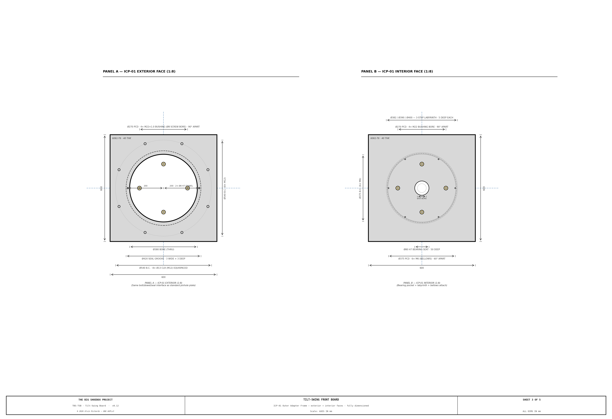
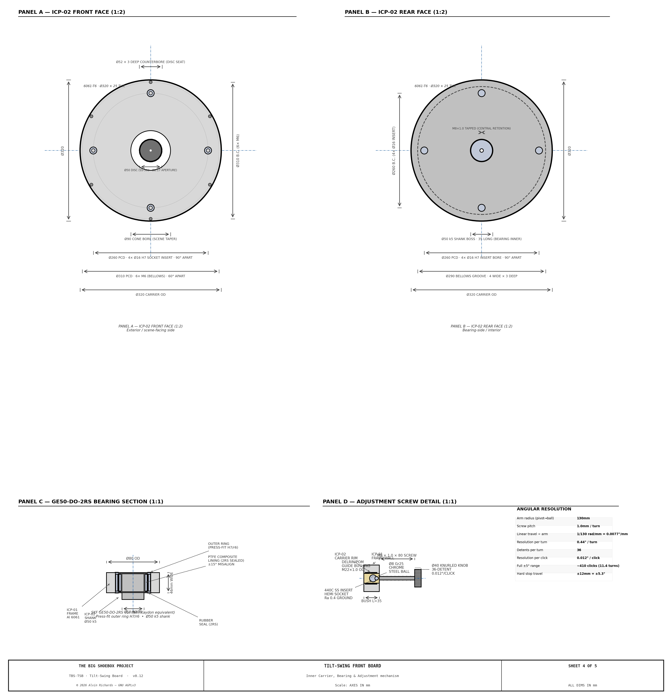
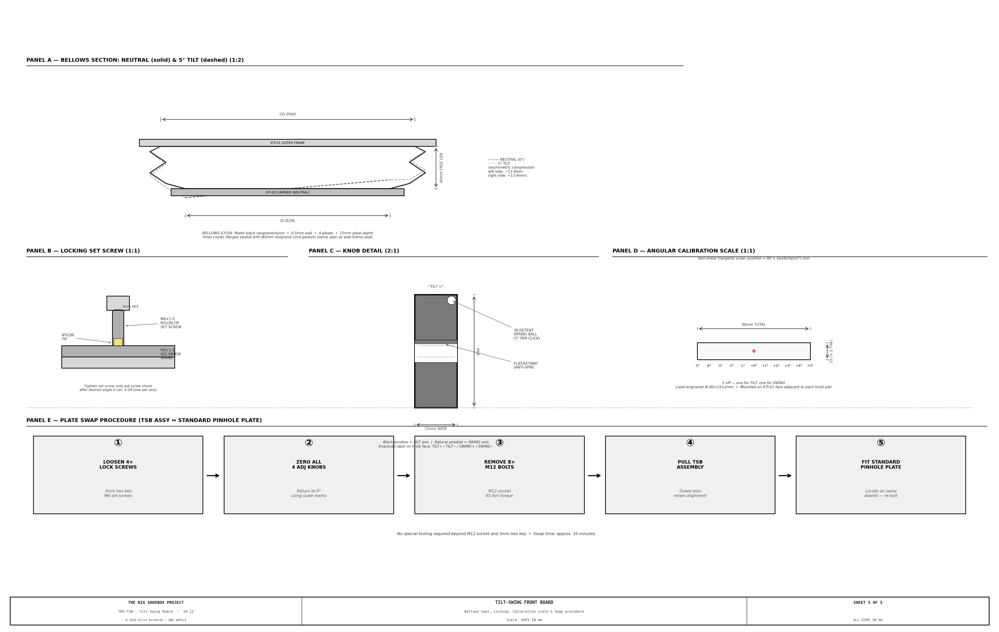

<!-- SPDX-License-Identifier: AGPL-3.0-only -->
<!-- © 2026 Alvin Richards -->
# Tilt-and-Swing Front Board Mechanism

## 1. Purpose

The front board is the interchangeable plate that carries the pinhole disc at the scene-facing end of the container. This report specifies a new plate — the **Tilt-Swing Board (TSB)** — that replaces the flat pinhole plate and adds two axes of angular adjustment to the pinhole's pointing direction.

---

## 2. Mechanism Overview

The TSB assembly is a two-part drop-in replacement for the standard flat pinhole plate. The drawing set (TBS-TSB, 5 sheets) runs from the overall arrangement through the sectional master to a component blueprint per part.

**Sheet 1 — Overall design, front view** (1:2, scene side). ICP-01 outer frame with bolt pattern, bore, carrier plate, adjustment knobs, pinhole disc, and the A-A cut line.


**Sheet 2 — Section A-A (sectional master)** (1:2). Vertical section through center: bearing pocket, carrier shank, bellows, adjustment-screw mechanism, and pinhole disc.


**Sheet 3 — ICP-01 Outer Adapter Frame** (1:8). Exterior (scene-side) and interior (container-side) faces: the bolt/dowel/seal interface, adjustment bushings, bearing seat, 3-step labyrinth, and bellows flange.



**Sheet 4 — ICP-02 Carrier, bearing & adjustment** (1:8). The inner carrier plate, the GE50-DO-2RS bearing fit, and the ball-socket adjustment detail.



**Sheet 5 — Light seal, locking, calibration & swap** (1:8). Bellows geometry, the M6 locking set screws, the angular calibration scale, and the plate-swap sequence.



```
WALL FRAME (fixed, welded to container)
│
├── ICP-01  OUTER ADAPTER FRAME  600×600×40mm Al 6061-T6
│    ├── Identical M12/540PCD/Ø8 dowel interface as all other plates
│    ├── Ø380mm central bore (passes ICP-02 carrier + 135mm clearance margin)
│    ├── Ø80 H7 × 50mm deep bearing seat pocket (interior face)
│    ├── 4× M8×1.0 fine-pitch adjustment screws with Delrin guide bushings
│    ├── 4× M6 nylon-tip locking set screws (cross-lock each adj screw)
│    ├── 6× M6 bellows outer flange attachment on Ø375mm PCD
│    └── 3-step labyrinth bore (Ø382/390/400mm) — secondary light seal
│
├── ICP-02  INNER CARRIER PLATE  Ø320×25mm Al 6061-T6
│    ├── Carries standard Ø50×0.1mm SS-302 pinhole disc (Lenox Laser)
│    ├── Ø52×3mm counterbore — identical to standard plate
│    ├── Spherical pivot: Ø50 k5 shank into GE50-DO-2RS bearing
│    ├── 4× 440C SS hemispherical ball-socket inserts on Ø260mm PCD
│    └── 6× M6 bellows inner flange attachment on Ø310mm PCD
│
├── ICP-03  GE50-DO-2RS SPHERICAL PLAIN BEARING
│    ├── SKF/INA/Kaydon GE50-DO-2RS (same bearing family as film plane)
│    ├── Bore Ø50mm | OD Ø80mm | Width 46mm | Misalignment ±15°
│    └── PTFE-lined self-lubricating — maintenance-free, chemistry-safe
│
└── ICP-10  BELLOWS (matte black neoprene/nylon)
     ├── ID Ø290mm → OD Ø360mm, free length 60mm, 4 pleats
     └── Accommodates ±13.9mm asymmetric compression at ±5° tilt
```

## 3. Movement Specification

| Axis | Control | Travel | Resolution | Image effect |
|------|---------|--------|-----------|--------------|
| Tilt | Top + bottom M8 screws (black knobs) | ±<!-- BEGIN fact:front_board_max_deg -->5.3<!-- END fact:front_board_max_deg -->° | <!-- BEGIN fact:front_board_click_deg -->0.012<!-- END fact:front_board_click_deg -->°/click | ±<!-- BEGIN fact:front_board_max_shift_mm -->219<!-- END fact:front_board_max_shift_mm -->mm vertical image shift |
| Swing | Left + right M8 screws (silver knobs) | ±<!-- BEGIN fact:front_board_max_deg -->5.3<!-- END fact:front_board_max_deg -->° | <!-- BEGIN fact:front_board_click_deg -->0.012<!-- END fact:front_board_click_deg -->°/click | ±<!-- BEGIN fact:front_board_max_shift_mm -->219<!-- END fact:front_board_max_shift_mm -->mm horizontal image shift |
| Compound | All 4 screws | ±3.7° per axis simultaneously | <!-- BEGIN fact:front_board_click_deg -->0.012<!-- END fact:front_board_click_deg -->°/click | Diagonal shift + keystone |

**Image shift formula:** shift (mm) = f × tan(θ) = <!-- BEGIN fact:focal_length_mm -->2,362<!-- END fact:focal_length_mm --> × tan(θ)

| Board angle | Tilt image shift | Notes |
|-------------|-----------------|-------|
| 1° | 41mm | Very subtle — useful for fine composition |
| 2° | 83mm | ~3.5% of frame height |
| 3° | 124mm | ~5.2% — clearly visible on print |
| 5° | <!-- BEGIN fact:image_shift_per_5deg -->207<!-- END fact:image_shift_per_5deg -->mm | ~8.7% — dramatic compositional shift |
| 5.3° (max) | <!-- BEGIN fact:front_board_max_shift_mm -->219<!-- END fact:front_board_max_shift_mm -->mm | Mechanical hard stop |

---

## 4. Pivot Bearing: GE50-DO-2RS

The GE50-DO-2RS was chosen over cross-flexure and Cardan arrangements:

- **Cross-flexure**: two stacked stages needed for tilt + swing simultaneously; combined depth of ~60mm exceeds the 40mm plate budget; parasitic translation at compound angles
- **Cardan joint**: cross-spider projects beyond Ø350mm aperture; gimbal-lock risk near cross-axis; shaft seals at 4 points
- **GE50-DO-2RS (chosen)**: single component handles both axes about a true pivot point; ±15° misalignment capacity (well above ±<!-- BEGIN fact:front_board_max_deg -->5.3<!-- END fact:front_board_max_deg -->° required); PTFE sliding surface is sealed, maintenance-free, and impervious to photographic chemistry; zero backlash under preload from opposing screw pairs

The pivot is located at the plane of the pinhole disc face (40mm forward of the bearing housing), so tilt rotates the image cone about the pinhole itself — no parallax error from pivot offset.

---

## 5. Adjustment Mechanism

Four M8 × 1.0 fine-pitch stainless screws, each terminating in a Grade-25 Ø8mm chrome steel ball seated in a hardened 440C SS hemispherical insert pressed into the carrier plate rim.

**Angular resolution:**

```
Arm radius (pivot → ball contact):    130mm
Screw pitch:                          1.0mm per turn
Linear travel ÷ arm radius:           1/130 rad/mm = 0.0077°/mm
Resolution per full turn:             arctan(1.0/130) = 0.44°
Detents per turn (36-detent knob):    36
Resolution per click:                 0.44° / 36 = 0.012° per click
Full ±5° range from center:           ~410 clicks (11.4 turns)
Mechanical hard stop:                 ±12mm travel = ±5.3°
```

**Knob identification:**
- Top and bottom screws → **TILT** axis → **black anodised** knobs, engraved TILT+ / TILT−
- Left and right screws → **SWING** axis → **natural/silver anodised** knobs, engraved SWING+ / SWING−

**Operation:** To tilt upward, turn TILT+ clockwise (pushes top of carrier away from frame) and TILT− counter-clockwise (releases tension on bottom) by equal amounts. This keeps the pivot point centered on the bearing at all times.

---

## 6. Light Sealing

The bellows (ICP-10) is the primary seal — zero friction, zero wear, accommodates the full angular range with no light leakage:

- 4-pleat accordion geometry tolerates ±13.9mm asymmetric compression at ±5° tilt (left side compresses, right side extends by equal amounts)
- Inner and outer attachment flanges are sealed with Ø3mm neoprene cord gaskets — same specification as the wall-frame seal used on all plates
- The ICP-01 bore has a 3-step machined labyrinth (Ø382 / Ø390 / Ø400mm, 5mm deep each) — secondary seal preventing any direct light path even if the bellows flange lifts at extreme angles

**Why bellows over EPDM wiper seal:** A wiper seal pressed against the tilting disc edge creates variable friction at different angles, giving inconsistent feel. Bellows are zero-friction, standard photographic practice, and self-certify light-tightness by construction.

---

## 7. Locking for Long Exposures

After setting the desired angle, tighten the 4 × M6 nylon-tip set screws (one per adjustment screw, accessed with a 3mm hex key from the exterior face). The nylon tip binds against the M8 shank without marring the threads.

The combined stiction of:
1. M6 lock screws binding M8 adjustment screws
2. Opposite screw pair compressive preload
3. PTFE bearing surface stiction

provides robust position-holding for exposures of 20–90 minutes under ambient wind loads.

---

## 8. Plate Swap Procedure

The TSB assembly swaps in/out of the same wall frame as the standard pinhole plate. No special tooling required beyond an M12 socket and 3mm hex key.

1. **Loosen** 4× M6 locking set screws (3mm hex key)
2. **Zero** all 4 adjustment knobs to 0° using the calibration scales
3. **Remove** 8× M12×45 SHCS bolts
4. **Pull** TSB assembly from wall frame (dowel pins release with light pull)
5. **Fit** standard flat pinhole plate — locate on same Ø8mm dowel pins, torque M12 bolts to 65 Nm

Swap time: approximately 10 minutes.

---

## 9. Board-Only Distortion Renders

The following renders show the isolated effect of the tilt-swing front board on the projected image, with the film plane held flat at the far wall. The world scene is a regular grid at three depths (near: 7m, mid: 22m, far: 102m from pinhole) plus a human-figure reference and horizon line.


The board's ±<!-- BEGIN fact:front_board_max_deg -->5.3<!-- END fact:front_board_max_deg -->° range produces up to <!-- BEGIN fact:front_board_max_shift_mm -->219<!-- END fact:front_board_max_shift_mm -->mm of image shift — enough to steer composition without any film plane movement.

| Config | Board Tilt | Board Swing | Effect |
|--------|-----------|-------------|--------|
| C0 | 0° | 0° | Reference — no shift |
| C1 | +2° | 0° | Subtle vertical steering |
| C2 | +5.3° | 0° | Max vertical shift (+<!-- BEGIN fact:front_board_max_shift_mm -->219<!-- END fact:front_board_max_shift_mm -->mm) |
| C3 | -5.3° | 0° | Max downward shift (-<!-- BEGIN fact:front_board_max_shift_mm -->219<!-- END fact:front_board_max_shift_mm -->mm) |
| C4 | 0° | +2° | Subtle horizontal steering |
| C5 | 0° | +5.3° | Max horizontal shift |
| C6 | +3° | +3° | Compound diagonal steering |

A detailed analysis of the optical distortions can be found [here](distortion-renders.md#2-tilt-swing-board-distortion-renders).

The red cross (+) marks the projected image center; gray cross marks the nominal center. Note the grid remains rectilinear — the board translates the image cone without introducing geometric distortion. Distortion only appears when combined with film plane tilt/swing (§10).

---

## 10. Combined Distortion Renders

The following renders show the combined projection of both systems operating simultaneously. The world scene is a regular grid at three depths (near: 7.4m, mid: 22.4m, far: 102.4m from pinhole) plus a human-figure reference and horizon line.

The projection model applies two sequential transformations:

**Step 1 — Front board rotation:**
Board tilt α and swing β rotate the effective world coordinate system:
`W' = Ry(−β) · Rx(−α) · W_world`

**Step 2 — Film plane intersection:**
The tilted film plane (film tilt θ, film swing φ) is defined by anchor point r₀=(0,0,2362) and normal n = Ry(φ)·Rx(θ)·[0,0,−1]. The image point is:
`t = (n·r₀)/(n·d);  F = t × d`


The red cross (+) marks the projected image center; gray cross marks the nominal center.

Detailed renders can be found [in the full analysis](tilt-swing-board-analysis.md)

---

## 11. Machining Tolerances

| Feature | Nominal | Tolerance | Importance |
|---------|---------|-----------|------------|
| ICP-01 bearing seat bore Ø80 | Ø80.000 | H7: +0.030/0.000 | Bearing outer ring press-fit |
| ICP-02 bearing shank Ø50 | Ø50.000 | k5: +0.013/+0.002 | Bearing inner ring fit |
| ICP-02 counterbore Ø52 | Ø52.000 | H7: +0.030/0.000 | Concentric with shank to 0.05mm |
| ICP-02 shank perpendicularity | — | 0.05mm/100mm | Sets optical zero |
| ICP-08 hemispherical socket Ra | — | Ra 0.4 (ground) | Ball articulation smoothness |
| ICP-01 bolt holes M12 PCD | Ø540.000 | ±0.1mm positional | Must match wall frame exactly |
| ICP-01 dowel holes Ø8 | Ø8.000 | H7: +0.015/0.000 | Plate registration repeatability |
| Adj screw arm radius | 130.000 | ±0.25mm | Calibration scale accuracy |

---

## 12. Parts List

The BOM is single-sourced from the parts registry (`parts.py`) and generated below. The fasteners, bearing, chrome balls, bushing/insert stock, seals, and Loctite carry firm McMaster SKUs; the raw plate + round bar and the fab/finishing **services** (CNC machining, hard/black anodize, scale engraving, custom bellows) carry **SKU pending — source**: get a supplier or shop quote before purchase.

<!-- BEGIN parts:front-board -->
| Item | Spec | Qty | Supplier | Est. cost |
|------|------|-----|----------|-----------|
| GE50-DO-2RS spherical plain bearing | ICP-03 pivot: Ø50 bore × Ø80 OD × 46mm W, ±15° misalignment, PTFE-lined self-lubricating (chemistry-safe). Same bearing family as the film plane. SKU pending — source (Bearing Headquarters, Buena Park / Applied Industrial, LA). | 1 ea | Bearing Headquarters / Applied Industrial | $90 |
| ICP-01 outer adapter frame stock (6061-T651 plate) | 6061-T651 plate 620×620×45mm (24×24×1.75in) — machined to the 600×600×40 outer frame. SKU pending — source (Online Metals / Metal Supermarkets, Chatsworth). | 1 ea | Online Metals / Metal Supermarkets | $125 |
| ICP-02 inner carrier stock (6061-T6 round bar) | 6061-T6 round bar Ø340×35mm (13.5in OD × 1.5in) — machined to the Ø320×25 carrier. SKU pending — source (Metal Supermarkets, Chatsworth / Online Metals). | 1 ea | Metal Supermarkets / Online Metals | $100 |
| [M8×1.0×80 SHCS 18-8 SS (adjustment screws)](https://www.mcmaster.com/91180A407/) (91180A407) | Fine-pitch adjustment screw, ball-end seats in the 440C insert; partially threaded. 4 off. McMaster 91180A407 $18.73/10. | 4 ea | McMaster-Carr / Bolt Depot | $7 |
| [Delrin/POM guide bushing rod](https://www.mcmaster.com/8573K75/) (8573K75) | Ø30×200mm Delrin/POM rod — machine the 4 adjustment-screw guide bushings. McMaster 8573K75. | 1 ea | McMaster-Carr / Amazon Industrial | $20 |
| [Ø8mm Grade-25 chrome steel balls (10-pack)](https://www.mcmaster.com/9528K22/) (9528K22) | 52100 bearing steel, Ø8mm Grade 25, 10-pack — the ball-end contact at each adjustment screw. McMaster 9528K22. | 1 pack | McMaster-Carr / Precision Balls Inc. | $14 |
| [M6×1.0 nylon-tip set screw (10-pack)](https://www.mcmaster.com/91375A187/) (91375A187) | SS316, M6×20mm nylon-tip — cross-locks each adjustment screw for long exposures. Pack of 10. McMaster 91375A187. | 1 pack | McMaster-Carr / Fastenal | $14 |
| [440C SS round bar (ball-socket inserts)](https://www.mcmaster.com/1765T17/) (1765T17) | Ø20×100mm 440C SS bar — machine the 4 hardened hemispherical ball-socket inserts (ICP-08), Ra 0.4 ground. McMaster 1765T17. | 1 ea | McMaster-Carr / Metal Supermarkets | $28 |
| [M12×45 SHCS SS A4 (plate-to-frame)](https://www.mcmaster.com/92290A198/) (92290A198) | 8 off — mounts the TSB into the same wall frame as the standard plate (torque 65 Nm). McMaster 92290A198 $20/pack of 5. | 8 ea | McMaster-Carr / Bolt Depot | $32 |
| [M8×1.0×50 SHCS 18-8 SS (central retention)](https://www.mcmaster.com/91180A352/) (91180A352) | 1 off — non-structural central retention/preload, downsized from M16 (reuses the M8×1.0 fine thread of the adjustment screws). McMaster 91180A352 $6.42/10. | 1 ea | McMaster-Carr / Bolt Depot | $1 |
| [Ø8 m6 SS303 dowel pin](https://www.mcmaster.com/97395A437/) (97395A437) | Ø8×40mm — plate registration repeatability (light-pull release). 2 off. McMaster 97395A437. | 2 ea | McMaster-Carr / Fastenal | $18 |
| [Loctite 638 retaining compound (10mL)](https://www.mcmaster.com/1832A1/) (1832A1) | Bearing outer-ring + ball-socket insert retention. McMaster 1832A1. | 1 ea | McMaster-Carr / Home Depot | $22 |
| Custom photographic bellows (ICP-10) | Ø290 ID × Ø360 OD × 60mm free length, 4-pleat, matte-black neoprene — the primary zero-friction light seal. Custom order — SKU pending (Micro-Tools / Ames Camera Repair). | 1 ea | Micro-Tools / Ames Camera Repair | $80–$150 |
| [Neoprene cord seal Ø3mm](https://www.mcmaster.com/1834K22/) (1834K22) | 70 Shore, 1.5m — bellows flange gaskets + Ø420 loop (same spec as the wall-frame seal). McMaster 1834K22. | 1 ea | McMaster-Carr / Grainger | $18 |
| Hard anodize — ICP-01 exterior (service) | MIL-A-8625 Type III, 0.025mm, ICP-01 exterior. SKU pending — get a shop quote (Pac-Nor, Chatsworth). | 1 job | Pac-Nor Anodizing | $80–$120 |
| Black anodize — ICP-02 + knobs (service) | Type II, ICP-02 carrier + the 4 knobs. SKU pending — get a shop quote (Aero Finishing, Burbank). | 1 job | Aero Finishing | $60–$90 |
| CNC machining — ICP-01 + ICP-02 (service) | All-aluminum machining of both plates (bores, H7 seat, k5 shank, PCDs, labyrinth, counterbore). SKU pending — get a fab quote (Fictiv / ProtoLabs). | 1 job | Fictiv / ProtoLabs | $800–$1,500 |
| Knurled knob stock Ø40mm Al (4 off) | Ø40mm Al knurled knob — 4 off (2 black TILT, 2 silver SWING), engraved. Jergens 49525 (SKU pending — verify) or machine from bar. | 4 ea | Jergens / local machine shop | $60 |
| Angular calibration scale engraving (service) | Al 80×15×2mm, 2 off — laser-engraved angular scales (tilt + swing). SKU pending — quote (LaserPros, Chatsworth). | 1 set | LaserPros | $35–$50 |
| **Front-Board total** | | | | **$1,604–$2,459** |
<!-- END parts:front-board -->

**Estimated module total: ~<!-- BEGIN costing:front-board-total -->$1,604<!-- END costing:front-board-total --> – ~<!-- BEGIN costing:front-board-total-high -->$2,459<!-- END costing:front-board-total-high -->.** CNC machining and the custom bellows dominate the upper band.


---

## 13. Maintenance

| Interval | Task |
|----------|------|
| Before each session | Check all four M6 locking set screws are released before adjustment |
| Before each session | Verify bellows (ICP-10) is intact — no tears, flange gaskets seated |
| Before each session | Zero-check calibration scales against spirit level |
| Monthly | Inspect M8 adjustment screw ball-socket contacts for wear |
| Monthly | Check Delrin guide bushings for cracking or swelling |
| Every 6 months | Inspect GE50-DO-2RS bearing for play — replace if radial slop exceeds 0.1mm |
| Every 6 months | Check labyrinth bore steps for accumulated dust or debris |
| Annually | Inspect bellows pleats for fatigue cracking (especially at max-angle fold lines) |
| Annually | Verify M12 bolt torque at wall frame interface (65 Nm) |
| Annually | Check dowel pin fit — pins should release with light pull, no binding |

---

## 14. Source References

1. [SKF GE50-DO-2RS Spherical Plain Bearing](https://www.skf.com/group/products/plain-bearings/spherical-plain-bearings-rod-ends/spherical-plain-bearings/productid-GE50DO-2RS) — Bearing specifications, misalignment capacity, and PTFE liner properties.
2. [Lenox Laser Precision Pinholes](https://lenoxlaser.com/blog/pinholes-and-apertures/) — Pinhole disc fabrication (Ø2.17mm, SS-302 shim).
3. [Micro-Tools Custom Bellows](https://microtools.com/) — Custom photographic bellows fabrication.
4. [Film Plane Mechanism Report](film-plane-mechanism-report.md) — Rear standard mechanism and combined distortion analysis.
5. [Pinhole Report](pinhole-report.md) — Wall frame and interchangeable plate interface specification.
