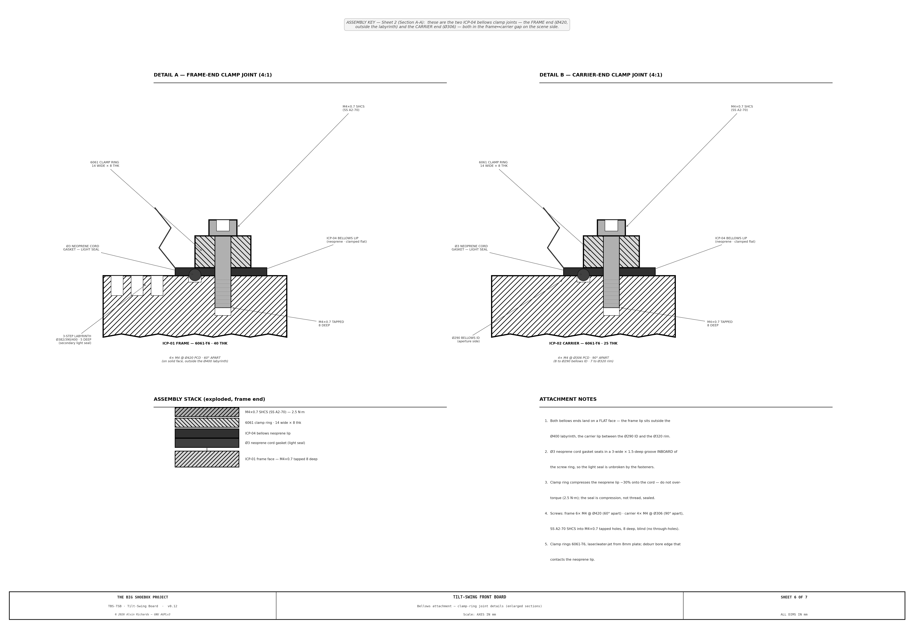

<!-- SPDX-License-Identifier: AGPL-3.0-only -->
<!-- © 2026 Alvin Richards -->
# Tilt-and-Swing Front Board Mechanism

## 1. Purpose

The front board is the interchangeable plate that carries the pinhole disc at the scene-facing end of the container. This report specifies a new plate — the **Tilt-Swing Board (TSB)** — that replaces the flat pinhole plate and adds two axes of angular adjustment to the pinhole's pointing direction.

---

## 2. Mechanism Overview

The TSB assembly is a drop-in replacement for the standard flat pinhole plate. The drawing set (TBS-TSB, 6 sheets) runs from the overall arrangement through the sectional master to a component blueprint per fabricated part. The tilt/swing knobs are adjusted from **inside the container** (the camera side).

**Sheet 1 — Overall design, front view** (1:2, scene side). ICP-01 outer frame with bolt pattern, bore, carrier plate, adjustment knobs, pinhole disc, and the A-A cut line.


**Sheet 2 — Section A-A (sectional master)** (1:2). Vertical section through center: the rim kinematic mount (adjuster balls on the carrier rear face + wave spring in the frame counterbore + the interior adjuster bracket ring), bellows, and pinhole disc — with an enlarged DETAIL Z of the rim joint. The cutting plane is referenced by the A-A line on Sheet 1. **The knobs are on the interior (camera) side — set from inside.**


**Sheet 3 — ICP-01 Outer Adapter Frame** (1:8). Exterior (scene-side) and interior (container-side) faces: the bolt/dowel/seal interface, the clear Ø380 bore, 3-step labyrinth, the bellows outer clamp ring, the wave-spring counterbore, and the adjuster-bracket-ring standoff pattern.


**Sheet 4 — ICP-02 Carrier, preload & adjustment** (1:2/2:1). The inner carrier plate (front + rear faces with the kinematic seats), the preload & kinematic-seat section (Panel C), and the adjustment-screw detail.


**Sheet 5 — Light seal, locking & calibration** (1:8). Bellows geometry, the M6 locking set screws, and the angular calibration scale. The plate-swap sequence is an operating step, not a fabrication feature — it lives as the numbered procedure in §8 below.


**Sheet 6 — Bellows attachment** (4:1). Enlarged sections through both clamp-ring joints (frame end at Ø420, carrier end at Ø306) — the neoprene lip, Ø3 cord gasket, aluminum clamp ring, and M4 screw into a tapped hole — with the exploded assembly stack and attachment notes.



```
WALL FRAME (flat adapter plate welded/bolted over the corrugated end wall; enlarged aperture cut through the corrugation)
│
├── ICP-01  OUTER ADAPTER FRAME  600×600×40mm Al 6061-T6
│    ├── Identical M12/540PCD/Ø8 dowel interface as all other plates
│    ├── Ø380mm central bore — CLEAR (carrier is rim-supported; no central bearing)
│    ├── Ø300mm wave-spring counterbore (interior face) — the spring reaction
│    ├── 6× M5 adjuster-bracket-ring standoffs on Ø450mm PCD (carry the ICP-03 ring)
│    ├── Bellows outer clamp ring on Ø420mm PCD (6× M4, outside the labyrinth)
│    └── 3-step labyrinth bore (Ø382/390/400mm) — secondary light seal
│
├── ICP-02  INNER CARRIER PLATE  Ø320×25mm Al 6061-T6
│    ├── Carries standard Ø50×0.1mm SS-302 pinhole disc (Lenox Laser) — camera-side face
│    ├── Ø52×3mm counterbore — identical to standard plate
│    ├── 4× 440C SS kinematic-seat inserts (ICP-05) on Ø260mm PCD — REAR (camera) face
│    │     (1 cone / 1 V-groove / 2 flat → in-plane position + spin exactly constrained)
│    ├── Ø300mm wave-spring bearing land — FRONT (scene) rim; no central shank
│    └── Bellows inner clamp ring on Ø306mm PCD (4× M4)
│
├── ICP-03  RIM PRELOAD + ADJUSTER SUBSYSTEM (replaces the central bearing)
│    ├── Annular wave spring (~Ø300) in the frame counterbore — pushes the carrier onto the balls
│    ├── Al adjuster bracket ring ~Ø470 × Ø250 × 8mm, 6× M5 standoffs @ Ø450 (outside the bellows)
│    ├── Carries the 4× M8×1.0 adjusters + Delrin bushings + 4× M6 locks — KNOBS FACE THE INTERIOR
│    └── Zero backlash; optical axis completely clear; adjust from inside the container
│
└── ICP-04  BELLOWS (matte black neoprene/nylon)
     ├── Truncated cone Ø290mm (carrier) → Ø430mm (frame), free length 60mm, 4 pleats — clamp-ring retained both ends
     └── Accommodates ±13.9mm asymmetric compression at ±5° tilt
```

**Wall mounting.** The pinhole (nose) end wall of the container is corrugated steel, so ICP-01 cannot seat on it directly. A flat steel **wall-frame adapter plate** is welded/bolted over the corrugation to present a flat datum, with an aperture cut through the corrugation larger than the Ø380 bore; ICP-01 (and the standard flat plate it interchanges with) bolts to that adapter via the 8× M12 / Ø540 interface. Section A-A (Sheet 2) shows the corrugated wall, the adapter plate, and the enlarged aperture.

## 3. Movement Specification

| Axis | Control | Travel | Resolution | Image effect |
|------|---------|--------|-----------|--------------|
| Tilt | Top + bottom M8 screws (black knobs) | ±<!-- BEGIN fact:front_board_max_deg -->5.3<!-- END fact:front_board_max_deg -->° | <!-- BEGIN fact:front_board_click_deg -->0.012<!-- END fact:front_board_click_deg -->°/click | ±<!-- BEGIN fact:front_board_max_shift_mm -->219<!-- END fact:front_board_max_shift_mm -->mm vertical image shift |
| Swing | Left + right M8 screws (silver knobs) | ±<!-- BEGIN fact:front_board_max_deg -->5.3<!-- END fact:front_board_max_deg -->° | <!-- BEGIN fact:front_board_click_deg -->0.012<!-- END fact:front_board_click_deg -->°/click | ±<!-- BEGIN fact:front_board_max_shift_mm -->219<!-- END fact:front_board_max_shift_mm -->mm horizontal image shift |
| Compound | All 4 screws | ±3.7° per axis simultaneously | <!-- BEGIN fact:front_board_click_deg -->0.012<!-- END fact:front_board_click_deg -->°/click | Diagonal shift + keystone |

**Image shift formula:** shift (mm) = f × tan(θ) = <!-- BEGIN fact:focal_length_mm -->2,362<!-- END fact:focal_length_mm --> × tan(θ)

| Board angle | Tilt image shift | Notes |
|-------------|-----------------|-------|
| 1° | 41mm | Very subtle — useful for fine composition |
| 2° | 83mm | ~3.5% of frame height |
| 3° | 124mm | ~5.2% — clearly visible on print |
| 5° | <!-- BEGIN fact:image_shift_per_5deg -->207<!-- END fact:image_shift_per_5deg -->mm | ~8.7% — dramatic compositional shift |
| 5.3° (max) | <!-- BEGIN fact:front_board_max_shift_mm -->219<!-- END fact:front_board_max_shift_mm -->mm | Mechanical hard stop |

---

## 4. Carrier Support: Rim Kinematic Mount

The carrier is located **entirely at its rim**, leaving the pinhole's optical axis completely clear. This rules out any central pivot: a shaft or bearing on the axis would either block the image cone (a solid boss) or vignette it (a hollow one), and a hub reaching the axis across the Ø380 bore would need a spider that obstructs the aperture — the same objection that rules out the Cardan cross-spider below.

**Rejected central-pivot arrangements:**

- **Central spherical bearing (e.g. GE50-DO-2RS)**: gives a true pivot at the pinhole, but sits *on* the optical axis — a solid Ø50 shank blocks the central image, a hollow one vignettes it, and its outer ring cannot be carried across the open Ø380 bore without a spider. Not buildable here.
- **Cross-flexure**: two stacked stages for tilt + swing; combined depth ~60mm exceeds the 40mm plate budget; parasitic translation at compound angles.
- **Cardan joint**: cross-spider projects across the aperture (obstruction + gimbal-lock risk near cross-axis).

**Rim kinematic mount (chosen).** The carrier rests on the four adjuster balls, which seat in four hardened 440C inserts on the carrier's **rear (camera-side) face**, arranged as a kinematic coupling — **1 cone, 1 V-groove, 2 flats** — so in-plane position and rotation about the axis (spin) are exactly constrained while the four axial contacts set tilt and swing. The four M8 adjusters mount on an aluminum **adjuster bracket ring** standoff-mounted to the frame's interior face (6× M5 @ Ø450, outside the bellows), so their **knobs face into the container and are set from inside**. A peripheral **wave spring** (~Ø300) seated in a counterbore in the frame's interior face bears on the carrier's front rim and pushes it back onto the balls for zero backlash. The bellows carries no load — it is only the light seal.

**Parallax.** With the pivot at the rim-contact plane (~one carrier thickness, ~25mm, behind the pinhole) rather than exactly at the pinhole, a full tilt swings the pinhole ~2.3mm — under 1.5% of the intended ±<!-- BEGIN fact:front_board_max_shift_mm -->219<!-- END fact:front_board_max_shift_mm -->mm image shift, and optically negligible. This small, bounded parallax is the deliberate trade for keeping the optical axis clear.

---

## 5. Adjustment Mechanism

Four M8 × 1.0 fine-pitch stainless screws mounted on the **interior adjuster bracket ring** (§4), each terminating in a Grade-25 Ø8mm chrome steel ball seated in a hardened 440C SS kinematic-seat insert (1 cone / 1 V-groove / 2 flat) on the carrier's rear face. The knobs face into the container, so tilt/swing is set from inside. A peripheral wave spring in the frame holds the carrier against all four balls, so each screw pair works against a constant preload (zero backlash).

**Angular resolution:**

```
Arm radius (pivot → ball contact):    130mm
Screw pitch:                          1.0mm per turn
Linear travel ÷ arm radius:           1/130 rad/mm = 0.0077°/mm
Resolution per full turn:             arctan(1.0/130) = 0.44°
Detents per turn (36-detent knob):    36
Resolution per click:                 0.44° / 36 = 0.012° per click
Full ±5° range from center:           ~410 clicks (11.4 turns)
Mechanical hard stop:                 ±12mm travel = ±5.3°
```

**Knob identification:**
- Top and bottom screws → **TILT** axis → **black anodised** knobs, engraved TILT+ / TILT−
- Left and right screws → **SWING** axis → **natural/silver anodised** knobs, engraved SWING+ / SWING−

**Operation:** To tilt upward, turn TILT+ clockwise (advances the top ball, pushing the top of the carrier) and TILT− counter-clockwise (retracts the bottom ball, letting the wave-spring preload follow it) by equal amounts. The carrier pivots about its rim-contact plane; the wave spring keeps all four balls seated throughout.

---

## 6. Light Sealing

The bellows (ICP-04) is the primary seal — zero friction, zero wear, accommodates the full angular range with no light leakage:

- 4-pleat accordion geometry tolerates ±13.9mm asymmetric compression at ±5° tilt (left side compresses, right side extends by equal amounts)
- Both flanges are clamp-ring retained (an aluminum retaining ring + M4 screws) onto Ø3mm neoprene cord gaskets — same gasket spec as the wall-frame seal. The carrier ring lands at Ø306 (7mm edge to the Ø320 rim); the frame ring lands at Ø420, outside the Ø400 labyrinth on solid frame face — so each flange seats on real material
- The ICP-01 bore has a 3-step machined labyrinth (Ø382 / Ø390 / Ø400mm, 5mm deep each) — secondary seal preventing any direct light path even if the bellows clamp ring lifts at extreme angles

**Why bellows over EPDM wiper seal:** A wiper seal pressed against the tilting disc edge creates variable friction at different angles, giving inconsistent feel. Bellows are zero-friction, standard photographic practice, and self-certify light-tightness by construction.

---

## 7. Locking for Long Exposures

After setting the desired angle, tighten the 4 × M6 nylon-tip set screws (one per adjustment screw, accessed with a 3mm hex key from the interior/camera side, on the adjuster bracket ring). The nylon tip binds against the M8 shank without marring the threads.

The combined stiction of:
1. M6 lock screws binding M8 adjustment screws
2. Opposite screw pair compressive preload
3. Wave-spring preload seating all four balls in their kinematic seats

provides robust position-holding for exposures of 20–90 minutes under ambient wind loads.

---

## 8. Plate Swap Procedure

The TSB assembly swaps in/out of the same wall frame as the standard pinhole plate. No special tooling required beyond an M12 socket and 3mm hex key.

1. **Loosen** 4× M6 locking set screws (3mm hex key)
2. **Zero** all 4 adjustment knobs to 0° using the calibration scales
3. **Remove** 8× M12×45 SHCS bolts
4. **Pull** TSB assembly from wall frame (dowel pins release with light pull)
5. **Fit** standard flat pinhole plate — locate on same Ø8mm dowel pins, torque M12 bolts to 65 Nm

Swap time: approximately 10 minutes.

---

## 9. Board-Only Distortion Renders

The following renders show the isolated effect of the tilt-swing front board on the projected image, with the film plane held flat at the far wall. The world scene is a regular grid at three depths (near: 7m, mid: 22m, far: 102m from pinhole) plus a human-figure reference and horizon line.


The board's ±<!-- BEGIN fact:front_board_max_deg -->5.3<!-- END fact:front_board_max_deg -->° range produces up to <!-- BEGIN fact:front_board_max_shift_mm -->219<!-- END fact:front_board_max_shift_mm -->mm of image shift — enough to steer composition without any film plane movement.

| Config | Board Tilt | Board Swing | Effect |
|--------|-----------|-------------|--------|
| C0 | 0° | 0° | Reference — no shift |
| C1 | +2° | 0° | Subtle vertical steering |
| C2 | +5.3° | 0° | Max vertical shift (+<!-- BEGIN fact:front_board_max_shift_mm -->219<!-- END fact:front_board_max_shift_mm -->mm) |
| C3 | -5.3° | 0° | Max downward shift (-<!-- BEGIN fact:front_board_max_shift_mm -->219<!-- END fact:front_board_max_shift_mm -->mm) |
| C4 | 0° | +2° | Subtle horizontal steering |
| C5 | 0° | +5.3° | Max horizontal shift |
| C6 | +3° | +3° | Compound diagonal steering |

A detailed analysis of the optical distortions can be found [here](distortion-renders.md#2-tilt-swing-board-distortion-renders).

The red cross (+) marks the projected image center; gray cross marks the nominal center. Note the grid remains rectilinear — the board translates the image cone without introducing geometric distortion. Distortion only appears when combined with film plane tilt/swing (§10).

---

## 10. Combined Distortion Renders

The following renders show the combined projection of both systems operating simultaneously. The world scene is a regular grid at three depths (near: 7.4m, mid: 22.4m, far: 102.4m from pinhole) plus a human-figure reference and horizon line.

The projection model applies two sequential transformations:

**Step 1 — Front board rotation:**
Board tilt α and swing β rotate the effective world coordinate system:
`W' = Ry(−β) · Rx(−α) · W_world`

**Step 2 — Film plane intersection:**
The tilted film plane (film tilt θ, film swing φ) is defined by anchor point r₀=(0,0,2362) and normal n = Ry(φ)·Rx(θ)·[0,0,−1]. The image point is:
`t = (n·r₀)/(n·d);  F = t × d`


The red cross (+) marks the projected image center; gray cross marks the nominal center.

Detailed renders can be found [in the full analysis](tilt-swing-board-analysis.md)

---

## 11. Machining Tolerances

| Feature | Nominal | Tolerance | Importance |
|---------|---------|-----------|------------|
| ICP-02 kinematic-seat insert bore Ø16 | Ø16.000 | H7: +0.018/0.000 | Press-fit for the 440C seats (ICP-05) |
| ICP-05 seat form (cone/vee) Ra | — | Ra 0.4 (ground) | Ball location + articulation smoothness |
| Kinematic-seat PCD Ø260 | Ø260.000 | ±0.05mm positional | Sets tilt/swing zero + even preload |
| ICP-02 counterbore Ø52 | Ø52.000 | H7: +0.030/0.000 | Concentric with the pinhole axis to 0.05mm |
| ICP-01 bracket-ring standoff PCD Ø450 | Ø450.000 | ±0.1mm positional | Even adjuster-ring + spring seating |
| ICP-01 bolt holes M12 PCD | Ø540.000 | ±0.1mm positional | Must match wall frame exactly |
| ICP-01 dowel holes Ø8 | Ø8.000 | H7: +0.015/0.000 | Plate registration repeatability |
| Adj screw arm radius | 130.000 | ±0.25mm | Calibration scale accuracy |

---

## 12. Parts List

The BOM is single-sourced from the parts registry (`parts.py`) and generated below. The fasteners, chrome balls, bushing/insert stock, seals, and Loctite carry firm McMaster SKUs; the raw plate + round bar, the preload wave spring + adjuster bracket ring, and the fab/finishing **services** (CNC machining, hard/black anodize, scale engraving, custom bellows) carry **SKU pending — source**: get a supplier or shop quote before purchase.

<!-- BEGIN parts:front-board -->
| Item | Spec | Qty | Supplier | Est. cost |
|------|------|-----|----------|-----------|
| Annular wave spring — carrier preload (ICP-03) | ICP-03 preload: ~Ø300 mean-dia crest-to-crest wave spring (17-7 PH SS), seated in a counterbore in ICP-01's interior face; bears on the carrier's exterior rim to push it onto the 4 adjuster balls (zero backlash). Replaces the former central GE50 bearing — the carrier is rim-supported and the optical axis is clear. Large-dia custom coil — SKU pending (Smalley / Associated Spring). | 1 ea | Smalley / Associated Spring | $25–$50 |
| Adjuster bracket ring — Al (ICP-03) | ICP-03: 6061-T6 annular bracket ring ~Ø470 OD × Ø250 ID × 8mm, standoff-mounted to ICP-01's interior face (6× M5 @ Ø450, outside the bellows). Carries the 4 M8 adjuster bushings at Ø270 with the KNOBS facing into the container (adjust from inside) and reacts the wave-spring preload. Waterjet blank + machined (bushing bores + tapped mounts). SKU pending — fab quote. | 1 ea | local machine shop | $35–$70 |
| M5×30 SHCS 18-8 SS (bracket-ring standoff) | 6 off — standoff screws mounting the adjuster bracket ring to ICP-01 at Ø450 (tapped). M5×30 SHCS 18-8 SS, pack of 25 — SKU pending (source). | 1 pack | McMaster-Carr / Bolt Depot | $8 |
| ICP-01 outer adapter frame stock (6061-T651 plate) | 6061-T651 plate 620×620×45mm (24×24×1.75in) — machined to the 600×600×40 outer frame. SKU pending — source (Online Metals / Metal Supermarkets, Chatsworth). | 1 ea | Online Metals / Metal Supermarkets | $125 |
| ICP-02 inner carrier stock (6061-T6 round bar) | 6061-T6 round bar Ø340×30mm (13.5in OD × 1.2in) — machined to the Ø320×25 carrier (no central shank — rim-supported). SKU pending — source (Metal Supermarkets, Chatsworth / Online Metals). | 1 ea | Metal Supermarkets / Online Metals | $100 |
| [M8×1.0×80 SHCS 18-8 SS (adjustment screws)](https://www.mcmaster.com/91180A407/) (91180A407) | Fine-pitch adjustment screw, ball-end seats in the 440C insert; partially threaded. 4 off. McMaster 91180A407 $18.73/10. | 4 ea | McMaster-Carr / Bolt Depot | $7 |
| [Delrin/POM guide bushing rod](https://www.mcmaster.com/8573K75/) (8573K75) | Ø30×200mm Delrin/POM rod — machine the 4 adjustment-screw guide bushings (pressed into the adjuster bracket ring, not the frame). McMaster 8573K75. | 1 ea | McMaster-Carr / Amazon Industrial | $20 |
| [Ø8mm Grade-25 chrome steel balls (10-pack)](https://www.mcmaster.com/9528K22/) (9528K22) | 52100 bearing steel, Ø8mm Grade 25, 10-pack — the ball-end contact at each adjustment screw. McMaster 9528K22. | 1 pack | McMaster-Carr / Precision Balls Inc. | $14 |
| [M6×1.0 nylon-tip set screw (10-pack)](https://www.mcmaster.com/91375A187/) (91375A187) | SS316, M6×20mm nylon-tip — cross-locks each adjustment screw for long exposures. Pack of 10. McMaster 91375A187. | 1 pack | McMaster-Carr / Fastenal | $14 |
| [440C SS round bar (ball-socket inserts)](https://www.mcmaster.com/1765T17/) (1765T17) | Ø20×100mm 440C SS bar — machine the 4 hardened kinematic-seat inserts (ICP-05): 1 cone / 1 V-groove / 2 flat, Ra 0.4 ground (locate the carrier in-plane + anti-spin). McMaster 1765T17. | 1 ea | McMaster-Carr / Metal Supermarkets | $28 |
| [M12×45 SHCS SS A4 (plate-to-frame)](https://www.mcmaster.com/92290A198/) (92290A198) | 8 off — mounts the TSB into the same wall frame as the standard plate (torque 65 Nm). McMaster 92290A198 $20/pack of 5. | 8 ea | McMaster-Carr / Bolt Depot | $32 |
| [Ø8 m6 SS303 dowel pin](https://www.mcmaster.com/97395A437/) (97395A437) | Ø8×40mm — plate registration repeatability (light-pull release). 2 off. McMaster 97395A437. | 2 ea | McMaster-Carr / Fastenal | $18 |
| [Loctite 638 retaining compound (10mL)](https://www.mcmaster.com/1832A1/) (1832A1) | Kinematic-seat insert (ICP-05) retention in the carrier bores. McMaster 1832A1. | 1 ea | McMaster-Carr / Home Depot | $22 |
| Custom photographic bellows (ICP-04) | Truncated cone Ø290 (carrier) → Ø430 (frame) × 60mm free length, 4-pleat, matte-black neoprene — the primary zero-friction light seal; clamp-ring retained both ends. Custom order — SKU pending (Micro-Tools / Ames Camera Repair). | 1 ea | Micro-Tools / Ames Camera Repair | $80–$150 |
| [Neoprene cord seal Ø3mm](https://www.mcmaster.com/1834K22/) (1834K22) | 70 Shore, 1.5m — bellows clamp-ring gaskets (carrier + frame flange) + Ø420 loop (same spec as the wall-frame seal). McMaster 1834K22. | 1 ea | McMaster-Carr / Grainger | $18 |
| Bellows clamp rings — Al retaining (inner + outer) | 2× Al retaining ring clamping the bellows flanges onto the cord gasket — inner ring ~Ø296 (carrier), outer ring ~Ø434 (frame, outside the labyrinth). Waterjet blank + light machining. SKU pending — fab quote. | 2 ea | local machine shop | $24–$40 |
| M4×12 SHCS 18-8 SS (bellows clamp-ring) | Retains the 2 bellows clamp rings — 4× on the carrier ring + 6× on the frame ring = 10 off, pack of 25. M4×12 SHCS 18-8 SS — SKU pending (source). | 1 pack | McMaster-Carr / Bolt Depot | $6 |
| Hard anodize — ICP-01 exterior (service) | MIL-A-8625 Type III, 0.025mm, ICP-01 exterior. SKU pending — get a shop quote (Pac-Nor, Chatsworth). | 1 job | Pac-Nor Anodizing | $80–$120 |
| Black anodize — ICP-02 + knobs (service) | Type II, ICP-02 carrier + the 4 knobs. SKU pending — get a shop quote (Aero Finishing, Burbank). | 1 job | Aero Finishing | $60–$90 |
| CNC machining — ICP-01 + ICP-02 (service) | All-aluminum machining of both plates + the adjuster bracket ring (Ø380 bore, wave-spring counterbore + bracket-ring standoff taps on the frame, kinematic-seat insert bores on the carrier rear face, PCDs, labyrinth, counterbore). SKU pending — get a fab quote (Fictiv / ProtoLabs). | 1 job | Fictiv / ProtoLabs | $800–$1,500 |
| Knurled knob stock Ø40mm Al (4 off) | Ø40mm Al knurled knob — 4 off (2 black TILT, 2 silver SWING), engraved. Jergens 49525 (SKU pending — verify) or machine from bar. | 4 ea | Jergens / local machine shop | $60 |
| Angular calibration scale engraving (service) | Al 80×15×2mm, 2 off — laser-engraved angular scales (tilt + swing). SKU pending — quote (LaserPros, Chatsworth). | 1 set | LaserPros | $35–$50 |
| **Front-Board total** | | | | **$1,611–$2,542** |
<!-- END parts:front-board -->

**Estimated module total: ~<!-- BEGIN costing:front-board-total -->$1,611<!-- END costing:front-board-total --> – ~<!-- BEGIN costing:front-board-total-high -->$2,542<!-- END costing:front-board-total-high -->.** CNC machining and the custom bellows dominate the upper band.


---

## 13. Maintenance

| Interval | Task |
|----------|------|
| Before each session | Check all four M6 locking set screws are released before adjustment |
| Before each session | Verify bellows (ICP-04) is intact — no tears, flange gaskets seated |
| Before each session | Zero-check calibration scales against spirit level |
| Monthly | Inspect the ball / kinematic-seat contacts for wear |
| Monthly | Check Delrin guide bushings for cracking or swelling |
| Every 6 months | Check the wave-spring preload — carrier should have no rim play; re-shim or replace if slack |
| Every 6 months | Check labyrinth bore steps for accumulated dust or debris |
| Annually | Inspect bellows pleats for fatigue cracking (especially at max-angle fold lines) |
| Annually | Verify M12 bolt torque at wall frame interface (65 Nm) |
| Annually | Check dowel pin fit — pins should release with light pull, no binding |

---

## 14. Source References

1. [Smalley Crest-to-Crest Wave Springs](https://www.smalley.com/wave-springs/crest-to-crest) — Wave-spring load/deflection characteristics for the ICP-03 carrier preload.
2. [Lenox Laser Precision Pinholes](https://lenoxlaser.com/blog/pinholes-and-apertures/) — Pinhole disc fabrication (Ø2.17mm, SS-302 shim).
3. [Micro-Tools Custom Bellows](https://microtools.com/) — Custom photographic bellows fabrication.
4. [Film Plane Mechanism Report](film-plane-mechanism-report.md) — Rear standard mechanism and combined distortion analysis.
5. [Pinhole Report](pinhole-report.md) — Wall frame and interchangeable plate interface specification.
