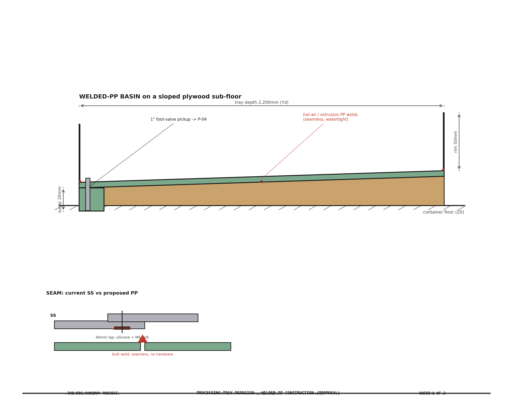

<!-- SPDX-License-Identifier: AGPL-3.0-only -->
<!-- © 2026 Alvin Richards -->
# Processing Tray Redesign — Proposal (for review)

**Status:** Proposal only, on branch `tray-redesign`. **Nothing in `parts.py` /
`tbs_constants.py` / the 3D models changes until you approve a direction.** This
document is for you to review the cost *and* the construction before we commit.

---

## 1. The headline (and a correction)

The [TODO cost-reduction list](TODO.md) carried "tray 304 SS → welded
polypropylene, ~$1,000–1,400." Two findings on review:

1. **Welded PP is *not* the big saver.** ¼" PP sheet is **$258.50/sheet**
   ([US Plastic #41584](https://www.usplastic.com/catalog/item.aspx?itemid=41584);
   $232.65 at 4+) — a welded basin needs ~5 sheets ≈ **$1,160**, which is *more*
   than the SS sheet ($720–1,000). PP also needs continuous support (it's floppy),
   adding a sub-floor. The saving is real only if **you** do the plastic welding,
   and even then it's ~$550–920, not $1,000–1,400.

2. **The real lever is recognizing what the tray *is*.** Per its own design
   goals it is a **catch / drain pan** — "contain all wash water… drain to a sump…
   no stepping on the print surface." Prints are washed on the film plane by the
   spray bar; the tray only catches runoff. **A rigid, premium, welded basin is
   over-spec for a drain pan.** A draped chemical-safe **liner over a cheap sloped
   sub-structure** does the same job for **~$220–450** — saving **~$1,150–1,850**.

So the biggest saving comes from a *simpler* tray, not a fancier material.

---

## 2. Current design (baseline — 304 SS)

A **4,459 × 2,200 mm** basin, **50 mm rim**, sloped **1:200** each axis to a
corner sump (X≈4,550, near rim). Built from **2× 304 SS 16-ga (1.5 mm) panels**
joined by a **40 mm bolted + siliconed center lap seam**, sitting on **5 tapered
HDPE slope shims**, with a pressed sump well + 1" foot-valve pickup → P-04.

| Item | Cost |
|---|---|
| 304 SS sheet (2 panels, #4 brushed) | $720–1,000 |
| Fabrication (cut, brake, weld sump — shop) | $450–850 |
| HDPE slope shims (×5, laminated) | $296 |
| Lap-seam silicone + 12× M6 bolts | $26–34 |
| Foot valve + suction hose (carry over) | $80 |
| **Tray total** | **$1,583–2,271** |

SS was chosen for **rigidity + finish**, not chemistry — the cyanotype wash
(dilute ferric ammonium oxalate / ferricyanide / citric, no chloride) is safe on
almost any plastic. That's what makes a downgrade possible.

---

## 3. The three options

The construction diagrams below show the **shared idea** for both redesigns: a
**sloped sub-structure** carrying a thin watertight surface that falls to the
corner sump. Options B and C differ only in that surface — a **welded-PP skin**
(B) or a **draped liner** (C).

### Option A — keep 304 SS (baseline)
Rigid, handsome, spans between 5 shims with minimal sub-structure. Also the most
expensive, has a **bolted lap-seam leak path**, and is ~120 kg of steel.

### Option B — welded polypropylene basin
3/16" PP, **4 sheets butt-welded into one seamless basin** (no lap seam, no
gasket, no bolts), on a **sloped exterior-ply sub-floor** that sets the fall and
supports the floppy PP. Chemical-matched, permanent, seamless. **But** the PP
sheet isn't cheaper than SS, and it needs the sub-floor — so the saving is modest
and hinges on **who welds** (hot-air/extrusion PP welding is a distinct skill +
a ~$50–150 welder tool).

### Option C — sloped sub-structure + drape-in chemical-safe liner ⭐
A **sloped exterior-ply frame** (cut to the 1:200 compound fall, with a sump
recess and a 50 mm perimeter rim) with a single **drape-in liner** — 45-mil EPDM
or reinforced-polyethylene (RPE), both inert to the cyanotype wash. **No welding,
no seam** (one continuous drape), permanent. This is how large catch-basins /
water features are built cheaply, and it fits a *drain pan* exactly. The foot
valve sits in the sump recess as today.

---

## 4. Cost comparison

| Option | Watertight surface | Sub-structure | Fab | **Tray total** | **vs SS** |
|---|---|---|---|---|---|
| **A. 304 SS** (baseline) | 2× 16-ga panels + lap seam | 5 HDPE shims | SS shop | **$1,583–2,271** | — |
| **B. Welded PP** | 3/16" PP, butt-welded | sloped ply | you weld ($0)… | **$935–1,263** | save ~$550–920 |
| | | | …or shop ($400–700) | $1,335–1,963 | save ~$150–220 (marginal) |
| **C. Liner + substructure** ⭐ | drape-in EPDM/RPE liner | sloped ply frame + rim | none (drape-in) | **~$220–450** | **save ~$1,150–1,850** |

*(All include the carry-over foot valve $14 + suction hose $66. PP sheet priced
firm at US Plastic; liner + ply are estimates — firm at quote per the
material-now rule.)*

---

## 5. Trade-offs

| | Pros | Watch-outs |
|---|---|---|
| **A. SS** | rigid, premium finish, minimal sub-structure | most expensive; lap-seam leak path; ~120 kg |
| **B. PP** | seamless welded basin, rigid, permanent | not cheaper unless you weld; needs a full sub-floor; PP-welding skill + tool |
| **C. Liner** | cheapest by far; no seam; no welding; light | it's a liner (puncture care; robust 45-mil EPDM mitigates); ply stays dry under the liner (seal edges; exterior BC/ACX ply, not marine — [[feedback_plywood_standard_not_marine]]) |

The **ply sub-structure is a dry, sealed, backing use** in all cases (it lives
*under* the watertight layer), so standard exterior grade is correct.

---

## 6. Recommendation

**Option C (liner on a sloped ply sub-structure).** The tray is a drain pan, not
a soaking basin, so the rigid premium SS is over-engineered. A draped chemical-
safe liner does the job seamlessly for ~$220–450 — the ~$1,150–1,850 saving is
the real number the TODO was reaching for (via the *right* mechanism).

**Option B (welded PP)** is the fallback if you specifically want a **rigid,
liner-free** surface and are willing to do the PP welding — it's seamless and
robust, but only a modest saver.

---

## 7. Decisions I need from you

1. **Is a drain-pan liner acceptable (C)**, or do you want a rigid basin surface (A/B)?
2. If **C**: liner material — **45-mil EPDM** (toughest, standard pond liner) or **RPE** (lighter, cheaper)?
3. If **B**: will **you** do the PP hot-air/extrusion welding? (that's what makes B save money)
4. Sub-structure material — **exterior plywood** (cheapest) or a **plastic/foam** sloped base (leak-paranoid)?

---

## 8. If adopted — cascade scope (not done yet)

- **`parts.py`** — retire `tray-ss-sheet`, `tray-fabrication`, `tray-hdpe-shim`,
  `tray-silicone-gasket`, `bolt-m6-tray`, `nut-m6-flange`; add the chosen option's
  parts (liner + ply frame + rim, or PP sheet + weld consumables + sub-floor).
- **`tbs_constants.py`** — tray material / surface thickness (the 4,459×2,200×50
  geometry + 1:200 slope + sump are unchanged).
- **3D** — the tray appears in `overview`, `water`, `spraybar`, `construction`
  models → re-generate + re-send (your save/upload).
- **2D + reports** — `generate_spray_bar_diagram.py` (tray section),
  `processing-tray-and-spray-bar.md` §2, weight model, `costing.py` (§5 tray line)
  + facts. Grand total drops ~$1.2–1.8k (Option C).

*No files above are touched until you pick a direction.*
