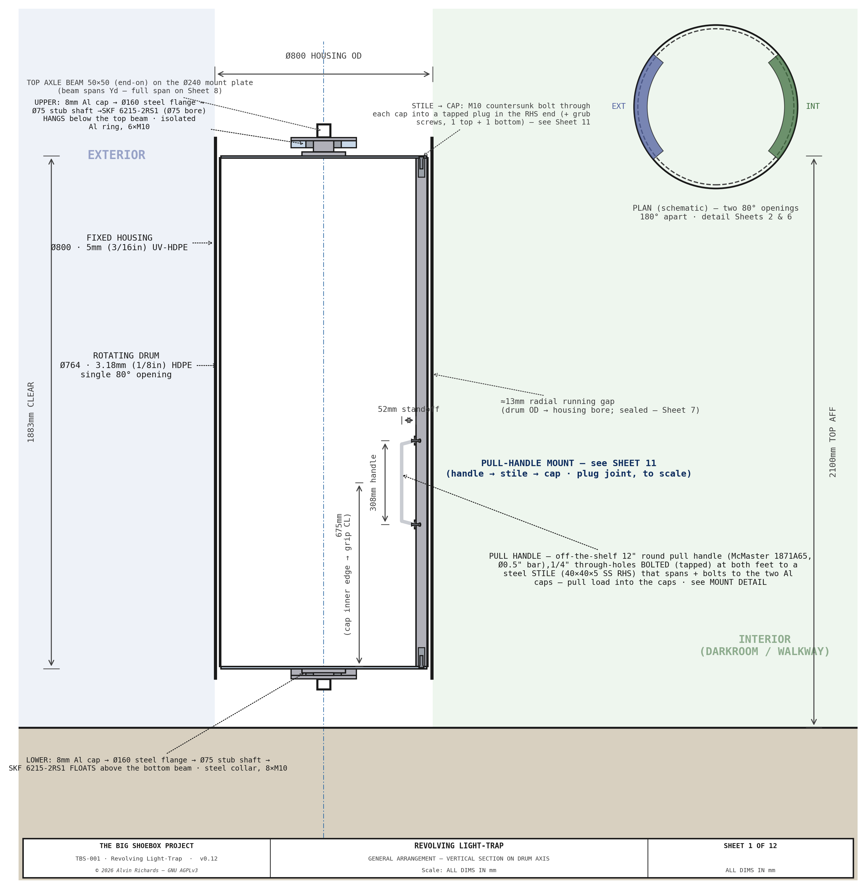
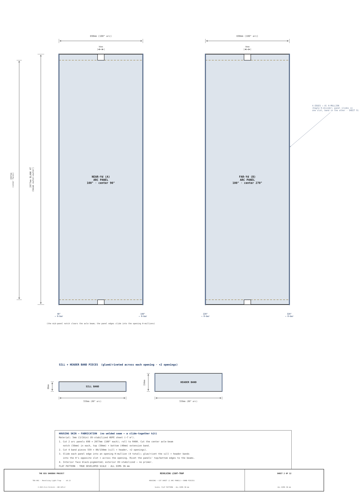
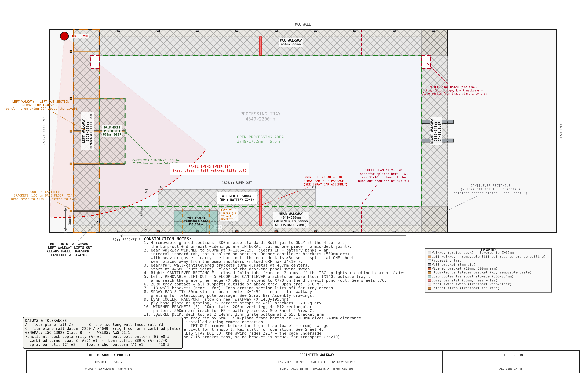

<!-- SPDX-License-Identifier: AGPL-3.0-only -->
<!-- © 2026 Alvin Richards -->
# Ventilation & Cooling

## 1. Purpose

TBS-001 requires active ventilation and cooling to maintain safe operator working conditions and acceptable chemistry coating temperatures inside a sealed steel container. This report consolidates the complete ventilation and cooling specification: thermal analysis, fan system, evaporative cooler, light-safe duct penetrations, shade canopy, and operating modes.

All ventilation and cooling components run at 12V DC from the solar/battery power system. See [Electrical Report](electrical-report.md) for circuit assignments and wiring.

---

## 2. Thermal Problem

A 20ft ISO steel container in direct Palm Springs summer sun (ambient 40–45°C, direct irradiance 1,000 W/m²) reaches interior temperatures of 65–75°C without intervention. Two constraints drive the cooling design:

| Constraint | Limit | Source |
|-----------|-------|--------|
| Operator safety | Interior < 40°C | OSHA heat illness prevention guidelines |
| Chemistry coating | Interior < 35°C | Cyanotype sensitizer application window |

Without any mitigation, the container is unusable in summer daytime. The system uses three complementary strategies to bring the interior within working range.

---

## 3. Cooling Strategy

| Method | Interior ΔT | Cost | Power | Required? |
|--------|------------|------|-------|-----------|
| 80% shade cloth canopy over container | −15 to −20°C | ~$300 | None | **Yes — always** |
| Scheduling (shoot before 09:00 / after 18:00 in summer) | −10 to −15°C effective | $0 | None | Recommended |
| 12V DC evaporative cooler (swamp cooler) | −10 to −15°C additional | ~$300 | 80W | **Yes — in temperatures above 30°C ambient** |

Combined (shade canopy + cooler + scheduling): interior temperature reaches 25–32°C — within operator working range.

> **Why evaporative cooling works in hot climates (e.g. Palm Springs):** Evaporative (swamp) cooling is most effective when ambient relative humidity is low. Palm Springs in summer averages 10–18% RH — optimal for this technology. At 15% RH and 42°C ambient, an evaporative cooler can reduce temperature by 15–18°C, bringing 42°C down to 24–27°C after the shade canopy's contribution. At the same conditions, a standard 9,000 BTU mini-split uses 900W vs. the evaporative cooler's 80W — an 11× power saving.

---

## 4. Ventilation Fans

For operator comfort during processing in warm conditions, but also to ensure there is fresh air exchange within the space.

Longitudinal section showing the cross-flow ventilation path: Fan A intake at the far end wall (low position), diagonal airflow through the container volume, Fan B exhaust at the cargo door panel (high position). Evaporative cooler intake duct on the pinhole wall.

**Sheet 1 — Container Ventilation Section**

| Parameter | Specification |
|-----------|---------|
| Fan diameter |  6" (150mm) |
| Airflow per fan |  ~200 CFM |
| Total airflow | ~400 CFM |
| Power draw (each) |  ~60W |
| Circuit fuse | 5A |
| Cost  | ~$60 |

### 4.1 Fan Positions

| Fan | Position | Mounting | Function |
|-----|----------|----------|----------|
| Fan A (intake) | Far end wall (X=5,893mm), low position | Flush-mounted in wall penetration | Fresh air intake — draws cooler air near floor level |
| Fan B (exhaust) | Hinged panel, far corner zone (Yd=2,287mm, Z=1,800mm) | Flush-mounted in 40mm corner zone panel | Exhaust humid air during processing and drying |

Both fans are 6" (150mm) diameter, 12V DC (AC Infinity S6 or equivalent). Fan bodies do not protrude beyond either panel face. Cross-flow ventilation runs diagonally: low intake at the far end → high exhaust at the cargo door end.

### 4.2 Fan A — Far End Wall Intake

Fan A is flush-mounted in a wall penetration at the far end wall (X=5,893mm), low position (Z=600mm AFF, Yd=75mm corner). The fan body sits inside a light-safe baffle duct (see §4.4) bolted to the interior face of the wall. A weatherproof louvre grille on the exterior face protects the penetration from rain and debris. The fan, duct, and grille are permanently installed — no removal is required for mode conversion or transport.

**Wiring:** Fan A's wire run routes from the fuse block along the ceiling cable trunking to the far end wall, then drops vertically to the fan. The entire run is inside the container — no flex cable or weatherproof connectors are needed.

### 4.3 Fan B — Panel-Mounted Exhaust

Fan B is mounted on the sliding hinged panel, which moves with the panel during mode conversion (300mm slide travel + 180° swing). The fan and baffle duct are interior-mounted (same as Fan A); a weatherproof louvre grille on the panel exterior face is the only external component. During operation, the cargo doors are open (personnel access is via the revolving light trap drum), so exhaust air passes through the grille and discharges directly into the open doorway.

**Wiring:** Fan B's wire run routes from the fuse block along the ceiling cable trunking to the fixed door frame, then crosses to the panel via a 1m coiled cable (16 AWG, 2-conductor, silicone-jacketed) with Deutsch DT 2-pin weatherproof connectors at each end. The coiled cable accommodates 300mm of panel slide travel plus 180° panel swing without binding. The fixed end anchors to the door frame top rail; the panel end anchors to the carriage beam. The service loop hangs in the ceiling zone above Z=2,200mm.

### 4.4 Light-Safe Baffle Ducts

Both fan penetrations include L-shaped offset baffles inside a duct stub to prevent light ingress while allowing unrestricted airflow:

- **Construction:** Black sheet metal, L-shaped offset — two 150mm × 150mm flat baffles offset 75mm inside a 300mm deep duct stub
- **Light path:** No straight line of sight from exterior to interior at any incidence angle
- **Airflow resistance:** Minimal — the L-path increases duct length by ~150mm but maintains full 150mm diameter cross-section at each turn

**Sheet 2 — Fan & Baffle Duct Assembly**
Detail views of the L-shaped light-safe baffle duct construction for both the 6" ventilation fans and the 8" cooler intake duct. Shows offset baffle geometry, duct stub dimensions, and light path verification.

The baffle design is identical for both fans. Fan A's baffle duct is fixed to the end wall interior; Fan B's baffle duct is fixed to the hinged panel interior. Both fans and ducts are fully interior-mounted — only the weatherproof louvre grille is on the exterior face.

---

## 5. Evaporative Cooler

### 5.1 Specification

| Parameter | Specification |
|-----------|--------------|
| Model | Portacool Jetstream 110 (12V DC version) or equivalent |
| Dimensions | ~600 × 350 × 800mm |
| Weight | ~20 kg dry |
| Power draw | ~80W at 12V DC |
| Airflow | ~300 CFM |
| Water consumption | ~3 liters/hour |
| Circuit | E (10A fuse, 14 AWG) |
| Water source | Dedicated 20-liter reservoir, refilled from Blue circuit IBC tote |

### 5.2 Light-Safe Cooler Intake

The cooler sits on the ground outside the container, adjacent to the pinhole wall. A short length of Ø200mm flexible insulated duct connects the cooler outlet to a wall penetration with light-safe baffles. This arrangement requires no permanent external mounting — the cooler is simply placed, connected, and removed each session.

| Parameter | Value |
|-----------|-------|
| Duct size | 200mm (8") — sized for ~300 CFM at low velocity |
| Penetration location | Pinhole wall (Yd=0 face) at X=1,000mm, Z=1,900mm |
| Flexible duct | Ø200mm insulated flex, ~1m length, aluminum foil jacket |
| Interior baffles | Two 200 × 200mm flat steel baffles, offset 100mm, inside a 300mm duct stub |
| Light path | Broken by offset baffles — no direct line of sight |
| Exterior coupling | Ø200mm duct collar on wall stub; flex duct secured with hose clamp |
| Exterior cap | Removable weatherproof cap on wall stub when cooler is not connected |

### 5.3 Transport Stowage

The cooler is stowed inside the container for transport. See [Equipment Layout Report](equipment-layout-report.md) §6.2 for the full stowage specification.

From the walkway design, the location of the cooler can be seen for transportation, secured by straps and D-rings.

| Parameter | Value |
|-----------|-------|
| Stowage zone | Near walkway wide section, X=1,200–1,800mm, Yd=0–500mm |
| Base plate | 12mm plywood, 600 × 350mm (load distribution) |
| Securing | 2 × 25mm ratchet straps to cantilever bracket arms |
| Clearance to panel transport envelope | 780mm (panel max X=420mm, cooler starts X=1,200mm) |

---

## 6. Shade Canopy

| Parameter | Specification |
|-----------|--------------|
| Material | 80% shade cloth, 20 × 10 ft |
| Frame | 1.5" EMT conduit + fittings |
| Installation | Erected over the container before solar noon |
| Temperature reduction | −15 to −20°C interior |
| Power requirement | None |
| Approximate cost | ~$200 (cloth $80 + frame $120) |

The shade canopy is the most effective single mitigation — it eliminates direct solar irradiance on the container roof and walls, reducing the primary heat source before any active cooling is applied. It is required at all deployments regardless of season.

---

## 7. Operating Modes

| Mode | Intake (Fan A) | Exhaust (Fan B) | Evap cooler | Shade |
|------|---------------|----------------|-------------|-------|
| Pre-cooling (before entry) | Full speed | Full speed | ON (30 min minimum) | Erected |
| Loading / coating (safelight) | Low speed | Low speed | ON | Erected |
| Exposure | OFF | OFF | OFF or standby | Erected |
| Development / washing | Low speed | Low speed | ON if > 30°C | Erected |
| Post-session ventilation | Full speed | Full speed | OFF | — |

**Minimum ventilation requirement for darkroom chemistry:** Cyanotype chemistry includes ammonium iron(III) oxalate and potassium ferricyanide, which produce low-level fumes during mixing and application. OSHA permissible exposure limits require forced ventilation during chemistry use. The 400 CFM combined airflow (2 × 200 CFM) provides approximately 16 air changes per hour in the container volume (~25 m³) — exceeding the OSHA minimum for darkroom operations.

---

## 8. Electrical Integration

| Circuit | Device | Fuse | Wire gauge | Run length |
|---------|--------|------|-----------|-----------|
| A | Ventilation fan — intake (6") | 5A | 16 AWG | ~3m |
| B | Ventilation fan — exhaust (panel-mounted) | 5A | 16 AWG | ~8m + flex connector |
| E | Evaporative cooler | 10A | 14 AWG | ~4m |

All circuits originate from the Blue Sea 5026 fuse block in the main electrical enclosure. See [Electrical Report](electrical-report.md) §10 for full wiring specification.

---

## 9. Parts List

| Item | Spec | Source | Est. cost |
|------|------|--------|-----------|
| 6" inline fans × 2 | 12V DC, ~200 CFM each | Amazon (AC Infinity S6) | ~$120 |
| Evaporative cooler | 12V DC, ~300 CFM | Portacool / Amazon | ~$280 |
| Shade canopy — 80% shade cloth | 20 × 10 ft | Amazon / Farm supply | ~$80 |
| Canopy frame | 1.5" EMT conduit + fittings | Home Depot | ~$120 |
| Baffle duct sheet metal (fans) | 22 ga galvanized, 2 × 300mm stubs | Local sheet metal / Home Depot | ~$30 |
| Baffle duct sheet metal (cooler) | 22 ga galvanized, 1 × 300mm stub, Ø200mm | Local sheet metal / Home Depot | ~$20 |
| 200mm insulated flex duct | Ø200mm × 1m, aluminum foil jacket | Home Depot / McMaster-Carr | ~$20 |
| Duct collar + hose clamp | Ø200mm, galvanized | Home Depot | ~$12 |
| Weatherproof duct cap | Ø200mm, removable | Home Depot | ~$8 |
| Deutsch DT 2-pin connectors | Fan B flex connector (×2 sets) | Waytek Wire (waytekwire.com) | ~$8 |
| 16 AWG silicone coiled cable | 1m, 2-conductor (Fan B flex) | Amazon / Waytek Wire | ~$15 |
| Ratchet straps, 25mm × 2 | Cooler stowage | Home Depot / Amazon | ~$12 |
| Plywood base plate | 12mm, 600 × 350mm (cooler stowage) | Lumber yard / Home Depot | ~$8 |
| **Ventilation & cooling total** | | | **~$733** |

---

## 10. Maintenance

| Interval | Task |
|----------|------|
| Before each session | Confirm Fan A and Fan B airflow (tissue deflection test at duct stubs) |
| Before each session | Check evaporative cooler reservoir level; refill from Blue circuit |
| Before each session | Inspect shade canopy for tears or collapsed frame sections |
| Monthly | Clean fan blades and baffle duct interiors (dust accumulation reduces airflow) |
| Monthly | Inspect Deutsch DT connectors at Fan B flex cable for corrosion |
| Every 6 months | Check cooler pad condition — replace if mineral buildup reduces airflow |
| Every 6 months | Inspect baffle duct welds for cracking or corrosion |
| Annually | Replace evaporative cooler pads regardless of condition |
| Annually | Inspect shade cloth for UV degradation; replace if shade factor drops below 70% |
| Before transport | Drain cooler reservoir completely; stow cooler per §5.3 |
| Before transport | Cap all exterior duct stubs to prevent rain ingress |

---

## 11. Source References

1. [AC Infinity CLOUDLINE S6](https://acinfinity.com/cloudline-s6-quiet-inline-fan-6-with-speed-controller/) — 6" inline duct fan specifications.
2. [Portacool Jetstream 110](https://www.portacool.com/) — 12V DC evaporative cooler specifications.
3. [OSHA Heat Illness Prevention](https://www.osha.gov/heat-exposure) — Workplace heat exposure guidelines and permissible limits.
4. [Electrical Report](electrical-report.md) — Circuit assignments (A, B, E), wiring specification, and fuse block layout.
5. [Hinged Panel Report](hinged-panel-report.md) — Panel corner zone construction and Fan B mounting.
6. [Equipment Layout Report](equipment-layout-report.md) — Evaporative cooler position and transport stowage specification.
7. [Operating Manual](operating-manual.md) — Ventilation and cooling operational procedures (Phase 1.6).

*© 2026 Alvin Richards — Released under [GNU AGPLv3](licensing.md)*
