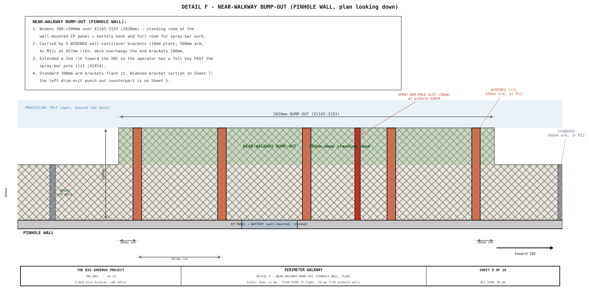

<!-- SPDX-License-Identifier: AGPL-3.0-only -->
<!-- © 2026 Alvin Richards -->
# Walkway System

## 1. Purpose

The perimeter walkway provides dry-foot operator access around all four sides of
the processing tray without wading through chemical solution. It serves four
access functions:

- **Near walkway** (pinhole wall side) — access to electrical panel, battery
  bank, tilt-swing adjusters, and valve manifold.
- **Far walkway** (film plane wall side) — access to film plane carriage clamps,
  rail end-stops, and far-side spray bar pole slot.
- **Left walkway** (cargo door end) — access to hinged light-trap panel latches
  and revolving drum. Removable for panel transport.
- **Right walkway** (IBC end) — access to IBC valves, filter skid, and pump
  manifold. Ceiling-hung to clear the IBC stack below.

All four sections share a common 80mm deck height (65mm bracket arm, L-angle, or
edge-beam ledge + 15mm grating) and 300mm standard width, creating a level perimeter walking
surface. The deck is lowered (from the original 100mm) so the film plane travels
above the in-place walkway — deck top Z=80mm clears the Z=100mm film-frame bottom
by 20mm. The cantilever bracket arm (Z=55–65mm) clears the 50mm processing-tray
rim by 5mm where it overhangs the tray.

The design enforces **zero processing tray contact** — all walkway supports are
either wall-mounted, ceiling-hung, or placed outside the tray footprint. This
prevents chemical contamination of walkway structures and avoids disrupting the
tray's watertight seal.

**Interactive 3D model** — the four removable grated sections, the wall-cantilevered near/far brackets (with exterior reinforcing plates + M12 through-bolts), the ceiling-hung right walkway on threaded-rod hangers, the removable left lift-out carried by the full-width steel edge beam on bolt-through wall seats, and the processing tray, inside a ghost of the container. Drag to orbit, scroll to zoom.

  

    <iframe title="TBS-001 Walkway Model" frameborder="0" allowfullscreen mozallowfullscreen="true" webkitallowfullscreen="true" allow="autoplay; fullscreen; xr-spatial-tracking" execution-while-out-of-viewport execution-while-not-rendered web-share src="https://sketchfab.com/models/96b3d0e5fc8b4fc18c528f64bda028bc/embed" style="position:absolute;top:0;left:0;width:100%;height:100%;border:0;"></iframe>
  

  
<a href="https://sketchfab.com/3d-models/tbs-001-walkway-model-96b3d0e5fc8b4fc18c528f64bda028bc?utm_medium=embed&utm_campaign=share-popup&utm_content=96b3d0e5fc8b4fc18c528f64bda028bc" target="_blank" rel="nofollow" style="font-weight: bold; color: #1CAAD9;">TBS-001 Walkway Model</a> by <a href="https://sketchfab.com/alvin91403?utm_medium=embed&utm_campaign=share-popup&utm_content=96b3d0e5fc8b4fc18c528f64bda028bc" target="_blank" rel="nofollow" style="font-weight: bold; color: #1CAAD9;">alvin91403</a> on <a href="https://sketchfab.com?utm_medium=embed&utm_campaign=share-popup&utm_content=96b3d0e5fc8b4fc18c528f64bda028bc" target="_blank" rel="nofollow" style="font-weight: bold; color: #1CAAD9;">Sketchfab</a>

---

## 2. System Specifications

| Parameter | Value |
|-----------|-------|
| Standard walkway width | 300mm |
| Deck height (floor to grate top) | 80mm |
| Grating thickness | 15mm press-locked galvanized steel (thin grate, lowered deck) |
| Grating bearing bars | 15×3mm at 34.2mm pitch |
| Bracket arm height | 65mm above finished floor |
| Bracket spacing (near/far) | 457mm (18") — aligned to container rib spacing |
| Container rib spacing | 457mm (18") — ISO standard corrugation pitch |
| Near walkway widened section | 500mm at X≈1155–2629mm |
| Open processing area | 3859×1662mm = 6.41 m² |
| Spray bar slit width | 30mm (near and far walkways) |
| Total walkway sections | 4 (all removable) |

---

## 3. Near and Far Walkways — Wall-Cantilevered

The near (pinhole wall, Yd=0) and far (film plane wall, Yd=2362mm) walkways run
the full length of the processing tray zone, from the left walkway butt joint at
X=470mm to the right walkway butt joint at X=4629mm — a span of 4159mm.

### 3.1 Cantilever Bracket Design

Each bracket is a three-piece welded 8mm steel plate assembly:

| Component | Dimensions | Function |
|-----------|-----------|----------|
| Vertical mounting plate | 8×150mm (height), flat against wall rib | Bolted to container corrugation rib interior face |
| Horizontal arm | 8mm plate, 300mm cantilever (500mm in widened zone) | Supports grating — top surface at Z=65mm |
| Triangular gusset | Right triangle, 70mm reach from wall | Braces arm from below; reach stops before tray rim at Yd=80mm |

**Attachment:** 3× M12 through-bolts per bracket in a triangular pattern,
passing through the full wall assembly: hex head → reinforcing plate (6mm) →
exterior panel (1.6mm Corten) → air gap → rib interior face (1.6mm) →
bracket vertical plate (8mm) → nut. Two lower bolts at Z=35mm straddle
the 8mm gusset plate at ±27mm from the plate centerline in X (centered
between plate edge and gusset). One upper bolt at Z=120mm (above grating deck at Z=80,
30mm from plate top) is centered on the gusset centerline. The container
corrugation ribs are hollow — each bolt bridges the air gap inside the rib.
A 6mm reinforcing plate (100×180mm) is welded to the exterior panel face to
provide a bearing surface for the bolt heads and washers. See View B for the bolt pattern detail.

**Spacing:** Brackets mount at every container rib — 457mm (18") centers.

### 3.2 Near Walkway Widened Section

The near walkway widens from 300mm to 500mm between X≈1155mm and X≈2629mm
(1474mm length), extending past the spray bar slit to the next rib position.
This widened section provides additional standing room in front of the
electrical panel (EP, X=1600–1900mm), battery bank (X=1810–2310mm), and
through the spray bar slit zone (X≈2400mm). These wall-mounted equipment
items require front access for operation and maintenance, and the wider
platform gives the operator full-width standing room during spray bar passes.

Four brackets in this zone (at X≈1156mm, X≈1612mm, X≈2070mm, and
X≈2526mm) use a heavier design to support the 500mm cantilever arm. The
bracket positions align to container corrugation ribs at 457mm centers.
Extending the widened zone past the slit ensures 500mm-arm brackets support
the grating on both sides of the slit, eliminating unsupported overhang.

| Parameter | Standard bracket | Widened bracket |
|-----------|-----------------|-----------------|
| Plate thickness | 8mm | 10mm |
| Vertical leg height | 150mm | 200mm |
| Arm reach | 300mm | 500mm |
| Gusset reach | 70mm | 70mm (tray rim constrained) |
| Bolt pattern | 3x M12 triangular (2+1) | 4x M12 rectangular (2+2) |
| Reinforcing plate | 100x180x6mm | 120x220x6mm |

The gusset reach remains 70mm on both bracket types — limited by the processing
tray rim at Yd=80mm. The widened bracket compensates with heavier plate, taller
vertical leg for greater wall engagement, and the additional bolt for higher
moment capacity.

**Attachment:** 4× M12 through-bolts per bracket in a rectangular pattern,
passing through the full wall assembly: hex head → reinforcing plate (6mm) →
exterior panel (1.6mm Corten) → air gap → rib interior face (1.6mm) →
bracket vertical plate (10mm) → nut. Two lower bolts at Z=35mm straddle
the 10mm gusset plate at ±32mm from the plate centerline in X (centered
between plate edge and gusset). Two upper bolts at Z=160mm (above grating
deck at Z=80, 60mm from plate top) at the same ±32mm X offset. The
container corrugation ribs are hollow — each bolt bridges the air gap inside
the rib. A 6mm reinforcing plate (120×220mm) is welded to the exterior panel
face to provide a bearing surface for the bolt heads and washers. See Sheet 7,
View B for the bolt pattern detail.

**Width transition:** At the two transition brackets (X≈1,156 and X≈2,526),
the grating changes from 300mm to 500mm width (or vice versa). Both the
narrow and wide grating sections rest on the same 500mm bracket arm. A
40×500×5mm flat bearing plate is welded to the bracket arm top surface at each
transition, providing a wider landing surface so both grating sections have
adequate bearing. The narrow section occupies the inner 300mm of the plate;
the wide section occupies the full 500mm. M saddle clips retain each grating
section independently on either side of the transition.

### 3.3 Spray Bar Slit

A 30mm wide slot is cut through both near and far walkway grating at the beam
center X position, providing clearance for the spray bar telescoping pole to
pass through the walkway during processing operations.

On both walkways, the slit extends from the inner walkway edge inward only to
the processing tray lip — not the full walkway depth. The remaining grating
between the tray lip and the wall stays solid, maintaining structural
continuity across the slit.

| Walkway | Inner edge (Yd) | Tray lip (Yd) | Slit depth | Solid remaining |
|---------|----------------|---------------|-----------|----------------|
| Near (widened) | 500mm | 80mm | 420mm | 80mm |
| Far (standard) | 2062mm | 2280mm | 218mm | 82mm |

See [Processing Tray & Spray Bar](processing-tray-and-spray-bar.md) for pole
assembly details.

---

## 4. Right Walkway — Ceiling-Hung

The right walkway at the IBC end (X=4329–4629mm) cannot use wall-cantilevered
brackets because the IBC stack (X=4674–5893mm) occupies the floor below. Instead,
the walkway is suspended from the container ceiling by threaded rod hangers.

### 4.1 Bearer Angles

Two 25×25×5mm steel L-angle bearers run the full container width (2362mm along
Yd) at X=4329mm and X=4629mm. The 300mm grating spans between these bearers.
Near and far ends of the bearers bear on the adjacent near/far walkway bracket
arm structures at the butt joints.

### 4.2 Ceiling Hangers

| Parameter | Value |
|-----------|-------|
| Hanger rod | M10 threaded rod |
| Rod length | 2313mm (ceiling to bearer top) |
| Number of hanger pairs | 5 |
| First pair position | Yd=320mm |
| Remaining pairs spacing | 457mm centers |
| All hangers at | Yd ≤ 2057mm (clear of optical cone) |
| Ceiling anchor plates | 120×90×6mm steel — an INSIDE plate (rod hangs from it) + an OUTSIDE roof-exterior reinforcing plate, sandwiching the roof |
| Ceiling attachment | 4× M12 through-bolts per hanger (2×2 pattern), drawing the inside/outside plates together through the roof — same 4-bolt anchor as the wall stays / cantilever brackets; sealed penetrations |

Each hanger pair consists of two M10 rods — one at each bearer (X=4329mm and
X=4629mm). The rod passes through the horizontal flange of the L-angle bearer
with a nut and washer above and below the flange, then extends up to the **inside
ceiling anchor plate**. Each hanger is anchored through the roof with a sandwiched
plate pair — the inside plate plus an **outside roof-exterior reinforcing plate** —
drawn together by **4× M12 through-bolts** (the same 4-bolt anchor pattern used for
the wall stays and the wall-cantilever brackets), so the hanger load reacts into the
roof through a plate on each side rather than a single interior plate.

### 4.3 Design Rationale

The ceiling-hung design achieves three goals:

1. **Zero floor contact** — clears the IBC stack entirely; no legs or supports
   on the container floor in the IBC zone.
2. **Zero tray contact** — the walkway floats above the processing tray.
3. **Level deck** — 80mm deck height matches all four walkway sections.

---

## 5. Left Walkway — Removable Lift-Out

The left walkway at the cargo door end (X=170–470mm) cannot use wall-cantilevered
brackets because the hinged light-trap panel occupies the end wall and slides
~880mm inward for transport mode. Its **inner edge (X=470mm) sits over the
processing tray**, so it cannot be supported from below either. The left walkway
is therefore a removable lift-out section whose inner edge is carried by a
**full-width steel edge beam simply supported wall-to-wall on bolt-through wall
seats** — the same load path as the IBC platform beams, not a cantilever.

### 5.1 Support System

| Component | Specification | Position |
|-----------|--------------|----------|
| Inner-edge edge beam | 40×40×3mm **steel** SHS, full width 2362mm | X=470mm, spans wall-to-wall (Yd 0→2362), Z52–92 (top at Z≈92mm) |
| Wall-seat bracket (×2) | 6mm **drop-in pocket** (floor piece + 2 triangular gusset sides) on an interior mounting plate + matching exterior plate (both 100×135×6mm) + **4× M12 through-bolts at the plate corners** (clear of the pocket), each end | Near (Yd≈0) and far (Yd≈2362) container walls at X=470mm |
| Floor-standing support legs | 25×25×3mm aluminum SHS, 3 legs | X=140mm (on bare floor outside tray), 440mm spacing |
| Foot plates | 60×60×3mm aluminum with rubber pad | At base of each floor leg |
| Bearing strip | 15mm aluminum flat bar | On processing tray rim at X=170mm (removable) |

The inner edge at X=470mm is the load-critical line (it overhangs the tray). It is
carried by a **steel 40×40×3mm SHS edge beam** standing in the envelope
**Z≈52–92mm**. The 40mm section (not 50mm) and the Z52 underside are deliberate: the
beam runs the full container width and **crosses the tray's near and far perimeter
rims** (Z0–50, at Yd≈80 and 2280), so its bottom must sit above Z50 — Z52 clears the
rim by 2mm, the bath (Z42) by 10mm, and the film-frame bottom (Z=100mm) by 8mm, and
keeps all load on the wall seats (the thin SS tray rim carries nothing). The beam
stands ~12mm proud of the Z=80mm deck, so it doubles as a **toe-board / safety
kerb**. The grating's inner edge rests on a Z65 ledge along the beam and is located
laterally by the proud kerb (no fasteners, so it lifts straight out).

The edge beam is **simply supported wall-to-wall** on a seat bracket bolted through
the corrugated container wall at each end — a 6mm **drop-in pocket** (floor piece +
two triangular gusset sides) welded to an interior mounting plate, a **matching
exterior plate**, and **4× M12 through-bolts at the plate corners** (clear of the
pocket so the nuts are reachable — the beam end drops into the pocket where the old
3-bolt pattern would have blocked the nuts), mirroring the IBC wall-seat brackets. An operator's load travels grating →
edge beam → wall as a clean end reaction, **not** a cantilever moment dumped on a
bracket-arm tip. Because the seats sit at X=470mm — inside the panel's transport-
slide path — the **edge beam and the interior pocket/mounting plates are demountable**
(a few bolts) and lift out with the walkway before the panel slides; the through-bolts
and exterior plates stay on the wall. The full-width beam also picks up the
near/far walkways' door-end grate edges at X=470mm, so no separate X=470mm
cantilever bracket is needed.

**Structural check** (≈1kN operator at midspan, span = full width 2362mm): for the
40×40×3 SHS (I ≈ 1.02×10⁵mm⁴, Z ≈ 5.1×10³mm³) bending ≈116MPa vs ~250MPa yield →
**FoS ≈2.2**; deflection ≈13mm = **L/175** (springy but serviceable for occasional
single-person access — a midspan stiffener is the fallback if bounce is an issue);
beam mass ≈8.2kg (liftable). Each wall reaction ≈0.5kN — the IBC-style
wall seats carry ~50× that in the tote application. This is a hand-check, not a
signed analysis. See the [edge-beam design spec](https://github.com/alvinr/tbs/blob/main/docs/superpowers/specs/2026-06-05-left-walkway-edge-beam-support.md)
for the full rationale and the ruled-out alternatives (rod suspension fouls the
film plane).

### 5.2 Drum-Exit Punch-Out (rev 8)

The operator steps out of the revolving-door light lock at its interior face
(X≈450mm), but the standard 300mm walkway ends at X=470mm — leaving only ~20mm of
landing in front of the drum opening, with the processing-tray basin immediately
beyond. The left walkway is therefore **deepened to 600mm (X=170–770mm) over the
drum-opening span (Yd 800–1560mm)** — a ~600 × 760mm landing centered on the exit
(the same approach as the near-walkway widened section on the pinhole side).

| Parameter | Value | Constant |
|-----------|-------|----------|
| Punch-out depth | 600mm (vs 300mm) | `WALKWAY_LEFT_WIDE_W` |
| Punch-out Yd span | 800–1560mm | `WALKWAY_LEFT_WIDE_YD_L/_YD_R` |
| Deck height | Z=65–80mm (grating, as elsewhere) | `WALKWAY_H` |

**Optical clearance.** The punch-out reaches X=770mm — inside the active image
zone (X≥150mm) — so it was checked against the optical cone. At the drum-exit depth
(Yd 800–1560mm) the cone's left boundary lies at **X≈914–1535mm** (the cone narrows
toward the pinhole at X=2399mm), so the punch-out is entirely **left of the cone**:
every pinhole sight line through it lands at X≤37mm on the film plane, ~113mm clear
of the image edge. Confirmed by `generate_line_of_sight.py` (no equipment intersects
the cone).

**Support.** The 600mm section overhangs ~300mm past the X=470mm edge beam, out
over the processing tray. Because a floor leg cannot stand in the tray basin, the
overhang is carried by a small **cantilever sub-frame**: two 50×50×3mm aluminum RHS
cantilever arms bolted to the edge beam at the punch-out's Yd ends (Yd=800 and
1560mm), tied at their tips by an outer trim bearer at X≈770mm. The sub-frame
cantilevers entirely over the tray with **zero tray contact**, and lifts out with
the rest of the left walkway for transport. See **walkway Sheet 9 (Detail E)** for
the attachment plan.

On the cargo door side (X=170mm), the grating rests on a 15mm aluminum flat-bar
bearing strip placed on top of the processing tray rim (rim top at Z=50mm, strip
top at Z=65mm). Below the bearing strip, three floor-standing support legs at
X=140mm provide vertical support. These legs stand on bare floor outside the
processing tray footprint — zero tray contact.

**Sheet 9 — Detail E: Drum-Exit Punch-Out Support (plan).** How the deeper
landing attaches and is supported — the cantilever sub-frame off the
X=470mm edge beam, the outer trim bearer at X=770mm, and the zero-tray-contact
overhang.

### 5.3 Wall-Seat Bracket Detail

The edge beam lands in a **seat bracket bolted through the container wall** at each
end (the IBC wall-seat load path). The beam is located in X and Z by the seat
pocket — no separate anti-slip restraint is needed.

| Component | Specification |
|-----------|--------------|
| Interior mounting plate + pocket | 100×135×6mm steel plate carrying a **drop-in pocket** — a floor piece + two triangular gusset sides (all 6mm) — the beam end drops onto the floor between the gussets |
| Exterior backing plate | **100×135×6mm** steel (matches the interior plate) — spreads the bolt reaction across the corrugated wall |
| Through-bolts | **4× M12×80mm** grade 8.8 at the **plate corners** — clear of the pocket so the nuts are reachable, into the wall rib |
| End reaction | ≈0.5kN per seat (1kN operator at midspan) |

The beam end drops into the seat-plate pocket — located in X and Z, free to lift
straight out. **Demountable for transport:** the seat plate is on a few bolts and
comes off with the beam before the panel slides; the through-bolts and exterior
backing plate remain on the wall. No tools beyond a wrench for the 3 bolts.

### 5.4 Panel Transport Clearance

| Parameter | Value |
|-----------|-------|
| Panel slide travel (B2) | 880mm |
| Panel front face when slid | X≈1000mm |
| Butt joint / edge beam / near-far walkway start | X=470mm |
| Panel reach past butt joint | ≈530mm (into the vacated left-walkway zone) |
| Panel bottom edge | Z=80mm (above the 50mm tray rim) |

The left walkway grating, **edge beam, interior seat plates**, support legs, and
bearing strip must all be removed before the hinged panel can slide to transport
position (the exterior backing plates and through-bolts stay on the wall). The
panel slides 880mm — its front face reaches X≈1000mm, **sweeping ≈530mm past the
X=470mm butt joint through the zone the removable left walkway has vacated**. The
relevant standing clearance is vertical: the panel bottom edge (Z=80mm) rides above
the tray rim (Z=50mm).

---

## 6. Corner Joints

All four corners use butt joints (not miter joints). The near and far walkway
grating sections terminate at the butt joint lines, and the left and right
walkway grating sections rest on or abut the near/far bracket arms at these
intersections.

| Corner | Butt joint X | Design |
|--------|-------------|--------|
| Near-left / Far-left | X=470mm | Left walkway grating bolts to the full-width edge beam |
| Near-right / Far-right | X=4629mm | Right walkway grating abuts near/far grating |

Butt joints are used rather than miters for two reasons:

1. **Panel clearance** — near/far walkways start at X=470mm, entirely past the
   panel transport envelope (X ≤ 420mm), so only the left walkway needs removal
   for transport mode.
2. **Simplicity** — each grating section lifts off independently without
   affecting adjacent sections.

---

## 7. Evaporative Cooler Transport Stowage

During transport, the evaporative cooler (600×350mm, ~20kg dry) is stowed on the
near walkway grating at X=1450–2050mm, Yd=0–350mm — in the widened section, moved
deeper (rev10) so it clears the panel swing sweep (which reaches X≈1395 in this
near-walkway zone). The cooler sits on a 12mm plywood base plate that distributes
load across the grating and prevents the housing from catching in grate openings.
Two 25mm ratchet straps loop over the cooler and hook to near walkway cantilever
bracket arms at X≈1550mm and X≈1950mm.

The 350mm cooler depth slightly exceeds the 300mm walkway width — the cooler
overhangs 50mm into the processing tray zone. This is acceptable because the
tray is drained and empty during transport.

---

## 8. Grating Specification

All four walkway sections use the same grating:

| Parameter | Value |
|-----------|-------|
| Type | Press-locked galvanized steel grating |
| Thickness | 25mm |
| Bearing bar size | 30×3mm |
| Bearing bar pitch | 34.2mm |
| Cross bar type | Twist-locked at mid-height |
| Surface finish | Hot-dip galvanized |

### 8.1 Grating Retention by Walkway Section

| Walkway | Retention Method | Attachment Point | Removal |
|---------|-----------------|------------------|---------|
| Near (pinhole wall) | M saddle clips + TEK screws | Bracket arm top surface | Unscrew TEK screws, lift grating |
| Far (film plane wall) | M saddle clips + TEK screws | Bracket arm top surface | Unscrew TEK screws, lift grating |
| Right (IBC end) | M saddle clips + TEK screws | L-angle bearer horizontal leg | Unscrew TEK screws, lift grating |
| Left (cargo door) | Gravity + proud kerb | Edge beam (X=470) + bearing strip (X=170) | Lift straight up — no fasteners |

**Near and far walkways** use M saddle clips that straddle two grating bearing
bars. Each clip is secured to the bracket arm with a self-drilling TEK screw
through the clip's center hole. Clips are spaced at every other bracket
(~914mm centers).

**Right walkway** uses the same M saddle clip design, but the TEK screws drive
into the horizontal leg of the 25×25×5mm L-angle bearers rather than bracket
arms.

**Left walkway** uses gravity retention only. The grating sits on twin support
lines (edge beam at X=470mm and bearing strip at X=170mm) and is held in
position laterally by the edge beam's **proud kerb**, which stands ~12mm above the
deck and stops the grating sliding tray-ward. The twin support lines prevent
rocking. No fasteners are used because the left walkway must be removed quickly
for hinged panel transport mode — lift straight up and carry out.

---

## 9. Load Considerations

The walkway must support an operator (~100kg) plus portable equipment. The
critical load case is the widened near walkway section (500mm cantilever) with an
operator standing at the outer edge.

The standard 8mm steel plate gusset brackets at 457mm centers provide substantial
structural capacity. Each standard bracket is a rigid triangle (vertical leg +
horizontal arm + gusset) with 3x M12 through-bolts to the container rib. The four
widened brackets (X≈1,156, 1,612, 2,070, 2,526) use 10mm plate with 4x M12
rectangular bolt patterns and 200mm vertical legs for the increased moment
demand of the 500mm cantilever arm.

The ceiling-hung right walkway is the most compliant section. Five pairs of M10
threaded rod hangers (2313mm free length) support the two bearer angles and
grating. Rod deflection under load is proportional to length — the 2.3m rods
will deflect more than the short cantilever brackets. However, the 300mm
walkway width limits the moment arm, and the 5-pair hanger arrangement
distributes load across multiple rods.

---

## 10. Parts List

| # | Item | Specification | Qty | Est. Cost |
|---|------|--------------|-----|-----------|
| 1 | Press-locked galvanized steel grating | 15mm thick, 15×3mm bearing bars at 34.2mm pitch | ~6.5 m² (4 sections) | $350–$550 |
| 2 | Cantilever bracket — standard (near/far) | 8mm steel plate: 150mm vert leg + 300mm arm + 70mm gusset, welded | 14 (5 near + 9 far at 457mm centers) | $420–$700 |
| 3 | Cantilever bracket — widened (near) | 10mm steel plate: 200mm vert leg + 500mm arm + 70mm gusset, welded | 4 (EP/battery/slit zone) | $160–$280 |
| 4 | M12×80mm through-bolt kit | Hex bolt + 2× washers + nut, grade 8.8 | 58 (3 per std bracket + 4 per widened) | $87–$145 |
| 5 | Reinforcing plate (exterior) | 6mm steel: 100×180mm std (×14) + 120×220mm widened (×4) | 18 | $75–$130 |
| 6 | Transition bearing plate | 40×500×5mm flat bar, welded to bracket arm top at width transitions | 2 | $5–$10 |
| 7 | Bearer angle (right walkway) | 25×25×5mm steel L-angle, 2362mm long | 2 | $40–$70 |
| 8 | M10 threaded rod | 2313mm length (ceiling to bearer) | 10 (5 pairs) | $50–$80 |
| 9 | Ceiling bracket plate | 100×60×6mm steel | 10 | $30–$50 |
| 10 | M10 bolt kit (ceiling) | Through-bolt + nut + washer (ceiling attachment) | 20 (2 per plate) | $20–$35 |
| 11 | M10 nut + washer set (bearer) | Nut + washer above and below bearer flange, per rod | 20 sets | $15–$25 |
| 12 | Edge beam (left walkway inner edge) | 40×40×3mm **steel** SHS, 2362mm long (full width) | 1 | $35–$60 |
| 12a | Wall-seat bracket (left edge beam) | 6mm drop-in pocket (floor + 2 triangular gussets) on a 100×135×6mm interior mounting plate + matching 100×135×6mm exterior plate, each end | 2 | $30–$55 |
| 12b | M12×80mm through-bolt kit (wall seats) | Hex bolt + 2× washers + nut, grade 8.8 | 8 (4 per seat) | $9–$15 |
| 13 | Floor support leg | 25×25×3mm aluminum SHS, 65mm tall | 3 | $10–$20 |
| 14 | Foot plate | 60×60×3mm aluminum + 2mm rubber pad | 3 | $10–$15 |
| 15 | Bearing strip | 15mm aluminum flat bar, ~2362mm long | 1 | $15–$25 |
| 17 | Grating clips | Removable spring clips, stainless | ~30 | $30–$50 |
| 18 | Plywood base plate (evap cooler stowage) | 12mm plywood, 600×350mm | 1 | $5–$10 |
| 19 | Ratchet strap (evap cooler) | 25mm×3m, 500kg WLL | 2 | $15–$25 |
| | **Total** | | | **$1,460–$2,425** |

---

## 11. Maintenance

| Interval | Task |
|----------|------|
| Before each session | Inspect all grating clips are seated; test left walkway lift-out for freedom of movement |
| Before each session | Check edge-beam wall-seat bolts are tight; beam seated fully in both pockets |
| Monthly | Inspect cantilever bracket bolts for tightness (3× M12 std, 4× M12 widened) |
| Monthly | Check ceiling hanger nuts — ensure double-nut lock on bearer flange side |
| Monthly | Inspect grating for corrosion, damaged bearing bars, or bent cross bars |
| Quarterly | Inspect reinforcing plates (exterior) for corrosion — touch up paint if needed |
| Quarterly | Check right walkway hanger rods for straightness and thread condition |
| Before transport | Remove left walkway: lift grating, remove bearing strip and floor legs, unbolt edge beam + interior seat plates (backing plates stay on wall) |
| Before transport | Verify evap cooler ratchet straps to bracket arms; check anti-slide cleats |
| After transport | Reinstall left walkway in reverse order; check all sections for level deck |

---

## 12. Source References

1. [ISO 668:2020](https://www.iso.org/standard/76912.html) — Series 1 freight containers: Classification, dimensions and ratings.
   Container rib spacing 457mm (18").
2. [ANSI/NAAMM MBG 531](https://www.naamm.org/division/publications/8) — Metal bar grating manual. Press-locked grating design.
3. [AS 1657-2018](https://www.standards.org.au/standards-catalogue/sa-snz/building/sf-013/as--1657-colon-2018) — Fixed platforms, walkways, stairways and ladders: Design,
   construction and installation. 300mm minimum clear width for walkways.
4. [Shurflo 2088 Series datasheet](https://www.shurflo.com/products/2088-series) — Pump dimensions for manifold access clearance.
5. [Equipment Layout Report](equipment-layout-report.md) — Component positions
   and access requirements.
6. [Processing Tray & Spray Bar Report](processing-tray-and-spray-bar.md) — Tray
   dimensions, rim height, spray bar slit requirements.
7. [Hinged Panel Report](hinged-panel-report.md) — Panel transport envelope,
   slide travel, floor gap.
8. [Light Trap Selection Report](light-trap-selection.md) — Panel and drum
   dimensions at cargo door end.
9. [IBC Stacking Report](ibc-stacking-report.md) — IBC stack dimensions and
   floor zone clearance requirements.
   
   *© 2026 Alvin Richards — Released under [GNU AGPLv3](licensing.md)*

