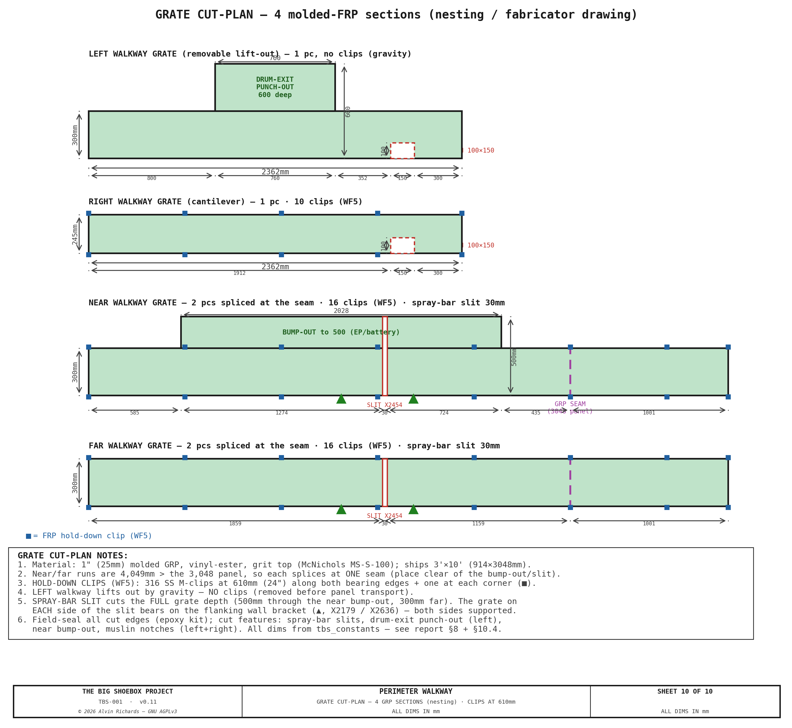

<!-- SPDX-License-Identifier: AGPL-3.0-only -->
<!-- © 2026 Alvin Richards -->
# Walkway System

## 1. Purpose

The perimeter walkway provides dry-foot operator access around all four sides of
the processing tray without wading through chemical solution. It serves four
access functions:

- **Near walkway** (pinhole wall side) — access to electrical panel, battery
  bank, spray-bar, tilt-swing adjusters, and valve manifold.
- **Far walkway** (film plane wall side) — access to film plane carriage clamps,
  rail end-stops, and far-side spray bar pole slot.
- **Left walkway** (cargo door end) — access to hinged light-trap panel latches
  and revolving drum. Removable for panel transport.
- **Right walkway** (IBC end) — access to IBC valves, filter skid, and pump
  manifold. Carried on a cantilever rectangle off the IBC frame to clear the IBC stack below.

All four sections share a common 140mm deck height (115mm bracket arm, L-angle, or
floor-leg arm + 25mm grating) and 300mm standard width, creating a level perimeter walking
surface. There are two sections that _punch out_ to allows easier access of the lightrap and around the battery stack.

The design enforces **zero processing tray contact** — all walkway supports are
either wall-mounted, carried on the cantilever rectangle off the IBC frame, or placed outside the tray footprint. This
prevents chemical contamination of walkway structures and avoids disrupting the
tray's watertight seal.

<!-- brochure:skip -->
**Interactive 3D model** — the four removable grated sections, the wall-cantilevered near/far brackets (with exterior reinforcing plates + M12 through-bolts), the right walkway on its cantilever rectangle (closed 2×1×0.120in (50.8×25.4mm) frame on 2 center arms off the IBC frame, with combined corner plates shared with the bottom film rail), the removable left lift-out grate on 5 floor-leg cantilever brackets (posts on bare floor outside the tray, arms cantilevering over it), and the processing tray, inside a ghost of the container. Drag to orbit, scroll to zoom.

  

    <iframe title="TBS-001 Walkway Model" frameborder="0" allowfullscreen mozallowfullscreen="true" webkitallowfullscreen="true" allow="autoplay; fullscreen; xr-spatial-tracking" execution-while-out-of-viewport execution-while-not-rendered web-share src="https://sketchfab.com/models/96b3d0e5fc8b4fc18c528f64bda028bc/embed" style="position:absolute;top:0;left:0;width:100%;height:100%;border:0;"></iframe>
  

  
<a href="https://sketchfab.com/3d-models/tbs-001-walkway-model-96b3d0e5fc8b4fc18c528f64bda028bc?utm_medium=embed&utm_campaign=share-popup&utm_content=96b3d0e5fc8b4fc18c528f64bda028bc" target="_blank" rel="nofollow" style="font-weight: bold; color: #1CAAD9;">TBS-001 Walkway Model</a> by <a href="https://sketchfab.com/alvin91403?utm_medium=embed&utm_campaign=share-popup&utm_content=96b3d0e5fc8b4fc18c528f64bda028bc" target="_blank" rel="nofollow" style="font-weight: bold; color: #1CAAD9;">alvin91403</a> on <a href="https://sketchfab.com?utm_medium=embed&utm_campaign=share-popup&utm_content=96b3d0e5fc8b4fc18c528f64bda028bc" target="_blank" rel="nofollow" style="font-weight: bold; color: #1CAAD9;">Sketchfab</a>

<!-- brochure:endskip -->

---

## 2. System Specifications

| Parameter | Value |
|-----------|-------|
| Standard walkway width | 300mm |
| Deck height (floor to grate top) | 140mm (raised to clear the floor-level spray bar) |
| Grating | 1" (25mm) molded GRP (fiberglass), vinyl-ester, grit top — McNichols MS-S-100, the thinnest molded FRP made (15mm doesn't exist); corrosion-proof in the chemistry zone |
| Grating bearing bars | 15×3mm at 34.2mm pitch |
| Bracket arm height | 115mm above finished floor |
| Bracket spacing (near/far) | 457mm (18") — aligned to container rib spacing |
| Container rib spacing | 457mm (18") — ISO standard corrugation pitch |
| Near walkway widened section | <!-- BEGIN fact:walkway_near_wide_w_mm -->500<!-- END fact:walkway_near_wide_w_mm -->mm at X≈1,055–3,083mm (5 widened brackets) |
| Open processing area | <!-- BEGIN fact:spray_beam_span_mm -->4,289<!-- END fact:spray_beam_span_mm -->×1,762mm = 6.80 m² |
| Spray bar slit width | 30mm (near and far walkways) |
| Total walkway sections | 4 (all removable) |

---

## 3. Near and Far Walkways — Wall-Cantilevered

The near (pinhole wall) and far (film plane wall) walkways run
the full length of the processing tray zone, from the left walkway butt joint at
with the left and right walkways.

### 3.1 Cantilever Bracket Design

Each bracket is a welded assembly — an 8mm steel plate (vertical mounting leg + gusset) with a
**steel tube arm** welded on. The arm was redesigned to the US IBC/OSHA basis (§9): the original
8mm-plate arm yielded at ~25 lbf, so the arm is now a **2×1×0.120in tube** (standard) that carries
the 300 lbf tip load at SF 2.1.

| Component | Dimensions | Function |
|-----------|-----------|----------|
| Vertical mounting plate | 8×180mm (height), flat against wall rib | Bolted to container corrugation rib interior face |
| Horizontal arm | **2×1×0.120in steel tube** (50.8×25.4), 300mm cantilever (**3×1** in the widened zone) | Supports grating; sized to IBC/OSHA (§9) |
| Triangular gusset | Right triangle, 70mm reach from wall | Braces the arm root; reach stops before tray rim |

**Attachment:** 3× M12 through-bolts per bracket in a triangular pattern,
passing through the full wall assembly: hex head → reinforcing plate (6mm) →
exterior panel (1.6mm Corten) → air gap → rib interior face (1.6mm) →
bracket vertical plate (8mm) → nut. Two lower bolts straddle
the 8mm gusset plate at ±27mm from the plate centerline in X (centered
between plate edge and gusset). One upper bolt (just above the bracket
arm, near the top of the mounting plate) is centered on the gusset
centerline. The container
corrugation ribs are hollow — each bolt bridges the air gap inside the rib.
A 6mm reinforcing plate (100×180mm) is welded to the exterior panel face to
provide a bearing surface for the bolt heads and washers. See View B for the bolt pattern detail.

**Spacing:** Brackets mount at every container rib — 457mm (18") centers.

### 3.2 Near Walkway Widened Section

The near walkway widens from 300mm to 500mm, extending past the spray bar slit to the next rib position.
This widened section provides additional standing room in front of the
electrical panel, battery bank, and
through the spray bar slit zone. These wall-mounted equipment
items require front access for operation and maintenance, and the wider
platform gives the operator full-width standing room during spray bar passes.

Five brackets in this zone use a heavier design to support the 500mm cantilever arm. The
bracket positions align to container corrugation ribs.
Extending the widened zone past the slit ensures 500mm-arm brackets support
the grating on both sides of the slit, eliminating unsupported overhang.

**Sheet 9 — Detail F: Near-Walkway Bump-Out (pinhole wall, plan).** The 500mm-deep standing
band over X1,055–3,083, its 5 widened wall-cantilever brackets on the ribs, the 100mm deck
overhang past each end bracket, and the spray-bar pole slit at the pinhole (X2,454) — the
pinhole-side counterpart to the left drum-exit punch-out (Sheet 5).

| Parameter | Standard bracket | Widened bracket |
|-----------|-----------------|-----------------|
| Plate thickness (leg + gusset) | 8mm | 10mm |
| Vertical leg height | 180mm | 200mm |
| Arm section | 2×1×0.120in tube (SF 2.1) | 3×1×0.120in tube (SF 1.83, defl-governed) |
| Arm reach | 300mm | 500mm |
| Gusset reach | 70mm | 70mm (tray rim constrained) |
| Bolt pattern | 3x M12 triangular (2+1) | 4x M12 rectangular (2+2) |
| Reinforcing plate | 100x180x6mm | 120x200x6mm |

The gusset reach remains 70mm on both bracket types — limited by the processing
tray rim. The widened bracket compensates with heavier plate, taller
vertical leg for greater wall engagement, and the additional bolt for higher
moment capacity.

**Attachment:** 4× M12 through-bolts per bracket in a rectangular pattern,
passing through the full wall assembly: hex head → reinforcing plate (6mm) →
exterior panel (1.6mm Corten) → air gap → rib interior face (1.6mm) →
bracket vertical plate (10mm) → nut. Two lower bolts straddle
the 10mm gusset plate at ±32mm from the plate centerline in X (centered
between plate edge and gusset). Two upper bolts (30mm above the grating
deck) at the same ±32mm X offset. The
container corrugation ribs are hollow — each bolt bridges the air gap inside
the rib. A 6mm reinforcing plate (120×200mm) is welded to the exterior panel
face to provide a bearing surface for the bolt heads and washers. See Sheet 7,
View B for the bolt pattern detail.

**Width transition:** At the two transition brackets,
the grating changes from 300mm to 500mm width (or vice versa). Both the
narrow and wide grating sections rest on the same 500mm bracket arm. A
40×500×5mm flat bearing plate is welded to the bracket arm top surface at each
transition, providing a wider landing surface so both grating sections have
adequate bearing. The narrow section occupies the inner 300mm of the plate;
the wide section occupies the full 500mm. Stainless hold-down clips retain each grating
section independently on either side of the transition.

### 3.3 Spray Bar Slit

A 30mm wide slot is cut through both near and far walkway grating at the beam
center X position, providing clearance for the spray bar telescoping pole to
pass through the walkway during processing operations.

On both walkways, the slit extends from the inner walkway edge inward only to
the processing tray lip — not the full walkway depth. The remaining grating
between the tray lip and the wall stays solid, maintaining structural
continuity across the slit.

| Walkway | Inner edge (Yd) | Tray lip (Yd) | Slit depth | Solid remaining |
|---------|----------------|---------------|-----------|----------------|
| Near (widened) | 500mm | 80mm | 420mm | 80mm |
| Far (standard) | 2,062mm | 2,280mm | 218mm | 82mm |

See [Processing Tray & Spray Bar](processing-tray-and-spray-bar.md) for pole
assembly details.

---

## 4. Right Walkway — Cantilever Rectangle

The right walkway at the IBC end cannot use wall-cantilevered
brackets because the IBC stack occupies the floor below.

### 4.1 The Cantilever Rectangle

A closed rectangular frame of **2×1×0.120in (50.8×25.4mm) steel tube** sits directly under the deck,
its 1in dimension the depth so the full-width 1½in spray beam — which rides the Yd-sloped tray floor —
clears the soffit (Z89.6) by **11.6mm** at every travel position. A shallow section is less stiff on its
own, so the rectangle is **picked up at mid-span by two center cantilever arms** (§4.2); with them the
deflection stays well under 1mm. (2×⅞ would clear by 15mm but isn't a stock size — MetalsDepot and Metal
Supermarkets carry only **2×1**; being *deeper* it gives **stronger** arms, SF≈2.5, at the cost of 3.4mm
clearance, which keeps the deck height unchanged.) The frame:

- **Two long beams** run the full container width, with the 245mm grating spanning between them
  (the right deck is shortened to land on the shared combined corner plate).
- **Two short end beams** (≈245mm) close the near and far ends, joining the long
  beams into a torsionally stiff closed rectangle (no free bearer ends to droop).

**Cranked inner beam at the muslin-rod slot.** The muslin-drop notch on the right walkway
(Yd 1,912–2,062) sits at the tray-facing edge, directly over the **inner** long beam — and the
rigid batten on the muslin's bottom edge has to drop straight down through it into the tray. Rather
than cut the beam (which would sever a continuous member at mid-span of its ~1.1m end bay), the inner
beam is **cranked outboard 100mm** — the full notch depth — over the notch, with ~100mm angled ramps
each side. Over Yd 1,912–2,062 it runs at X4,429 instead of X4,329, vacating the entire notch footprint
so the rod passes clear, while the beam stays **one continuous, uncut member** — bending and tension
continuity fully preserved. The grating loses no support (the notch already voids the deck there; the
outboard strip still bears on the cranked beam and the outer beam). The left-walkway notch needs no
such treatment — it falls between floor-leg brackets, with no beam beneath it. See **Sheet 3 (Detail A)**.

### 4.2 Center Cantilever Arms

Two **2×1×0.120in arms** cantilever inward off the **IBC corridor uprights**
and pick the rectangle up at
mid-span. Each arm is **half-lapped (cross-halved)** where the long beams cross
it, so the beams seat down into the arm and the two members share a flush top
face. The arms carry the central span that the corner supports alone would leave
to sag. With the section shaved to 2×1×0.120in for spray-beam clearance, an **added
mid-span support** keeps the deflection in check (the ~0.35 kN·m peak moment at
the arm root still passes with margin — see the [cantilever study](right-walkway-cantilever-study.md)).

### 4.3 Corner Supports

| Corner | Support | Fixing |
|--------|---------|--------|
| Left, near + far | **Wall cleat** — 8mm steel back-plate + exterior reinforcing plate + a shelf the long beam lands on | M12 through-bolts (sandwich the wall, sealed) |
| Right, near + far | **Combined corner plate** — a single 10mm plate that carries BOTH the walkway right beam AND the bottom film rail (BR/TR) | 4× M12, permanently bolted (interior + exterior plate sandwich the wall) |

The **combined corner plate** is the key coupling: the walkway's right long beam
and the film plane's bottom (and top) rail terminate at the same position, so a
single plate seats both — the walkway beam on a 70mm seat, the film
rail on a 150mm seat.

### 4.4 Design Rationale

The cantilever rectangle achieves three goals:

1. **Zero floor contact** — clears the IBC stack entirely; no legs on the floor in
   the IBC zone.
2. **Zero tray contact** — the rectangle floats above the processing tray.
3. **Consolidated film-rail anchor** — the combined corner plate does double duty,
   removing a separate BR saddle.

The pipe-routing space under this walkway — past the IBC frame feet, the tray rims,
and the cantilever arms — is detailed in the [Walkway Routing Sections](walkway-routing-sections.md).

---

## 5. Left Walkway — Removable Lift-Out

The left walkway at the cargo door end cannot use wall-cantilevered
brackets because the hinged light-trap panel occupies the end wall and swings ~56°
about the pivot for transport (its sweep passes over this zone). Its **inner edge
sits over the processing tray**, so it cannot be supported from below
either. The left walkway is therefore a removable lift-out grate carried by **5
floor-leg cantilever brackets** — each a post standing on the bare floor *outside*
the tray with an arm that cantilevers over the tray to the grate inner
edge. The +50mm deck raise lifts these arms clear of the floor-level spray bar.

### 5.1 Support System

| Component | Specification | Position |
|-----------|--------------|----------|
| Floor-leg cantilever bracket (×5) | 2×2×0.120in steel SHS post (~115mm, floor to grate bottom) + arm (2×1×0.120in standard / **4×1×0.120in** on the 3 punch-out legs, §9) + 165×60×8mm foot plate (inboard outrigger — the post sits on its outboard end, the plate reaches inboard so the 4 floor anchors clear the post footprint) | 5 brackets (outside the tray) |
| Floor screws | 4× #14×2″ 410 SS self-drilling structural screws per foot plate (20 total) | Bite the plywood-over-steel container floor — wedge/concrete anchors don't hold there |
| Standard arm reach | Arm reaches the grate inner edge | 2 brackets |
| Extended arm reach | Arm extends under the drum-exit punch-out | 3 brackets |

The grate rests on the cantilever arms and lifts straight out — no fasteners, no
kerb. The operator load travels grating → cantilever arm (2×1; 4×1 at the punch-out) → 2×2×0.120in post →
foot plate → floor anchor, with **zero tray contact**: the posts stand on bare
floor outside the tray and the arms cantilever over it. The arm bottom clears the floor-level spray bar
by 15mm and the tray rim
by 25mm. Because the brackets
stand entirely outside the panel's transport-swing footprint, the grate simply
lifts out before the panel swings; the floor-bolted posts stay put.

**Load path.** The operator load travels grate → cantilever arm → 2×2×0.120in post → foot plate → floor
anchors. The longest cantilever is the drum-exit punch-out arm (605mm). Under the US IBC/OSHA 300 lbf tip
load this needs a **4×1×0.120in tube** (SF 1.99) — a plain 2×1 was only SF 1.04 — while the standard
305mm arms stay 2×1 (SF 2.06); the post carries SF 2.68 (all computed in §9, `walkway_load.py`). The foot
plate's 4× #14 anchors react the ~2.4 kN/screw overturning uplift and **must engage the container's steel
floor pan**, not the plywood alone. This floor-leg cantilever supersedes the earlier full-width edge-beam
scheme — simpler, lighter, and needs no through-wall seats.

### 5.2 Drum-Exit Punch-Out

The operator steps out of the revolving-door light lock at its interior face, but the standard 300mm walkway
ends — leaving only ~20mm of
landing in front of the drum opening, with the processing-tray basin immediately
beyond. The left walkway is therefore **deepened to 600mm over the
drum-opening span** — a ~600 × 760mm landing centered on the exit
(the same approach as the near-walkway widened section on the pinhole side).

**Optical clearance.** The punch-out is inside the active image
zone (X≥150mm) — so it was checked against the optical cone. At the drum-exit depth
the cone's left boundary, so the punch-out is entirely **left of the cone**:
every pinhole sight line through it lands ~113mm clear
of the image edge. Confirmed by `generate_line_of_sight.py` (no equipment intersects
the cone).

**Support.** The 600mm punch-out is carried by the **3 middle
floor-leg brackets** — the same posts that carry the
standard left walkway, but with their arms **extended to X=880mm** on the heavier
**4×1×0.120in tube** section (IBC/OSHA — see §9).
Each arm cantilevers ~605mm over the tray from its
post on bare floor, with **zero tray contact**, and lifts out with the rest
of the left walkway for transport. No separate sub-frame, edge beam, or bearing
strip is needed.

The drum-exit punch-out and its support are shown on **Sheet 5 (Detail C)** — the deeper
landing on the 3 middle floor-leg brackets with 4×1 arms extended to X880, cantilevering over
the tray with zero tray contact — alongside the rest of the left-walkway floor-leg system.
See also **Sheet 6 (Detail D)** for the floor-leg bracket itself.

### 5.3 Floor-Leg Cantilever Bracket Detail

Each of the 5 brackets is a post standing on the bare floor outside the tray, with
an arm cantilevering over the tray to carry the grate. No wall seats and no tray
contact.

| Component | Specification |
|-----------|--------------|
| Post | 2×2×0.120in steel SHS, ~115mm tall (floor to grate bottom), on bare floor at X=140mm |
| Foot plate | 165×60×8mm steel plate (inboard outrigger — F3), with **4× #14×2″ 410 SS self-drilling screws** into the plywood-over-steel container floor |
| Arm | 2×1×0.120in (50.8×25.4mm) steel reaching X=580mm (2 standard brackets, SF 2.06); **4×1×0.120in** extended to X=880mm (3 punch-out brackets, SF 1.99 — IBC/OSHA, §9) |
| Overturning reaction | reacted by the 4× #14 foot-plate anchors (~2.4 kN/screw uplift → engage the steel floor pan); 300 lbf tip point load governs (§9) |

The grate simply rests on the cantilever arms — located laterally by butting the
near/far grate edges, free to lift straight out (no fasteners, no kerb).
**Demountable for transport:** the grate lifts out before the panel swings; the
floor-bolted posts stay in place. No through-wall hardware at all.

### 5.4 Panel Transport Clearance

| Parameter | Value |
|-----------|-------|
| Panel transport motion | SWING ~56° about the Ø89 pivot |
| Swing sweep reach (near-walkway zone) | X≈1,395mm |
| Butt joint / near-far walkway start | X=470mm |
| Panel / cage bottom edge | Z=130mm (panel floor gap; 10mm below the Z140 grate top) |

The left walkway grate — together with the door-end near-deck lift-out
section — must be lifted out before the panel can swing (the 5 floor-leg posts stay
bolted to the floor). As the panel + drum swing ~56° about the pivot, the cage sweeps past
the butt joint into the vacated zone, its **cage underside (Z130) passing over the
Z115 door-end floor-leg posts** — so no floor-leg post is struck (the swing clears).
The relevant standing clearance is vertical: the drum-cage underside sits at Z130 —
25mm over the Z115 posts and 70mm over the Z70 tray rim (the panel bottom rides higher
still, at the 217mm floor gap). See hinged-panel Sheet 16.

---

## 6. Corner Joints

All four corners use butt joints (not miter joints). The near and far walkway
grating sections terminate at the butt joint lines, and the left and right
walkway grating sections rest on or abut the near/far bracket arms at these
intersections.

| Corner | Butt joint X | Design |
|--------|-------------|--------|
| Near-left / Far-left | X=470mm | Left walkway grate rests on the floor-leg cantilever arms; butts the near/far grate |
| Near-right / Far-right | X=4,629mm | Right walkway grating abuts near/far grating |

Butt joints are used rather than miters for two reasons:

1. **Panel clearance** — near/far walkways start at X=470mm, clear of the door-end
   panel swing sweep, so only the left walkway + the door-end near-deck section need
   removal for transport mode.
2. **Simplicity** — each grating section lifts off independently without
   affecting adjacent sections.

---

## 7. Evaporative Cooler Transport Stowage

During transport, the evaporative cooler (~20kg dry) is stowed on the
near walkway grating — in the widened section, so it clears the panel swing sweep. The cooler sits on a
12mm plywood base plate that distributes
load across the grating and prevents the housing from catching in grate openings.
Two 25mm ratchet straps loop over the cooler and hook to near walkway cantilever
bracket arms.

The 350mm cooler depth slightly exceeds the 300mm walkway width — the cooler
overhangs 50mm into the processing tray zone. This is acceptable because the
tray is drained and empty during transport.

---

## 8. Grating Specification

All four walkway sections use the same grating:

| Parameter | Value |
|-----------|-------|
| Type | Molded GRP (fiberglass) grating |
| Thickness | 1" (25mm) — McNichols MS-S-100 (thinnest molded FRP); deck raised to 140mm to suit |
| Resin | Vinyl-ester (resists both alkaline developer and acidic fixer splash) |
| Mesh | ~38×38mm square, molded |
| Open area | ~40% |
| Surface finish | Grit top (slip-resistant) |

The four sections' overall sizes, cut features (spray-bar slits, drum-exit punch-out, near bump-out,
muslin notches), GRP panel seams (each 4,049mm near/far run splices at the 3,048mm panel length), and
hold-down-clip positions (WF5, 610mm centers + corners) are dimensioned on the **Sheet 10 grate cut-plan**
— a nesting/fabricator drawing:

### 8.1 Grating Retention by Walkway Section

| Walkway | Retention Method | Attachment Point | Removal |
|---------|-----------------|------------------|---------|
| Near (pinhole wall) | 316 SS hold-down clips | Bracket arm top surface | Release clips, lift grating |
| Far (film plane wall) | 316 SS hold-down clips | Bracket arm top surface | Release clips, lift grating |
| Right (IBC end) | 316 SS hold-down clips | L-angle bearer horizontal leg | Release clips, lift grating |
| Left (cargo door) | Gravity (floor-leg arms) | Floor-leg cantilever arms | Lift straight up — no fasteners |

**Near and far walkways** use 316 SS hold-down clips that clamp the GRP panel
down onto the bracket arm (a stainless clamp clip — not a TEK screw driven into a
steel bearing bar, since FRP isn't screwed through). Clips are spaced at every other bracket
(~914mm centers).

**Right walkway** uses the same stainless hold-down clips, but they clamp to
the horizontal leg of the 1×1×3/16in (25.4×25.4×4.8mm) steel L-angle bearers rather than the bracket
arms.

**Left walkway** uses gravity retention only. The grate rests on the 5 floor-leg
cantilever arms (Yd 250/800/1180/1560/2110) and is located laterally by butting the
near/far grate edges. No fasteners are used because the left walkway must be removed
quickly for hinged panel transport mode — lift straight up and carry out; the
floor-bolted posts stay put.

---

## 9. Structural Validation

Every walkway element is checked to the **US IBC/OSHA** load basis — [IBC-2021
Table 1607.1](https://codes.iccsafe.org/content/IBC2021P2/chapter-16-structural-design#IBC2021P2_Ch16_Sec1607)
for walkways / elevated platforms: a **60 psf (2.87 kPa) uniform** live load and a **300 lbf (1.33 kN)
concentrated** load applied at the location of maximum stress, mirrored by [OSHA 29 CFR
1910.28](https://www.osha.gov/laws-regs/regulations/standardnumber/1910/1910.28) for the workplace. Per IBC
1607.1 the two need not be combined; for every cantilever the **concentrated load at the free tip governs**.
The figures below are computed by `src/generators/walkway_load.py` (safety factors on yield, target ≥ 2.0),
so they cannot drift from the geometry.

<!-- BEGIN load:validation -->
| Element | Design demand | Capacity | SF | Basis |
|---------|---------------|----------|----|-------|
| Grate — uniform | 60 psf | 2360 psf max-rec | 39 | Fibergrate 1" 1×4 molded FRP; span ≤ 12" tabulated min |
| Grate — concentrated | 300 lbf | 0.8 mm defl | — | 0.03" @ 18" span (Fibergrate); less at our shorter span |
| Wall bracket STD arm | 400 N·m | 838 N·m | 2.09 | 2×1×0.120 tube, 300 mm; tip defl 1.4 mm (L/213) |
| Wall bracket WIDE arm | 667 N·m | 1222 N·m | 1.83 | 3×1×0.120 tube, 500 mm; deflection-governed, tip L/112 |
| Wall bolt tension (M12 8.8) | 3543 N | 60696 N | 17 | root-moment couple, 113 mm lever |
| Corrugated-rib pull-through | 3543 N | 25334 N | 7 | 1.6 mm rib punch over M12 washer; needs ≥30 mm corrugation for grip |
| Floor-leg STD arm | 406 N·m | 838 N·m | 2.06 | 2×1×0.120, 305 mm cant. |
| Floor-leg punch-out arm | 807 N·m | 1605 N·m | 1.99 | 4×1×0.120, 605 mm cant. (redesign; 2×1 was SF 1.04) |
| Floor-leg post | 807 N·m | 2158 N·m | 2.68 | 2×2×0.120 SHS |
| Foot-anchor uplift | 2445 N/screw | engage steel pan | ≈1 | 4× #14 SS self-driller; 2 outboard react the couple over the 165 mm foot |
| Combined corner plate | 1612 N | 161856 N | 100 | 10 mm plate, 4× M12; shared with the BR film rail |
| RWK long beam (cross-ref) | person + grate | SF 7.1 | 7.1 | ibc_frame_load.outer_beam_frame_check — simply-supported full section |
| RWK arm half-lap notch (cross-ref) | 334 N·m | SF 2.03 | 2.03 | ibc_frame_load.arm_notch_check — solid-bar rebalanced split |
| Arm→upright J6 (IBC-owned) | 395 N·m | SF 20 | 20 | ibc_frame_load.service_loads — drawn on IBC-frame Sheet 5, cross-ref only |
<!-- END load:validation -->

**Reading the table.** The grate is far over-capacity (SF ≈ 39 on the 245–300mm span — well below the
manufacturer's shortest tabulated 12" span). The **wall-cantilever bracket arms were redesigned** to this
basis: the as-drawn 8×10mm plate arm yielded at ~25 lbf, so the arm is now a **2×1×0.120in tube** (standard,
SF 2.1) / **3×1×0.120in tube** (widened, SF 1.83). The widened bracket is **deflection-governed** — at the
25.4mm depth the spray bar allows, its 500mm reach gives L/112 tip deflection under the worst-case corner point
load (a rare position; distributed standing deflects far less). The **left-walkway floor-leg** punch-out arm was
likewise upgraded to a **4×1×0.120in tube** (SF 1.99; the 2×1 was only SF 1.04 at the 605mm reach). Two items
carry fabrication conditions rather than a clean margin: the **corrugated-rib pull-through** (SF 7) depends on the
≥30mm corrugation confirmation for bolt grip, and the **floor-leg foot anchors** (~2.4 kN/screw uplift) require
the #14 self-drillers to engage the container's **steel floor pan**, not the plywood alone.

The **right walkway** is a closed **2×1×0.120in cantilever rectangle** picked up at mid-span by two arms off the
IBC corridor uprights and at its corners by wall cleats (left) + combined corner plates (right). Its long/end
beams and the arm half-lap notch are validated in `ibc_frame_load.py` (`outer_beam_frame_check`, SF 7.1;
`arm_notch_check`, SF 2.03) and cross-referenced above; the **arm→upright connection (joint J6) is IBC-frame-owned**
and drawn on IBC-frame Sheet 5, so it is cross-referenced, not re-validated here (see the
[cantilever study](right-walkway-cantilever-study.md)). The closed rectangle resists twist far better than the
free-ended bearer angles it replaces, so the deck barely bounces.

---

## 10. Fabrication Schedules

Walkway-scoped marks (**WF#** fasteners, **WW#** welds) so they don't collide with the IBC-frame
joint schedule (J1–J9). The center-arm end-plate bolts and the half-lap hold-down screws belong to
the **IBC-frame J6** schedule and are cross-referenced, not scheduled here. Governing weld throats are
load-checked in `walkway_load.py`; the rest are [AWS D1.1](https://www.aws.org/standards/) minimum
practical fillets for the plate thickness.

### 10.1 Fastener Schedule

<!-- BEGIN load:fasteners -->
| Mark | Joint | Fastener | Grade | Qty | Torque | Washer | Locker |
|------|-------|----------|-------|-----|--------|--------|--------|
| WF1 | Standard bracket → wall rib | M12×65 hex, [91280A728](https://www.mcmaster.com/91280A728/) | Gr.8.8 zinc | 3/brkt × 13 = 39 | ~90 N·m | flat both ends | plain nut + split-lock |
| WF2 | Widened bracket → wall rib | M12×65 hex, [91280A728](https://www.mcmaster.com/91280A728/) | Gr.8.8 zinc | 4/brkt × 5 = 20 | ~90 N·m | flat both ends | plain nut + split-lock |
| WF3 | Right-walkway wall cleat + combined corner plate → wall | M12×70 hex, [91280A732](https://www.mcmaster.com/91280A732/) | Gr.8.8 zinc | 20 | ~90 N·m | flat both ends | plain nut + split-lock |
| WF4 | Floor-leg foot plate → container floor | #14×2″ HWH self-driller | 410 SS | 4/foot × 5 = 20 | driven to seat (no torque spec) | bonded washer | thread-forming (self-locking) |
| WF5 | Grating hold-down clip → bracket arm / long beam | M-type FRP grating clip + bolt | 316 SS | 610 mm (24") along bearing edges + corners | snug | — | — |
| J6 (IBC-owned) | Center-arm end-plate → IBC upright + half-lap hold-down | M12×100 + #14 TEK | Gr.8.8 / 410 SS | cross-ref | — | — | see IBC-frame Sheet 5 |
<!-- END load:fasteners -->

### 10.2 Weld Schedule

<!-- BEGIN load:welds -->
| Mark | Weld | Leg | Basis / check |
|------|------|-----|---------------|
| WW1 | Std bracket 2×1 arm → 8mm leg (GOVERNING) | 5mm all-round | root M 400 N·m → 310 N/mm vs 1018 N/mm, SF 3.3 |
| WW2 | Widened 3×1 arm → 10mm leg (GOVERNING) | 5mm all-round | root M 667 N·m → SF 3.0 |
| WW3 | Gusset → leg + gusset → arm | 5mm | braces the arm root; AWS D1.1 min for 8/10mm plate |
| WW4 | Reinforcing plate → exterior wall panel | 5mm stitched | bearing plate; nominal load, AWS D1.1 min |
| WW5 | Rectangle long ↔ end-beam corners (right walkway) | 5mm | closed-frame corners; AWS D1.1 min (tube ≤6mm) |
| WW6 | Floor-leg 4×1 arm → 2×2 post (GOVERNING) | 5mm all-round | root M 807 N·m → 313 N/mm vs 1018 N/mm, SF 3.3 |
| WW7 | Floor-leg post → foot plate (GOVERNING) | 5mm all-round | base M 807 N·m → SF 3.3; also carries the 1334 N vertical in shear |
| WW8 | Wall cleat — back-plate + shelf + upstand | 5mm | AWS D1.1 min; the long beam bears on the shelf, TEK-locked |
| WW9 | Combined corner plate — beam seat + upstand | 5mm | AWS D1.1 min; shared with the BR film rail |
| J6/W (IBC-owned) | Half-lap seat + arm end-plate welds | 5mm | IBC-frame schedule — cross-ref, not scheduled here |
<!-- END load:welds -->

**Weld-location map** — each mark is ticked at its joint on the detail sheets: **WW1/WW3** on Sheet 2
(standard bracket), **WW2/WW3** on Sheet 7 (widened), **WW6/WW7** on Sheet 6 (floor-leg), and
**WW5/WW8/WW9** on Sheet 3 (right cantilever rectangle). **WF1–WF4** land on the same sheets; **WF5**
(grating clips) is dimensioned on the Sheet 10 cut-plan.

All M12 Gr.8.8 wall bolts torque to **~90 N·m** (dry, matching the IBC-frame J3/J6 wall bolts) with a
flat washer each end, a plain nut, and a split-lock washer. The floor-leg #14 self-drillers are driven
to seat (no torque spec — thread-forming). The grating hold-down clip pitch is fixed in Phase D against
the McNichols clip datasheet.

### 10.3 Datums & Tolerances

Three datums register the walkway to the container **and** the film plane, so it lands in the same frame
as the subsystems it interfaces (the traveling spray bar, the film-plane rail):

<!-- BEGIN load:datums -->
| Datum | Definition | References |
|-------|-----------|------------|
| **A** | Floor plane — the container floor / foot-plate undersides (Z0) | all heights: deck Z140, arm top Z115, bolt Z42/Z155, beam soffit Z89.6 |
| **B** | The two long wall faces — pinhole wall (Yd0) + film-plane wall (Yd2362) interior faces the brackets bolt to | all Yd bracket/deck positions, bracket spacing 457 |
| **C** | Rail datum — film-plane rail X260 (left) / X4649 (right) | the right-walkway outer edge (X4574) + combined corner plate register to C (shared with the film plane) |
<!-- END load:datums -->

General weldment tolerance is [**ISO 13920**](https://www.iso.org/standard/23282.html) **Class B**
(medium — appropriate for a bolted-and-welded steel walkway); welds are qualified to
[**AWS D1.1**](https://www.aws.org/standards/). The following features carry tighter **functional**
tolerances because a fit or a clearance depends on them:

<!-- BEGIN load:tolerances -->
| Feature | Datum | Tolerance | Why |
|---------|-------|-----------|-----|
| Deck coplanarity — grate-bearing tops, all 4 sections | A | ±2 mm | level walking surface |
| Bracket arm reach (tip X) | B | ±2 mm | grate-edge bearing only |
| Wall-bolt pattern (±27/±32 X, Z42/Z155) | B | ±0.5 mm | must align reinf-plate + wall holes |
| Foot-anchor pattern (X +20/+60, ±18 Yd) | A | ±1 mm | self-drillers are forgiving |
| Spray-bar slit position (X2454) | C | ±2 mm | align to the traveling spray bar |
| Muslin notch / drum-exit punch-out position | B/C | ±3 mm | clearance features |
| Combined corner-plate seat Z (walkway beam + film rail) | A+C | ±1 mm | shared level interface with the film plane |
| Rectangle beam soffit Z89.6 (spray-bar clearance) | A | +2 / −0 mm | must NOT drop below the spray-bar clearance |
| *General (all else)* | — | **ISO 13920 Class B** | weldment linear/angular; welds per **AWS D1.1** |
<!-- END load:tolerances -->

A **DATUMS & TOLERANCES** callout carrying this scheme lands on the Sheet 1 plan.

### 10.4 Member Cut List

Every steel member computed from `tbs_constants.py` (so the lengths can't drift), with a net stock
linear-feet summary to order from — add kerf/handling waste at the shop. The two IBC-post center arms
are in the **IBC-frame** cut list, not here.

<!-- BEGIN load:cutlist -->
| Member | Stock | Length (mm) | Qty |
|--------|-------|-------------|-----|
| Near/far bracket arm — standard | 2×1×0.120in tube | 300 | 13 |
| Near/far bracket arm — widened | 3×1×0.120in tube | 500 | 5 |
| Right-rectangle long beam (inner cranked + outer) | 2×1×0.120in tube | 2362 | 2 |
| Right-rectangle end beam | 2×1×0.120in tube | 143 | 2 |
| Floor-leg post | 2×2×0.120in SHS | 115 | 5 |
| Floor-leg arm — standard | 2×1×0.120in tube | 305 | 2 |
| Floor-leg arm — drum-exit punch-out | 4×1×0.120in tube | 605 | 3 |
| **Stock summary (net, add kerf/waste)** | | | |
| 2×1×0.120in tube | — | 9520 = 31.2 ft | — |
| 3×1×0.120in tube | — | 2500 = 8.2 ft | — |
| 4×1×0.120in tube | — | 1815 = 6.0 ft | — |
| 2×2×0.120in SHS | — | 575 = 1.9 ft | — |
| *IBC-post center arms (×2, solid 2×1 bar)* | | | *IBC-frame cut list* |
<!-- END load:cutlist -->

### 10.5 Plate Fabrication Schedule

Flat-plate parts with their hole sizes and positions (the bolt patterns are referenced to the datums of
§10.3). The J6 arm end/backing plates are on the **IBC-frame** plate schedule.

<!-- BEGIN load:plates -->
| Plate | Blank (mm) | Thk (mm) | Holes | Positions / PCD | Qty |
|-------|-----------|----------|-------|-----------------|-----|
| Foot plate | 165×60 | 8 | 4× Ø5.5 (#14) | X +20/+60 from left edge × Yd ±18 | 5 |
| Reinforcing plate — std | 100×180 | 6 | 3× Ø13 (M12) | ±27 X @ Z42; 0 @ Z155 (triangular) | 13 |
| Reinforcing plate — widened | 120×200 | 6 | 4× Ø13 (M12) | ±32 X @ Z35 & Z155 (rectangular) | 5 |
| Bracket vertical leg — std / widened | 100×180 / 120×200 | 8 / 10 | matches reinf plate | same bolt pattern; arm + gusset welded on | 13 / 5 |
| Combined corner plate | 150×~271 | 10 | 4× Ø13 corner | shared with the BR film rail (fp_combined_corner_plate) | 2 |
| Wall cleat (back + ext + shelf) | 90×(bolt span) | 8 | 2× Ø13 horizontal | below-shelf + above-beam, clear of the beam edge | 2 |
| Transition bearing plate | 40×500 | 5 | — | welded to the arm top at each 300↔500 width step | 2 |
| *J6 arm end + backing plates (×4)* | 65×155 | 8 | 2× Ø13 | *IBC-frame plate schedule* | — |
<!-- END load:plates -->

---

## 11. Parts List

<!-- BEGIN parts:walkway -->
| Item | Spec | Qty | Supplier | Est. cost |
|------|------|-----|----------|-----------|
| Molded GRP grating (American Grating, cut-to-size) | 1" MS-S-100 vinyl-ester grit, ~48 ft² cut to the walkway sections. PRIMARY: American Grating public list ≈ $830 (2× 3'×10' @ $415); band to $1,050 covers freight + edge cut — firm cut quote + SoCal freight still to confirm. SECONDARY (firm, shipped): McNichols 2× 48"×144" @ $796.77 = $1,593.54 + freight → $2,049.98 shipped (firm 2026-07-24) — ~2× the American list; held as the firm fallback while the American quote is pending. NB McNichols' sheet is 4'×12' (bigger than the American 3'×10'), so switching to it would re-nest the cut plan. Cut plan: grp-grating-quote.md. | 1 lot | American Grating / McNichols | $830–$1,050 |
| GRP grating edge-seal kit | Fibergrate Sealing & Bonding Kit — molded FRP cut edges are field-SEALED (epoxy), not snap-trimmed; ½-pint kit seals ~20–40 linear ft of cut edge. | 1 kit | Fibergrate | $40–$60 |
| Drum-exit punch-out grating | Extra GRP landing (~0.23 m²) at the light-lock exit | 1 lot | McNichols | $50–$65 |
| Cantilever bracket — standard (near/far) | 8mm steel plate (180mm vert leg + 70mm gusset) + a 300mm 2×1×0.120in steel tube arm, welded — REDESIGNED to US IBC/OSHA (60 psf + 300 lbf concentrated, IBC Table 1607.1): the old 8mm plate arm yielded at ~25 lbf; the 2×1 tube arm carries the 300 lbf tip load at SF 2.10 (walkway_load.py). 4 near + 9 far at 457mm centers. ~0.3 m of 2×1 tube/bracket (same stock as the floor-leg + RWK arms). | 13 ea | Local fab | $390–$650 |
| Cantilever bracket — widened (near) | 10mm steel plate (200mm vert leg + 70mm gusset) + a 500mm 3×1×0.120in steel tube arm, welded — US IBC/OSHA redesign: the 500mm cantilever is deflection-governed (SF 1.83 strength, tip L/112 under the 300 lbf point; arm depth is spray-bar-capped at 25.4mm so the widened bracket takes a WIDER 3×1 section, not deeper). EP/battery/slit zone, X1055–3083 = 5 bays. ~0.5 m of 3×1 tube/bracket. | 5 ea | Local fab | $200–$350 |
| [M12×65 hex through-bolt, Grade 8.8 zinc, partial-thread](https://www.mcmaster.com/91280A728/) (91280A728) | Cantilever-bracket wall bolts (3 per std + 4 per widened), sized for the 30mm-corrugation grip (~48–50mm), partial thread. Pad with 1–2 M12 flat washers if the actual container corrugation is <30mm. | 59 ea | McMaster-Carr | $94 |
| [M12 hex nut, plain](https://www.mcmaster.com/90591A181/) (90591A181) | Plain hex nut — M12×65 cantilever bolts (+ split lock washer). $12.78/pack of 50. Pitch M12×1.75 coarse — confirmed vs 90591A181 PDF 2026-07-29. | 59 ea | McMaster-Carr | $15 |
| [M12 flat washer, zinc](https://www.mcmaster.com/91166a290/) (91166A290) | Flat washers, M12×65 cantilever bolts — 2 functional + 2 shim/bolt (shims pad the grip if corrugation <30mm). | 236 ea | McMaster-Carr | $23 |
| [M12 split lock washer, zinc](https://www.mcmaster.com/91202A246/) (91202A246) | Split lock washer under each nut — M12×65 cantilever bolts (plain nut + split = locked). | 59 ea | McMaster-Carr | $7 |
| Reinforcing plate (exterior) | 6mm steel: 100×180mm std (×13) + 120×200mm widened (×5) — each matches its interior mounting-plate footprint | 18 ea | Local fab | $75–$130 |
| Transition bearing plate | 40×500×5mm flat bar, welded to bracket arm top at width transitions | 2 ea | Local fab | $5–$10 |
| Right walkway cantilever frame (long + end beams) | 2×1×0.120in steel tube — 2 long beams (<!-- BEGIN fact:container_width_mm -->2,362<!-- END fact:container_width_mm -->mm) + 2 end beams (~245mm, the 245mm right deck) that make the closed rectangle, ~5.2 m (17.1 ft) of tube. The 2 center cantilever ARMS are a SEPARATE part (walkway-cantilever-arms) — a SOLID 2×1 flat bar, because each arm is half-lapped over both long beams and a notched HOLLOW tube opens into a weak channel (a notched partial section must be solid). Firm: MetalsDepot 2×1×0.120 $76.20/12ft stick ($6.35/ft) — 2 sticks (24 ft) cover the beams with spare; retail cut-to-size runs ~3× ($16.72/ft, Metal Supermarkets) so bulk-stick it. 2026-08-07. | 1 lot | MetalsDepot / Metal Supermarkets | $125–$153 |
| Wall cleat (left corners) | 8mm steel: back-plate + exterior plate + shelf, through-bolted to the wall | 2 ea | Local fab | $20–$35 |
| Combined corner plate (right corners) | 10mm steel, ~200mm wide (widened inboard to back the walkway right beam) — carries the walkway right beam AND the bottom film rail | 2 ea | Local fab | $50–$80 |
| [M12×70 hex through-bolt, Grade 8.8 zinc, partial-thread](https://www.mcmaster.com/91280A732/) (91280A732) | Right-walkway wall cleats + combined corner plates, sized for the deepest 30mm-corrugation grip (~54mm), partial thread. (The 2 center arms no longer use these — they bolt via the J6 end-plate, see bolt-m12x100.) $17.36/pack of 10. Pad with 1–2 M12 flat washers if the actual container corrugation is <30mm. | 20 ea | McMaster-Carr | $35 |
| [M12 hex nut, plain](https://www.mcmaster.com/90591A181/) (90591A181) | Plain hex nut — M12×70 right-walkway bolts (+ split lock washer). $12.78/pack of 50. Pitch M12×1.75 coarse — confirmed vs 90591A181 PDF 2026-07-29. | 24 ea | McMaster-Carr | $6 |
| [M12 flat washer, zinc](https://www.mcmaster.com/91166a290/) (91166A290) | Flat washers, M12×70 right-walkway bolts — 2 functional + 2 shim/bolt (shims pad the grip if corrugation <30mm). | 96 ea | McMaster-Carr | $9 |
| [M12 split lock washer, zinc](https://www.mcmaster.com/91202A246/) (91202A246) | Split lock washer under each nut — M12×70 right-walkway bolts (plain nut + split = locked). | 24 ea | McMaster-Carr | $3 |
| Floor-leg cantilever bracket (left walkway, ×5) | 2×2×0.120in SHS post (~115mm) + arm: 2×1×0.120in for the 2 standard legs (reach X580, SF 2.06) / 4×1×0.120in for the 3 drum-exit punch-out legs (extended to X880 — REDESIGNED to US IBC/OSHA, the 2×1 was only SF 1.04, 4×1 → SF 1.99; walkway_load.py) + 165×60×8mm foot plate (F3: lengthened 128→165 so the 4 floor anchors clear the post footprint as an inboard outrigger). #26: post 50→50.8 (2in). Material firm (MetalsDepot 2×1 $6.35/ft + 2×2 $22.99/ft ret); cut/weld fab deferred to a shop quote. | 5 ea | MetalsDepot / Local fab | $65–$105 |
| [Self-drilling structural screw, #14×2″ HWH, 410 SS](https://www.bridgefasteners.com/products/14-x-2-hex-washer-head-self-drilling-screws-410-stainless-steel-self-tapping-full-thread) | 4 per foot plate (20 total). Self-drills the 6mm plate + 28mm plywood (structural bite in the ply — wedge/concrete anchors don't hold in a ply-over-steel container floor). Hex washer head bears on the plate. 410 SS. Simpson SDWS 316 (pre-drilled plate holes) if max corrosion is wanted. | 20 ea | Bridge Fasteners / ASMC | $7–$11 |
| Grating clips | Removable spring clips, stainless | 30 ea | McNichols / McMaster-Carr | $30–$50 |
| **Walkway total** | | | | **$2,079–$2,941** |
<!-- END parts:walkway -->

*Evap-cooler transport-stowage hardware (plywood base plate + ratchet straps, §7) is costed in the [Ventilation & Cooling parts list](ventilation-report.md), not here.*

---

## 12. Maintenance

| Interval | Task |
|----------|------|
| Before each session | Inspect all grating clips are seated; test left walkway lift-out for freedom of movement |
| Before each session | Check the 5 floor-leg foot-plate anchors are tight; posts standing square |
| Monthly | Inspect cantilever bracket bolts for tightness (3× M12 std, 4× M12 widened) |
| Monthly | Check right walkway cantilever-arm U-clamps to the IBC uprights and the combined-plate bolts for tightness |
| Monthly | Inspect GRP grating panels for cracks, delamination, or a worn grit top |
| Quarterly | Inspect reinforcing plates (exterior) for corrosion — touch up paint if needed |
| Quarterly | Inspect the right walkway cantilever-rectangle welds + wall cleats for corrosion and bolt tightness |
| Before transport | Remove left walkway: lift the grate straight out (the 5 floor-leg posts stay bolted to the floor) |
| Before transport | Verify evap cooler ratchet straps to bracket arms; check anti-slide cleats |
| After transport | Reinstall left walkway in reverse order; check all sections for level deck |

---

## 13. Source References

1. [ISO 668:2020](https://www.iso.org/standard/76912.html) — Series 1 freight containers: Classification, dimensions and ratings.
   Container rib spacing 457mm (18").
2. [Fibergrate — Molded Grating load/engineering data](https://www.fibergrate.com/products/molded-gratings/) — molded FRP grating load tables + chemical-resistance guide (vinyl-ester resin selection)
3. [AS 1657-2018](https://www.standards.org.au/standards-catalogue/sa-snz/building/sf-013/as--1657-colon-2018) — Fixed platforms, walkways, stairways and ladders: Design,
   construction and installation. 300mm minimum clear width for walkways.
4. [Shurflo 2088 Series datasheet](https://www.shurflo.com/products/2088-series) — Pump dimensions for manifold access clearance.
5. [Equipment Layout Report](equipment-layout-report.md) — Component positions
   and access requirements.
6. [Processing Tray & Spray Bar Report](processing-tray-and-spray-bar.md) — Tray
   dimensions, rim height, spray bar slit requirements.
7. [Hinged Panel Report](hinged-panel-report.md) — Panel swing sweep, transport
   swing, floor gap.
8. [Light Trap Selection Report](light-trap-selection.md) — Panel and drum
   dimensions at cargo door end.
9. [IBC Stacking Report](ibc-stacking-report.md) — IBC stack dimensions and
   floor zone clearance requirements.
10. [Walkway Routing Sections](walkway-routing-sections.md) — Under-walkway
    pipe-routing cross-sections and clearances at each junction.
